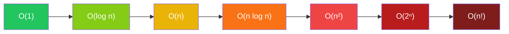
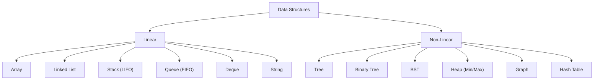
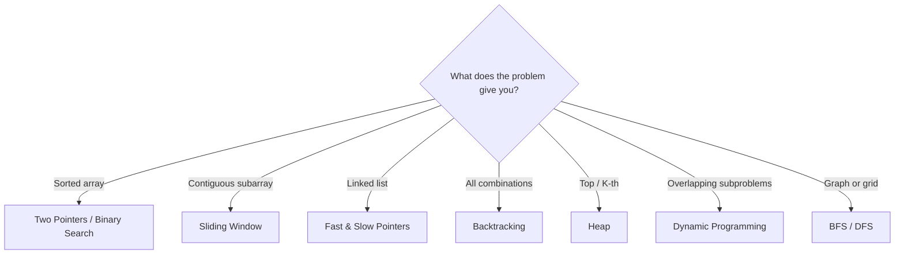
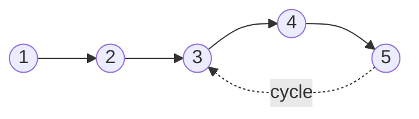
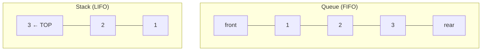
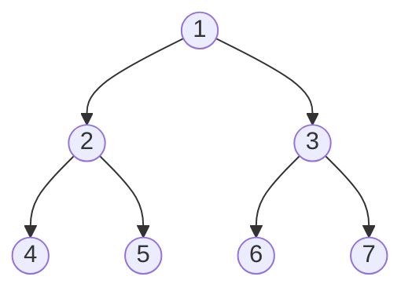
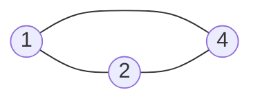
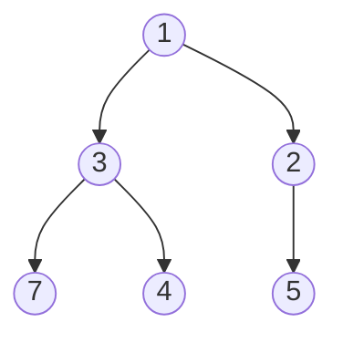
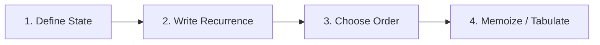
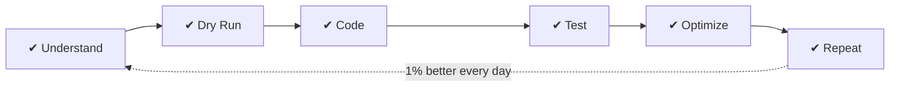

# DSA Master Cheatsheet

> Code. Practice. Think. Repeat. — Master patterns, solve anything.

This is a one-page map of everything you need for coding interviews: how to measure an algorithm (complexity), the building blocks (data structures), the standard algorithms, and the reusable problem-solving patterns that turn unseen problems into familiar ones. Skim it before an interview; deep-dive each section while practicing.

## 1. Complexity Analysis

**What it is:** Big-O notation describes how the running time (or memory) of an algorithm grows as the input size `n` grows. It ignores constants and small terms — `O(2n + 5)` is just `O(n)` — because for large inputs only the growth rate matters. Interviewers almost always ask "what's the complexity?" after you code, so know these cold. Always state the **worst case** unless asked otherwise.

| Time Complexity | Name | Meaning for large `n` | Example |
|---|---|---|---|
| `O(1)` | Constant | Same time no matter how big the input | Hash table lookup, array index |
| `O(log n)` | Logarithmic | Doubling input adds just one step | Binary search, balanced BST ops |
| `O(n)` | Linear | Time grows in step with input | Single loop, linear scan |
| `O(n log n)` | Linearithmic | Best possible for comparison sorting | Merge sort, heap sort |
| `O(n²)` | Quadratic | Doubling input = 4× the time | Nested loops, bubble sort |
| `O(2ⁿ)` | Exponential | Each extra element doubles the work | Naive recursion (subsets, fib) |
| `O(n!)` | Factorial | Explodes almost immediately | Permutations, brute-force TSP |



**Rule of thumb from constraints:** if `n ≤ 10⁶` aim for `O(n)` or `O(n log n)`; if `n ≤ 10³` an `O(n²)` solution is fine; if `n ≤ 20`, exponential backtracking is acceptable.

::: tip Space complexity → similar
Analyzed exactly the same way — count the **extra** memory your algorithm allocates beyond the input. A recursion stack of depth `n` counts as `O(n)` space!
:::

---

## 2. Data Structures

**What they are:** ways of organizing data so specific operations become fast. There is no "best" structure — each trades one strength for another (arrays give instant access by index but slow inserts; linked lists are the opposite). Half of interview success is picking the structure whose strengths match the problem.

They split into two families:

- **Linear** — elements form a sequence, one after another: Array, Linked List, Stack (LIFO), Queue (FIFO), Deque, String.
- **Non-linear** — elements form hierarchies or networks: Tree, Binary Tree, BST, Heap (Min/Max), Graph, Hash Table.



| Structure | Access | Search | Insert | Delete | Use when |
|---|---|---|---|---|---|
| Array | `O(1)` | `O(n)` | `O(n)` | `O(n)` | Index-based access, fixed-size data |
| String | `O(1)` | `O(n)` | `O(n)`* | `O(n)`* | Text processing (immutable in Python/Java) |
| Linked List | `O(n)` | `O(n)` | `O(1)`** | `O(1)`** | Frequent inserts/deletes at the ends |
| Stack | `O(n)` | `O(n)` | `O(1)` | `O(1)` | Undo, parsing, DFS, "most recent first" |
| Queue | `O(n)` | `O(n)` | `O(1)` | `O(1)` | Scheduling, BFS, "first come first served" |
| Deque | `O(n)` | `O(n)` | `O(1)` | `O(1)` | Push/pop at **both** ends (sliding window max) |
| Hash Table | — | `O(1)` avg | `O(1)` avg | `O(1)` avg | Fast lookups by key |
| BST (balanced) | `O(log n)` | `O(log n)` | `O(log n)` | `O(log n)` | Sorted data, range queries |
| Heap | — | `O(n)` | `O(log n)` | `O(log n)` | Repeatedly need the min/max |

<small>* Strings are immutable in most languages — every "modification" builds a new string. ** `O(1)` when you already hold a reference to the node; finding it first costs `O(n)`.</small>

---

## 3. Algorithms

### Sorting

**Why it matters:** sorting is a building block — binary search, two pointers, merge intervals, and greedy solutions all usually start with "sort the input". Know the trade-offs: **stable** means equal elements keep their original order (matters when sorting objects by one field), and comparison-based sorts can never beat `O(n log n)` — counting/radix sort get around that by not comparing at all.

| Algorithm | Time | Space | Stable | How it works / notes |
|---|---|---|---|---|
| Bubble Sort | `O(n²)` | `O(1)` | ✅ | Repeatedly swap adjacent out-of-order pairs. Educational only |
| Selection Sort | `O(n²)` | `O(1)` | ❌ | Pick the minimum, place it in front. Fewest swaps |
| Insertion Sort | `O(n²)` | `O(1)` | ✅ | Insert each item into a sorted prefix. Great for nearly-sorted data |
| Merge Sort | `O(n log n)` | `O(n)` | ✅ | Split in half, sort each, merge. Guaranteed `n log n` |
| Quick Sort | `O(n log n)` avg | `O(log n)` | ❌ | Partition around a pivot. `O(n²)` worst case (bad pivot) |
| Heap Sort | `O(n log n)` | `O(1)` | ❌ | Build a max-heap, repeatedly extract. In-place, no blowup |
| Counting Sort | `O(n + k)` | `O(k)` | ✅ | Count occurrences. Integers in a small range `k` |
| Radix Sort | `O(nk)` | `O(n + k)` | ✅ | Sort digit by digit. Fixed-width integers/strings |

### Searching

**The idea:** linear search checks every element and needs no preparation. Binary search cuts the search space in half each step — but only works on **sorted** (or monotonic) data. If you see a sorted array or a "find the minimum X such that…" question, think binary search.

| Algorithm | Time | Requirement |
|---|---|---|
| Linear Search | `O(n)` | None |
| Binary Search | `O(log n)` | **Sorted** input |

```python
def binary_search(arr, target):
    lo, hi = 0, len(arr) - 1
    while lo <= hi:
        mid = (lo + hi) // 2
        if arr[mid] == target:
            return mid
        elif arr[mid] < target:
            lo = mid + 1          # target is in the right half
        else:
            hi = mid - 1          # target is in the left half
    return -1
```

---

## 4. Common Patterns

**Why patterns beat memorizing problems:** there are thousands of LeetCode problems but only ~15 underlying techniques. Learn to recognize *which pattern a problem is wearing* and you can solve problems you've never seen. ⭐

| Pattern | The idea | Recognize when… | Classic problem |
|---|---|---|---|
| Two Pointers | Walk two indexes toward/past each other instead of nesting loops | Sorted array, pair/triplet search | Two Sum II, 3Sum |
| Sliding Window | Grow/shrink a window over the array, updating state incrementally | Contiguous subarray/substring, "longest/shortest…" | Longest substring w/o repeats |
| Fast & Slow Pointer | Two pointers at different speeds must meet inside a cycle | Cycle detection, middle of a list | Linked list cycle |
| Merge Intervals | Sort by start, then merge overlaps in one pass | Overlapping ranges, calendars | Meeting rooms |
| Cyclic Sort | Value `v` belongs at index `v−1`; swap until everything is home | Numbers in range `1..n`, find missing/duplicate | Find missing number |
| Top K Elements | Keep a heap of size K instead of sorting everything | "K largest / smallest / most frequent" | Kth largest element |
| Backtracking | Try a choice, recurse, undo it — explore the decision tree | "All combinations / permutations / ways" | Subsets, N-Queens |
| Divide & Conquer | Split → solve halves → combine | Problem splits into independent halves | Merge sort, max subarray |
| Greedy | Take the locally best choice; prove it never hurts | Interval scheduling, "minimum number of…" | Jump game |
| Dynamic Programming | Cache answers to overlapping subproblems | Count ways / max-min over choices | Knapsack, LCS |
| BFS / DFS | Level-by-level vs. depth-first exploration | Trees, graphs, grids, shortest path | Islands, word ladder |



---

## 5. Array / String

**What to know:** arrays are the most common interview input. The core skills are **traversal** (visiting every element), **insertion/deletion** (and knowing they cost `O(n)` because elements must shift), **prefix sums** (precompute once, answer range queries instantly), **two pointers**, and **Kadane's algorithm**. Strings are essentially character arrays — same techniques apply, plus remember they're immutable in Python/Java.

### Traversal & Insertion/Deletion

```python
for i, x in enumerate(arr):    # traversal: O(n)
    ...

arr.insert(2, 99)   # O(n) — shifts everything after index 2 right
arr.pop(2)          # O(n) — shifts everything after index 2 left
arr.append(99)      # O(1) amortized — only the END is cheap
```

::: info Why insert/delete is O(n)
An array is a contiguous block of memory. Inserting in the middle means every later element must move one slot over. That's why "lots of middle insertions" → use a linked list instead.
:::

### Prefix Sum

Precompute running totals once (`O(n)`), then answer any "sum of range `l..r`" query in `O(1)` — instead of re-adding every time.

```python
# prefix[i] = sum of arr[0..i-1]
prefix = [0]
for x in arr:
    prefix.append(prefix[-1] + x)

range_sum = prefix[r + 1] - prefix[l]     # sum of arr[l..r] in O(1)
```

### Two Pointers

Replace a nested `O(n²)` loop with one `O(n)` pass: start pointers at both ends of a sorted array and move the one that helps.

```python
# Pair with target sum in a SORTED array
lo, hi = 0, len(arr) - 1
while lo < hi:
    s = arr[lo] + arr[hi]
    if s == target: break
    elif s < target: lo += 1     # need a bigger sum
    else: hi -= 1                # need a smaller sum
```

### Kadane's Algorithm (Max Subarray Sum)

Finds the contiguous subarray with the largest sum in one pass. At every element make one decision: does extending the previous subarray help, or is it better to start fresh here?

```python
def kadane(arr):
    maxi = curr = arr[0]
    for x in arr[1:]:
        curr = max(x, curr + x)   # extend the run, or restart at x
        maxi = max(maxi, curr)    # remember the best ever seen
    return maxi
```

::: tip Intuition
A negative running sum can never help what comes next — drop it and restart. `O(n)` time, `O(1)` space.
:::

---

## 6. Linked List

**What it is:** a chain of nodes where each node stores a value and a pointer to the next node. Unlike arrays there's no indexing — to reach the 5th element you must walk from the head (**traversal**, `O(n)`). The payoff: **insertion/deletion** is `O(1)` once you're standing at the right spot — just rewire pointers, nothing shifts. Interview staples: **reverse a list**, **detect a cycle (Floyd's)**, **merge two sorted lists**.

### Traversal & Insertion/Deletion

```python
node = head
while node:              # traversal: O(n)
    node = node.next

new.next = prev.next     # insert AFTER prev: O(1) — just rewire
prev.next = new

prev.next = prev.next.next   # delete the node AFTER prev: O(1)
```

::: tip The dummy-node trick
Operations on the head are annoying edge cases. Create `dummy = ListNode(next=head)` and work from `dummy` — now the head is no longer special.
:::

### Reverse a List

Walk the list once, flipping each `next` pointer to face backwards.

```python
def reverse(head):
    prev = None
    while head:
        head.next, prev, head = prev, head, head.next
    return prev              # prev is the new head
```

### Floyd's Cycle Detection (Fast & Slow)

Does the list loop back on itself? You can't just walk it — you'd loop forever. Send two pointers: slow moves 1 step, fast moves 2. If there's a cycle, fast eventually laps slow and they meet; if fast hits the end (`None`), there's no cycle.

```python
def has_cycle(head):
    slow = fast = head
    while fast and fast.next:
        slow = slow.next             # 1 step
        fast = fast.next.next        # 2 steps
        if slow is fast:
            return True              # they met inside a cycle
    return False                     # fast fell off the end
```



::: info Why it works
Like two runners on a circular track — the faster one always catches the slower one. Bonus: the same slow pointer trick (fast at 2×) finds the **middle** of a list in one pass.
:::

### Merge Two Sorted Lists

Repeatedly take the smaller head of the two lists — the same merge step that powers merge sort.

```python
def merge(a, b):
    dummy = tail = ListNode()
    while a and b:
        if a.val <= b.val: tail.next, a = a, a.next
        else:              tail.next, b = b, b.next
        tail = tail.next
    tail.next = a or b       # attach whatever is left over
    return dummy.next
```

---

## 7. Stack & Queue

**The two orderings:** a **stack** is LIFO (Last-In, First-Out) — like a stack of plates, you take the one you put down most recently. A **queue** is FIFO (First-In, First-Out) — like a line at a shop, first come first served. This one difference decides everything: stacks power undo, matching brackets, expression evaluation, and DFS; queues power task scheduling, buffering, and BFS. A **deque** does `O(1)` push/pop at *both* ends, so it can act as either.



| Stack (LIFO) | Queue (FIFO) |
|---|---|
| `push(x)` — add to top | `enqueue(x)` — add to rear |
| `pop()` — remove from top | `dequeue()` — remove from front |
| `peek()` / `top()` — look, don't remove | `front()` — look, don't remove |
| `isEmpty()` | `isEmpty()` |

All operations are `O(1)`.

```python
from collections import deque

stack = []                    # Python list works as a stack
stack.append(1)               # push
top = stack[-1]               # peek
stack.pop()                   # pop

queue = deque()               # deque works as a queue (and a stack)
queue.append(1)               # enqueue
queue.popleft()               # dequeue — O(1)
```

::: warning
Never use a Python `list` as a queue — `list.pop(0)` shifts every element and costs `O(n)`. Use `collections.deque` (`O(1)` at both ends).
:::

---

## 8. Trees

**What they are:** hierarchical structures — every node has one parent (except the root) and possibly children. A **binary tree** allows at most two children per node. A **BST (binary search tree)** adds an ordering rule — everything left of a node is smaller, everything right is bigger — which makes search/insert/delete `O(log n)` when the tree is balanced. Trees are recursion's home turf: almost every tree problem is "solve for left subtree, solve for right subtree, combine".



### Traversals

Four standard orders of visiting every node — know which one a problem needs:

| Traversal | Order | Use it for |
|---|---|---|
| Inorder (LNR) | left → node → right | Getting a BST's values in **sorted order** |
| Preorder (NLR) | node → left → right | Copying/serializing a tree (root first) |
| Postorder (LRN) | left → right → node | Deleting a tree, evaluating expressions (children first) |
| Level Order (BFS) | level by level, top down | Shortest depth, per-level views (uses a queue) |

```python
def inorder(node):
    if node:
        inorder(node.left)
        print(node.val)          # move this line first/last for pre/postorder
        inorder(node.right)

from collections import deque
def level_order(root):
    q, out = deque([root]), []
    while q:
        node = q.popleft()
        out.append(node.val)
        if node.left:  q.append(node.left)
        if node.right: q.append(node.right)
    return out
```

### Height / Depth

Height = longest path from a node down to a leaf. The recursive definition writes itself: a tree's height is 1 + the taller of its two subtrees.

```python
def height(node):
    if not node: return 0
    return 1 + max(height(node.left), height(node.right))
```

### Diameter

The longest path between **any** two nodes — it doesn't have to pass through the root. At every node the candidate path is `left height + right height`; track the best while computing heights.

```python
def diameter(root):
    best = 0
    def h(node):
        nonlocal best
        if not node: return 0
        l, r = h(node.left), h(node.right)
        best = max(best, l + r)      # path bending through this node
        return 1 + max(l, r)
    h(root)
    return best
```

### Check BST

Common trap: comparing a node only with its direct children isn't enough — a grandchild can violate the order. Instead pass down the valid `(lo, hi)` range each node must fit in.

```python
def is_bst(node, lo=float('-inf'), hi=float('inf')):
    if not node: return True
    if not (lo < node.val < hi): return False
    return is_bst(node.left, lo, node.val) and is_bst(node.right, node.val, hi)
```

### LCA (Lowest Common Ancestor)

The deepest node that has both `p` and `q` in its subtree. Recurse: if `p` and `q` turn up in different subtrees, the current node is the answer; if both are on one side, the answer is on that side.

```python
def lca(root, p, q):
    if not root or root is p or root is q:
        return root
    l, r = lca(root.left, p, q), lca(root.right, p, q)
    return root if l and r else l or r
```

---

## 9. Graphs

**What they are:** the most general structure — nodes (vertices) connected by edges, modeling anything with relationships: social networks, maps, task dependencies, state machines. Edges can be directed or undirected, weighted or unweighted. Most graph interview problems are one of four types: *traverse it* (BFS/DFS), *find the shortest path*, *connect everything cheaply* (MST), or *order tasks with dependencies* (topological sort).

### Representations

Two ways to store a graph — pick by what you need to be fast:

```python
# Adjacency list — space O(V + E), iterate neighbors fast. The default choice.
graph = {1: [2, 4], 2: [1, 4], 4: [1, 2]}

# Adjacency matrix — space O(V²), but "is there an edge u→v?" in O(1).
matrix = [[0, 1, 1],
          [1, 0, 1],
          [1, 1, 0]]
```



### Traversals — BFS & DFS

**BFS** explores in rings — all neighbors first, then their neighbors — using a queue. Because it visits nodes in distance order, it finds shortest paths in unweighted graphs. **DFS** dives down one path fully before backtracking, using recursion (or an explicit stack) — natural for exploring islands, detecting cycles, and exhaustive search. Both are `O(V + E)`. Always track `visited` or you'll loop forever.

```python
from collections import deque

def bfs(graph, start):               # shortest path in UNWEIGHTED graphs
    visited, q = {start}, deque([start])
    while q:
        node = q.popleft()
        for nb in graph[node]:
            if nb not in visited:
                visited.add(nb)
                q.append(nb)

def dfs(graph, node, visited=None):  # explore deep first
    visited = visited or set()
    visited.add(node)
    for nb in graph[node]:
        if nb not in visited:
            dfs(graph, nb, visited)
    return visited
```

### Shortest Path

| Algorithm | Handles | Time | Idea |
|---|---|---|---|
| BFS | Unweighted graphs | `O(V + E)` | Distance = number of rings from the start |
| Dijkstra | Weighted, **no negative edges** | `O((V + E) log V)` | Always expand the closest unvisited node (min-heap) |
| Bellman-Ford | Negative edges (detects neg. cycles) | `O(V · E)` | Relax every edge `V−1` times |

```python
import heapq

def dijkstra(graph, src):            # graph[u] = [(v, weight), ...]
    dist = {src: 0}
    pq = [(0, src)]
    while pq:
        d, u = heapq.heappop(pq)     # closest unprocessed node
        if d > dist.get(u, float('inf')): continue   # stale entry
        for v, w in graph[u]:
            if d + w < dist.get(v, float('inf')):
                dist[v] = d + w
                heapq.heappush(pq, (d + w, v))
    return dist
```

### MST (Minimum Spanning Tree)

Connect **all** vertices with the minimum total edge weight and no cycles (think: cheapest cable layout connecting every city). Two classic greedy algorithms:

- **Kruskal** — sort all edges by weight; add the cheapest edge that doesn't form a cycle (checked with Union-Find). `O(E log E)`
- **Prim** — start anywhere; repeatedly add the cheapest edge leaving the tree built so far (min-heap). `O(E log V)`

### Topological Sort (DAG only)

A linear ordering of a **directed acyclic graph** where every edge points forward — i.e., every task comes after its prerequisites. This is the answer to course-schedule and build-order problems. If no valid order exists, the graph has a cycle.

```python
from collections import deque

def topo_sort(graph, n):             # Kahn's algorithm (BFS)
    indeg = [0] * n
    for u in graph:
        for v in graph[u]: indeg[v] += 1
    q = deque(i for i in range(n) if indeg[i] == 0)   # no prerequisites
    order = []
    while q:
        u = q.popleft()
        order.append(u)
        for v in graph[u]:
            indeg[v] -= 1            # prerequisite u is done
            if indeg[v] == 0: q.append(v)
    return order if len(order) == n else []   # [] ⇒ cycle, no valid order
```

---

## 10. Heap (Min/Max)

**What it is:** a **complete binary tree** (every level full, last level fills left-to-right) stored flat in an array — no pointers needed. It maintains one simple invariant:

- **Min-Heap** → every parent ≤ its children, so the **root is always the minimum**
- **Max-Heap** → every parent ≥ its children, so the **root is always the maximum**

That's all a heap promises — it is *not* fully sorted. But that one promise is enough to always grab the min/max in `O(1)` and restore order in `O(log n)` after changes, which is why heaps power priority queues, "Top K" problems, and finding a running median.



| Operation | Complexity | What happens |
|---|---|---|
| `insert(x)` | `O(log n)` | Append at the end, "bubble up" until the parent rule holds |
| `extractMin()` / `extractMax()` | `O(log n)` | Remove root, move last element to root, "sink down" |
| `peek()` | `O(1)` | Just read the root |
| Build heap from array | `O(n)` | Heapify bottom-up (cheaper than n inserts!) |

```python
import heapq                  # Python's heapq is a MIN-heap

h = []
heapq.heappush(h, 3)          # insert
smallest = h[0]               # peek O(1)
smallest = heapq.heappop(h)   # extract-min O(log n)

# Max-heap trick: store negated values
heapq.heappush(h, -x); largest = -heapq.heappop(h)

# Top K largest in O(n log k)
top_k = heapq.nlargest(k, nums)
```

::: tip Array indexing
For the node at index `i`: children live at `2i + 1` and `2i + 2`, parent at `(i − 1) // 2`. This is why a complete tree fits an array perfectly — no gaps.
:::

---

## 11. Hash Table

**What it is:** a **key → value** store. A hash function turns each key into an array index, so `insert(key, val)`, `get(key)`, `delete(key)`, and `contains(key)` all run in **average `O(1)`** — no scanning, no ordering. It's the single most useful tool for trading a little memory for a lot of speed: whenever your solution re-scans data to answer "have I seen this before?", a hash table probably removes a factor of `n`.

**Use cases:** counting, caching, frequency maps, de-duplication, Two Sum.

```python
# Frequency map / counting
from collections import Counter, defaultdict
freq = Counter("hello")            # {'l': 2, 'h': 1, 'e': 1, 'o': 1}

groups = defaultdict(list)         # missing keys auto-create a list
groups["anagram"].append("word")

# Two Sum in O(n): one pass, remember what you've seen
def two_sum(nums, target):
    seen = {}                      # value -> index
    for i, x in enumerate(nums):
        if target - x in seen:     # the partner was seen earlier
            return [seen[target - x], i]
        seen[x] = i
```

::: warning Collisions
Two keys can hash to the same bucket. With a good hash function and automatic resizing this stays rare (`O(1)` amortized), but the theoretical worst case is `O(n)`. Also note: hash tables have no ordering — if you need sorted keys, use a BST.
:::

---

## 12. Dynamic Programming

**What it is:** recursion + a memory. When a problem's recursion tree solves the **same subproblems over and over** (naive Fibonacci recomputes `fib(3)` exponentially many times), store each answer the first time and reuse it. That single idea collapses exponential time to polynomial. DP = **break it down, build it up!** ⭐

Use it when you see: "count the number of ways…", "minimum/maximum cost to…", "longest/shortest subsequence…", or explicit choices at every step (take it or leave it).



**The 4 steps:**
1. **Define the state** — what does `dp[i]` (or `dp[i][j]`) *mean* in plain words? This is the hard part.
2. **Write the recurrence** — express `dp[i]` using smaller states, covering every choice.
3. **Choose the order** — top-down (recursion, compute on demand) or bottom-up (fill a table from base cases).
4. **Add memoization / tabulation** — cache so each state is computed exactly once.

### Fibonacci — memoization (top-down)

```python
from functools import lru_cache

@lru_cache(None)                 # the cache IS the memoization
def fib(n):
    return n if n < 2 else fib(n - 1) + fib(n - 2)
# Without the cache: O(2^n). With it: O(n).
```

### 0/1 Knapsack — tabulation (bottom-up)

Each item can be taken **once or not at all** (that's the "0/1"), subject to a weight budget. State: `dp[cap]` = best value achievable with capacity `cap`.

```python
def knapsack(weights, values, W):
    dp = [0] * (W + 1)
    for w, v in zip(weights, values):
        for cap in range(W, w - 1, -1):     # reverse ⇒ each item used once
            dp[cap] = max(dp[cap],          # skip this item
                          dp[cap - w] + v)  # take it
    return dp[W]
```

### LCS (Longest Common Subsequence)

Longest sequence appearing in both strings in order (not necessarily contiguous) — the core of diff tools and edit distance. State: `dp[i][j]` = LCS length of `a[:i]` and `b[:j]`.

```python
def lcs(a, b):
    m, n = len(a), len(b)
    dp = [[0] * (n + 1) for _ in range(m + 1)]
    for i in range(1, m + 1):
        for j in range(1, n + 1):
            if a[i-1] == b[j-1]:
                dp[i][j] = dp[i-1][j-1] + 1          # match: extend the diagonal
            else:
                dp[i][j] = max(dp[i-1][j], dp[i][j-1])  # drop one char
    return dp[m][n]
```

### Coin Change

Fewest coins to reach `amount`, unlimited copies of each coin. State: `dp[a]` = fewest coins for amount `a`.

```python
def coin_change(coins, amount):
    dp = [0] + [float('inf')] * amount
    for a in range(1, amount + 1):
        for c in coins:
            if c <= a:
                dp[a] = min(dp[a], dp[a - c] + 1)
    return dp[amount] if dp[amount] != float('inf') else -1
```

### Matrix Chain Multiplication

Given matrices `A₁·A₂·…·Aₙ`, find the parenthesization minimizing scalar multiplications (multiplication is associative, but cost isn't!). State: `dp[i][j]` = cheapest cost to multiply matrices `i..j`; try every split point `k`:

```
dp[i][j] = min over k of  dp[i][k] + dp[k+1][j] + rows(i)·cols(k)·cols(j)
```

This *interval DP* shape (state = a range, recurrence = try every split) also solves burst balloons and polygon triangulation.

**Common problems:** Fibonacci · Knapsack (0/1) · LCS · Coin Change · Matrix Chain Multiplication

---

## 13. Important Formulas

Handy identities that show up in complexity analysis and math-flavored problems:

| Formula | Value | Where it shows up |
|---|---|---|
| Sum of first `n` numbers | `n(n+1) / 2` | Why `1+2+…+n` loops are `O(n²)`; missing-number tricks |
| Sum of squares `1²+…+n²` | `n(n+1)(2n+1) / 6` | Nested triangular loops |
| Combinations `nCr` | `n! / (r!(n−r)!)` | Counting subsets, paths in a grid |
| Log product rule | `log(xy) = log x + log y` | Simplifying complexity expressions |
| Log quotient rule | `log(x/y) = log x − log y` | Same |
| Nodes in complete binary tree of height `h` | `2^(h+1) − 1` | Why tree height ≈ `log n` |
| Edges in a complete graph (handshakes) | `n(n−1) / 2` | Why "all pairs" is `O(n²)` |

---

## 14. Bit Manipulation

**What it is:** treating an integer as an array of bits and operating on them directly with AND/OR/XOR/shifts. It's fast (`O(1)` per operation), memory-free, and shows up in "find the unique number", subset enumeration, and low-level flag problems. The building block is the **mask** `1 << i` — a number with only bit `i` set.

| Operation | Trick | Meaning |
|---|---|---|
| AND `&` | `n & (1 << i)` | **Check** bit `i` (non-zero ⇒ set) |
| OR `\|` | `n \| (1 << i)` | **Set** bit `i` to 1 |
| XOR `^` | `n ^ (1 << i)` | **Toggle** bit `i` |
| NOT `~` | `~x` | **Invert** all bits (and `n & ~(1 << i)` clears bit `i`) |
| Left shift | `x << 1` | Multiply by 2 |
| Right shift | `x >> 1` | Divide by 2 (floor) |

```python
n & (n - 1)          # drop the lowest set bit  (== 0 ⇒ n is a power of two)
n & (-n)             # isolate the lowest set bit
bin(n).count('1')    # count set bits (popcount)

# XOR magic: a ^ a = 0 and a ^ 0 = a, so pairs cancel out.
# Find the single non-duplicated number in O(n) time, O(1) space:
from functools import reduce
from operator import xor
single = reduce(xor, nums)
```

::: tip Practice LeetCode daily!
Bit tricks feel like magic until you've used each one twice. Try: Single Number, Number of 1 Bits, Counting Bits, Power of Two.
:::

---

## 15. Golden Rules

The process matters as much as the knowledge — interviewers grade *how* you solve, not just whether you solve. Follow the same loop every time:



1. **Understand** — restate the problem in your own words; ask about input size, duplicates, negatives, empty input. Never code a problem you can't explain.
2. **Dry Run** — walk through a small example *by hand* before coding; this exposes the pattern (§4) and the edge cases.
3. **Code** — say your approach out loud, write the brute force first if the optimal isn't obvious, keep names clear.
4. **Test** — trace your code with: empty input, one element, duplicates, extremes, the example from the prompt.
5. **Optimize** — state the current complexity, then ask which pattern from [§4](#_4-common-patterns) could reduce it. Hash table for lookups? Heap for top-K? Sort first?
6. **Repeat** — consistency beats intensity. One problem a day, every day. ✅

::: tip Discipline today, success tomorrow
Be consistent. Be better. Be 1% every day. Keep practicing. Stay focused. Crack interviews. Build dreams. 💪
:::
