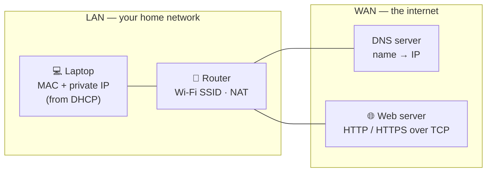
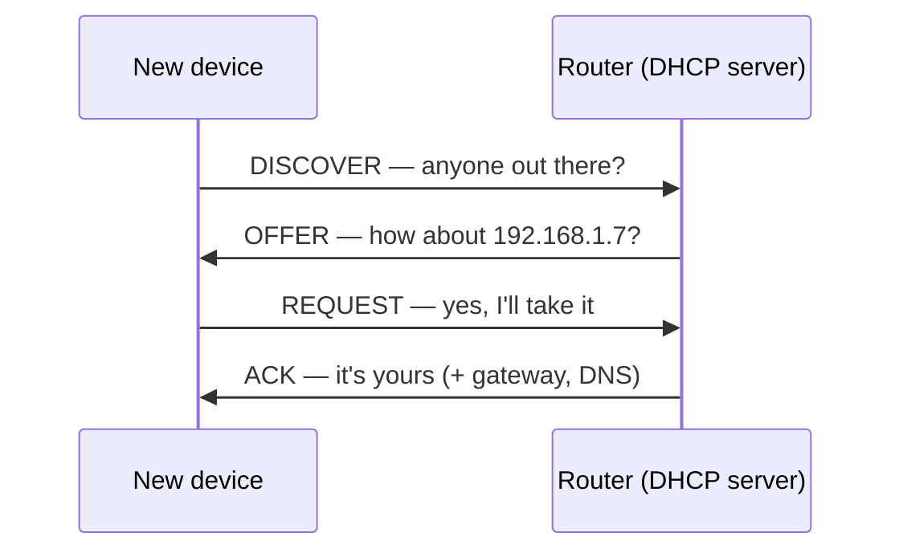
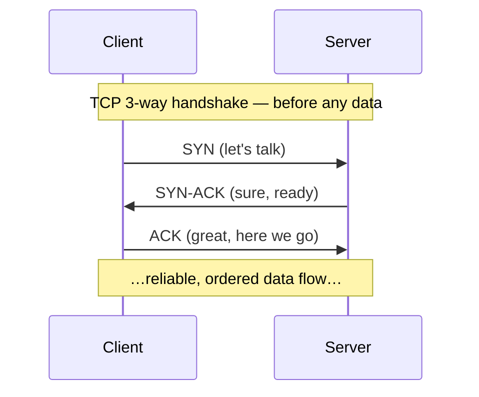
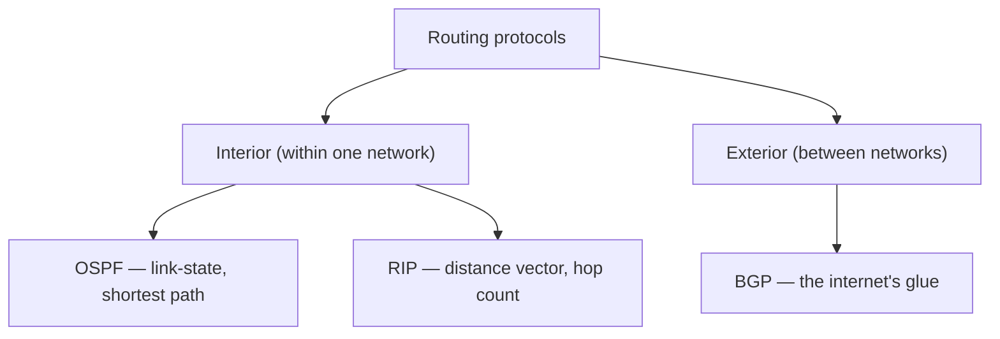

# Networking Abbreviations Cheat Sheet

> Essential networking terms — understanding these abbreviations is the first step to mastering networking!

Networking is full of three-and-four-letter acronyms, but they all answer one of a few basic questions: *how do devices get addresses?* (IP, MAC, DHCP, DNS, ARP, NAT), *how does data travel reliably?* (TCP, UDP, TTL, MTU), *what protocol does each application speak?* (HTTP, FTP, SMTP…), and *how do routers find the way?* (BGP, OSPF, RIP). This page groups all 30 terms by the question they answer.

## The big picture

A quick mental map of where these terms live when you load a website from your laptop at home:

Your laptop gets an address automatically (**DHCP**), asks **DNS** to translate the site's name into an **IP** address, talks to the local router by **MAC** address (found via **ARP**), the router hides your private address behind one public one (**NAT**), and the page itself travels as **HTTP(S)** on top of **TCP**.

---

## 1. Addressing & Identity

**The question:** how does every device get found on a network? Two address types exist side by side — the **MAC** address is burned into the hardware and only matters on the local network; the **IP** address is assigned logically and routes traffic across the world. Everything else here exists to hand out, translate, or map between those two.

| Term | Full name | What it does |
|---|---|---|
| **IP** | Internet Protocol | The unique logical address of a device on a network (e.g. `192.168.1.7`, or IPv6 `2001:db8::1`). Routable — this is how packets find you across the internet |
| **MAC** | Media Access Control | The unique hardware address of a network interface (e.g. `00:1A:2B:3C:4D:5E`). Fixed at the factory; used only within the local network segment |
| **DNS** | Domain Name System | The internet's phone book — translates human-friendly domain names (`google.com`) into IP addresses machines can route to |
| **DHCP** | Dynamic Host Configuration Protocol | Automatically hands out IP addresses (plus gateway and DNS settings) to devices joining a network — no manual configuration |
| **ARP** | Address Resolution Protocol | The bridge between the two address types: "who has IP `192.168.1.7`? Tell me your MAC" — maps IP addresses to MAC addresses on the local network |
| **NAT** | Network Address Translation | Lets many devices share one public IP: your router rewrites private addresses (`192.168.x.x`) to its single public address and keeps track of who asked for what |
| **SSID** | Service Set Identifier | Simply the name of a Wi-Fi network — the string you pick from the list when connecting |

::: tip DHCP's "DORA" handshake
Discover → Offer → Request → Acknowledge. If a device has a wrong or missing IP, this exchange failing is the usual suspect.
:::

---

## 2. Network Types & Boundaries

**The question:** how big is the network, and who can see it? Size and privacy define the terms here — from the network in your house to encrypted tunnels across the globe.

| Term | Full name | What it does |
|---|---|---|
| **LAN** | Local Area Network | A network limited to a small area — a home, office, or building. Fast, private, one broadcast domain |
| **WAN** | Wide Area Network | A network spanning large geographic areas — the internet is the biggest WAN. Connects LANs together |
| **VLAN** | Virtual LAN | Splits one physical switch into multiple isolated virtual networks — e.g. separating guest Wi-Fi from office machines without extra hardware |
| **VPN** | Virtual Private Network | An encrypted tunnel over the public internet — makes a remote device behave as if it were plugged into a private network, hiding traffic from everyone in between |

---

## 3. Transport — how data actually travels

**The question:** reliable or fast? Every application protocol rides on one of these two. **TCP** guarantees delivery with acknowledgments and retransmissions; **UDP** just fires packets and hopes — which is exactly right when speed beats completeness (video calls, gaming, DNS lookups).

| Term | Full name | What it does |
|---|---|---|
| **TCP** | Transmission Control Protocol | Connection-based, ensures reliable, ordered delivery: data arrives complete and in sequence, or gets re-sent. Used by web, email, file transfer |
| **UDP** | User Datagram Protocol | Connectionless and fast, with no guarantee of delivery or order. Used by streaming, gaming, VoIP, DNS — where a late packet is worse than a lost one |

### Packet mechanics that ride along

| Term | Full name | What it does |
|---|---|---|
| **TTL** | Time To Live | A counter in every packet, decremented at each router hop; at 0 the packet is discarded. Prevents lost packets from circling the internet forever (`traceroute` works by exploiting it) |
| **MTU** | Maximum Transmission Unit | The largest packet size a link can carry (typically **1500** bytes on Ethernet). Bigger data gets fragmented — mismatched MTUs cause mysterious "some sites don't load" bugs |
| **QoS** | Quality of Service | Prioritizes some traffic over others — e.g. a router giving video-call packets the fast lane while downloads wait. Latency-sensitive traffic first |

---

## 4. Web & File Protocols

**The question:** what language do client and server speak once connected? These are application-layer protocols — the ones you actually see in URLs.

| Term | Full name | What it does |
|---|---|---|
| **HTTP** | HyperText Transfer Protocol | The protocol of the web: the request/response language browsers and servers use (`GET /page`, `200 OK`). Plain text — anyone on the path can read it |
| **HTTPS** | HyperText Transfer Protocol Secure | HTTP wrapped in TLS encryption — same requests, but private and tamper-proof. The 🔒 in your address bar; the default for everything today |
| **FTP** | File Transfer Protocol | Transfers files between machines over a network. Old and unencrypted — in practice replaced by SFTP/HTTPS, but the term survives everywhere |

---

## 5. Email Protocols

**The question:** how does mail get *sent* vs. *read*? One protocol pushes mail toward its destination; two different ones let you fetch it — and the difference between those two matters when you use multiple devices.

| Term | Full name | What it does |
|---|---|---|
| **SMTP** | Simple Mail Transfer Protocol | **Sends** email — from your client to your mail server, and between mail servers. Outgoing only |
| **POP3** | Post Office Protocol 3 | **Retrieves** email by downloading it to one device (typically deleting the server copy). Simple, but your phone and laptop fall out of sync |
| **IMAP** | Internet Message Access Protocol | **Accesses** email directly on the server — messages, folders, and read-status stay in sync across all devices. What modern clients use |

---

## 6. Routing & Switching Protocols

**The question:** with millions of possible paths, how does a packet find its way? Routers constantly talk to each other to build maps. Protocols split into **interior** ones (inside one organization's network: OSPF, RIP) and the one **exterior** protocol that glues the whole internet together (BGP). STP plays a related game one level down, on switches.

| Term | Full name | What it does |
|---|---|---|
| **BGP** | Border Gateway Protocol | Routes traffic **between networks on the internet** — ISPs and big organizations announce "these addresses live here" to each other. When BGP breaks, whole services vanish from the internet |
| **OSPF** | Open Shortest Path First | Interior gateway routing protocol — routers inside one organization share a full map of the network and each computes shortest paths (Dijkstra! see the [DSA cheatsheet](./dsa#_9-graphs)) |
| **RIP** | Routing Information Protocol | The old, simple interior protocol: distance-vector routing — routers just tell neighbors "I can reach X in N hops" (max 15). Mostly historical, still an exam favorite |
| **STP** | Spanning Tree Protocol | Prevents loops in switch networks — if switches are wired in a cycle, frames would circulate and multiply forever; STP logically blocks redundant links to form a loop-free tree |

---

## 7. Management & Diagnostics

**The question:** how do you check that a network is healthy, keep clocks aligned, and power devices? The unglamorous plumbing every network admin lives in.

| Term | Full name | What it does |
|---|---|---|
| **ICMP** | Internet Control Message Protocol | The network's diagnostic and error-reporting channel — `ping` (echo request/reply) and "destination unreachable" messages are ICMP |
| **SNMP** | Simple Network Management Protocol | Monitors and manages network devices — routers, switches, and printers expose their stats (traffic, errors, temperature) for monitoring dashboards to poll |
| **NTP** | Network Time Protocol | Synchronizes clocks across devices to within milliseconds. Boring until logs, certificates, or distributed systems break because two machines disagree on the time |
| **PoE** | Power over Ethernet | Delivers electrical power and data over one network cable — how ceiling-mounted access points and IP cameras run without a power socket nearby |

---

## Quick reference — all 30 at a glance

| Abbr. | Full name | One-liner |
|---|---|---|
| **ARP** | Address Resolution Protocol | Maps IP addresses to MAC addresses |
| **BGP** | Border Gateway Protocol | Routes traffic between networks on the internet |
| **DHCP** | Dynamic Host Configuration Protocol | Automatically assigns IP addresses to devices |
| **DNS** | Domain Name System | Translates domain names to IP addresses |
| **FTP** | File Transfer Protocol | Transfers files over a network |
| **HTTP** | HyperText Transfer Protocol | Protocol for web communication |
| **HTTPS** | HyperText Transfer Protocol Secure | Secure (encrypted) version of HTTP |
| **ICMP** | Internet Control Message Protocol | Network diagnostics — `ping` lives here |
| **IMAP** | Internet Message Access Protocol | Accesses email on the server, syncs all devices |
| **IP** | Internet Protocol | Unique address for devices on a network |
| **LAN** | Local Area Network | Network limited to a small area (home/office) |
| **MAC** | Media Access Control | Unique hardware address of a network device |
| **MTU** | Maximum Transmission Unit | Largest size of a network packet (~1500 B) |
| **NAT** | Network Address Translation | Lets multiple devices share one public IP |
| **NTP** | Network Time Protocol | Synchronizes time across devices |
| **OSPF** | Open Shortest Path First | Interior gateway routing protocol (link-state) |
| **PoE** | Power over Ethernet | Power + data over one cable |
| **POP3** | Post Office Protocol 3 | Retrieves email by downloading from the server |
| **QoS** | Quality of Service | Prioritizes network traffic |
| **RIP** | Routing Information Protocol | Distance-vector routing protocol (hop count) |
| **SMTP** | Simple Mail Transfer Protocol | Sends email messages |
| **SNMP** | Simple Network Management Protocol | Monitors and manages network devices |
| **SSID** | Service Set Identifier | Name of a Wi-Fi network |
| **STP** | Spanning Tree Protocol | Prevents loops in switch networks |
| **TCP** | Transmission Control Protocol | Reliable, ordered data delivery |
| **TTL** | Time To Live | Limits how long packets live on the network |
| **UDP** | User Datagram Protocol | Fast delivery with no guarantees |
| **VLAN** | Virtual Local Area Network | Multiple virtual networks on one switch |
| **VPN** | Virtual Private Network | Secure encrypted connection over the internet |
| **WAN** | Wide Area Network | Network spanning large geographic areas |

::: tip
Understanding these abbreviations is the first step to mastering networking! 💡
:::
