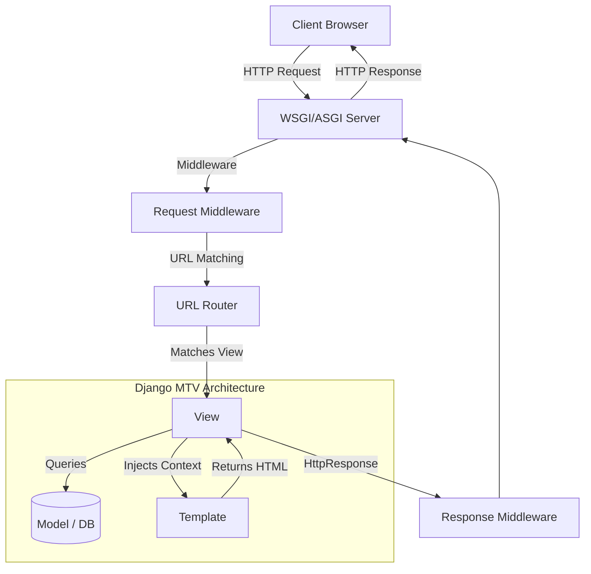

# Django fundamentals and architecture

## What is Django, and why do companies use it for backend development?

::: details View Answer
Django is a high-level Python web framework that provides batteries-included components such as ORM, routing, templates, forms, authentication, admin, security middleware, and migrations. Companies use it because it enables fast delivery while still supporting maintainable, secure, and scalable backend systems when engineered carefully.
:::

## Explain Django's MTV pattern.

::: details View Answer
Django uses Model-Template-View. The Model represents data and business persistence, the Template renders presentation, and the View coordinates request handling, business logic, and responses. It resembles MVC, but Django's View is closer to a controller and the Template is closer to the view layer.
:::

## What happens when a request reaches a Django application?

::: details View Answer
The web server passes the request to WSGI or ASGI, Django creates an HttpRequest, middleware processes it, URL resolution maps it to a view, the view executes business logic, and returns an HttpResponse. Response middleware then runs before the server sends the response to the client.


:::

## What are the main strengths and weaknesses of Django compared with Flask or FastAPI?

::: details View Answer
Django is stronger for full product backends because it includes ORM, admin, auth, security, forms, migrations, and conventions. Flask and FastAPI are lighter and can be better for small services or async-first APIs. In large companies the choice depends on team skill, governance, lifecycle cost, and service boundaries.
:::

## What does 'batteries included' mean in Django?

::: details View Answer
It means Django ships with many production-grade components that developers otherwise would need to select and integrate separately. Examples include authentication, sessions, CSRF protection, ORM, admin, migrations, static files, internationalization, and security middleware.
:::

## How does Django encourage maintainable application structure?

::: details View Answer
It encourages separation into reusable apps, declarative models, URL configuration, views, templates, forms, tests, and settings. Good teams further separate business logic into services, selectors, repositories, or domain modules instead of putting all logic in views or models.
:::

## What is a Django app versus a Django project?

::: details View Answer
A project is the full Django site or service, including settings and root URL configuration. An app is a reusable module inside the project that owns a focused domain such as billing, accounts, orders, or reporting.
:::

## When should you create a new Django app?

::: details View Answer
Create a new app when a domain area has its own models, behavior, API surface, tests, and lifecycle. Avoid creating apps only because a file is large; split by business capability, not by technical layer alone.
:::

## What is the role of manage.py?

::: details View Answer
manage.py is a command-line utility that sets the Django settings module and delegates commands to Django's management system. It is used for development server, migrations, shell, tests, static collection, and custom management commands.
:::

## How would you describe Django to a non-technical stakeholder?

::: details View Answer
Django is a mature Python framework for building secure web applications quickly. It gives the engineering team prebuilt foundations for data, users, administration, and security so they can focus on product-specific logic.
:::

## What is the standard Django project directory structure and the role of key files? <Badge type="tip" text="easy" />

::: details View Answer
A standard Django project is split into a root configuration folder and separate app directories. Key files include:
* `manage.py`: Command-line utility to run commands (runserver, migrate, etc.).
* `settings.py`: Core configuration (databases, installed apps, middleware).
* `urls.py`: Root routing mapping URL patterns to views.
* `wsgi.py` / `asgi.py`: Entry points for web servers (WSGI/ASGI).
* `models.py`: Database schema definitions via Python classes.
* `views.py`: Request-handling business logic.
* `admin.py`: Django admin panel registration.
:::

## Why is Django described as a loosely coupled framework? <Badge type="warning" text="medium" />

::: details View Answer
Django's MVT (Model-View-Template) components are highly independent. The Model handles data storage and database definitions, the View manages business logic, and the Template handles the presentation layer. These layers communicate through clean interfaces, allowing developers to change or swap one component (e.g., swapping a database backend or template engine) with minimal impact on the others.
:::

## What is Django's contrib framework and what are some common built-in apps it provides? <Badge type="tip" text="easy" />

::: details View Answer
Django's `django.contrib` package contains a collection of optional, pluggable, and reusable apps that ship out-of-the-box with the framework. Common contrib apps include:
* `django.contrib.auth`: Authentication and permissions.
* `django.contrib.admin`: Administrative database dashboard interface.
* `django.contrib.sessions`: Session framework to store visitor state.
* `django.contrib.contenttypes`: High-level database schema abstraction for model tracking.
* `django.contrib.staticfiles`: Static file asset manager.
:::

## What is the purpose of Django's contenttypes framework? <Badge type="warning" text="medium" />

::: details View Answer
The `django.contrib.contenttypes` application tracks all models installed in a Django project. It provides high-level generic relations, enabling a single model instance to link to any object in the system (Generic Foreign Keys). This is highly useful for building decoupled features like audit logs, comments, or tagging systems that attach to various unrelated models.

```python
from django.contrib.contenttypes.fields import GenericForeignKey
from django.contrib.contenttypes.models import ContentType
from django.db import models

class Comment(models.Model):
    content_type = models.ForeignKey(ContentType, on_delete=models.CASCADE)
    object_id = models.PositiveIntegerField()
    content_object = GenericForeignKey("content_type", "object_id")
```
:::

## What is a Python metaclass, and how does Django use them in models.Model? <Badge type="danger" text="hard" />

::: details View Answer
A metaclass in Python is a class of a class that defines how a class behaves. Django uses `ModelBase` as the metaclass for `models.Model`. When a model class is parsed, `ModelBase` intercepts its creation, reads the defined field attributes (like `CharField`), and moves them into a `_meta` API (the `Options` class). This enables Django's ORM to map Python attributes to database columns magically.
:::

## How does Django's application registry work, and what typically causes the AppRegistryNotReady exception? <Badge type="danger" text="hard" />

::: details View Answer
The application registry (`django.apps.apps`) is populated during Django's initialization sequence (`django.setup()`). It loads application configurations and models in a strict order. `AppRegistryNotReady` occurs when code tries to interact with models or the ORM before the setup phase completes, often caused by placing ORM queries or model imports at the root level of a module (like in `__init__.py` or global variables in `views.py`).
:::