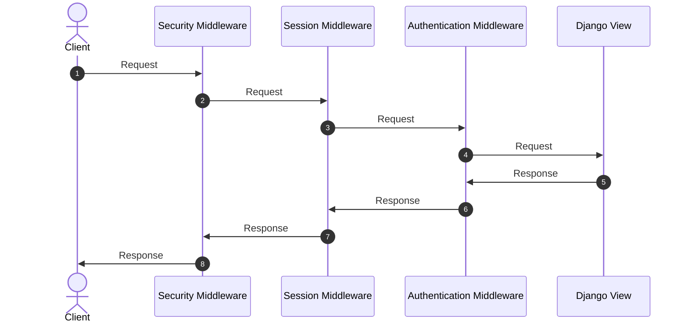

# Settings, configuration, and environments

## How should settings be managed across local, staging, and production environments?

::: details View Answer
Use a base settings module plus environment-specific overrides, or a typed configuration layer that reads environment variables. Secrets must not be committed. Production settings should explicitly configure security, databases, cache, logging, allowed hosts, static files, and email.
:::

## What is SECRET_KEY used for?

::: details View Answer
SECRET_KEY is used for cryptographic signing in Django, including sessions, password reset tokens, and other signed data. It must be unique, unpredictable, and kept secret. Rotating it requires planning because existing signed values may become invalid.
:::

## What is ALLOWED_HOSTS and why does it matter?

::: details View Answer
ALLOWED_HOSTS defines which Host headers Django will accept. It protects against Host header attacks, cache poisoning, and password reset link manipulation. In production it should contain exact domains, not a broad wildcard unless there is a deliberate multi-tenant strategy.
:::

## What is DEBUG and why must it be False in production?

::: details View Answer
DEBUG controls detailed error pages and other development behavior. If enabled in production it can leak settings, environment data, SQL, filesystem paths, and internal implementation details. Production should use structured logging and error monitoring instead.
:::

## How would you manage environment variables in Docker or Kubernetes?

::: details View Answer
Use environment variables injected by the platform, backed by a secret manager where possible. Keep non-secret configuration in ConfigMaps or deployment manifests and secrets in Vault, AWS Secrets Manager, GCP Secret Manager, Azure Key Vault, or Kubernetes Secrets with appropriate encryption and access control.
:::

## How do you avoid configuration drift between environments?

::: details View Answer
Use infrastructure as code, repeatable deployment pipelines, validated settings checks, and automated smoke tests. Keep environment differences explicit and minimal. Production-like staging reduces surprises around databases, caches, queues, security headers, and external integrations.
:::

## What are Django system checks?

::: details View Answer
System checks are validations run by Django to detect configuration, model, security, or compatibility problems. They run during commands such as check and can be extended with custom checks for organizational policies.
:::

## What is INSTALLED_APPS used for?

::: details View Answer
INSTALLED_APPS tells Django which applications are active. It controls model discovery, migrations, templates, static files, admin registration, checks, signals, and app configuration.
:::

## What is MIDDLEWARE ordering and why is it important?

::: details View Answer
Middleware is executed in order for requests and reverse order for responses. Ordering matters because authentication depends on sessions, CSRF checks must occur at the right point, and security or compression middleware can affect final response behavior.
:::

## What settings would you review before deploying a Django app in Germany or the EU?

::: details View Answer
Review DEBUG, SECRET_KEY, ALLOWED_HOSTS, CSRF_COOKIE_SECURE, SESSION_COOKIE_SECURE, SECURE_SSL_REDIRECT, HSTS, database encryption, logging of personal data, cookie consent, retention policies, and GDPR-related data processing responsibilities.
:::

## Why is it important to use a virtual environment for a Django project? <Badge type="tip" text="easy" />

::: details View Answer
A virtual environment creates an isolated workspace containing project-specific dependencies. This prevents version conflicts between different Python projects on the same machine, ensures clean and reproducible deployments, and makes dependency management (via `pip`, `poetry`, etc.) predictable and secure.
:::

## What does the settings.py file do? <Badge type="tip" text="easy" />

::: details View Answer
`settings.py` is the core configuration file of a Django project. It defines database settings, static/media file paths, installed apps, active middleware, security keys, logging formats, and internationalization preferences. It configuration governs how the application behaves in different deployment environments.
:::

## What is middleware in Django and how does it work? <Badge type="warning" text="medium" />

::: details View Answer
Middleware is a framework of hooks that plug into Django's request/response processing cycle. It is a light, low-level plugin system for globally altering Django's input or output. Each middleware component processes the incoming request before it reaches the view, and the outgoing response before it is returned to the client.
:::

## What is the difference between MEDIA_ROOT and MEDIA_URL in Django settings? <Badge type="tip" text="easy" />

::: details View Answer
`MEDIA_ROOT` is the absolute local file system path on the server where user-uploaded files are stored (e.g., images or documents). `MEDIA_URL` is the public URL prefix used in the browser to access those uploaded files (e.g., `/media/`).
:::

## What are static files in Django and how are they managed? <Badge type="tip" text="easy" />

::: details View Answer
Static files are assets that do not change dynamically, such as CSS, JavaScript, images, and fonts. Django manages them using the `django.contrib.staticfiles` app. In development, Django serves them automatically. In production, developers run `python manage.py collectstatic` to gather all static assets into a single directory configured by `STATIC_ROOT`, which is then served by a web server (like Nginx) or a CDN.
:::

## How do you create and register custom middleware in Django? <Badge type="warning" text="medium" />

::: details View Answer
Middleware is written as a class that accepts `get_response` in its constructor and defines a `__call__` method to process requests and responses:

```python
class ExecutionTimerMiddleware:
    def __init__(self, get_response):
        self.get_response = get_response

    def __call__(self, request):
        # 1. Runs before request reaches the view
        response = self.get_response(request)
        # 2. Runs after response leaves the view
        return response
```
Register it by appending its import path to the `MIDDLEWARE` list in `settings.py`.


:::