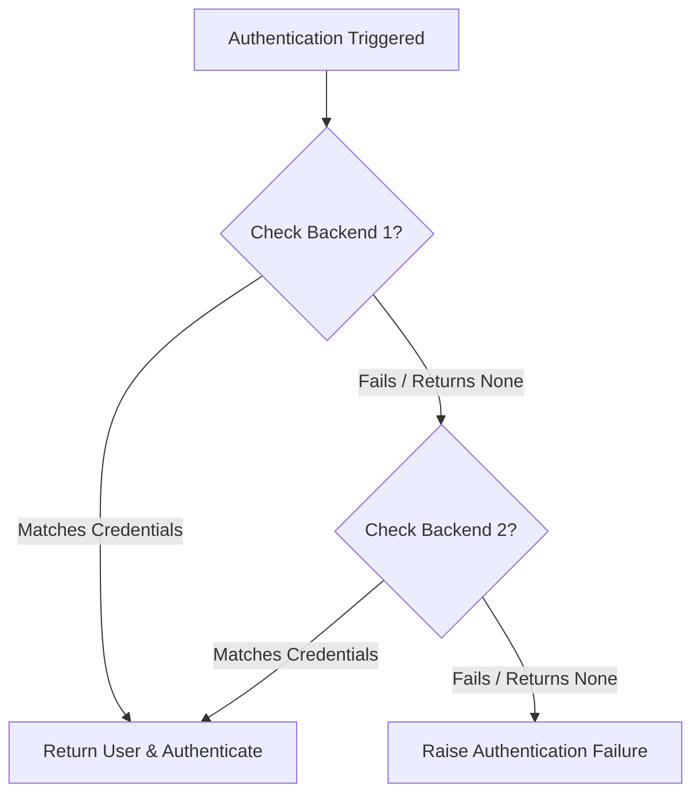

# Authentication, authorization, and sessions

## What does django.contrib.auth provide?

::: details View Answer
It provides users, groups, permissions, password hashing, authentication backends, login/logout views, decorators, mixins, and integration with sessions and admin. Many companies extend it rather than replacing it entirely.
:::

## What is the difference between authentication and authorization?

::: details View Answer
Authentication verifies who the user is. Authorization determines what the authenticated user is allowed to do. Confusing the two often leads to security bugs.
:::

## How do Django sessions work by default?

::: details View Answer
Django stores a session key in a cookie and stores session data server-side in the configured session backend, commonly the database or cache. Signed-cookie sessions store data client-side but must be used carefully because clients can see the data even if they cannot tamper with it.
:::

## What are authentication backends?

::: details View Answer
Authentication backends define how credentials are checked and how permissions are loaded. They allow integration with LDAP, SSO, OAuth, custom user identifiers, or object-level permission systems.
:::

## Why is a custom user model recommended early in a project?

::: details View Answer
Changing the user model later is painful because it affects foreign keys, migrations, admin, forms, and authentication. Starting with a custom user model gives flexibility for email login, UUID primary keys, profile fields, or organization-specific identity rules.
:::

## How do permissions work in Django?

::: details View Answer
Django creates add, change, delete, and view permissions for models. Users can receive permissions directly or through groups. Custom permissions can be defined in model Meta and enforced in views, admin, APIs, and business logic.
:::

## What are object-level permissions?

::: details View Answer
Object-level permissions decide access per object, such as whether a user can edit a specific invoice or project. Django has hooks for object permissions, but full implementation often requires custom logic or packages such as django-guardian.
:::

## How would you implement SSO in a Django application?

::: details View Answer
Use a standard protocol such as OIDC, OAuth2, or SAML through a maintained library or identity provider integration. Map external identities to local users, validate tokens, handle group or role mapping, and define account provisioning and deprovisioning rules.
:::

## What is MFA and when should it be required?

::: details View Answer
Multi-factor authentication requires an additional factor beyond password, such as TOTP, WebAuthn, or hardware keys. It should be required for admin, privileged users, financial workflows, and systems handling sensitive data.
:::

## How should password storage be handled in Django?

::: details View Answer
Use Django's built-in password hashers and never store plain-text passwords. Passwords are salted and hashed with strong adaptive algorithms. Teams should monitor framework security releases and avoid custom password hashing.
:::

## What is a Django Superuser? <Badge type="tip" text="easy" />

::: details View Answer
A Superuser is a user account that has all permissions enabled automatically (`is_superuser=True` and `is_staff=True`). Superusers can access the Django admin panel and perform any CRUD operations on any registered model without explicit permission setup.
:::

## How do you read and write cookies in a Django application? <Badge type="warning" text="medium" />

::: details View Answer
Cookies are set on the `HttpResponse` object using `set_cookie()` and read from the `HttpRequest` object using the `COOKIES` dictionary.

```python
# Set a cookie in a view
response = HttpResponse("Setting a cookie")
response.set_cookie("user_theme", "dark", max_age=86400, secure=True, httponly=True)

# Read a cookie in a view
theme = request.COOKIES.get("user_theme", "light")
```
:::

## What is the difference between AbstractBaseUser, AbstractUser, and Django's default User model? <Badge type="warning" text="medium" />

::: details View Answer
* **Default User**: Out-of-the-box user model with fixed fields (username, first_name, last_name, email, password, is_staff, is_active). Difficult to customize later.
* **AbstractUser**: Inherits all standard fields and permissions of default `User` but lets you extend it (e.g. adding a profile picture or age field) while keeping standard authentication flow.
* **AbstractBaseUser**: Provides only password hashing and auth methods, offering complete control over the fields. Useful when removing standard fields like `username` (e.g., using `email` as the primary identifier).

```python
from django.contrib.auth.models import AbstractBaseUser, BaseUserManager
from django.db import models

class CustomUser(AbstractBaseUser):
    email = models.EmailField(unique=True)
    is_active = models.BooleanField(default=True)
    
    USERNAME_FIELD = "email"
    REQUIRED_FIELDS = []
:::

## How do you implement a custom authentication backend in Django? <Badge type="warning" text="medium" />

::: details View Answer
Define a class that subclasses `django.contrib.auth.backends.ModelBackend` (or inherits from `object`) and implements the `authenticate(request, **credentials)` and `get_user(user_id)` methods:

```python
from django.contrib.auth.backends import BaseBackend
from django.contrib.auth import get_user_model

class EmailBackend(BaseBackend):
    def authenticate(self, request, username=None, password=None, **kwargs):
        User = get_user_model()
        try:
            user = User.objects.get(email=username)
            if user.check_password(password):
                return user
        except User.DoesNotExist:
            return None

    def get_user(self, user_id):
        User = get_user_model()
        try:
            return User.objects.get(pk=user_id)
        except User.DoesNotExist:
            return None
```
Register it in `settings.py` by adding it to the `AUTHENTICATION_BACKENDS` list.


:::

## Why must AUTH_USER_MODEL be set before running the first migration, and what happens if you try to change it later? <Badge type="warning" text="medium" />

::: details View Answer
`AUTH_USER_MODEL` tells Django which model represents the user. It must be set immediately because other apps (like `admin` and third-party packages) create foreign keys to it in their initial migrations. Changing it mid-project requires dropping tables, manually deleting migration history, or writing extremely complex schema migrations to migrate all foreign keys.
:::