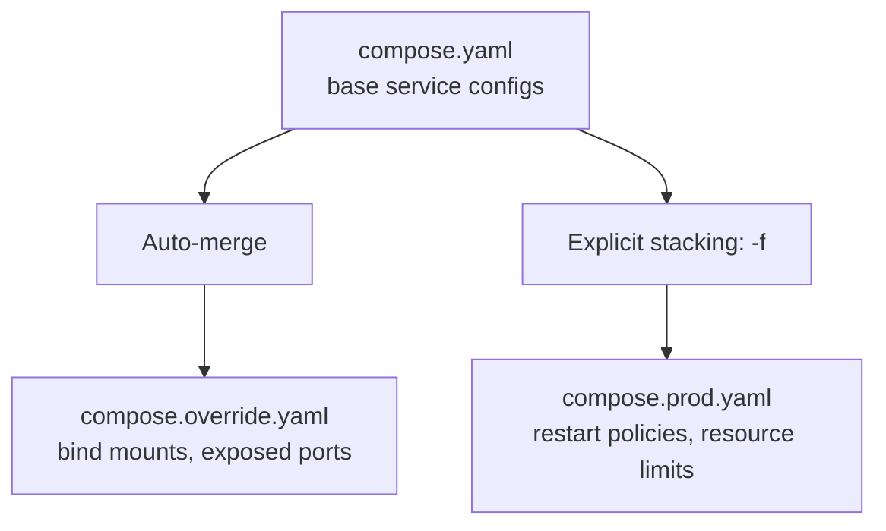
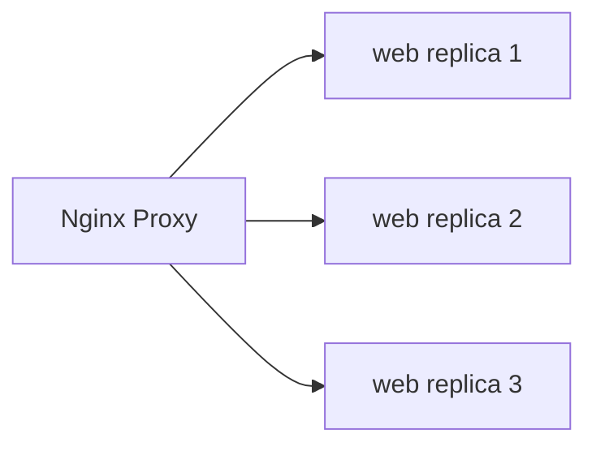

# Advanced Compose

> Master override files for multi-environment setups, profiles for optional services, Compose Watch for modern dev loops, and scaling patterns.

## Mental model

Docker Compose is not just for local single-file setups. By leveraging compose inheritance, service extensions, overrides, profiles, and live sync options, you can use the same base configuration template to power developer environments, integration testing rigs, and production runtimes. 



---

## Core concepts

### Multi-Environment Overrides

By default, running `docker compose up` automatically loads `compose.yaml` (or `docker-compose.yml`) and merges it with a `compose.override.yaml` file if present in the same directory. To deploy to staging or production, stack files explicitly using the `-f` flag.

#### 1. Base Configuration (`compose.yaml`)
Contains environment-agnostic fields (image structures, core services, database setups).

```yaml
# compose.yaml
services:
  web:
    image: ghcr.io/company/web:latest
    depends_on:
      db:
        condition: service_healthy

  db:
    image: postgres:16-alpine
    environment:
      POSTGRES_DB: appdb
      POSTGRES_USER: app
      POSTGRES_PASSWORD: ${DB_PASSWORD}
    volumes:
      - pgdata:/var/lib/postgresql/data
    healthcheck:
      test: ["CMD-SHELL", "pg_isready -U app -d appdb"]
      interval: 5s
      timeout: 3s
      retries: 5

volumes:
  pgdata:
```

#### 2. Development Override (`compose.override.yaml`)
Overwrites settings to enable bind mounts for hot reloading, expose ports to the host, and attach debug tools.

```yaml
# compose.override.yaml (automatically loaded in dev)
services:
  web:
    build:
      context: .
      target: dev
    ports:
      - "8000:8000"
    volumes:
      - ./src:/app/src
    command: uvicorn src.main:app --reload --host 0.0.0.0 --port 8000

  db:
    ports:
      - "5432:5432" # Expose DB port to host for local GUI clients
```

#### 3. Production Configuration (`compose.prod.yaml`)
Applies hardening, removes host port exposure from databases, establishes logging caps, and enables restart policies.

```yaml
# compose.prod.yaml
services:
  web:
    restart: unless-stopped
    logging:
      driver: json-file
      options:
        max-size: "10m"
        max-file: "3"

  db:
    restart: unless-stopped
    # No ports exposed to the host for database security
```

To run the production stack:
```bash
docker compose -f compose.yaml -f compose.prod.yaml up -d
```

---

### Profiles: Optional Services

Profiles allow you to define services that are only started when explicitly requested. This prevents developer laptops from running heavy optional tools (like GUI database viewers or load testing rigs) by default.

```yaml
# compose.yaml
services:
  web:
    image: nginx:alpine

  pgadmin:
    image: dpage/pgadmin4
    profiles:
      - debug-tools # Only runs if this profile is active
    ports:
      - "5050:80"

  k6:
    image: grafana/k6
    profiles:
      - testing
    command: run /scripts/load-test.js
```

Commands:
```bash
# Starts only Nginx (web)
docker compose up -d

# Starts Nginx AND pgAdmin
docker compose --profile debug-tools up -d

# Starts Nginx, pgAdmin, and run-once k6 container
docker compose --profile debug-tools --profile testing up
```

---

### YAML Anchors & Extensions (DRY Configs)

Avoid duplicating parameters across similar services (like multiple Celery workers or microservices sharing the same runtime configs). Use YAML anchors (`&`) and aliases (`*`), or Compose's native `extends`.

```yaml
# compose.yaml
x-app-defaults: &app-defaults
  build: .
  restart: unless-stopped
  env_file: .env
  depends_on:
    - db

services:
  api:
    <<: *app-defaults
    ports:
      - "8000:8000"
    command: uvicorn main:app --host 0.0.0.0

  worker:
    <<: *app-defaults
    command: celery -A tasks worker -l info
```

---

### Compose Watch (Modern Dev Loop)

Compose Watch is a modern alternative to raw bind mounts. Instead of mounting a directory (which can slow down operations and clobber `node_modules`), Compose syncs specific files and directories or triggers automated rebuilds inside the container when a file changes.

```yaml
# compose.yaml
services:
  web:
    build: .
    develop:
      watch:
        - action: sync
          path: ./src
          target: /app/src
          ignore:
            - node_modules/
        - action: rebuild
          path: package.json
```

Run watch:
```bash
docker compose alpha watch
# Or in Compose V2:
docker compose watch
```

---

### Scaling and Replicas

You can scale stateless services on a single host. Compose round-robins requests using its internal DNS server when referencing a scaled service name.



To scale via the CLI:
```bash
docker compose up -d --scale web=3
```

> ⚠️ **Warning**: You cannot use `--scale` on a service that binds a static host port (like `"80:80"`). Doing so causes a port collision error. Instead, map dynamic ports (like `"80"`) or front the service with an Nginx container inside the Compose network.

---

### Named Projects

By default, Docker Compose prefixes all created networks, containers, and volumes with the name of the directory containing the Compose file. You can override this to run multiple isolated instances of the same stack (e.g., for multi-tenant setups or testing different git branches).

```bash
# Spin up client A
docker compose -p client_a up -d

# Spin up client B (isolated copy)
docker compose -p client_b up -d

# List all active compose projects
docker compose ls
```

---

## Checkpoint

You can:
1. Explain stacking rules when using multiple `-f` compose files.
2. Configure profiles to keep debugging tools offline by default.
3. Eliminate duplicate configurations in compose using YAML anchors.
4. Implement Compose Watch for container-optimized hot reloading.
5. Scale a stateless web service to three instances without port conflicts.
