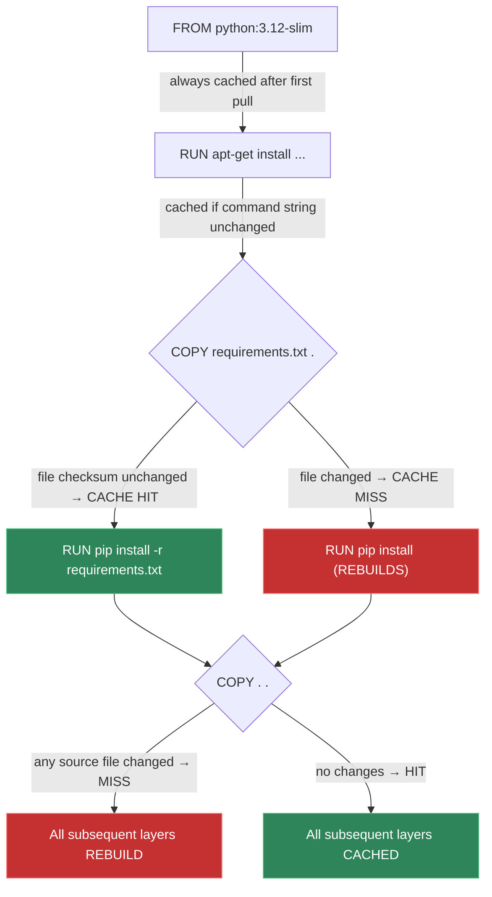
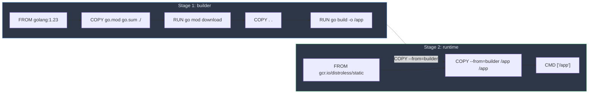

# Building & Optimizing Images

> Master layer caching, multi-stage builds, base image selection, and image publishing — the skills that separate amateur Dockerfiles from production-grade ones.

## Mental model

A Dockerfile is a recipe. Docker executes it **line by line, top to bottom**. After each
instruction that changes the filesystem, Docker snapshots the result as a **layer** and stores
it in a content-addressed cache. On subsequent builds, Docker checks whether the inputs for
each instruction have changed — if not, it **reuses the cached layer** and skips execution.
This caching mechanism is the single most impactful thing to understand about Docker builds.

## Core concepts

### Layer caching — the number one build skill

Docker evaluates cache validity per-instruction using these rules:

1. **`RUN`** — the cache is valid if the **command string** is identical (character-for-character).
2. **`COPY` / `ADD`** — the cache is valid if the **file checksums** of every copied file are identical.
3. **Any cache miss** — every subsequent instruction is **rebuilt from scratch**, even if its inputs haven't changed.

Rule 3 is the killer. It means that **instruction order in your Dockerfile determines build speed**.



#### Bad ordering — cache busts on every code change

```dockerfile
# BAD: copying everything first means ANY file change invalidates
# the pip install layer — even editing a README
FROM python:3.12-slim
COPY . /app                              # cache busts on any file change
WORKDIR /app
RUN pip install -r requirements.txt      # reinstalls every time!
CMD ["python", "app.py"]
```

#### Good ordering — dependencies before code

```dockerfile
# GOOD: dependencies are cached independently from application code
FROM python:3.12-slim
WORKDIR /app

COPY requirements.txt .                  # changes rarely
RUN pip install --no-cache-dir -r requirements.txt   # cached until requirements.txt changes

COPY . .                                 # changes often — but deps layer is safe
CMD ["python", "app.py"]
```

::: tip
The principle is universal: **copy things that change rarely first, things that change
often last**. This applies to every language — `package.json` before `src/`, `go.mod`
before `*.go`, `Gemfile` before `app/`.
:::

### Multi-stage builds

Multi-stage builds let you use **multiple `FROM` instructions** in a single Dockerfile.
Each `FROM` starts a new stage with a fresh filesystem. You can copy artifacts from earlier
stages into later ones — and only the **final stage** ends up in the output image.



#### Go example — 1.2 GB → 8 MB

```dockerfile
# Stage 1: build with the full Go toolchain (1.2 GB)
FROM golang:1.23-bookworm AS builder
WORKDIR /src

COPY go.mod go.sum ./            # cache dependency downloads
RUN go mod download

COPY . .                         # copy source code
RUN CGO_ENABLED=0 GOOS=linux go build -ldflags="-s -w" -o /app ./cmd/server

# Stage 2: run on distroless (< 5 MB base)
FROM gcr.io/distroless/static-debian12
COPY --from=builder /app /app
ENTRYPOINT ["/app"]
```

#### Python example — separate build tools from runtime

```dockerfile
# Stage 1: build wheels (needs gcc, headers)
FROM python:3.12-slim AS builder
RUN apt-get update && apt-get install -y --no-install-recommends \
    gcc libpq-dev \
    && rm -rf /var/lib/apt/lists/*

WORKDIR /build
COPY requirements.txt .
RUN pip wheel --no-cache-dir --wheel-dir /wheels -r requirements.txt

# Stage 2: runtime — no compiler needed
FROM python:3.12-slim
WORKDIR /app

COPY --from=builder /wheels /wheels
RUN pip install --no-cache-dir /wheels/* && rm -rf /wheels

COPY . .
USER nobody
CMD ["gunicorn", "myapp.wsgi:application", "--bind", "0.0.0.0:8000"]
```

#### Node.js example — dev dependencies stay behind

```dockerfile
# Stage 1: install all dependencies and build
FROM node:22-alpine AS builder
WORKDIR /app

COPY package.json package-lock.json ./
RUN npm ci                                  # install everything (including devDeps)

COPY . .
RUN npm run build                           # e.g., Next.js, Vite, etc.

# Stage 2: production runtime
FROM node:22-alpine
WORKDIR /app
ENV NODE_ENV=production

COPY package.json package-lock.json ./
RUN npm ci --omit=dev                       # production deps only

COPY --from=builder /app/dist ./dist        # copy the build output only
USER node
EXPOSE 3000
CMD ["node", "dist/index.js"]
```

#### Using --target for dev vs prod images

```bash
# Build only the builder stage (e.g., for running tests in CI)
docker build --target builder -t myapp:test .

# Build the full image (default — builds to the last stage)
docker build -t myapp:prod .
```

::: tip
The `--target` flag is powerful for CI pipelines. You can have a `test` stage that
includes test frameworks and linters, a `dev` stage with hot-reload tools, and a `prod`
stage that ships only the binary. One Dockerfile, multiple outputs.
:::

### Base image strategy

Choosing the right base image is a security and performance decision. Here is the landscape:

| Base image         | Size       | Package manager | libc   | Best for                              |
|--------------------|------------|-----------------|--------|---------------------------------------|
| `debian:bookworm`  | ~120 MB    | apt             | glibc  | Maximum compatibility, debugging      |
| `python:3.12-slim` | ~50 MB     | apt (minimal)   | glibc  | Python apps (recommended default)     |
| `alpine:3.20`      | ~8 MB      | apk             | musl   | Tiny images, Go/Rust static binaries  |
| `distroless`       | ~3-20 MB   | None            | glibc  | Hardened production (no shell!)       |
| `scratch`          | 0 MB       | None            | None   | Statically linked binaries only       |

::: warning
**Alpine uses musl libc**, not glibc. This can cause subtle runtime bugs in Python
(performance regressions), Node.js (DNS resolution issues), and any app using C extensions.
Test thoroughly before choosing alpine for non-trivial applications. For Python, prefer
`-slim` over alpine.
:::

#### Digest pinning for supply-chain safety

Tags are **mutable** — `python:3.12-slim` today may point to a different image tomorrow.
For reproducible, auditable builds, pin by digest:

```dockerfile
# Digest-pinned — this exact image, forever
FROM python:3.12-slim@sha256:f5a1c8a0340f3e0b5d1a87d9c1e6a4d8e0b3f2a1c7d6e5f4a3b2c1d0e9f8a7b6

# Find the current digest
# docker inspect --format='{{index .RepoDigests 0}}' python:3.12-slim
```

### Tagging, registries, and publishing

#### The image naming convention

```text
registry / namespace / repository : tag
───────   ─────────   ──────────   ───
docker.io / library   / python     : 3.12-slim      ← Docker Hub official
ghcr.io   / myorg     / myapp      : v1.2.0         ← GitHub Container Registry
```

#### Tagging and pushing

```bash
# Build and tag
docker build -t myapp:latest .

# Add more tags to the same image (no rebuild needed)
docker tag myapp:latest myapp:v1.2.0
docker tag myapp:latest myapp:v1.2
docker tag myapp:latest myapp:v1

# Tag for a remote registry
docker tag myapp:v1.2.0 ghcr.io/myorg/myapp:v1.2.0

# Push to registry (must docker login first)
docker push ghcr.io/myorg/myapp:v1.2.0
```

#### Why `latest` is a lie

`latest` is **not** the latest version — it is simply the **default tag name** that Docker
uses when you don't specify one. It is not automatically updated, not guaranteed to be
the most recent, and often stale.

```bash
# These two commands are identical
docker pull python
docker pull python:latest

# This image may be months older than python:3.12-slim
# because nobody manually re-tagged python:latest recently
```

::: danger
**Never deploy with `:latest` in production.** It is ambiguous and non-reproducible.
Use explicit version tags (`v1.2.0`) or git-SHA tags (`abc123f`).
:::

#### Git-SHA tags for CI

In CI pipelines, tag images with the git commit SHA for perfect traceability:

```bash
# In GitHub Actions
GIT_SHA=$(git rev-parse --short HEAD)
docker build -t ghcr.io/myorg/myapp:${GIT_SHA} .
docker push ghcr.io/myorg/myapp:${GIT_SHA}

# You can always trace an image back to the exact code that built it
docker inspect ghcr.io/myorg/myapp:abc123f
```

#### Pulling by immutable digest

```bash
# Pull a specific, immutable image (digest never changes)
docker pull python@sha256:f5a1c8a0340f3e0b5d1a87d9c1e6a4d8e0b3f2a1c7d6e5f4a3b2c1d0e9f8a7b6

# Get the digest of a local image
docker images --digests python
```

### Offline image transfer — save, load, export

Sometimes you need to move images without a registry (air-gapped networks, USB transfer):

```bash
# Save — packs image layers into a tar archive
docker save -o myapp.tar myapp:v1.2.0

# Load — imports the tar back as an image
docker load -i myapp.tar
# Output: Loaded image: myapp:v1.2.0

# Save multiple images at once
docker save -o all-images.tar myapp:v1.2.0 postgres:16 redis:7
```

::: info
`docker save` / `docker load` operate on **images** (preserves layers, tags, metadata).
`docker export` / `docker import` operate on **containers** (flattens to a single layer,
loses metadata). Almost always prefer `save` / `load`.
:::

| Command         | Input       | Output       | Preserves layers | Preserves tags |
|-----------------|-------------|--------------|------------------|----------------|
| `docker save`   | Image       | tar archive  | Yes              | Yes            |
| `docker load`   | tar archive | Image        | Yes              | Yes            |
| `docker export` | Container   | tar archive  | No (flattened)   | No             |
| `docker import` | tar archive | Image        | No (single layer)| No             |

### BuildKit basics

BuildKit is Docker's modern build engine, enabled by default since Docker 23.0.
It provides significant improvements over the legacy builder:

```bash
# Confirm BuildKit is active (you should see "buildkit" in the output)
docker info --format '{{.BuilderVersion}}'

# Force BuildKit on (for older Docker versions)
DOCKER_BUILDKIT=1 docker build .
```

Key BuildKit features you get automatically:

- **Parallel execution** — independent stages build concurrently
- **Better caching** — smarter cache invalidation and inline cache metadata
- **Build secrets** — mount secrets without leaking them into layers
- **SSH forwarding** — clone private repos during build without copying keys
- **Cache mounts** — persist package manager caches across builds

```dockerfile
# syntax=docker/dockerfile:1

# Secret mount — secret is available at /run/secrets/mytoken during this RUN only
RUN --mount=type=secret,id=mytoken \
    TOKEN=$(cat /run/secrets/mytoken) && \
    curl -H "Authorization: Bearer $TOKEN" https://api.example.com/data

# Cache mount — pip cache persists between builds, speeding up reinstalls
RUN --mount=type=cache,target=/root/.cache/pip \
    pip install -r requirements.txt
```

```bash
# Build with a secret (the secret never appears in docker history)
docker build --secret id=mytoken,src=./my-secret-token.txt .
```

::: tip
The `# syntax=docker/dockerfile:1` directive at the top of your Dockerfile opts in to
the latest stable Dockerfile syntax features. Always include it.
:::

### Image size optimization checklist

A quick reference for keeping images small:

```bash
# Check your image size
docker images myapp
# REPOSITORY   TAG       IMAGE ID       CREATED       SIZE
# myapp        latest    abc123def456   2 min ago     127MB

# Dive into layers to find bloat
docker history myapp:latest --format "{{.Size}}\t{{.CreatedBy}}" | head -20
```

1. **Use multi-stage builds** — build tools don't ship to production
2. **Choose slim/distroless bases** — not full Debian/Ubuntu
3. **Combine `RUN` instructions** — fewer layers, cleanup in same layer
4. **Use `--no-install-recommends`** — skip suggested apt packages
5. **Use `--no-cache-dir`** — pip, apk, npm don't cache downloads
6. **Clean up in the same `RUN`** — `rm -rf /var/lib/apt/lists/*`
7. **Use `.dockerignore`** — keep build context small
8. **Pin specific tags** — avoid pulling unexpected large base images

## Checkpoint

After this tutorial you should be able to:

- [ ] Explain how layer caching works and why instruction order matters
- [ ] Reorganize a Dockerfile to maximize cache hits
- [ ] Write multi-stage Dockerfiles for Go, Python, and Node.js
- [ ] Choose the right base image for your use case (slim vs alpine vs distroless)
- [ ] Explain why `latest` is unreliable and use proper tagging strategies
- [ ] Tag and push images to Docker Hub and GitHub Container Registry
- [ ] Transfer images offline with `docker save` and `docker load`
- [ ] Use BuildKit features like secret mounts and cache mounts
