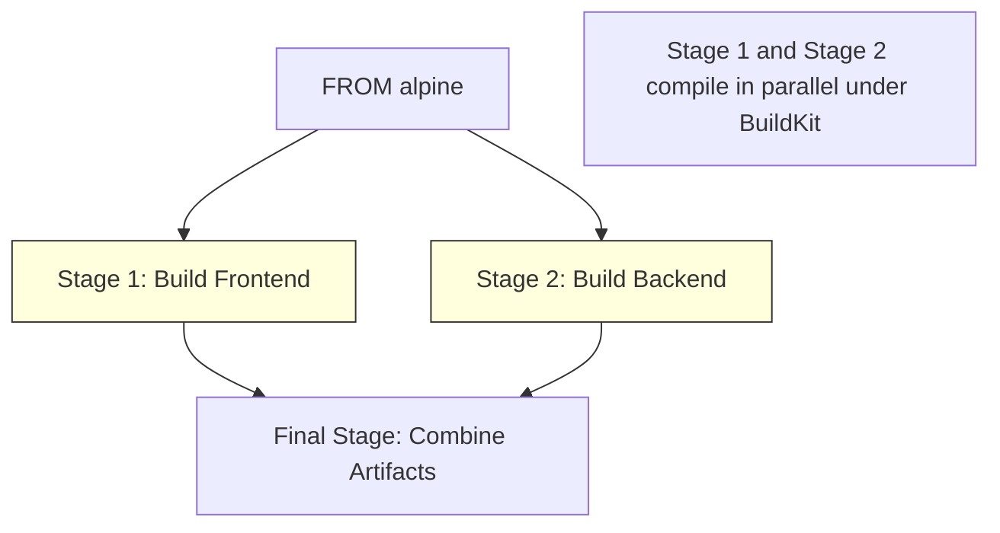
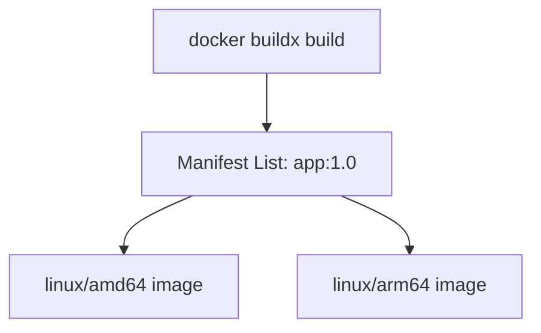

# BuildKit & Multi-Architecture

> Unlock BuildKit's parallel DAG builds, cache mounts, and secret mounts — then build images for amd64 and arm64 from a single command.

## Mental model

Legacy Docker builders run instructions sequentially, creating disk layers for every step. **BuildKit** is a modern, high-performance build engine that builds a Directed Acyclic Graph (DAG) of the build stages. It runs unrelated stages in parallel, skips unused stages, and supports advanced mount options (for secrets, SSH keys, and compiler caches) without leaving footprints in the final image layers.



---

## Core concepts

### BuildKit Features & Mount Types

To unlock advanced BuildKit features, place the syntax parser directive at the very top of your Dockerfile:

```dockerfile
# syntax=docker/dockerfile:1.7
```

#### 1. Cache Mounts (`--mount=type=cache`)
Keeps compiler and package manager cache directories between builds. This prevents files from being downloaded repeatedly on every rebuild.

```dockerfile
# syntax=docker/dockerfile:1.7
FROM python:3.12-slim
WORKDIR /app

# Cache pip downloads across builds
RUN --mount=type=cache,target=/root/.cache/pip \
    --mount=type=bind,source=requirements.txt,target=requirements.txt \
    pip install -r requirements.txt
```

#### 2. Secret Mounts (`--mount=type=secret`)
Mounts confidential files into the build environment. These secrets are not included in the image history or metadata.

```dockerfile
# syntax=docker/dockerfile:1.7
FROM node:20-alpine
WORKDIR /app

# Safely mount npm token during package install
RUN --mount=type=secret,id=npm_token \
    NPM_TOKEN=$(cat /run/secrets/npm_token) npm ci
```
*Build command passing the secret:*
```bash
docker build --secret id=npm_token,src=.npmrc-token -t app:1.0 .
```

#### 3. SSH Mounts (`--mount=type=ssh`)
Passes local SSH agent keys to compile dependencies from private repositories.

```dockerfile
# syntax=docker/dockerfile:1.7
FROM alpine
RUN apk add --no-cache git openssh-client

# Add github to known hosts
RUN mkdir -p -m 0700 ~/.ssh && ssh-keyscan github.com >> ~/.ssh/known_hosts

# Clone private git repository using host keys
RUN --mount=type=ssh git clone git@github.com:company/private-repo.git
```
*Build command forwarding the active SSH agent:*
```bash
docker build --ssh default .
```

#### 4. Heredocs (Multi-line scripts)
Avoid long, fragile chains of `&&` and `\` commands:

```dockerfile
# syntax=docker/dockerfile:1.7
FROM debian:bookworm-slim
RUN <<EOF
apt-get update
apt-get install -y --no-install-recommends \
    curl \
    git \
    jq
rm -rf /var/lib/apt/lists/*
EOF
```

---

### Multi-Architecture Builds with buildx

Modern applications run across different CPU architectures: `amd64` (standard Intel/AMD cloud servers) and `arm64` (AWS Graviton, Apple Silicon, Raspberry Pi).

BuildKit supports multi-architecture builds using the `buildx` plugin. It creates a **Manifest List** pointing to the specific image built for each architecture.



#### Building Multi-Arch Images

1. Create and select a new virtual multi-architecture builder:
```bash
docker buildx create --name multi-builder --use
docker buildx inspect --bootstrap
```

2. Compile and push the multi-architecture image (requires registry push to store manifest lists):
```bash
docker buildx build \
  --platform linux/amd64,linux/arm64 \
  -t ghcr.io/company/app:1.0 \
  --push .
```

3. Inspect the published manifest list:
```bash
docker buildx imagetools inspect ghcr.io/company/app:1.0
# Expected output displays supported platforms (linux/amd64, linux/arm64) and digests.
```

---

## Checkpoint

You can:
1. Enable the BuildKit parser directive.
2. Implement caching mounts to accelerate package installation steps.
3. Pass build secrets securely without leaving footprints in image layers.
4. Mount host SSH agent credentials inside the build stage.
5. Provision a multi-platform Buildx engine.
6. Build and push multi-architecture manifest lists.
