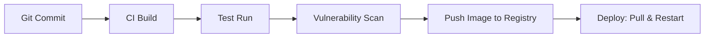

# CI/CD with Docker

> Automate the path from code push to production deployment — build, scan, tag, and ship Docker images through GitHub Actions with build caching and rollback strategies.

## Mental model

In modern containerized deployments, the code repository is the single source of truth, and the CI/CD pipeline is the only mechanism allowed to compile and release code. 

Developers commit code, triggering an automated CI process that builds the OCI image. The image runs tests internally, undergoes security scanning, and is pushed to a secure registry. CD pipelines then instruct the target servers to pull the updated image and perform a rolling update.



---

## Core concepts

### Image Tagging Strategy

A structured tagging strategy is essential for traceablility and security.

* **Git Commit SHA**: Tagging an image with the short Git commit SHA (e.g. `:sha-ab12cd3`) provides an immutable, traceable reference back to the exact code change that generated it.
* **Semantic Versioning (SemVer)**: Releases use semantic versions (e.g. `:1.4.2`).
* **Tag Cascade**: When pushing a release version, publish multiple tags pointing to the same image digest:
  * `:1.4.2` (specific patch)
  * `:1.4` (floats with minor releases)
  * `:1` (floats with major releases)
  * `:latest` (floats with the newest build)

> ⚠ **Warning**: Avoid using the `:latest` tag in production environments. If a container restarts or autoscales, it may pull a newer, untested image tagged as `:latest`, leading to runtime regressions and blocking reliable rollbacks.

---

### GitHub Actions Pipeline Configuration

Here is a complete, production-ready GitHub Actions workflow file that builds, tests, scans, and deploys a Docker application.

```yaml
# .github/workflows/deploy.yml
name: CI/CD Pipeline

on:
  push:
    branches: [ main ]
    tags: [ 'v*.*.*' ]

env:
  REGISTRY: ghcr.io
  IMAGE_NAME: ${{ github.repository }}

jobs:
  build-and-test:
    runs-on: ubuntu-latest
    permissions:
      contents: read
      packages: write

    steps:
      - name: Checkout repository
        uses: actions/checkout@v4

      # Setup BuildKit build engine
      - name: Set up Docker Buildx
        uses: docker/setup-buildx-action@v3

      # Login to GitHub Container Registry
      - name: Log in to the Container registry
        uses: docker/login-action@v3
        with:
          registry: ${{ env.REGISTRY }}
          username: ${{ github.actor }}
          password: ${{ secrets.GITHUB_TOKEN }}

      # Extract metadata (tags, labels) for Docker
      - name: Extract metadata
        id: meta
        uses: docker/metadata-action@v5
        with:
          images: ${{ env.REGISTRY }}/${{ env.IMAGE_NAME }}
          tags: |
            type=semver,pattern={{version}}
            type=sha,prefix=sha-

      # Build and push with BuildKit Actions Cache
      - name: Build and push Docker image
        uses: docker/build-push-action@v6
        with:
          context: .
          push: true
          tags: ${{ id.meta.outputs.tags }}
          labels: ${{ id.meta.outputs.labels }}
          cache-from: type=gha # Cache from GitHub Actions cache
          cache-to: type=gha,mode=max

  security-scan:
    needs: build-and-test
    runs-on: ubuntu-latest
    steps:
      - name: Scan Image for Vulnerabilities
        uses: aquasecurity/trivy-action@master
        with:
          image-ref: ghcr.io/${{ github.repository }}:sha-${{ github.sha }}
          format: 'table'
          exit-code: '1' # Fail the pipeline on Critical/High findings
          ignore-unfixed: true
          vuln-type: 'os,library'
          severity: 'CRITICAL,HIGH'

  deploy:
    needs: security-scan
    runs-on: ubuntu-latest
    steps:
      - name: Deploy to Server via SSH
        uses: appleboy/ssh-action@v1
        with:
          host: ${{ secrets.PROD_HOST }}
          username: deploy
          key: ${{ secrets.SSH_PRIVATE_KEY }}
          script: |
            cd /opt/app
            # Export short Git SHA to environment
            export IMAGE_TAG=sha-${{ github.sha }}
            # Pull new image version
            docker compose pull
            # Restart containers with zero downtime
            docker compose up -d --remove-orphans
```

---

### Build Caching in CI

Building containers in a blank virtual machine every time is slow. BuildKit supports remote caching options:
* **GHA Cache (`type=gha`)**: Saves intermediate build layer caches directly into the GitHub Actions runner cache store.
* **Registry Cache (`type=registry`)**: Pushes cache layers directly into the container registry as a separate image tag (e.g. `:cache`).

---

### Update and Rollback Strategy

With Docker Compose, rollbacks are fast and deterministic because they only require pointing to a different image tag.

```bash
# Deploy a specific stable version
IMAGE_TAG=sha-9a8b7c6 docker compose up -d

# Rollback: simply redeploy using the previous commit SHA tag
IMAGE_TAG=sha-1a2b3c4 docker compose up -d
```

---

## Checkpoint

You can:
1. Design a multi-tag cascade strategy for container images.
2. Configure a GitHub Actions workflow using Buildx and Container Registry actions.
3. Optimize CI build times using GitHub Actions cache mounts (`type=gha`).
4. Integrate Trivy scans to block critical vulnerabilities from production.
5. Deploy and roll back Docker Compose applications using environment variable tags.
