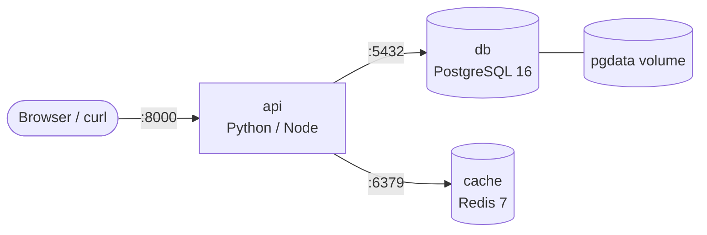
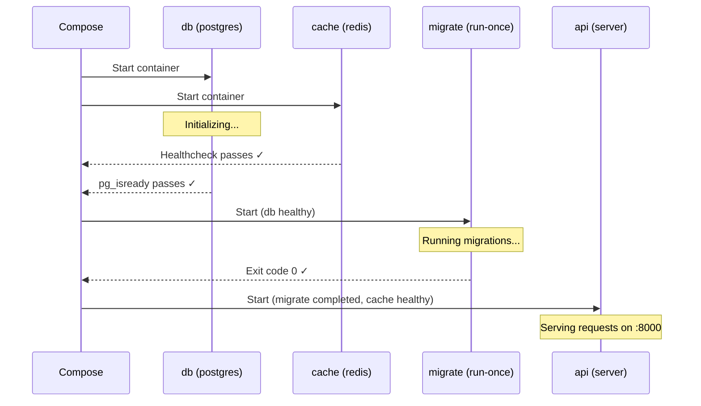

# Compose Fundamentals

> Turn multi-container chaos into a single declarative YAML file — define services, wire dependencies, add healthchecks, and manage your entire stack with one command.

## Mental model

Every non-trivial application needs more than one container. A typical web app
runs an API server, a database, a cache, maybe a worker process and a reverse
proxy. Without Compose you end up with a wall of `docker run` commands:

```bash
# The "docker run hell" — don't do this
docker network create myapp                        # create a network
docker volume create pgdata                        # create a volume
docker run -d --name db --network myapp \          # start postgres
  -v pgdata:/var/lib/postgresql/data \
  -e POSTGRES_PASSWORD=secret postgres:16
docker run -d --name cache --network myapp \       # start redis
  redis:7
docker run -d --name api --network myapp \         # start the api
  -p 8000:8000 \
  -e DATABASE_URL=postgres://postgres:secret@db/postgres \
  -e REDIS_URL=redis://cache:6379 \
  myapp-api:latest
```

This is fragile, impossible to version-control cleanly, and painful to
reproduce. Compose replaces all of it with a single YAML file.

### Compose V2

Docker Compose V2 is a **plugin** built into the Docker CLI. The command is
`docker compose` (space, not hyphen). The legacy standalone binary
`docker-compose` (with a hyphen) is deprecated since July 2023.

```bash
# Correct — Compose V2 plugin
docker compose up -d

# Deprecated — standalone binary
docker-compose up -d   # don't use this
```

### compose.yaml naming convention

Compose V2 looks for files in this priority order:

| Priority | Filename                 |
| -------- | ------------------------ |
| 1        | `compose.yaml`           |
| 2        | `compose.yml`            |
| 3        | `docker-compose.yaml`    |
| 4        | `docker-compose.yml`     |

The Compose specification recommends **`compose.yaml`**. Use it for all new
projects.

### The project concept

Compose prefixes every resource (containers, networks, volumes) with a
**project name**. By default the project name is the parent directory name:

```
~/projects/webshop/compose.yaml
# project name = "webshop"
# containers:  webshop-api-1, webshop-db-1, webshop-cache-1
# network:     webshop_default
```

Override it with `-p` or the `COMPOSE_PROJECT_NAME` env var when you need
multiple isolated copies of the same stack.

## Core concepts

### Your first compose.yaml

Start with the simplest possible file — a single nginx container:

```yaml
# compose.yaml — single-service example
services:
  web:                            # service name (also the DNS hostname)
    image: nginx:1.27-alpine      # official image with tag
    ports:
      - "8080:80"                 # host:container port mapping
    volumes:
      - ./html:/usr/share/nginx/html:ro  # bind mount, read-only
```

```bash
# Start the service (detached)
docker compose up -d

# Verify it's running
docker compose ps
# NAME       IMAGE              STATUS    PORTS
# web-1      nginx:1.27-alpine  Up 5s     0.0.0.0:8080->80/tcp

# Stop and remove everything
docker compose down
```

::: tip
`docker compose down` removes containers and the default network but
**preserves named volumes**. Add `-v` to also remove volumes.
:::

### The full-stack pattern — API + DB + Cache

Real projects wire multiple services together. Here is a complete,
production-realistic example with healthchecks.

```yaml
# compose.yaml — full-stack with healthchecks
services:
  api:
    build:
      context: .                       # build from Dockerfile in current dir
      dockerfile: Dockerfile           # explicit Dockerfile path
    ports:
      - "8000:8000"                    # expose the API
    environment:
      DATABASE_URL: postgres://app:secret@db:5432/appdb  # db service hostname
      REDIS_URL: redis://cache:6379    # cache service hostname
    depends_on:
      db:
        condition: service_healthy     # wait until DB is truly ready
      cache:
        condition: service_healthy     # wait until Redis is truly ready
    healthcheck:
      test: ["CMD", "curl", "-f", "http://localhost:8000/health"]
      interval: 10s
      timeout: 5s
      retries: 3
      start_period: 15s               # grace period during startup

  db:
    image: postgres:16-alpine
    environment:
      POSTGRES_USER: app              # creates user "app"
      POSTGRES_PASSWORD: secret       # sets the password
      POSTGRES_DB: appdb              # creates database "appdb"
    volumes:
      - pgdata:/var/lib/postgresql/data  # persist data across restarts
    healthcheck:
      test: ["CMD-SHELL", "pg_isready -U app -d appdb"]
      interval: 5s
      timeout: 3s
      retries: 5
      start_period: 10s

  cache:
    image: redis:7-alpine
    healthcheck:
      test: ["CMD", "redis-cli", "ping"]   # returns PONG when ready
      interval: 5s
      timeout: 3s
      retries: 5

volumes:
  pgdata:                             # named volume declaration
```



### depends_on done right

`depends_on` is the most misunderstood Compose directive. There are three
conditions you can specify, and each one solves a different problem:

| Condition                          | What it means                          | Use case                    |
| ---------------------------------- | -------------------------------------- | --------------------------- |
| *(none — just the service name)*   | Start the dependency first (order only) | Rarely sufficient           |
| `service_healthy`                  | Wait until the healthcheck passes      | DB, cache, any server       |
| `service_completed_successfully`   | Wait until the container exits with 0  | Migrations, seed scripts    |

```yaml
# depends_on examples
services:
  migrate:
    image: myapp:latest
    command: ["python", "manage.py", "migrate"]   # run-once migration
    depends_on:
      db:
        condition: service_healthy                # DB must be ready first

  api:
    image: myapp:latest
    command: ["uvicorn", "app:app", "--host", "0.0.0.0"]
    depends_on:
      migrate:
        condition: service_completed_successfully # migrations must finish
      cache:
        condition: service_healthy                # cache must be ready
```

::: warning
`depends_on` without a `condition` only controls **start order**, not
readiness. Your app will crash if the database hasn't finished initializing.
Always pair `depends_on` with a healthcheck condition.
:::



### Healthchecks in Compose

A healthcheck turns a container's status from `Up` to `Up (healthy)`. Compose
uses this status for `depends_on` conditions.

| Field          | Default  | Description                                   |
| -------------- | -------- | --------------------------------------------- |
| `test`         | —        | Command to run; exit 0 = healthy              |
| `interval`     | `30s`    | Time between checks                           |
| `timeout`      | `30s`    | Max time per check before it's marked failed  |
| `retries`      | `3`      | Consecutive failures before `unhealthy`       |
| `start_period` | `0s`     | Grace period — failures don't count here      |

Common healthcheck patterns for popular services:

```yaml
# PostgreSQL
healthcheck:
  test: ["CMD-SHELL", "pg_isready -U ${POSTGRES_USER} -d ${POSTGRES_DB}"]
  interval: 5s
  timeout: 3s
  retries: 5
  start_period: 10s

# MySQL / MariaDB
healthcheck:
  test: ["CMD", "mysqladmin", "ping", "-h", "localhost"]
  interval: 5s
  timeout: 3s
  retries: 5

# Redis
healthcheck:
  test: ["CMD", "redis-cli", "ping"]
  interval: 5s
  timeout: 3s
  retries: 5

# HTTP endpoint (curl)
healthcheck:
  test: ["CMD", "curl", "-f", "http://localhost:8000/health"]
  interval: 10s
  timeout: 5s
  retries: 3
  start_period: 15s

# HTTP endpoint (wget — useful in Alpine images without curl)
healthcheck:
  test: ["CMD", "wget", "--spider", "-q", "http://localhost:3000/health"]
  interval: 10s
  timeout: 5s
  retries: 3
```

::: tip
Use `CMD-SHELL` when you need shell features like pipes or variable expansion.
Use `CMD` (exec form) for a direct command without shell overhead.
:::

### Environment variables and .env files

Compose gives you three ways to inject environment variables, each with
different scope and precedence:

```yaml
# compose.yaml — three methods side by side
services:
  api:
    image: myapp:latest

    # Method 1: inline key-value pairs
    environment:
      NODE_ENV: production             # hardcoded in the YAML
      LOG_LEVEL: info

    # Method 2: load from a file
    env_file:
      - .env.db                        # bulk-load variables from a file

    # Method 3: interpolation from .env or shell
    environment:
      DATABASE_URL: postgres://app:${DB_PASSWORD}@db:5432/appdb
```

**Precedence** (highest wins):

1. Shell environment (`export DB_PASSWORD=hunter2`)
2. `.env` file in the project directory (auto-loaded for interpolation only)
3. `env_file:` directive
4. `environment:` directive (inline values)
5. Dockerfile `ENV`

```bash
# .env — auto-loaded for ${} interpolation in compose.yaml
DB_PASSWORD=supersecret
APP_VERSION=2.4.1
```

Use parameter expansion for safety:

```yaml
environment:
  # Required — Compose fails fast with a clear error if missing
  DB_PASSWORD: ${DB_PASSWORD:?Set DB_PASSWORD in .env or shell}

  # Optional with default — falls back silently
  LOG_LEVEL: ${LOG_LEVEL:-info}
```

::: danger
Never commit `.env` files containing real secrets. Add `.env` to
`.gitignore` and provide a `.env.example` template instead.
:::

### Compose services that build from a Dockerfile

Instead of referencing a pre-built image, Compose can build from source:

```yaml
services:
  api:
    build:
      context: .                       # build context directory
      dockerfile: docker/Dockerfile    # path to Dockerfile (relative to context)
      target: production               # multi-stage target
      args:
        PYTHON_VERSION: "3.12"         # build-time ARGs
    image: myapp-api:latest            # tag the built image
    ports:
      - "8000:8000"
```

```bash
# Build and start
docker compose up -d --build

# Build without starting
docker compose build

# Build a specific service only
docker compose build api
```

::: info
When both `build:` and `image:` are present, Compose builds the image and
tags it with the name specified in `image:`. This is useful for pushing to a
registry later.
:::

## Daily Compose commands

| Command                              | What it does                                          |
| ------------------------------------ | ----------------------------------------------------- |
| `docker compose up -d`               | Create and start all services in the background       |
| `docker compose up -d --build`       | Rebuild images before starting                        |
| `docker compose down`                | Stop and remove containers + default network          |
| `docker compose down -v`             | Also remove named volumes (destroys data!)            |
| `docker compose ps`                  | List running services and their status                |
| `docker compose logs -f`             | Tail logs from all services                           |
| `docker compose logs -f api db`      | Tail logs from specific services only                 |
| `docker compose exec api bash`       | Open a shell inside a running service                 |
| `docker compose run --rm api pytest` | Spin up a one-off container, run a command, remove it |
| `docker compose config`              | Validate and display the resolved YAML                |
| `docker compose pull`                | Pull the latest images for all services               |
| `docker compose top`                 | Display running processes in each service             |

```bash
# Typical dev loop
docker compose up -d --build     # start everything, rebuild if needed
docker compose logs -f api       # watch API logs in real time
docker compose exec api bash     # jump into the API container
docker compose down              # tear down when done
```

::: tip
`docker compose run --rm` is perfect for one-off commands like running
tests, generating migrations, or starting an interactive shell. The `--rm`
flag ensures the temporary container is cleaned up automatically.
:::

## Checkpoint

You should now be able to:

- [ ] Explain why Compose V2 (`docker compose`) replaces `docker-compose`
- [ ] Write a `compose.yaml` with multiple services, healthchecks, and proper `depends_on` conditions
- [ ] Use `service_healthy` for servers and `service_completed_successfully` for run-once jobs
- [ ] Inject environment variables using `.env`, `env_file:`, and `environment:`
- [ ] Build images from Dockerfiles inside a Compose file
- [ ] Use daily commands: `up`, `down`, `ps`, `logs`, `exec`, `run`, `config`
