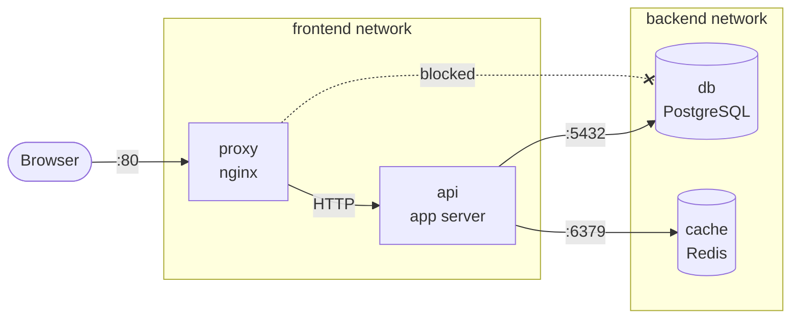

# Compose Networking & Storage

> Design isolated network topologies and persistent storage patterns in Docker Compose — from dev live-reload mounts to production-grade data management.

## Mental model

Compose automatically creates a bridge network and connects every service to
it. This is convenient but not always sufficient — production stacks need
network isolation (the frontend should never talk directly to the database) and
persistent storage that survives `docker compose down`.

This tutorial covers both pillars: **how data flows between containers**
(networking) and **where data lives** (volumes and mounts).

## Core concepts

### Default network

When you run `docker compose up`, Compose creates a single bridge network named
`<project>_default` and attaches every service to it:

```yaml
# compose.yaml — default networking (implicit)
services:
  api:
    image: myapp-api:latest
    ports:
      - "8000:8000"

  db:
    image: postgres:16-alpine
    environment:
      POSTGRES_PASSWORD: secret
```

Both `api` and `db` land on the same network. The API can reach Postgres at
hostname `db` on port `5432` — no extra configuration needed.

```bash
# Prove it — resolve the db hostname from inside the api container
docker compose exec api nslookup db
# Server:    127.0.0.11
# Name:      db
# Address:   172.20.0.3
```

::: tip
Docker's embedded DNS server (`127.0.0.11`) resolves service names to
container IPs automatically. Always use service names, never hardcoded IPs.
:::

### Custom networks for isolation

In a real stack the frontend proxy should reach the API, the API should reach
the database, but the proxy should **never** reach the database directly.
Custom networks enforce this:

```yaml
# compose.yaml — network isolation
services:
  proxy:
    image: nginx:1.27-alpine
    ports:
      - "80:80"
    networks:
      - frontend                       # can reach the api

  api:
    build: .
    networks:
      - frontend                       # reachable by the proxy
      - backend                        # can reach the db and cache

  db:
    image: postgres:16-alpine
    environment:
      POSTGRES_PASSWORD: secret
    volumes:
      - pgdata:/var/lib/postgresql/data
    networks:
      - backend                        # only reachable by the api

  cache:
    image: redis:7-alpine
    networks:
      - backend                        # only reachable by the api

networks:
  frontend:                            # proxy ↔ api
  backend:                             # api ↔ db, api ↔ cache

volumes:
  pgdata:
```



::: warning
A service can only resolve the hostname of another service if they share
**at least one network**. If `proxy` and `db` are on different networks
with no overlap, `proxy` cannot reach `db` at all — by design.
:::

### Internal networks

An **internal** network has no outbound internet access. Use it for backend
services that should never call external APIs:

```yaml
networks:
  backend:
    internal: true                     # no route to the internet
```

Containers on an internal network can still communicate with each other. Only
egress to the outside world is blocked.

### DNS service discovery

Every service name doubles as a DNS hostname within its network. Compose also
supports per-service aliases for more descriptive names:

```yaml
services:
  db:
    image: postgres:16-alpine
    networks:
      backend:
        aliases:
          - postgres                   # reachable as "db" or "postgres"
          - primary-db                 # or "primary-db"
```

```bash
# From the api container, all three resolve to the same IP
docker compose exec api ping -c1 db
docker compose exec api ping -c1 postgres
docker compose exec api ping -c1 primary-db
```

## Volume patterns in Compose

### Named volumes for persistent data

Named volumes are the right choice for any data that must survive container
restarts and `docker compose down`:

```yaml
services:
  db:
    image: postgres:16-alpine
    volumes:
      - pgdata:/var/lib/postgresql/data    # named volume

volumes:
  pgdata:                                  # declared at top level
    driver: local                          # default driver (optional)
```

```bash
# Volumes persist across down/up cycles
docker compose down          # containers removed, pgdata survives
docker compose up -d         # db picks up existing data
docker compose down -v       # -v flag removes volumes too (data loss!)
```

### Bind mounts for dev workflow

Bind mounts map a host directory into the container. They are essential for
live-reload development — edit a file on the host, see the change instantly
inside the container:

```yaml
services:
  api:
    build: .
    command: uvicorn app.main:app --host 0.0.0.0 --reload  # auto-reload on change
    volumes:
      - ./src:/app/src                 # bind mount — live code sync
      - app-deps:/app/.venv            # named volume — protect dependencies
    ports:
      - "8000:8000"

volumes:
  app-deps:                            # holds installed dependencies
```

### The dependency protection pattern

Bind-mounting your project root into the container can clobber installed
dependencies because the host directory doesn't contain `node_modules` or
`.venv`. The fix is an **anonymous or named volume** that "masks" the
dependency directory:

```yaml
services:
  frontend:
    build: ./frontend
    command: npm run dev
    volumes:
      - ./frontend:/app               # sync all source code
      - /app/node_modules             # anonymous volume — protects node_modules
    ports:
      - "3000:3000"
```

The anonymous volume `/app/node_modules` preserves the `node_modules`
installed during `docker build`, preventing the bind mount from overwriting it
with an empty (or non-existent) host directory.

::: info
The same pattern works for Python (`/app/.venv` or `/app/__pycache__`), Go
(`/app/vendor`), or any language where installed dependencies live inside the
project tree.
:::

### tmpfs in Compose

`tmpfs` mounts live in memory and are wiped when the container stops. Use them
for scratch data, caches, or test artifacts that should never hit disk:

```yaml
services:
  api:
    image: myapp-api:latest
    tmpfs:
      - /tmp                           # fast in-memory scratch space
      - /app/.pytest_cache:size=64m    # bounded tmpfs with size limit
```

## Dev workflow with Compose

A solid development setup combines bind mounts, dependency protection, and a
dev-mode command override:

```yaml
# compose.yaml — dev-friendly stack
services:
  api:
    build:
      context: .
      target: dev                      # multi-stage dev target
    command: uvicorn app.main:app --host 0.0.0.0 --reload --log-level debug
    volumes:
      - ./src:/app/src                 # live source sync
      - app-deps:/app/.venv            # protect installed packages
    ports:
      - "8000:8000"                    # API
      - "5678:5678"                    # debugger port (debugpy)
    environment:
      DEBUG: "true"

  frontend:
    build:
      context: ./frontend
      target: dev
    command: npm run dev
    volumes:
      - ./frontend/src:/app/src        # live source sync
      - /app/node_modules              # protect node_modules
    ports:
      - "3000:3000"                    # Vite dev server
      - "24678:24678"                  # Vite HMR websocket

  db:
    image: postgres:16-alpine
    environment:
      POSTGRES_USER: app
      POSTGRES_PASSWORD: secret
      POSTGRES_DB: appdb
    volumes:
      - pgdata:/var/lib/postgresql/data
    ports:
      - "5432:5432"                    # expose DB for local tools (dev only!)
    healthcheck:
      test: ["CMD-SHELL", "pg_isready -U app"]
      interval: 5s
      timeout: 3s
      retries: 5

volumes:
  pgdata:
  app-deps:
```

```bash
# Start the dev stack
docker compose up -d --build

# Watch API logs while developing
docker compose logs -f api

# Run tests inside the container
docker compose exec api pytest -x --tb=short

# Tear down (keep DB data)
docker compose down
```

## Database data management

### Backup with Compose exec

```bash
# Dump the database to a file on the host
docker compose exec db pg_dump -U app appdb > backup_$(date +%F).sql

# Expected output: SQL dump written to backup_2026-07-13.sql
```

### Restore from dump

```bash
# Restore into a running database
docker compose exec -T db psql -U app appdb < backup_2026-07-13.sql
# The -T flag disables pseudo-TTY (required for stdin redirection)
```

### Volume backup and restore with Alpine containers

For binary-level volume backups (not just SQL), use a temporary container:

```bash
# Backup — tar the volume contents to a file on the host
docker run --rm \
  -v myproject_pgdata:/data:ro \
  -v $(pwd):/backup \
  alpine tar czf /backup/pgdata-backup.tar.gz -C /data .

# Restore — extract the tarball into the volume
docker run --rm \
  -v myproject_pgdata:/data \
  -v $(pwd):/backup \
  alpine sh -c "cd /data && tar xzf /backup/pgdata-backup.tar.gz"
```

::: danger
Always stop the database container before restoring a binary volume backup.
Writing to a volume while Postgres is running can corrupt data.
:::

## Network debugging in Compose

### Testing connectivity from inside a service

```bash
# Check if the api can reach the database
docker compose exec api sh -c "nc -zv db 5432"
# db (172.20.0.3:5432) open

# Check DNS resolution
docker compose exec api nslookup cache
# Name: cache  Address: 172.20.0.4

# Test an HTTP endpoint
docker compose exec api curl -f http://proxy/health
```

### Using netshoot for deep debugging

The `nicolaka/netshoot` image is a Swiss-army knife of network debugging tools
(dig, nslookup, tcpdump, iptables, curl, nmap, and more). Add it temporarily
to your Compose file:

```yaml
services:
  debug:
    image: nicolaka/netshoot           # full networking toolkit
    command: sleep infinity             # keep it running
    networks:
      - frontend
      - backend                        # join whatever networks you need to test
    profiles:
      - debug                          # only starts when you ask for it
```

```bash
# Start the debugger alongside your stack
docker compose --profile debug up -d debug

# Jump in and poke around
docker compose exec debug bash

# Inside the container:
dig db                                 # DNS lookup
nmap -p 5432 db                        # port scan
tcpdump -i eth0 port 5432             # capture traffic
curl -v http://api:8000/health         # test HTTP

# Tear down the debugger when done
docker compose --profile debug down
```

::: tip
Putting debug tools behind a `profile` keeps them out of your normal
`docker compose up` workflow. They only start when explicitly requested.
:::

## Checkpoint

You should now be able to:

- [ ] Explain how the default Compose network works and why service names resolve as hostnames
- [ ] Design isolated network topologies with custom `frontend` and `backend` networks
- [ ] Use `internal: true` to block outbound internet access for backend services
- [ ] Set up bind mounts for live-reload development with dependency protection volumes
- [ ] Back up and restore database data using `pg_dump`, `psql`, and Alpine tar containers
- [ ] Debug network issues using `exec`, `nslookup`, `nc`, and the `netshoot` image
