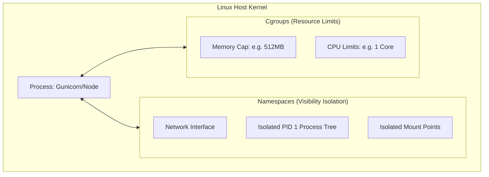
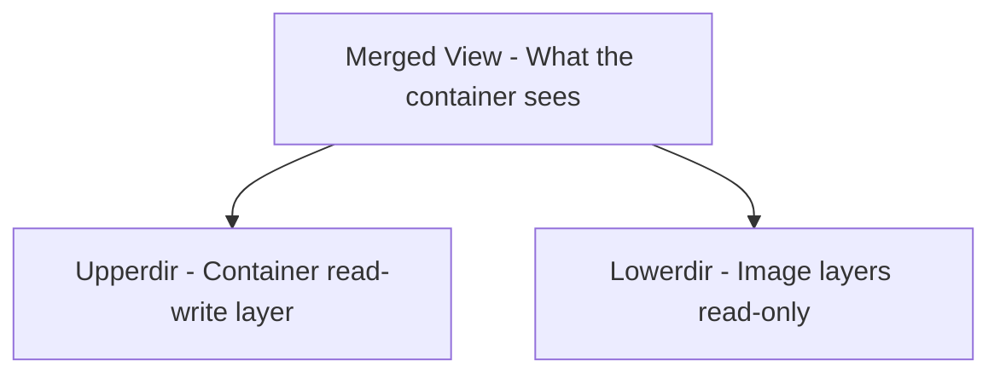
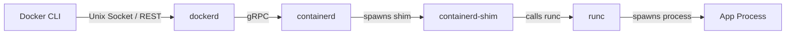

# Docker Internals

> Peek under the hood — learn how containers are really just Linux processes wrapped in namespaces and cgroups, and trace the full runtime stack from CLI to kernel.

## Mental model

There is no physical thing called a "container" inside the Linux kernel. A container is simply a normal Linux process that has been restricted and isolated using native kernel features: namespaces (which control what the process can **see**) and control groups (cgroups, which control what the process can **use**). 

The filesystem is assembled using OverlayFS, a union filesystem that merges read-only directories (image layers) with a single read-write directory (container layer).



---

## Core concepts

### Linux Namespaces

Namespaces wrap a global system resource in an abstraction, making it appear to the processes inside the namespace that they have their own isolated instance of that resource.

| Namespace | Isolates | Container Visibility |
|---|---|---|
| `pid` | Process ID space | The container's primary process becomes PID 1; it cannot see host processes. |
| `net` | Network devices, ports, routes | Container gets its own virtual loopback, IP address, and routing table. |
| `mnt` | Filesystem mount points | Container has its own root directory (`/`), separate from the host's mount table. |
| `uts` | Hostname and NIS domain | Container can define a unique hostname independent of the host. |
| `ipc` | Shared memory, message queues | Processes inside cannot communicate with host IPC channels. |
| `user` | User and group IDs | Root inside the container (UID 0) maps to a non-privileged user outside. |
| `cgroup` | Cgroup root directory | Limits container processes from seeing parent system cgroup nodes. |

#### Proving Namespace Isolation

You can inspect the namespace references of any running container process:

```bash
# Get the PID of a running container on the host
PID=$(docker inspect -f '{{.State.Pid}}' web)

# List the namespace files in the /proc directory
ls -l /proc/$PID/ns/
# Expected output shows entries like net -> 'net:[4026532248]', etc.
```

To run a command inside a running container's network namespace from the host:
```bash
sudo nsenter -t $PID -n ip addr
```

---

### Control Groups (cgroups v2)

Control groups enforce resource limits on CPU usage, memory thresholds, disk I/O bandwidth, and process counts.

When you pass resource limits to `docker run`, Docker writes those values directly into cgroup controller files on the host filesystem:

```bash
# Start a container with resource limits
docker run -d --name limited --memory 256m --cpus 0.5 nginx

# Fetch the long container ID
CID=$(docker inspect -f '{{.Id}}' limited)

# Read the cgroups v2 max memory controller file on the host
cat /sys/fs/cgroup/system.slice/docker-$CID.scope/memory.max
# Expected output: 268435456 (exactly 256MB in bytes)
```

---

### OverlayFS: The Storage Driver

OverlayFS is a modern union mount filesystem that combines multiple directories into a single unified mount point.



* **Lowerdir**: The read-only layers making up the base image.
* **Upperdir**: The container's writable layer. Any new files created or modified are stored here.
* **Merged**: The unified filesystem directory mounted inside the container.
* **Copy-on-Write (CoW)**: When an application inside the container attempts to edit an existing file belonging to a lower read-only layer, OverlayFS copies the file up to the `upperdir` writable layer first, where edits are applied. 

> 💡 **Tip**: Because copying large files up to the writable layer causes significant I/O latency, applications should always write high-frequency data to Docker **Volumes**, which bypass the OverlayFS driver completely.

---

### The Runtime Stack

Docker is not a single monolith. It is built as a chain of specialized components:



1. **Docker CLI**: The user-facing command-line tool.
2. **Docker Daemon (`dockerd`)**: Manages high-level features like networks, volumes, image builds, and exposing the REST API.
3. **containerd**: An industry-standard container runtime manager. It pulls images, manages volume attachments, and supervises container lifecycles.
4. **containerd-shim**: A lightweight monitor process spawned per container. It keeps the stdout/stderr pipe streams open and tracks exit statuses even if the main Docker daemon restarts.
5. **runc**: An OCI-compliant runtime CLI tool. It interacts with the Linux kernel to create namespaces, apply cgroups, mount OverlayFS, start the container process, and then immediately exits.

---

## Checkpoint

You can:
1. Explain how namespaces isolate container visibility.
2. Inspect host `/proc` and `/sys/fs/cgroup` directories to view runtime container constraints.
3. Define the role of Lowerdir, Upperdir, and Merged directories in OverlayFS.
4. Explain how the Copy-on-Write process affects write operations to image files.
5. Trace the execution flow from typing `docker run` to process startup.
