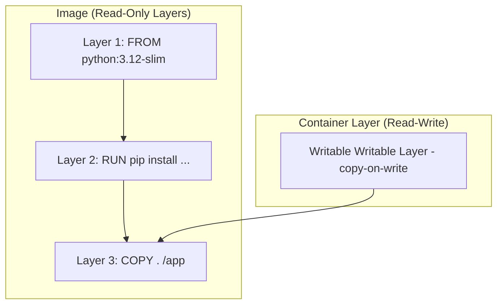

# Images & Dockerfiles

> Understand how images are built from layers, master every Dockerfile instruction, and learn the critical difference between CMD and ENTRYPOINT.

## Mental model

An image is an immutable, read-only template built from a stack of filesystem layers. Each layer represents a change made to the filesystem (like installing a package or copying code). When you launch a container, Docker places a thin, read-write layer (the container layer) on top of the stack. All changes made during runtime—writing files, deleting logs—occur in this writable layer using a copy-on-write strategy, leaving the underlying image pristine.



To see these layers and their sizes in an existing image, use `docker history`:

```bash
docker history python:3.12-slim
# Expected output shows size, creation timestamp, and the instruction that created each layer.
```

To inspect full metadata including the storage driver's active graph data layers:

```bash
docker image inspect python:3.12-slim
```

---

## Core concepts

### Dockerfile Instructions

A `Dockerfile` is a text document containing all the commands a user could call on the command line to assemble an image. Here is a breakdown of every core instruction:

#### FROM
* **Explanation**: Sets the base image for subsequent instructions.
* **Syntax**: `FROM <image>[:<tag>] [AS <name>]`
* **Example**: `FROM python:3.12-slim AS build`
* **Best Practice**: Always pin a specific version tag. Never use `latest`. Use `-slim` or `-alpine` to reduce footprint.

#### LABEL
* **Explanation**: Adds metadata to an image (key-value pairs).
* **Syntax**: `LABEL <key>=<value> <key>=<value> ...`
* **Example**: `LABEL maintainer="devs@company.com" version="1.0"`
* **Best Practice**: Use standardized label formats, such as the Open Containers Initiative (OCI) image specs.

#### ARG vs ENV
* **Explanation**: `ARG` defines build-time variables (discarded after build); `ENV` defines runtime environment variables (persist inside running containers).
* **Syntax**:
  * `ARG <name>[=<default value>]`
  * `ENV <key>=<value>`
* **Example**:
  ```dockerfile
  ARG APP_VERSION=1.0.0
  ENV APP_ENV=production
  ```
* **Best Practice**: Do not use `ARG` or `ENV` to bake secrets like passwords or private keys into the image.

#### WORKDIR
* **Explanation**: Sets the working directory for any subsequent `RUN`, `CMD`, `ENTRYPOINT`, `COPY`, and `ADD` instructions. Creates the directory if it doesn't exist.
* **Syntax**: `WORKDIR /path/to/dir`
* **Example**: `WORKDIR /app`
* **Best Practice**: Always use absolute paths instead of relative ones. Avoid mixing `cd` shell commands with `WORKDIR`.

#### COPY vs ADD
* **Explanation**: Both copy files from host to image. `COPY` only supports local file copying; `ADD` additionally supports remote URL downloads and automatic extraction of local tarball archives.
* **Syntax**: `COPY <src> <dest>` or `ADD <src> <dest>`
* **Example**:
  ```dockerfile
  COPY requirements.txt .
  ADD https://example.com/data.tar.gz /tmp/
  ```
* **Best Practice**: Prefer `COPY` because it is more transparent and predictable. Only use `ADD` when you explicitly need automatic extraction of local tar archives.

#### RUN
* **Explanation**: Executes commands at build time and commits the result as a new image layer.
* **Syntax**:
  * Exec form (preferred): `RUN ["executable", "param1", "param2"]`
  * Shell form: `RUN command param1 param2`
* **Example**: `RUN apt-get update && apt-get install -y --no-install-recommends curl`
* **Best Practice**: Chain commands with `&&` and clear caches in the same instruction layer (e.g. `rm -rf /var/lib/apt/lists/*`) to keep layer sizes small.

#### EXPOSE
* **Explanation**: Documents the ports on which the container will listen at runtime.
* **Syntax**: `EXPOSE <port>[/<protocol>]`
* **Example**: `EXPOSE 8080/tcp`
* **Best Practice**: This is strictly informational. It does not publish ports; you must map them using `-p` during `docker run`.

#### VOLUME
* **Explanation**: Creates a mount point with the specified name and marks it as holding externally mounted volumes from native host or other containers.
* **Syntax**: `VOLUME ["/data"]`
* **Example**: `VOLUME ["/var/lib/mysql"]`
* **Best Practice**: Use `VOLUME` for directories holding stateful database directories to prevent data from being written to the container's copy-on-write layer.

#### USER
* **Explanation**: Sets the user name or UID to use when running the image and for any subsequent `RUN`, `CMD`, and `ENTRYPOINT` instructions.
* **Syntax**: `USER <user>[:<group>]` or `USER <UID>[:<GID>]`
* **Example**:
  ```dockerfile
  RUN groupadd -r app && useradd -r -g app appuser
  USER appuser
  ```
* **Best Practice**: Always drop root privileges in production images for security.

#### HEALTHCHECK
* **Explanation**: Tells Docker how to test a container to check that it is still working.
* **Syntax**: `HEALTHCHECK --interval=30s --timeout=3s CMD curl -f http://localhost:8000/health || exit 1`
* **Best Practice**: Implement a health check endpoint in your application and define it in your Dockerfile to help orchestration systems detect zombie states.

#### SHELL, ONBUILD, STOPSIGNAL
* **Explanation**:
  * `SHELL` overrides the default shell used for shell-form instructions.
  * `ONBUILD` adds a trigger instruction to be executed when the image is used as the base for another build.
  * `STOPSIGNAL` sets the system call signal that will be sent to the container to exit.
* **Example**: `SHELL ["/bin/bash", "-c"]`

---

## CMD vs ENTRYPOINT

The distinction between `CMD` and `ENTRYPOINT` is a common point of confusion:
* **`ENTRYPOINT`** sets the command that will always be executed when the container starts.
* **`CMD`** sets the default arguments for the `ENTRYPOINT`. If the user passes arguments at the end of the `docker run` command, these arguments override the `CMD`.

| Entrypoint | CMD | Run Command | Resulting Execution |
|---|---|---|---|
| `["python", "manage.py"]` | `["runserver"]` | `docker run myapp` | `python manage.py runserver` |
| `["python", "manage.py"]` | `["runserver"]` | `docker run myapp migrate` | `python manage.py migrate` |
| (None) | `["python", "app.py"]` | `docker run myapp` | `python app.py` |
| `["/bin/ping"]` | `["localhost"]` | `docker run myapp 8.8.8.8` | `/bin/ping 8.8.8.8` |

### Shell vs Exec Form

Always use the **Exec form** (brackets `["executable", "args"]`) for both `ENTRYPOINT` and `CMD`. 

```dockerfile
# ✅ Exec form (Preferred)
ENTRYPOINT ["python", "app.py"]

# ❌ Shell form
ENTRYPOINT python app.py
```

* **Why?** Shell form wraps your command in `/bin/sh -c`, meaning the shell becomes PID 1, and your application runs as a subprocess. The shell does not forward OS signals (like `SIGTERM` on stop), causing your app to fail to exit gracefully (resulting in a hard kill after a 10-second timeout).

---

## .dockerignore

The `.dockerignore` file prevents directories and files (like development tools, build caches, git history, and secrets) from being sent to the Docker daemon during building. This reduces build context size and keeps images safe.

```
# .dockerignore
.git
.github
__pycache__/
*.pyc
node_modules/
.env
.venv
tests/
Dockerfile
docker-compose*.yml
```

---

## Checkpoint

You can:
1. Explain how copy-on-write keeps image layers read-only.
2. Write a single-stage Dockerfile utilizing `WORKDIR`, `USER`, `COPY`, and `ENV`.
3. Explain the interaction of `ENTRYPOINT` and `CMD` in exec form.
4. Utilize a `.dockerignore` file to optimize build contexts.
