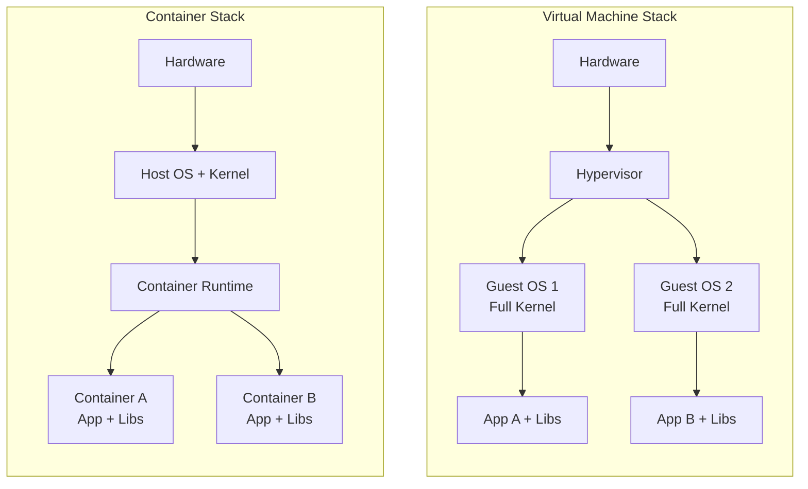
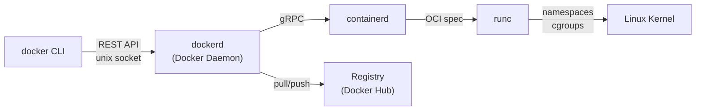
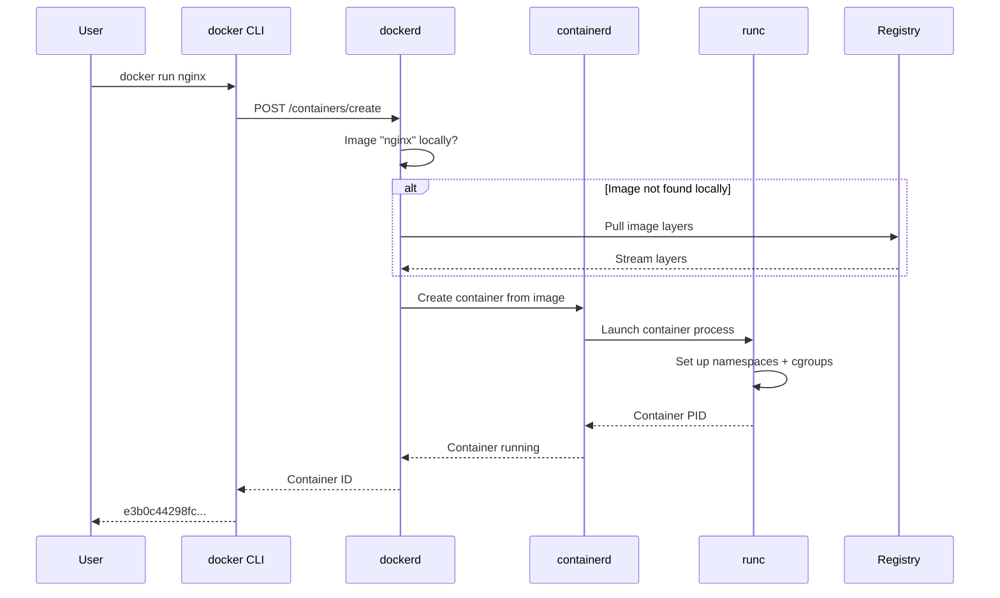

# Introduction & Architecture

> What containers are, why they exist, Docker's internal architecture, and how to get Docker installed and verified on any operating system.

## Mental model

Think of a shipping container on a cargo ship. Before containerization, longshoremen had
to handle every crate, barrel, and sack individually — breakage was common, loading was
slow, and every port had different equipment. The shipping container standardized
everything: uniform dimensions, stackable, loadable by any crane worldwide.

Docker containers do the same thing for software. They package an application together
with every library, config file, and runtime it needs into a single portable unit that
runs identically on a developer laptop, a CI server, and a production cluster.

## The problem Docker solves

### Dependency hell

Without containers, your Python app needs Python 3.11, but the server has 3.8. Your
colleague's macOS links against a different OpenSSL than the CI runner's Ubuntu. The
database driver compiles against glibc 2.31, but staging has 2.28. Every environment is
a snowflake.

### Environment drift

Over months, servers accumulate ad-hoc patches, orphaned packages, and hand-edited config
files. A deployment that works in January silently breaks in March because someone ran
`apt upgrade` on the staging box.

### Painful onboarding

A new developer joins your team. The README says "install Postgres 15, Redis 7, Node 20,
and Elasticsearch 8." Two days later they're still fighting library conflicts.

::: tip Docker eliminates all three
A Dockerfile captures the exact environment. `docker compose up` replaces a two-page
setup guide. If it runs on your machine, it runs everywhere.
:::

## Containers vs Virtual Machines



| Feature | Container | Virtual Machine |
|---|---|---|
| **Startup time** | Milliseconds | 30-90 seconds |
| **Size** | MBs (5-500 MB typical) | GBs (2-20 GB typical) |
| **Isolation** | Process-level (namespaces + cgroups) | Hardware-level (full kernel) |
| **Performance** | Near-native | ~5-15% overhead |
| **Density** | Hundreds per host | Tens per host |
| **Portability** | OCI image runs anywhere | Hypervisor-specific formats |
| **OS support** | Shares host kernel (Linux) | Any OS per VM |

::: info When to choose VMs over containers
VMs are still the right tool when you need full kernel isolation (multi-tenant hosting),
must run a different OS (Windows apps on Linux hosts), or need hardware-level security
boundaries (PCI-DSS, high-security workloads).
:::

## Core vocabulary

| Term | What it is |
|---|---|
| **Image** | A read-only template made of stacked filesystem layers. Contains the app code, runtime, libraries, and config. Built from a Dockerfile. |
| **Container** | A running (or stopped) instance of an image. Adds a writable layer on top. You can create many containers from one image. |
| **Dockerfile** | A text recipe of instructions (`FROM`, `RUN`, `COPY`, etc.) that Docker executes to build an image. |
| **Registry** | A server that stores and distributes images. Docker Hub is the default public registry. |
| **Volume** | A Docker-managed directory on the host that persists data beyond a container's lifecycle. |
| **Daemon** | The background service (`dockerd`) that manages images, containers, networks, and volumes via the Docker API. |
| **BuildKit** | The modern image builder (default since Docker 23). Supports parallel build stages, cache mounts, and secret mounts. |

## Docker architecture

Docker uses a client-server model. The CLI (`docker`) sends commands over a REST API to
the daemon (`dockerd`), which delegates low-level container operations to `containerd`,
which in turn spawns containers via `runc`.



### What happens when you run `docker run`



### OCI — the Open Container Initiative

The OCI defines two open standards so that container images and runtimes are
interchangeable across vendors:

- **Image Spec** — how image layers and manifests are structured. Any OCI-compliant
  image runs on any OCI-compliant runtime.
- **Runtime Spec** — how a container is configured, created, started, and stopped.
  `runc` is the reference implementation; alternatives include `crun` (faster, in C),
  `youki` (Rust), and `gVisor` (sandboxed kernel).

::: tip Why OCI matters to you
Because of OCI, an image built with Docker works in Kubernetes, Podman, or any cloud
container service. You're never locked in.
:::

## Docker components overview

| Component | What it does |
|---|---|
| **Docker Engine** | The core: daemon + CLI + BuildKit + containerd. This is what runs containers. |
| **Docker Desktop** | A GUI app for macOS/Windows that bundles Docker Engine inside a lightweight Linux VM, plus Kubernetes, volume sharing, and resource controls. |
| **Docker Hub** | The default public registry. Hosts official images (`nginx`, `postgres`, `node`) and user repositories. Free tier: unlimited public repos, one private. |
| **BuildKit** | The next-gen builder. Parallelizes stages, supports cache mounts (`--mount=type=cache`), secret mounts, and SSH forwarding during builds. Enabled by default. |
| **Docker Compose** | A tool for defining and running multi-container apps with a single `compose.yaml` file. Ships with Docker Desktop; installable as a CLI plugin on Linux. |

## Installation

### Linux — Ubuntu / Debian

```bash
# Remove old/unofficial packages that may conflict
sudo apt-get remove -y docker.io docker-doc docker-compose podman-docker containerd runc

# Add Docker's official GPG key and repository
sudo apt-get update
sudo apt-get install -y ca-certificates curl
sudo install -m 0755 -d /etc/apt/keyrings
sudo curl -fsSL https://download.docker.com/linux/ubuntu/gpg \
  -o /etc/apt/keyrings/docker.asc
sudo chmod a+r /etc/apt/keyrings/docker.asc

# Add the repository (works for Ubuntu; swap "ubuntu" → "debian" for Debian)
echo \
  "deb [arch=$(dpkg --print-architecture) signed-by=/etc/apt/keyrings/docker.asc] \
  https://download.docker.com/linux/ubuntu \
  $(. /etc/os-release && echo "$VERSION_CODENAME") stable" | \
  sudo tee /etc/apt/sources.list.d/docker.list > /dev/null

# Install Docker Engine, CLI, and plugins
sudo apt-get update
sudo apt-get install -y docker-ce docker-ce-cli containerd.io \
  docker-buildx-plugin docker-compose-plugin
```

### Linux — Fedora

```bash
# Install the dnf plugin and add the Docker repo
sudo dnf -y install dnf-plugins-core
sudo dnf config-manager --add-repo \
  https://download.docker.com/linux/fedora/docker-ce.repo

# Install and start Docker
sudo dnf install -y docker-ce docker-ce-cli containerd.io \
  docker-buildx-plugin docker-compose-plugin
sudo systemctl enable --now docker
```

### Linux — Arch

```bash
# Docker is in the official community repository
sudo pacman -S docker docker-compose docker-buildx

# Enable and start the daemon
sudo systemctl enable --now docker
```

### macOS — Docker Desktop

1. Download **Docker Desktop for Mac** from [docker.com/products/docker-desktop](https://www.docker.com/products/docker-desktop/).
2. Open the `.dmg`, drag Docker to Applications, and launch it.
3. Docker Desktop runs a lightweight Linux VM under the hood (Apple Virtualization framework on Apple Silicon, HyperKit on Intel).
4. The `docker` CLI is automatically added to your PATH.

### Windows — Docker Desktop + WSL 2

1. Enable **WSL 2**: open PowerShell as Administrator and run `wsl --install`.
2. Download and install **Docker Desktop for Windows**.
3. In Docker Desktop settings, ensure **"Use the WSL 2 based engine"** is checked.
4. Docker integrates with your WSL 2 distros — run `docker` from any WSL terminal.

::: warning Windows Home edition
Docker Desktop works on Windows Home (10 build 19045+) thanks to WSL 2.
The legacy Hyper-V backend requires Windows Pro/Enterprise.
:::

### Post-install — run Docker without sudo (Linux)

```bash
# Create the docker group (usually already exists)
sudo groupadd docker

# Add your user to the docker group
sudo usermod -aG docker $USER

# Activate the new group membership (or log out and back in)
newgrp docker

# Verify — this should work without sudo now
docker run hello-world
```

::: danger Security note
Adding a user to the `docker` group grants root-equivalent access to the Docker daemon.
Only add trusted users. For rootless Docker, see the advanced tutorials.
:::

## Verification

Run these three commands to confirm everything is working:

```bash
# Show client and server versions — confirms CLI can talk to the daemon
docker version
# Expected: Client and Server sections with version 27.x+

# Show system-wide information — storage driver, runtime, OS, kernel
docker info
# Look for: Server Version, Storage Driver (overlay2), Cgroup Version (2)

# Pull and run a tiny test image
docker run hello-world
# Expected: "Hello from Docker!" message confirming the full pipeline works
```

Expected output of `docker run hello-world`:

```
Unable to find image 'hello-world:latest' locally
latest: Pulling from library/hello-world
e6590344b1a5: Pull complete
Digest: sha256:...
Status: Downloaded newer image for hello-world:latest

Hello from Docker!
This message shows that your installation appears to be working correctly.
...
```

::: tip What just happened behind the scenes
1. The CLI asked the daemon for the `hello-world` image.
2. The daemon didn't find it locally, so it pulled it from Docker Hub.
3. The daemon created a container from the image.
4. The container ran its single binary, printed the message, and exited.
5. The container still exists in a "stopped" state (`docker ps -a` to see it).
:::

## Checkpoint

At this point you should be able to:

- [ ] Explain the difference between a container and a VM in one sentence
- [ ] Draw the Docker architecture from memory: CLI → daemon → containerd → runc
- [ ] Run `docker version` and see both Client and Server output
- [ ] Run `docker run hello-world` successfully without `sudo`
- [ ] Know what OCI means and why it prevents vendor lock-in

Next up: [Running Containers](./running-containers) — where you'll learn the full
container lifecycle, every essential `docker run` flag, and how to debug running
containers.
