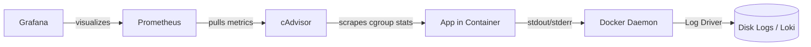

# Logging & Monitoring

> Configure log drivers and rotation to prevent disk disasters, then build a complete monitoring stack with Prometheus, Grafana, and cAdvisor.

## Mental model

Containers are transient and should be treated as stateless runtimes. A key tenet of 12-factor application design is that **applications should never write logs to internal files**. Instead, write logs directly to the standard output (`stdout`) and standard error (`stderr`) streams. The Docker daemon intercepts these streams and routes them to a configured logging driver. 

For monitoring, Docker provides access to the container stats API. By wiring this up to cAdvisor (container advisor), we can scrape system metrics and feed them into a Prometheus database, visualized via Grafana dashboards.



---

## Core concepts

### Logging Drivers

Docker supports several logging drivers for capturing stdout/stderr data:

| Driver | Destination | Use Case |
|---|---|---|
| `json-file` | Local JSON files (default) | Local development and small VM deployments |
| `journald` | Systemd journal service | Native systemd-integrated Linux servers |
| `syslog` | Local/Remote syslog server | Traditional enterprise centralized logging infrastructure |
| `fluentd` | Local/Remote fluentd collector | Routing to Elasticsearch, Splunk, or cloud storage |
| `awslogs` | Amazon CloudWatch | Native AWS ECS / EC2 container workloads |
| `gelf` | Graylog Extended Log Format | Structured log ingestion into Graylog clusters |

> ⚠ **Warning**: By default, the `json-file` logging driver does not rotate logs. Over time, high-traffic applications will write gigabytes of logs until the host filesystem fills up completely, causing host and database crashes.

---

### Implementing Log Rotation

Always configure log rotation limits globally or per container in production.

#### Option 1: Global Daemon Configuration (`/etc/docker/daemon.json`)
Applies to all newly created containers across the host.

```json
{
  "log-driver": "json-file",
  "log-opts": {
    "max-size": "10m",
    "max-file": "3"
  }
}
```
*After editing, restart the Docker daemon: `sudo systemctl restart docker`.*

#### Option 2: Per-Service Configuration in Compose

```yaml
services:
  web:
    image: nginx:alpine
    logging:
      driver: json-file
      options:
        max-size: "10m"
        max-file: "3"
```

---

### Reading and Filtering Logs

```bash
# Follow logs in real time
docker logs -f web

# Tail the last 50 lines
docker logs --tail 50 web

# Retrieve logs since a specific timestamp
docker logs --since 2026-07-13T00:00:00Z web

# Show logs from a Compose stack with service names
docker compose logs -f --tail 20
```

---

### Monitoring: Prometheus, Grafana, and cAdvisor

A complete production-grade monitoring stack running on a single host is easily provisioned using a dedicated Compose file.

```yaml
# compose.monitoring.yaml
services:
  prometheus:
    image: prom/prometheus:v2.52.0
    volumes:
      - ./prometheus.yml:/etc/prometheus/prometheus.yml:ro
      - promdata:/prometheus
    ports:
      - "9090:9090"

  grafana:
    image: grafana/grafana:11.0.0
    ports:
      - "3000:3000"
    volumes:
      - grafanadata:/var/lib/grafana

  cadvisor:
    image: gcr.io/cadvisor/cadvisor:v0.49.1
    ports:
      - "8080:8080"
    volumes:
      - /:/rootfs:ro
      - /var/run:/var/run:ro
      - /sys:/sys:ro
      - /var/lib/docker/:/var/lib/docker:ro
      - /dev/disk/:/dev/disk:ro
    devices:
      - /dev/kmsg

volumes:
  promdata:
  grafanadata:
```

#### Prometheus Configuration (`prometheus.yml`)
Configure Prometheus to scrape metrics from the cAdvisor container:

```yaml
global:
  scrape_interval: 15s

scrape_configs:
  - job_name: "prometheus"
    static_configs:
      - targets: ["localhost:9090"]

  - job_name: "cadvisor"
    static_configs:
      - targets: ["cadvisor:8080"]
```

---

### Container Health Monitoring

Use the `HEALTHCHECK` directive inside Dockerfiles or Compose files to help monitor container availability.

```yaml
services:
  web:
    image: nginx:alpine
    healthcheck:
      test: ["CMD-SHELL", "curl -f http://localhost/ || exit 1"]
      interval: 10s
      timeout: 5s
      retries: 3
      start_period: 10s
```

Check the health status using `docker ps`:
```bash
docker ps
# Expected output shows: Up 5 minutes (healthy)
```

---

## Checkpoint

You can:
1. Explain why logging to standard files inside containers is an anti-pattern.
2. Implement global and service-specific log rotation limits.
3. Fetch container logs using time-based filters.
4. Deploy a complete cAdvisor, Prometheus, and Grafana monitoring stack.
5. Define automated container health checks.
