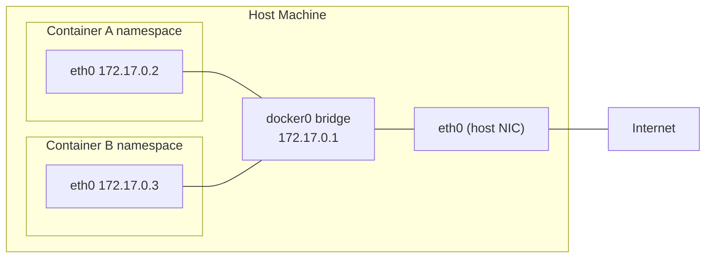
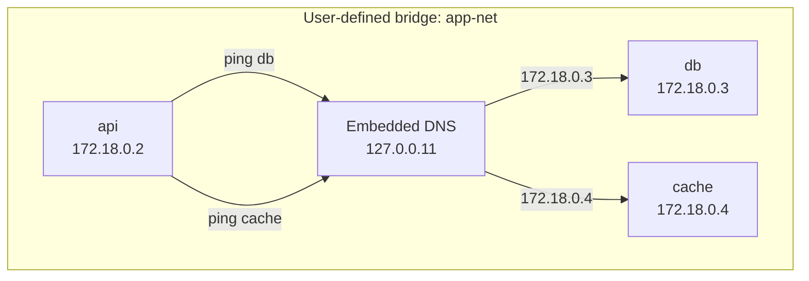
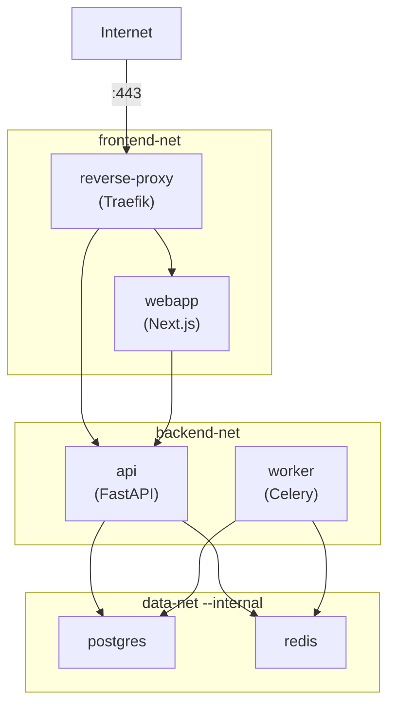

# Docker Networking

> Learn how containers communicate — network drivers, DNS resolution, port publishing, and network isolation patterns that keep your services secure.

## Mental model

Every container gets its own **network namespace** — a private copy of the network stack with its own interfaces, routing table, and `iptables` rules. By default, a container is an island. Docker's networking layer builds bridges between those islands.

Think of it this way:



When you run `docker run`, Docker creates a **veth pair** — one end goes inside the container (appears as `eth0`), the other end plugs into a bridge on the host. The bridge forwards traffic between containers and, through NAT, out to the internet.

## Core concepts

### Network drivers

Docker ships with several network drivers, each suited for a different use case.

#### bridge (default)

The **bridge** driver creates a Linux bridge on the host (`docker0` by default). All containers connect to this bridge and can reach the internet through NAT.

```bash
# Run two containers on the default bridge
docker run -d --name web1 nginx:alpine
docker run -d --name web2 nginx:alpine

# They get IPs on the 172.17.0.0/16 subnet
docker inspect -f '{{range .NetworkSettings.Networks}}{{.IPAddress}}{{end}}' web1
# 172.17.0.2
```

::: warning
The **default bridge** (`docker0`) does NOT provide DNS-based container name resolution. You must use IP addresses to communicate between containers on the default bridge. This is the #1 reason beginners can't get containers to talk to each other.
:::

#### User-defined bridge

A user-defined bridge gives you everything the default bridge has, plus:

- **Automatic DNS resolution** — containers resolve each other by name
- **Better isolation** — containers on different networks can't communicate
- **Hot-connect** — you can attach/detach running containers from networks

```bash
# Create a user-defined bridge network
docker network create app-net

# Run containers on it
docker run -d --name api --network app-net nginx:alpine
docker run -d --name db --network app-net postgres:16-alpine

# DNS works — 'api' can resolve 'db' by name
docker exec api ping -c 2 db
# PING db (172.18.0.3): 56 data bytes
# 64 bytes from 172.18.0.3: seq=0 ttl=64 time=0.089 ms
```

#### host

The **host** driver removes network isolation entirely. The container shares the host's network namespace — no bridge, no NAT, no port mapping. The process binds directly to the host's interfaces.

```bash
# Container listens directly on host port 80
docker run -d --network host nginx:alpine

# No -p needed — nginx is already on host:80
curl http://localhost
```

| Pros | Cons |
|------|------|
| Maximum network performance (no NAT overhead) | No isolation — port conflicts with host services |
| Useful for monitoring tools that need host network visibility | Only works on Linux (Docker Desktop uses a VM) |

#### none

The **none** driver gives the container a network namespace with only a loopback interface. No external connectivity at all.

```bash
# Air-gapped container — no network access
docker run --rm --network none alpine ping -c 1 google.com
# ping: bad address 'google.com'
```

Use this for batch-processing containers that should never make network calls, or for security-sensitive workloads.

#### overlay

The **overlay** driver creates a distributed network spanning multiple Docker hosts. It uses VXLAN to encapsulate container traffic across the physical network.

```bash
# Initialize a Docker Swarm (required for overlay)
docker swarm init

# Create an overlay network
docker network create --driver overlay --attachable my-overlay

# Services on different hosts can now communicate by name
docker service create --name frontend --network my-overlay nginx:alpine
```

::: info
Overlay networks require Docker Swarm mode. For Kubernetes-based multi-host networking, you'll use CNI plugins (Calico, Cilium, Flannel) instead.
:::

#### macvlan and ipvlan

These drivers give each container a real MAC address (macvlan) or share the host's MAC (ipvlan), making containers appear as physical devices on the LAN.

```bash
# Create a macvlan network on the host's physical interface
docker network create -d macvlan \
  --subnet=192.168.1.0/24 \        # match your LAN subnet
  --gateway=192.168.1.1 \           # your router IP
  -o parent=eth0 \                  # host's physical NIC
  lan-net

# Container gets a LAN IP, reachable from other devices
docker run -d --name legacy-app --network lan-net \
  --ip 192.168.1.50 \               # assign a specific LAN IP
  my-legacy-app
```

::: tip
Use macvlan when you need to integrate containers with existing LAN infrastructure — legacy apps that expect to be on the LAN, IoT devices, or DHCP scenarios.
:::

### Driver comparison table

| Driver | Isolation | DNS | Multi-host | Use case |
|--------|-----------|-----|------------|----------|
| `bridge` (default) | Container-level | No | No | Quick testing, single-host defaults |
| `bridge` (user-defined) | Container-level | Yes | No | Production single-host apps |
| `host` | None | N/A | No | Performance-critical, monitoring tools |
| `none` | Full (air-gap) | No | No | Batch processing, security-sensitive jobs |
| `overlay` | Container-level | Yes | Yes | Docker Swarm multi-host services |
| `macvlan` | LAN-level | No | LAN | Legacy integration, IoT, LAN presence |
| `ipvlan` | LAN-level | No | LAN | Same as macvlan, shared MAC address |

### User-defined bridge networks in detail

This is the network type you'll use 90% of the time.

```bash
# Create a network with custom subnet
docker network create \
  --driver bridge \
  --subnet 10.10.0.0/24 \       # custom subnet
  --gateway 10.10.0.1 \         # custom gateway
  backend

# List all networks
docker network ls
# NETWORK ID     NAME      DRIVER    SCOPE
# a1b2c3d4e5f6   backend   bridge    local
# f6e5d4c3b2a1   bridge    bridge    local
# ...

# Inspect a network — shows connected containers, subnet, gateway
docker network inspect backend
```



::: danger
Never rely on the default bridge for multi-container applications. Without DNS, you'd need to hardcode IPs, which change every time a container restarts. **Always create a user-defined network.**
:::

### Port publishing internals

Containers are isolated by default — nothing from the outside can reach them. Port publishing creates firewall rules (iptables/nftables DNAT) to forward host traffic into a container.

```bash
# Publish container port 80 on host port 8080
docker run -d -p 8080:80 --name web nginx:alpine

# What actually happened: Docker added iptables DNAT rules
sudo iptables -t nat -L DOCKER -n
# DNAT tcp -- 0.0.0.0/0  0.0.0.0/0  tcp dpt:8080 to:172.17.0.2:80
```

#### Binding to specific interfaces

By default, `-p 8080:80` binds to `0.0.0.0` — all interfaces, accessible from anywhere. For databases and internal services, **bind to localhost**:

```bash
# DANGEROUS — database accessible from the entire network
docker run -d -p 5432:5432 postgres:16-alpine

# SAFE — database only accessible from the host machine
docker run -d -p 127.0.0.1:5432:5432 postgres:16-alpine
```

::: danger
Always bind databases, admin panels, and internal APIs to `127.0.0.1`. Binding to `0.0.0.0` (the default) on a server with a public IP exposes them to the internet. This is one of the most common Docker security mistakes.
:::

#### Random ports and EXPOSE

```bash
# -P publishes all EXPOSEd ports on random high ports
docker run -d -P --name web nginx:alpine

# See the actual port mappings
docker port web
# 80/tcp -> 0.0.0.0:32768

# EXPOSE in a Dockerfile is documentation only — it does NOT publish ports
# It tells users which ports the app uses, nothing more
```

### Container communication patterns

#### Same network — communicate by name

```bash
docker network create mynet
docker run -d --name api --network mynet nginx:alpine
docker run -d --name worker --network mynet alpine sleep 3600

# Worker can reach api by container name
docker exec worker wget -qO- http://api
```

#### Different networks — isolated by default

```bash
docker network create frontend
docker network create backend

docker run -d --name web --network frontend nginx:alpine
docker run -d --name db --network backend postgres:16-alpine

# web CANNOT reach db — they're on different networks
docker exec web ping -c 1 db
# ping: bad address 'db'
```

#### Connecting to multiple networks

Some containers need to span network boundaries — like an API server that talks to both the frontend and backend networks:

```bash
# Start the API on the backend network
docker run -d --name api --network backend my-api

# Also connect it to the frontend network
docker network connect frontend api

# Now 'api' can reach containers on BOTH networks
# 'web' can reach 'api', and 'api' can reach 'db'
# But 'web' still cannot reach 'db' directly
```

### Network isolation with internal networks

An **internal network** blocks all outbound internet access while allowing container-to-container communication:

```bash
# Create an internal network — no internet access
docker network create --internal secure-net

docker run -d --name secret-db --network secure-net postgres:16-alpine

# Container can't reach the internet
docker exec secret-db ping -c 1 google.com
# ping: bad address 'google.com'

# But other containers on secure-net can reach it
docker run --rm --network secure-net alpine ping -c 1 secret-db
# PING secret-db (172.20.0.2): 56 data bytes — OK
```

### Real-world network topology

A production-like setup isolates tiers into separate networks:



In this topology:
- **reverse-proxy** spans `frontend-net` and `backend-net` — it routes external traffic
- **webapp** lives on `frontend-net`, talks to **api** through the proxy
- **api** and **worker** live on `backend-net`, connect to `data-net` for storage
- **data-net** is `--internal` — postgres and redis have zero internet access

### Common networking pitfalls and fixes

| Symptom | Cause | Fix |
|---------|-------|-----|
| `ping: bad address 'db'` | Containers on default bridge (no DNS) | Use a user-defined network |
| `connection refused` on published port | App inside container listens on `127.0.0.1` | Configure the app to listen on `0.0.0.0` |
| Can't reach container from another container | Containers on different networks | Put them on the same network or use `docker network connect` |
| Port already in use | Another process (or container) using the host port | Change the host port: `-p 8081:80` |
| Container can reach internet but not LAN hosts | macvlan not set up, or bridge NAT doesn't route to LAN | Use macvlan for LAN access or configure host routes |
| `iptables: No chain/target/match` | Docker modifies iptables; firewall tools may conflict | Ensure Docker manages its own chains; avoid `ufw` conflicts |

::: tip
When debugging networking, the `nicolaka/netshoot` image is invaluable — it bundles `curl`, `dig`, `nslookup`, `tcpdump`, `iperf`, and more:
```bash
# Attach a troubleshooting container to any network
docker run --rm -it --network app-net nicolaka/netshoot

# Inside the container, debug DNS
dig db
nslookup api

# Capture packets
tcpdump -i eth0 port 5432
```
:::

## Checkpoint

You now understand:

- Every container gets its own network namespace — isolation by default
- The **default bridge** has no DNS; **always use user-defined bridge networks**
- **Port publishing** creates iptables DNAT rules — bind databases to `127.0.0.1`
- Containers on the **same network** communicate by name; **different networks** are isolated
- **Internal networks** block outbound internet access for sensitive data stores
- Use **overlay** for multi-host, **macvlan/ipvlan** for LAN integration, **host** for raw performance
- Debug networking with `nicolaka/netshoot`
