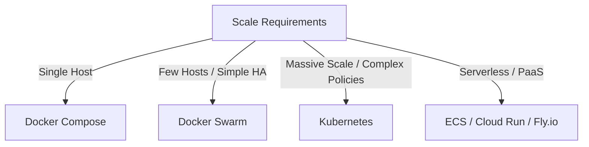

# Orchestration & Beyond

> When single-host Docker is not enough — Docker Swarm for simple HA, Docker contexts for remote deployment, rootless Docker for security, and the bridge to Kubernetes.

## Mental model

As applications grow, a single host represents a single point of failure. Orchestration tools coordinate containers across a cluster of virtual or physical machines. Before leaping directly to complex orchestrators like Kubernetes, developers can utilize lightweight patterns: **Docker Contexts** to manage remote machines over SSH, or **Docker Swarm** to run declarative multi-host stacks directly using compose configs.



---

## Core concepts

### Docker Contexts: Remote Host Management

Docker Contexts allow you to target remote Docker engines using your local CLI. By wiring this up over SSH, you can control and deploy applications to a remote VPS from your laptop with zero additional tool configurations.

```bash
# 1. Create a remote SSH context
docker context create vps --docker "host=ssh://deploy@vps.company.com"

# 2. View all configured contexts
docker context ls

# 3. Switch CLI targeting to the remote VPS
docker context use vps

# 4. Now, any commands run locally execute on the remote machine
docker ps
docker compose up -d # deploys your local Compose stack to the VPS!

# 5. Switch back to local development context
docker context use default
```

---

### Docker Swarm: Built-in Orchestration

Docker Swarm is Docker’s native orchestration tool. It groups multiple Docker hosts into a single, high-availability virtual engine. Swarm reuses standard Compose files and implements rolling updates and routing meshes out of the box.

```bash
# Initialize Swarm on the primary manager node
docker swarm init --advertise-addr 10.0.0.10

# Join worker nodes (using the token returned by swarm init)
docker swarm join --token SWMTKN-... 10.0.0.10:2377
```

#### Deploying Stacks to Swarm
Swarm uses a `deploy` section in the Compose file to configure replica counts, resource allocations, and rollout pacing:

```yaml
# compose.swarm.yaml
version: '3.8'
services:
  web:
    image: nginx:alpine
    ports:
      - "80:80"
    deploy:
      replicas: 3
      update_config:
        parallelism: 1
        delay: 10s
        order: start-first
      rollback_config:
        parallelism: 1
        order: stop-first
      restart_policy:
        condition: on-failure
```
Deploy the stack:
```bash
docker stack deploy -c compose.swarm.yaml myapp
```

---

### Rootless Docker

Rootless Docker runs both the Docker daemon and containers as a standard, non-privileged user ID. This leverages user namespaces to ensure that even if an attacker escapes the container, they do not gain root access to the host system.

#### Key Characteristics
* Uses `user_namespaces` to map container UID 0 (root) to host UID 1000 (regular user).
* Uses `slirp4netns` for network virtualization.
* **Limitations**: Cannot bind privileged host ports (<1024) directly; overlay network performance is slightly degraded.

---

### Alternative Runtimes

* **Podman**: A daemonless, rootless-by-default runtime offering a drop-in replacement for the Docker CLI (`alias docker=podman`).
* **gVisor**: A kernel virtualization sandbox that intercepts container system calls, protecting the host system from kernel exploits.
* **Kata Containers**: Spawns a lightweight hypervisor virtual machine per container, combining the security isolation of VMs with the speed of containers.

---

### The Bridge to Kubernetes

When migrating from Docker Compose to Kubernetes, keep this conceptual mapping in mind:

| Docker Compose Concept | Kubernetes Equivalent | Description |
|---|---|---|
| Container | Container (running inside a Pod) | The smallest unit of execution |
| Service | Service + Deployment | Deployment defines replicas; Service exposes network DNS |
| Named Volume | PersistentVolumeClaim (PVC) | Request for persistent storage allocation |
| Bridge Network | CNI Plugin (e.g. Calico) | Handles pod-to-pod IP routing |
| environment | ConfigMap / Secret | Injecting configuration variables or credentials |
| healthcheck | Liveness/Readiness Probes | Automated status checking loops |

---

## Checkpoint

You can:
1. Create and switch between local and remote Docker Contexts.
2. Initialize a Docker Swarm cluster.
3. Configure rolling update strategies using Compose `deploy` nodes.
4. Explain the security benefits and limits of Rootless Docker.
5. Map Docker Compose architectures to native Kubernetes components.
