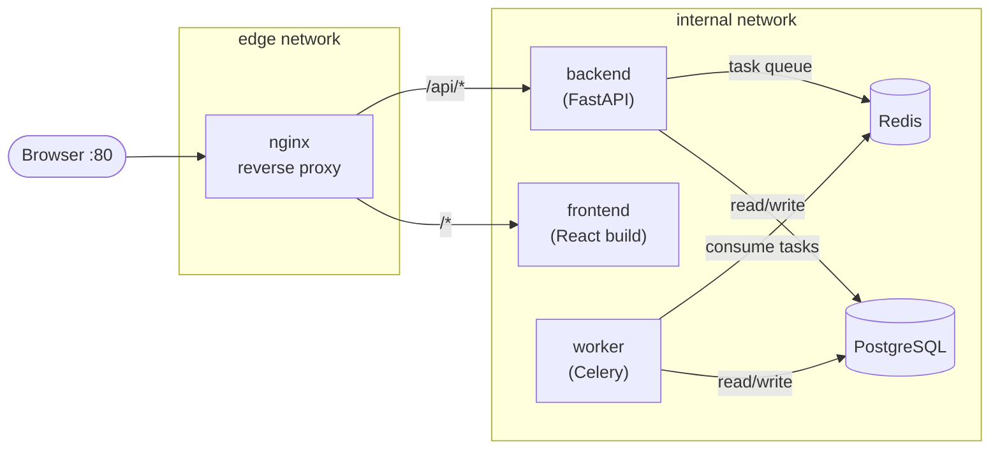
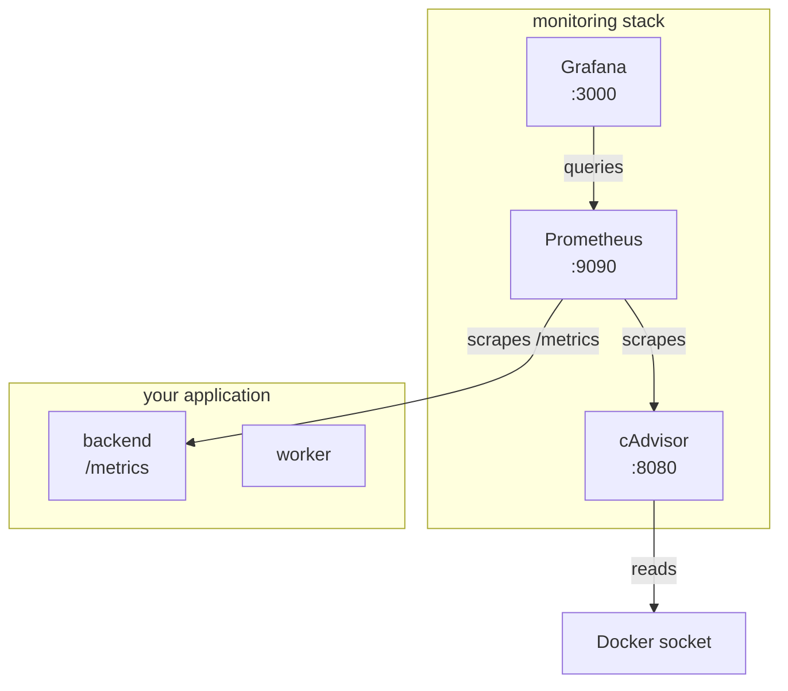
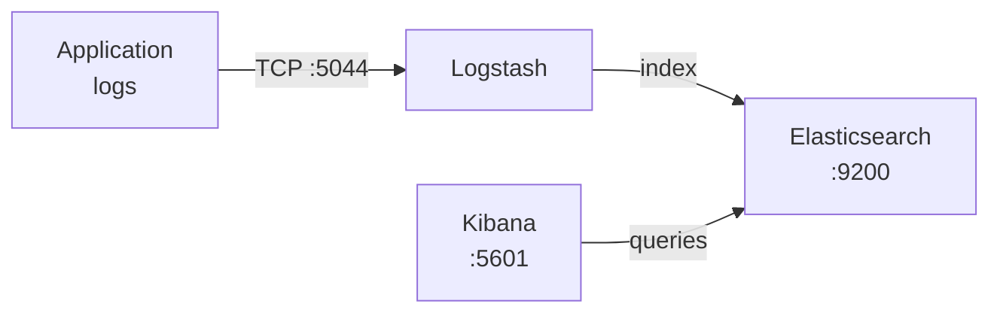

# Real-World Projects

> Put everything together — full-stack Compose applications, dev/prod environment setups, database backup workflows, and a complete monitoring stack.

## Mental model

Every tutorial so far taught one concept at a time.
Real applications combine dozens of concepts into a single running system.
Think of each project below as a blueprint you can fork, adapt, and deploy — they exercise networking, volumes, healthchecks, overrides, security, and monitoring all at once.

## Project 1 — Full-Stack Application

A production-shaped stack: React frontend, FastAPI backend, Celery worker, PostgreSQL, Redis, and nginx as the single entry point.

### Architecture



### Directory structure

```text
myapp/
├── compose.yaml            # production Compose file
├── nginx/
│   └── default.conf        # reverse-proxy config
├── frontend/
│   ├── Dockerfile
│   └── src/
├── backend/
│   ├── Dockerfile
│   ├── requirements.txt
│   └── app/
└── .env                    # shared env vars
```

### compose.yaml

```yaml
# compose.yaml — full-stack production layout
name: myapp

x-common-env: &common-env                 # YAML anchor for shared vars
  POSTGRES_USER: ${POSTGRES_USER:-app}
  POSTGRES_PASSWORD: ${POSTGRES_PASSWORD:?err}
  POSTGRES_DB: ${POSTGRES_DB:-appdb}

services:
  # ── Reverse Proxy ──────────────────────────────────────
  nginx:
    image: nginx:1.27-alpine
    ports:
      - "80:80"                            # the ONLY published port
    volumes:
      - ./nginx/default.conf:/etc/nginx/conf.d/default.conf:ro
    depends_on:
      frontend:
        condition: service_started
      backend:
        condition: service_healthy
    networks:
      - edge
      - internal
    restart: unless-stopped

  # ── Frontend ───────────────────────────────────────────
  frontend:
    build:
      context: ./frontend
      target: production                   # multi-stage: build then serve
    networks:
      - internal
    restart: unless-stopped

  # ── Backend ────────────────────────────────────────────
  backend:
    build:
      context: ./backend
      target: production
    environment:
      <<: *common-env
      REDIS_URL: redis://cache:6379/0
      DATABASE_URL: postgresql://${POSTGRES_USER:-app}:${POSTGRES_PASSWORD:?err}@db:5432/${POSTGRES_DB:-appdb}
    depends_on:
      db:
        condition: service_healthy         # wait for PG to accept connections
      cache:
        condition: service_started
    healthcheck:
      test: ["CMD", "curl", "-f", "http://localhost:8000/healthz"]
      interval: 10s
      retries: 3
    networks:
      - internal
    restart: unless-stopped

  # ── Celery Worker ──────────────────────────────────────
  worker:
    build:
      context: ./backend
      target: production
    command: celery -A app.tasks worker --loglevel=info   # override CMD
    environment:
      <<: *common-env
      REDIS_URL: redis://cache:6379/0
      DATABASE_URL: postgresql://${POSTGRES_USER:-app}:${POSTGRES_PASSWORD:?err}@db:5432/${POSTGRES_DB:-appdb}
    depends_on:
      db:
        condition: service_healthy
      cache:
        condition: service_started
    networks:
      - internal
    restart: unless-stopped

  # ── PostgreSQL ─────────────────────────────────────────
  db:
    image: postgres:16-alpine
    environment:
      <<: *common-env
    volumes:
      - pgdata:/var/lib/postgresql/data    # named volume survives recreates
    healthcheck:
      test: ["CMD-SHELL", "pg_isready -U $${POSTGRES_USER:-app}"]
      interval: 5s
      retries: 5
    networks:
      - internal
    restart: unless-stopped

  # ── Redis ──────────────────────────────────────────────
  cache:
    image: redis:7-alpine
    command: redis-server --maxmemory 128mb --maxmemory-policy allkeys-lru
    volumes:
      - redisdata:/data
    networks:
      - internal
    restart: unless-stopped

volumes:
  pgdata:
  redisdata:

networks:
  edge:                                    # nginx lives here, exposed to host
  internal:                                # everything else, isolated
    internal: true                         # blocks direct internet access
```

### Nginx configuration

```nginx
# nginx/default.conf
upstream frontend {
    server frontend:80;                    # React built with nginx image
}

upstream backend {
    server backend:8000;                   # FastAPI / Uvicorn
}

server {
    listen 80;

    # API traffic → backend
    location /api/ {
        proxy_pass         http://backend;
        proxy_set_header   Host $host;
        proxy_set_header   X-Real-IP $remote_addr;
    }

    # Everything else → frontend SPA
    location / {
        proxy_pass         http://frontend;
        proxy_set_header   Host $host;
    }
}
```

::: tip
The `internal: true` flag on the `internal` network prevents containers from reaching the public internet directly. Only `nginx` bridges both networks, acting as the single entry/exit point.
:::

---

## Project 2 — Dev vs Production Compose Setup

Use Compose's override system to keep a **single** base file and layer environment-specific settings on top.

### Base — compose.yaml

```yaml
# compose.yaml — environment-agnostic base
services:
  backend:
    build:
      context: ./backend
    environment:
      DATABASE_URL: postgresql://app:secret@db:5432/appdb
    depends_on:
      db:
        condition: service_healthy

  db:
    image: postgres:16-alpine
    environment:
      POSTGRES_USER: app
      POSTGRES_PASSWORD: secret
      POSTGRES_DB: appdb
    healthcheck:
      test: ["CMD-SHELL", "pg_isready -U app"]
      interval: 5s
      retries: 5
    volumes:
      - pgdata:/var/lib/postgresql/data

volumes:
  pgdata:
```

### Dev overlay — compose.override.yaml

```yaml
# compose.override.yaml — auto-loaded during `docker compose up`
services:
  backend:
    build:
      target: development                 # stage with dev deps installed
    volumes:
      - ./backend:/app                    # bind mount for hot reload
    environment:
      DEBUG: "true"
      RELOAD: "true"                      # Uvicorn --reload
    ports:
      - "8000:8000"                       # expose for local curl/browser

  db:
    ports:
      - "5432:5432"                       # expose for pgAdmin / DBeaver
```

### Prod overlay — compose.prod.yaml

```yaml
# compose.prod.yaml — explicit, locked-down production config
services:
  backend:
    build:
      target: production                  # slim, no dev deps
    # NO bind mounts, NO debug flags
    restart: unless-stopped
    logging:
      driver: json-file
      options:
        max-size: "10m"                   # cap log file at 10 MB
        max-file: "3"                     # keep 3 rotated files

  db:
    # NO exposed port — only reachable on internal Compose network
    restart: unless-stopped
    logging:
      driver: json-file
      options:
        max-size: "10m"
        max-file: "3"
```

### Running each environment

```bash
# Development (uses compose.yaml + compose.override.yaml automatically)
docker compose up --build

# Production (skip override, merge prod explicitly)
docker compose -f compose.yaml -f compose.prod.yaml up -d --build

# Verify which files Compose will merge
docker compose -f compose.yaml -f compose.prod.yaml config
```

::: warning
`compose.override.yaml` is loaded **automatically**. In CI/CD pipelines, always pass `-f compose.yaml -f compose.prod.yaml` explicitly so the override is never included by accident.
:::

---

## Project 3 — Database Backup and Restore Workflow

### Backup with compose exec

```bash
# Dump the entire database to a compressed SQL file on the host
docker compose exec db \
  pg_dump -U app -d appdb -Fc \
  > backups/appdb_$(date +%Y%m%d_%H%M%S).dump

# List existing backups
ls -lh backups/
```

### Restore from dump

```bash
# Drop and recreate, then restore from the latest dump
docker compose exec -T db \
  pg_restore -U app -d appdb --clean --if-exists \
  < backups/appdb_20260713_020000.dump
```

::: tip
The `-T` flag disables pseudo-TTY allocation so stdin redirection works correctly when piping a file into the container.
:::

### Volume-level backup with a disposable container

```bash
# Tar the raw PostgreSQL data directory into a backup archive
docker run --rm \
  -v myapp_pgdata:/source:ro \
  -v "$(pwd)/backups":/target \
  alpine \
  tar czf /target/pgdata_$(date +%Y%m%d).tar.gz -C /source .

# Restore: unpack the tarball back into the volume
docker run --rm \
  -v myapp_pgdata:/target \
  -v "$(pwd)/backups":/source:ro \
  alpine \
  sh -c "rm -rf /target/* && tar xzf /source/pgdata_20260713.tar.gz -C /target"
```

### Scheduled backup with a cron container

Add a dedicated service to your Compose file that runs backups on a schedule:

```yaml
# add to compose.yaml
services:
  db-backup:
    image: postgres:16-alpine             # same version as your db
    entrypoint: /bin/sh
    command:
      - -c
      - |
        # Run pg_dump every day at 02:00 UTC
        while true; do
          STAMP=$(date +%Y%m%d_%H%M%S)
          echo "[$$STAMP] Starting backup..."
          pg_dump -h db -U app -d appdb -Fc \
            > /backups/appdb_$${STAMP}.dump \
            && echo "Backup complete." \
            || echo "Backup FAILED!"
          # Delete backups older than 7 days
          find /backups -name "*.dump" -mtime +7 -delete
          sleep 86400                      # 24 hours
        done
    environment:
      PGPASSWORD: secret                  # or use .env / secrets
    volumes:
      - ./backups:/backups
    depends_on:
      db:
        condition: service_healthy
    networks:
      - internal
    restart: unless-stopped
```

::: danger
Never run `pg_restore --clean` against a production database without a tested backup. The `--clean` flag drops existing objects before recreating them.
:::

---

## Project 4 — Monitoring Stack

Prometheus for metrics collection, cAdvisor for container metrics, and Grafana for dashboards.

### Architecture



### compose.yaml

```yaml
# compose.monitoring.yaml
name: monitoring

services:
  prometheus:
    image: prom/prometheus:v2.53.0
    volumes:
      - ./prometheus/prometheus.yml:/etc/prometheus/prometheus.yml:ro
      - promdata:/prometheus                # persist metrics across restarts
    ports:
      - "9090:9090"
    command:
      - --config.file=/etc/prometheus/prometheus.yml
      - --storage.tsdb.retention.time=15d   # keep 15 days of data
    restart: unless-stopped

  grafana:
    image: grafana/grafana:11.1.0
    ports:
      - "3000:3000"
    environment:
      GF_SECURITY_ADMIN_PASSWORD: ${GRAFANA_PASS:-changeme}
    volumes:
      - grafanadata:/var/lib/grafana
    depends_on:
      - prometheus
    restart: unless-stopped

  cadvisor:
    image: gcr.io/cadvisor/cadvisor:v0.49.1
    volumes:
      - /:/rootfs:ro                        # host filesystem
      - /var/run:/var/run:ro
      - /sys:/sys:ro
      - /var/lib/docker/:/var/lib/docker:ro
    ports:
      - "8080:8080"
    restart: unless-stopped

volumes:
  promdata:
  grafanadata:
```

### prometheus.yml

```yaml
# prometheus/prometheus.yml
global:
  scrape_interval: 15s                     # how often to pull metrics

scrape_configs:
  - job_name: "prometheus"                 # self-monitoring
    static_configs:
      - targets: ["localhost:9090"]

  - job_name: "cadvisor"                   # container-level metrics
    static_configs:
      - targets: ["cadvisor:8080"]

  - job_name: "backend"                    # your app's /metrics endpoint
    static_configs:
      - targets: ["backend:8000"]
    metrics_path: /metrics
```

### What to monitor and alert on

| Metric | Source | Alert when |
|---|---|---|
| Container CPU % | cAdvisor | > 80 % sustained for 5 min |
| Container memory | cAdvisor | > 90 % of limit |
| Container restarts | cAdvisor | > 3 in 10 min |
| HTTP 5xx rate | backend `/metrics` | > 1 % of requests |
| Request latency p99 | backend `/metrics` | > 2 s |
| Disk usage | node-exporter | > 85 % |

---

## Project 5 — WordPress + MySQL

The classic five-minute Compose stack, done correctly with persistent storage and proper healthchecks.

```yaml
# compose.yaml
name: wordpress

services:
  wordpress:
    image: wordpress:6.5-apache
    ports:
      - "8080:80"
    environment:
      WORDPRESS_DB_HOST: db
      WORDPRESS_DB_USER: wp
      WORDPRESS_DB_PASSWORD: ${WP_DB_PASS:?set WP_DB_PASS in .env}
      WORDPRESS_DB_NAME: wordpress
    volumes:
      - wp_content:/var/www/html/wp-content   # themes, plugins, uploads
    depends_on:
      db:
        condition: service_healthy
    restart: unless-stopped

  db:
    image: mysql:8.4
    environment:
      MYSQL_DATABASE: wordpress
      MYSQL_USER: wp
      MYSQL_PASSWORD: ${WP_DB_PASS:?set WP_DB_PASS in .env}
      MYSQL_ROOT_PASSWORD: ${MYSQL_ROOT_PASS:?set MYSQL_ROOT_PASS in .env}
    volumes:
      - mysql_data:/var/lib/mysql             # persist database files
    healthcheck:
      test: ["CMD", "mysqladmin", "ping", "-h", "localhost"]
      interval: 10s
      retries: 5
    restart: unless-stopped

volumes:
  wp_content:          # survives docker compose down
  mysql_data:          # survives docker compose down
```

```bash
# Launch
echo "WP_DB_PASS=supersecret" >> .env
echo "MYSQL_ROOT_PASS=rootpass" >> .env
docker compose up -d

# Tear down but KEEP data
docker compose down          # volumes preserved

# Tear down and DELETE data
docker compose down -v       # volumes removed
```

---

## Project 6 — ELK Stack

Elasticsearch for storage and search, Logstash for ingestion and transformation, Kibana for visualization.

### Architecture



### compose.yaml

```yaml
# compose.elk.yaml
name: elk

services:
  elasticsearch:
    image: docker.elastic.co/elasticsearch/elasticsearch:8.14.0
    environment:
      discovery.type: single-node          # no cluster for local dev
      xpack.security.enabled: "false"      # disable auth for simplicity
      ES_JAVA_OPTS: "-Xms512m -Xmx512m"   # constrain heap
    volumes:
      - esdata:/usr/share/elasticsearch/data
    ports:
      - "9200:9200"
    healthcheck:
      test: ["CMD-SHELL", "curl -f http://localhost:9200/_cluster/health || exit 1"]
      interval: 10s
      retries: 10
    restart: unless-stopped

  logstash:
    image: docker.elastic.co/logstash/logstash:8.14.0
    volumes:
      - ./logstash/pipeline:/usr/share/logstash/pipeline:ro
    ports:
      - "5044:5044"                        # Beats input
    depends_on:
      elasticsearch:
        condition: service_healthy
    restart: unless-stopped

  kibana:
    image: docker.elastic.co/kibana/kibana:8.14.0
    environment:
      ELASTICSEARCH_HOSTS: http://elasticsearch:9200
    ports:
      - "5601:5601"
    depends_on:
      elasticsearch:
        condition: service_healthy
    restart: unless-stopped

volumes:
  esdata:
```

### Logstash pipeline

```ruby
# logstash/pipeline/logstash.conf
input {
  beats {
    port => 5044                           # receive from Filebeat / app
  }
}

filter {
  # Parse JSON-formatted application logs
  json {
    source => "message"
    skip_on_invalid_json => true
  }

  # Add a processed_at timestamp
  mutate {
    add_field => { "processed_at" => "%{@timestamp}" }
  }
}

output {
  elasticsearch {
    hosts => ["http://elasticsearch:9200"]
    index => "app-logs-%{+YYYY.MM.dd}"     # daily index rotation
  }
}
```

::: warning
The ELK stack is memory-hungry. Budget at least **2 GB RAM** for Elasticsearch alone. Set `ES_JAVA_OPTS` to hard-cap the heap and prevent OOM kills.
:::

---

## Capstone Checklist

Use this table to verify which skills each project exercises.

| Project | Skills proven |
|---|---|
| 1 — Full-Stack App | Compose, custom networks, healthchecks, depends_on conditions, YAML anchors, multi-service orchestration, reverse proxy |
| 2 — Dev vs Prod | Override files, multi-environment workflow, build targets, log rotation |
| 3 — Backup & Restore | Volume management, `exec` / `run`, data lifecycle, scheduled tasks |
| 4 — Monitoring Stack | Prometheus scraping, Grafana dashboards, cAdvisor, observability |
| 5 — WordPress + MySQL | Named volumes, environment variables, healthchecks, simple Compose |
| 6 — ELK Stack | Multi-container pipelines, healthcheck dependencies, resource constraints |

::: info
Completing all six projects means you have hands-on experience with every major Docker Compose concept covered in this notebook.
:::

---

## Command Reference Card

The 40 most-used Docker and Compose commands, organized by category.

### Containers

| Command | Description |
|---|---|
| `docker run -d --name c1 image` | Start a detached container |
| `docker run --rm -it image sh` | Interactive shell, auto-remove on exit |
| `docker ps` | List running containers |
| `docker ps -a` | List all containers (including stopped) |
| `docker stop c1` | Gracefully stop a container (SIGTERM) |
| `docker kill c1` | Force stop a container (SIGKILL) |
| `docker rm c1` | Remove a stopped container |
| `docker logs -f c1` | Follow live log output |
| `docker exec -it c1 sh` | Open a shell inside a running container |
| `docker inspect c1` | Show full JSON metadata |
| `docker stats` | Live resource-usage stream for all containers |
| `docker cp c1:/app/file .` | Copy a file from container to host |

### Images

| Command | Description |
|---|---|
| `docker build -t app:v1 .` | Build an image and tag it |
| `docker images` | List local images |
| `docker rmi app:v1` | Remove an image |
| `docker tag app:v1 reg/app:v1` | Tag image for a registry |
| `docker push reg/app:v1` | Push image to registry |
| `docker pull nginx:1.27` | Download image from registry |
| `docker image prune -a` | Remove all unused images |
| `docker history app:v1` | Show layer history of an image |

### Volumes

| Command | Description |
|---|---|
| `docker volume create dbdata` | Create a named volume |
| `docker volume ls` | List all volumes |
| `docker volume inspect dbdata` | Show volume mount path and driver |
| `docker volume rm dbdata` | Remove a volume |
| `docker volume prune` | Remove all unused volumes |

### Networks

| Command | Description |
|---|---|
| `docker network create mynet` | Create a bridge network |
| `docker network ls` | List all networks |
| `docker network inspect mynet` | Show connected containers and subnet |
| `docker network connect mynet c1` | Attach a running container to a network |
| `docker network rm mynet` | Remove a network |

### Compose

| Command | Description |
|---|---|
| `docker compose up -d` | Start all services in background |
| `docker compose up --build` | Rebuild images, then start |
| `docker compose down` | Stop and remove containers + networks |
| `docker compose down -v` | Same + remove named volumes |
| `docker compose ps` | List Compose-managed containers |
| `docker compose logs -f backend` | Follow logs for one service |
| `docker compose exec db psql` | Run a command in a running service |
| `docker compose config` | Validate and print merged config |
| `docker compose pull` | Pull latest images for all services |

### Advanced

| Command | Description |
|---|---|
| `docker system prune -a --volumes` | Remove everything unused (nuclear option) |
| `docker buildx build --platform linux/amd64,linux/arm64 .` | Multi-arch build |
| `docker compose -f a.yaml -f b.yaml up` | Merge multiple Compose files |
