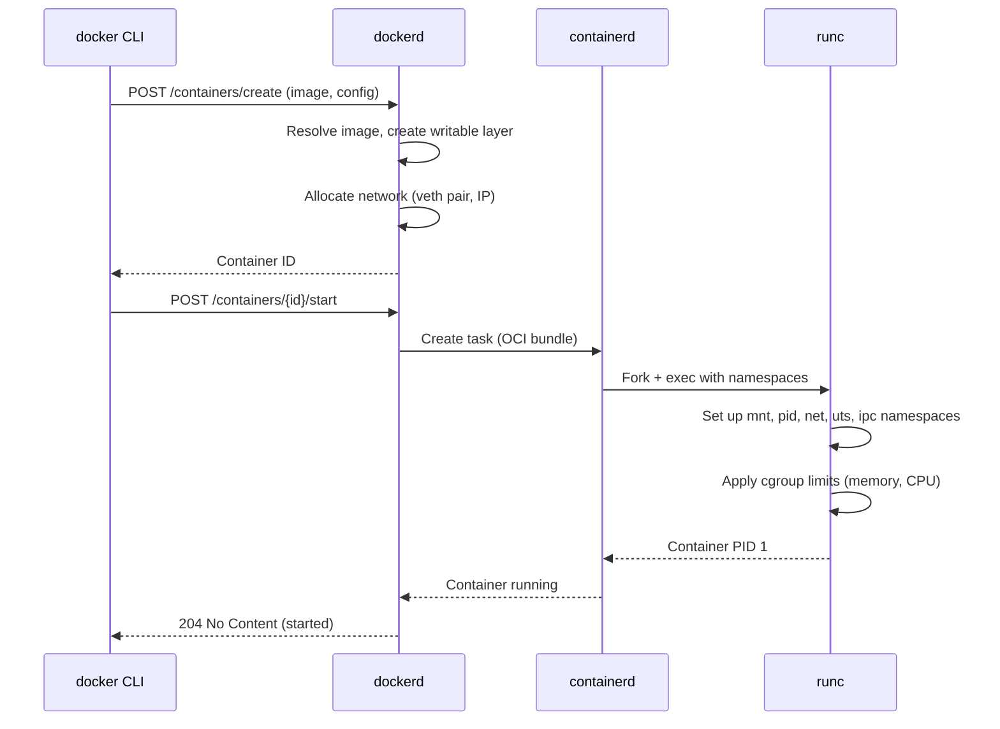
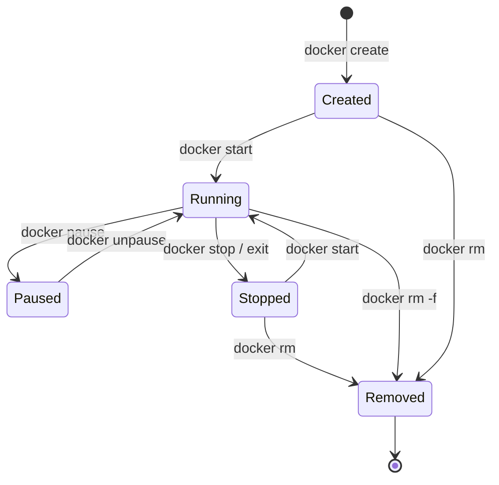

# Running Containers

> Master the container lifecycle — running, stopping, inspecting, debugging, and cleaning up containers with confidence.

## Mental model

An image is a class; a container is an instance. You can create many containers from one
image, each with its own writable layer, network identity, and process tree. Containers
are cheap and disposable — treat them like cattle, not pets.

## Anatomy of `docker run`

`docker run` is actually three operations in one: **create** the container, **start** it,
and **attach** your terminal (unless detached). Here's a real-world example with every
important flag:

```bash
docker run \
  -d \                        # Detached mode — run in the background
  --name web \                # Give the container a human-readable name
  -p 8080:80 \                # Map host port 8080 → container port 80
  -e NGINX_HOST=example.com \ # Set an environment variable inside the container
  -v app-data:/usr/share/nginx/html \ # Mount a named volume for persistent data
  --rm \                      # Automatically remove the container when it stops
  --restart unless-stopped \  # Restart policy (overridden by --rm if both set)
  nginx:1.27-alpine           # Image name:tag
```

### Flag reference

| Flag | Purpose | Example |
|---|---|---|
| `-d` | Run in background (detached). Without it, your terminal is attached to the container's stdout/stderr. | `docker run -d nginx` |
| `-it` | Interactive + TTY. Gives you a shell prompt inside the container. `-i` keeps stdin open; `-t` allocates a pseudo-terminal. | `docker run -it ubuntu bash` |
| `-p host:container` | Publish a port. Maps a host port to a container port. | `-p 3000:3000` |
| `-e KEY=VAL` | Set an environment variable. Repeatable. | `-e DB_HOST=db -e DB_PORT=5432` |
| `--name` | Assign a name instead of a random one. Must be unique per host. | `--name api-server` |
| `--rm` | Auto-remove the container filesystem on exit. Perfect for one-off tasks. | `docker run --rm alpine echo hi` |
| `-v name:/path` | Mount a named volume at the given path inside the container. | `-v pgdata:/var/lib/postgresql/data` |
| `-v /host:/container` | Bind mount a host directory into the container. | `-v $(pwd):/app` |
| `--network` | Connect to a specific Docker network. | `--network backend` |

### What happens internally on `docker run`



## Container lifecycle

Containers move through a well-defined set of states:



### `stop` vs `kill`

| Command | Signal sent | Grace period | When to use |
|---|---|---|---|
| `docker stop` | SIGTERM first | Waits 10s (configurable with `-t`), then sends SIGKILL | Normal shutdown — gives the app time to close connections and flush data |
| `docker kill` | SIGKILL immediately | None | Container is frozen or unresponsive; you need it dead now |

```bash
# Graceful stop with a custom timeout of 30 seconds
docker stop -t 30 web

# Immediate kill — no cleanup, process is terminated
docker kill web
```

::: warning Always prefer `docker stop`
Applications that handle SIGTERM can close database connections, finish in-flight
requests, and flush logs. `docker kill` gives them no chance. Use `kill` only as a last
resort.
:::

## Listing and inspecting containers

```bash
# Show only running containers
docker ps

# Show ALL containers (including stopped ones)
docker ps -a

```bash{v-pre}
# Custom output format using Go templates
docker ps --format "table {{.Names}}\t{{.Status}}\t{{.Ports}}"

# Full JSON metadata for a container
docker inspect web

# Extract a single field with --format
docker inspect --format '{{.NetworkSettings.IPAddress}}' web
# Output: 172.17.0.2

# Get the container's exit code
docker inspect --format '{{.State.ExitCode}}' web
# Output: 0
```

::: tip Go template cheat sheet
`docker inspect` output is JSON. Common paths:
- <code v-pre>{{.State.Status}}</code> — running, exited, paused
- <code v-pre>{{.Config.Env}}</code> — environment variables
- <code v-pre>{{.HostConfig.Memory}}</code> — memory limit in bytes
- <code v-pre>{{.NetworkSettings.Networks.bridge.IPAddress}}</code> — IP on bridge network
:::

## Logs

Containers should write to **stdout** and **stderr** — Docker captures both and makes
them available through `docker logs`. This is the standard convention because it lets
Docker (and orchestrators like Kubernetes) handle log routing, rotation, and aggregation
without any app-specific configuration.

```bash
# View all logs
docker logs web

# Follow logs in real-time (like tail -f)
docker logs -f web

# Show only the last 50 lines
docker logs --tail 50 web

# Show logs since a timestamp or relative duration
docker logs --since 2m web          # last 2 minutes
docker logs --since 2025-07-13T00:00:00 web

# Show timestamps alongside each log line
docker logs -t web

# Combine: follow + last 20 lines + timestamps
docker logs -f --tail 20 -t web
```

::: info Why stdout/stderr and not log files?
If your app writes to `/var/log/app.log` inside the container, Docker can't see it.
You'd have to exec into the container or mount a volume to read logs. By writing to
stdout/stderr, logs are automatically captured by Docker's logging driver and can be
shipped to CloudWatch, Loki, Elasticsearch, or any other backend.
:::

## Interactive access

### `docker exec` — run a new process in a running container

```bash
# Open an interactive shell in a running container
docker exec -it web /bin/sh

# Run a single command and exit
docker exec web cat /etc/nginx/nginx.conf

# Run as a specific user
docker exec -u root web apt-get update

# Set environment variables for the exec session only
docker exec -e DEBUG=true web /app/diagnostic.sh
```

### `docker attach` — connect to the container's PID 1

```bash
# Attach your terminal to the main process's stdout/stderr/stdin
docker attach web
```

| | `docker exec -it ... sh` | `docker attach` |
|---|---|---|
| **Creates new process?** | Yes — spawns a new process in the container | No — connects to the existing PID 1 |
| **Safe to Ctrl+C?** | Yes — kills only the exec process | **Dangerous** — sends SIGINT to PID 1, may stop the container |
| **Use case** | Debugging, inspecting, running tools | Interacting with a foreground app (rare) |

::: tip Detach from `attach` without stopping the container
Press `Ctrl+P` then `Ctrl+Q` to detach without sending a signal to PID 1.
:::

## Copying files

```bash
# Copy a file FROM the container to the host
docker cp web:/etc/nginx/nginx.conf ./nginx.conf

# Copy a file FROM the host into the container
docker cp ./custom.conf web:/etc/nginx/conf.d/custom.conf

# Copy an entire directory
docker cp web:/var/log/nginx ./nginx-logs/
```

`docker cp` works on both running and stopped containers — useful for grabbing crash logs
from a stopped container before removing it.

## One-off and disposable containers

Containers shine for quick, throwable tasks. Use `--rm` so they clean up automatically:

```bash
# Quick Python REPL — removed when you exit
docker run --rm -it python:3.13 python

# Run a one-off database migration
docker run --rm \
  --network app-net \
  -e DATABASE_URL=postgres://db:5432/myapp \
  myapp:latest python manage.py migrate

# Use a tool you don't want to install on your host
docker run --rm -v $(pwd):/work -w /work node:22-alpine npm init -y

# Quick network debugging with curl
docker run --rm curlimages/curl curl -s https://httpbin.org/ip

# Lint a Dockerfile without installing hadolint
docker run --rm -i hadolint/hadolint < Dockerfile
```

## Cleanup and disk management

Docker doesn't automatically delete stopped containers, unused images, or dangling build
cache. Over weeks, these accumulate into gigabytes of wasted disk space.

```bash
# See what Docker is consuming
docker system df
# TYPE           TOTAL   ACTIVE   SIZE      RECLAIMABLE
# Images         12      3        4.2GB     3.1GB (73%)
# Containers     8       2        120MB     95MB  (79%)
# Build Cache    15      0        1.8GB     1.8GB (100%)

# Remove all stopped containers
docker container prune

# Remove dangling images (untagged layers from old builds)
docker image prune

# Remove ALL unused images (not just dangling ones)
docker image prune -a

# Nuclear option: remove everything unused — containers, images, networks, build cache
docker system prune -a --volumes
```

::: danger `system prune -a --volumes` is destructive
This removes every image not used by a running container and all named volumes not
mounted to a running container. Never run this on a production host. In development,
it's a great way to reclaim disk space.
:::

## Restart policies

Restart policies tell Docker what to do when a container exits. Set them with
`--restart` on `docker run`, or in a `compose.yaml`.

| Policy | Behavior |
|---|---|
| `no` | Never restart (default). Container stays stopped after exit. |
| `on-failure[:max]` | Restart only if exit code ≠ 0. Optional max retry count. |
| `always` | Always restart, regardless of exit code. Starts on daemon boot. |
| `unless-stopped` | Like `always`, but does NOT restart if you manually `docker stop` the container before the daemon restarts. |

```bash
# Restart up to 5 times on failure
docker run -d --restart on-failure:5 --name worker myapp:latest

# Always restart — survives host reboots (if dockerd starts at boot)
docker run -d --restart always --name db postgres:16
```

::: info `--rm` and `--restart` are mutually exclusive
You can't auto-remove and auto-restart. Docker will reject the combination.
:::

## Resource limits

By default, a container can consume all available host CPU and memory. In production
(and even in development), you should set limits to prevent a runaway process from
starving the host.

```bash{v-pre}
# Limit to 512 MB of RAM and 1.5 CPU cores
docker run -d \
  --memory 512m \          # Hard memory limit
  --memory-swap 1g \       # Total memory + swap (set equal to --memory to disable swap)
  --cpus 1.5 \             # CPU quota: 1.5 cores worth of CPU time
  --name api myapp:latest

# Verify limits
docker inspect --format '{{.HostConfig.Memory}}' api
# Output: 536870912  (512 MB in bytes)
```

### OOM behavior

When a container exceeds its memory limit, the Linux OOM killer terminates it:

- The container exits with **code 137** (128 + signal 9 = SIGKILL).
- `docker inspect` shows `OOMKilled: true`.
- If a restart policy is set, Docker restarts the container.

```bash
# Intentionally trigger OOM to see what happens
docker run --rm --memory 10m alpine sh -c \
  "dd if=/dev/zero of=/dev/null bs=20m"
# Exit code: 137
```

::: warning Exit code 137 in CI/CD
If your CI pipeline containers exit with code 137, they're being OOM-killed. Increase
the memory limit or optimize the application's memory usage. Check `docker inspect`
for `OOMKilled: true`.
:::

## Environment variables

Environment variables are the standard way to configure containers. They follow the
[12-Factor App](https://12factor.net/config) methodology — config lives in the
environment, not in code.

```bash
# Set individual variables with -e
docker run -d \
  -e DB_HOST=postgres \
  -e DB_PORT=5432 \
  -e DB_NAME=myapp \
  --name api myapp:latest

# Load variables from a file (one VAR=value per line)
docker run -d --env-file .env --name api myapp:latest
```

Example `.env` file:

```bash
# .env — loaded with --env-file
DB_HOST=postgres
DB_PORT=5432
DB_NAME=myapp
LOG_LEVEL=info
```

::: danger Never bake secrets into images
Don't put passwords, API keys, or tokens in your Dockerfile with `ENV`. Anyone who
pulls the image can read them with `docker inspect`. Instead:
- Use `--env-file` with a `.gitignore`d file at runtime.
- Use Docker secrets (Swarm) or your orchestrator's secret management.
- Use build-time secrets with `--mount=type=secret` in BuildKit (they never persist
  in the image layer).
:::

## Checkpoint

At this point you should be able to:

- [ ] Run a container in detached mode with port mapping and environment variables
- [ ] Explain the five container states: Created → Running → Paused → Stopped → Removed
- [ ] Tail container logs in real-time with `docker logs -f`
- [ ] Open a shell in a running container with `docker exec -it`
- [ ] Set memory and CPU limits and recognize OOM exit code 137
- [ ] Reclaim disk space with `docker system prune`
- [ ] Choose the right restart policy for your use case

Next up: [Images & Dockerfiles](./images-and-dockerfiles) — where you'll learn how images
are built from layers, every Dockerfile instruction, and the critical difference between
`CMD` and `ENTRYPOINT`.
