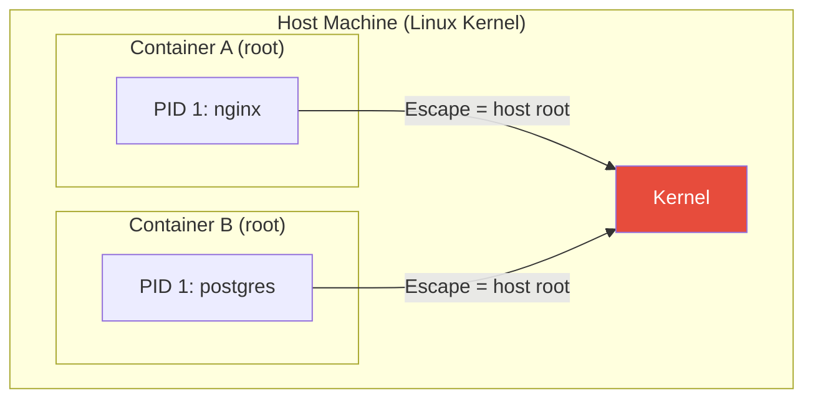

# Security & Hardening

> Harden your Docker images and containers — non-root users, dropped capabilities, read-only filesystems, secrets management, and image scanning for vulnerabilities.

## Mental model

Containers are **not** virtual machines. Every container on a host shares the same Linux kernel. The isolation comes from namespaces and cgroups — thin walls, not concrete bunkers. If an attacker escapes a container running as root, they land on the host **as root**.



Security is about **defense in depth** — layer multiple protections so that a single failure does not compromise the entire system.

## Core concepts

### Non-root containers

By default, the process inside a container runs as `root` (UID 0). This is the single biggest security mistake in container deployments. Even if namespaced, many kernel exploits only work from UID 0.

**Step 1 — Create a dedicated user and group in your Dockerfile:**

```dockerfile
FROM node:22-slim

# Create a non-root user with a fixed UID/GID for consistency
RUN groupadd --gid 1001 appgroup && \
    useradd --uid 1001 --gid appgroup --shell /bin/false --create-home appuser

WORKDIR /home/appuser/app

# Copy files and set ownership in one step
COPY --chown=appuser:appgroup package*.json ./
RUN npm ci --omit=dev

COPY --chown=appuser:appgroup . .

# Switch to non-root BEFORE CMD
USER appuser

EXPOSE 3000
CMD ["node", "server.js"]
```

::: tip Why --chown in COPY?
Without `--chown`, files are owned by root. Your non-root process then cannot read config files or write to expected directories. Always transfer ownership at copy time — it avoids an extra `RUN chown -R` layer.
:::

**Step 2 — Verify it works:**

```bash
# Build and run
docker build -t myapp:secure .
docker run --rm myapp:secure whoami
# Output: appuser

# Verify no root processes
docker run --rm myapp:secure id
# Output: uid=1001(appuser) gid=1001(appgroup) groups=1001(appgroup)
```

::: warning Alpine uses adduser, not useradd
Alpine-based images use BusyBox and need different syntax:
```dockerfile
RUN addgroup -g 1001 -S appgroup && \
    adduser -u 1001 -S -G appgroup -s /bin/false appuser
```
:::

### Least privilege in Compose

A production `compose.yaml` should lock down every service:

```yaml
services:
  api:
    image: myapp:1.4.2
    read_only: true            # Immutable root filesystem
    tmpfs:
      - /tmp                   # Writable temp directory in RAM
      - /run                   # Some apps need /run writable
    cap_drop:
      - ALL                    # Drop EVERY Linux capability
    cap_add:
      - NET_BIND_SERVICE       # Only add back what's needed (bind port <1024)
    security_opt:
      - no-new-privileges:true # Prevent privilege escalation via setuid binaries
    user: "1001:1001"          # Enforce non-root at runtime
    deploy:
      resources:
        limits:
          memory: 512M         # Prevent a single container from consuming all RAM
          cpus: "1.0"
```

::: info read_only: true
A read-only root filesystem prevents an attacker from modifying binaries, installing tools, or writing backdoors inside the container. Use `tmpfs` mounts for directories the app legitimately needs to write to.
:::

### Linux capabilities explained

Linux capabilities split the monolithic root privilege into fine-grained units. The principle is: drop all, add back only what you need.

| Capability | What it allows | Commonly needed? |
|---|---|---|
| `NET_BIND_SERVICE` | Bind to ports below 1024 | Yes, for web servers on port 80/443 |
| `CHOWN` | Change file ownership | Rarely |
| `DAC_OVERRIDE` | Bypass file permission checks | No — fix permissions instead |
| `SETUID` / `SETGID` | Change process UID/GID | No — use USER instruction |
| `SYS_PTRACE` | Trace/debug other processes | Only for debugging containers |
| `NET_RAW` | Create raw sockets (ping) | Rarely in production |
| `SYS_ADMIN` | Mount filesystems, BPF, etc. | Never in production |
| `NET_ADMIN` | Network configuration | Only for network tools |
| `KILL` | Send signals to any process | Rarely |

::: danger Never grant SYS_ADMIN
`SYS_ADMIN` is essentially root. It allows mounting filesystems, loading BPF programs, and bypassing most security boundaries. If your app needs it, redesign your app.
:::

### Secrets management

**Why environment variables leak:**

```bash
# Anyone with Docker access can see env vars
docker inspect mycontainer --format '{{json .Config.Env}}'
# ["DB_PASSWORD=hunter2","API_KEY=sk-live-abc123"]

# They also appear in /proc inside the container
docker exec mycontainer cat /proc/1/environ | tr '\0' '\n'

# And they can appear in application logs, crash dumps, and error reports
```

**Solution 1 — File-based secrets in Compose:**

```yaml
# compose.yaml
services:
  api:
    image: myapp:1.4.2
    secrets:
      - db_password
      - api_key
    environment:
      # Point your app to the file path, not the secret value
      DB_PASSWORD_FILE: /run/secrets/db_password
      API_KEY_FILE: /run/secrets/api_key

secrets:
  db_password:
    file: ./secrets/db_password.txt   # Plain text file, never committed to git
  api_key:
    file: ./secrets/api_key.txt
```

Secrets are mounted as files at `/run/secrets/<name>`, readable only by the container process. Your application reads the file at startup:

```python
# Python example: reading file-based secrets
from pathlib import Path

def read_secret(name: str) -> str:
    """Read a Docker secret from the mounted file."""
    secret_path = Path(f"/run/secrets/{name}")
    if secret_path.exists():
        return secret_path.read_text().strip()
    # Fall back to env var for local development
    import os
    return os.environ.get(name.upper(), "")

db_password = read_secret("db_password")
```

**Solution 2 — BuildKit secret mounts (build-time secrets):**

Secrets like private registry tokens or SSH keys are needed during `docker build` but must never be baked into image layers.

```dockerfile
# syntax=docker/dockerfile:1
FROM python:3.12-slim

WORKDIR /app
COPY requirements.txt .

# Secret is mounted at /run/secrets/pip_token — only during this RUN step
# It is NEVER written to any image layer
RUN --mount=type=secret,id=pip_token \
    PIP_INDEX_URL="https://$(cat /run/secrets/pip_token)@pypi.example.com/simple" \
    pip install --no-cache-dir -r requirements.txt

COPY . .
USER 1001
CMD ["python", "main.py"]
```

```bash
# Pass the secret at build time
docker build --secret id=pip_token,src=$HOME/.pip_token -t myapp:1.4.2 .
```

::: tip Verify secrets are not in layers
After building, inspect every layer to confirm the secret is absent:
```bash
docker history myapp:1.4.2
docker run --rm myapp:1.4.2 cat /run/secrets/pip_token
# cat: /run/secrets/pip_token: No such file or directory
```
:::

### Image scanning and supply chain

**Scan images for known vulnerabilities before deployment:**

```bash
# Docker Scout — built into Docker Desktop and CLI
docker scout cves myapp:1.4.2
docker scout recommendations myapp:1.4.2

# Trivy — popular open-source scanner
trivy image myapp:1.4.2

# Generate a Software Bill of Materials (SBOM)
docker sbom myapp:1.4.2
docker sbom myapp:1.4.2 --format spdx-json > sbom.json
```

**Pin base images by digest to prevent supply chain attacks:**

```dockerfile
# BAD — :slim can change at any time
FROM python:3.12-slim

# GOOD — pinned to exact image, immutable
FROM python:3.12-slim@sha256:a1b2c3d4e5f6...

# Find the digest
# docker pull python:3.12-slim
# docker inspect --format='{{index .RepoDigests 0}}' python:3.12-slim
```

**Scan in CI — fail the build on critical vulnerabilities:**

```yaml
# GitHub Actions step
- name: Scan for vulnerabilities
  uses: aquasecurity/trivy-action@master
  with:
    image-ref: myapp:${{ github.sha }}
    exit-code: "1"              # Fail the build
    severity: "CRITICAL,HIGH"   # Only block on critical and high
    format: "table"
```

**Prefer minimal base images to reduce attack surface:**

| Base image | Size | Packages | CVEs (typical) |
|---|---|---|---|
| `ubuntu:24.04` | ~78 MB | ~100 | 20-40 |
| `python:3.12` | ~1 GB | ~400 | 50-100+ |
| `python:3.12-slim` | ~150 MB | ~80 | 10-20 |
| `python:3.12-alpine` | ~55 MB | ~30 | 5-10 |
| `gcr.io/distroless/python3` | ~50 MB | ~15 | 2-5 |
| `scratch` | 0 MB | 0 | 0 |

### Docker Bench for Security

Docker Bench for Security is an open-source script that checks your Docker host configuration against CIS benchmarks:

```bash
# Run the audit
docker run --rm --net host --pid host --userns host --cap-add audit_control \
    -e DOCKER_CONTENT_TRUST=$DOCKER_CONTENT_TRUST \
    -v /etc:/etc:ro \
    -v /usr/bin/containerd:/usr/bin/containerd:ro \
    -v /usr/bin/runc:/usr/bin/runc:ro \
    -v /usr/lib/systemd:/usr/lib/systemd:ro \
    -v /var/lib:/var/lib:ro \
    -v /var/run/docker.sock:/var/run/docker.sock:ro \
    docker/docker-bench-security

# Output includes PASS/WARN/INFO for each CIS check:
# [PASS] 4.1  - Ensure a user for the container has been created
# [WARN] 4.6  - Ensure HEALTHCHECK instructions have been added
# [PASS] 5.12 - Ensure the container's root filesystem is mounted as read-only
```

### Rootless Docker

Rootless mode runs the Docker daemon and containers entirely without root privileges. If an attacker escapes the container, they land as an unprivileged user on the host.

```bash
# Install rootless Docker (Ubuntu/Debian)
dockerd-rootless-setuptool.sh install

# Verify
docker context use rootless
docker info --format '{{.SecurityOptions}}'
# Output includes: rootless
```

::: warning Rootless limitations
Rootless Docker cannot bind to ports below 1024 without extra configuration, and some storage drivers have limitations. It is the strongest isolation available without switching to a VM-based runtime.
:::

### Image trust and signing

**Docker Content Trust (DCT)** ensures you only pull images that have been signed by trusted publishers:

```bash
# Enable DCT — Docker will refuse to pull unsigned images
export DOCKER_CONTENT_TRUST=1

docker pull nginx:latest  # Only succeeds if signed
```

**Cosign** (from Sigstore) is the modern standard for container image signing:

```bash
# Sign an image after pushing
cosign sign --key cosign.key myregistry.io/myapp:1.4.2

# Verify before deploying
cosign verify --key cosign.pub myregistry.io/myapp:1.4.2
```

### Security best practices checklist

| Practice | Priority | Implementation |
|---|---|---|
| Run as non-root | Critical | `USER` instruction + `user:` in Compose |
| Drop all capabilities | Critical | `cap_drop: [ALL]` + selective `cap_add` |
| Read-only root filesystem | High | `read_only: true` + `tmpfs` for writes |
| No new privileges | High | `security_opt: [no-new-privileges:true]` |
| Scan images for CVEs | High | `trivy` or `docker scout` in CI |
| Pin base images by digest | High | `FROM image@sha256:...` |
| Use file-based secrets | High | Compose `secrets:` — never env vars |
| BuildKit secret mounts | High | `--mount=type=secret` for build-time secrets |
| Minimal base images | Medium | `slim`, `alpine`, or `distroless` |
| Set resource limits | Medium | `deploy.resources.limits` in Compose |
| Enable Docker Content Trust | Medium | `DOCKER_CONTENT_TRUST=1` |
| Run Docker Bench audit | Medium | Periodic CIS benchmark checks |
| Use rootless Docker | Low | For highest isolation requirements |
| Sign images with Cosign | Low | For regulated or multi-team environments |

## Checkpoint

After this tutorial you should be able to:

- [ ] Build images that run as non-root with proper file ownership
- [ ] Write Compose files that drop all capabilities and use read-only filesystems
- [ ] Manage secrets via mounted files — never environment variables
- [ ] Use BuildKit `--mount=type=secret` for build-time credentials
- [ ] Scan images with Trivy or Docker Scout and fail CI on critical CVEs
- [ ] Pin base images by digest to prevent supply chain attacks
- [ ] Run Docker Bench for Security to audit your host configuration
- [ ] Understand rootless Docker and when to use it
