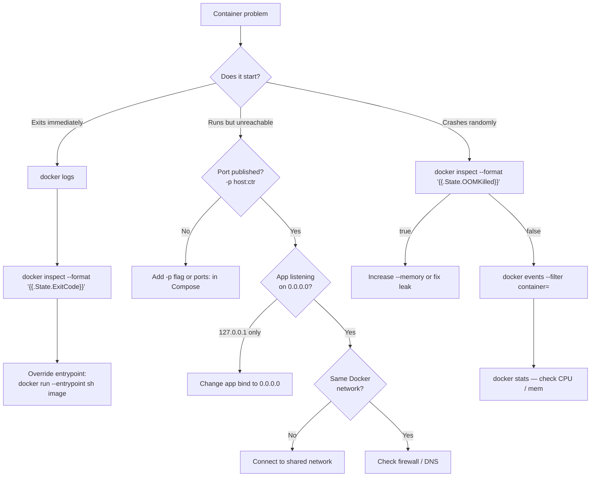

# Troubleshooting & Debugging

> A systematic playbook for diagnosing and fixing broken containers — from instant exits and OOM kills to network failures and disk-full disasters.

## Mental model

Docker failures fall into three broad categories: **build-time** (the image won't build),
**start-time** (the container exits immediately), and **run-time** (the container runs but
misbehaves). Each category has a different diagnostic path, but they all converge on the
same core tools: `docker logs`, `docker inspect`, and `docker events`.



## Core concepts

### Exit codes — the Rosetta Stone

Every container process terminates with an exit code. This is the single most important
piece of diagnostic information.

| Exit Code | Name | Meaning | Common Cause |
|-----------|------|---------|--------------|
| `0` | Success | Process finished normally | One-shot scripts, completed migrations |
| `1` | General error | Application-level failure | Unhandled exception, bad config |
| `126` | Cannot invoke | Permission / not executable | Missing `chmod +x` on entrypoint script |
| `127` | Command not found | Binary doesn't exist in `$PATH` | Typo in CMD, wrong base image |
| `137` | SIGKILL (128+9) | Process was forcibly killed | OOM killer, `docker stop` timeout, `docker kill` |
| `139` | SIGSEGV (128+11) | Segmentation fault | Native code bug, corrupted binary |
| `143` | SIGTERM (128+15) | Graceful shutdown requested | `docker stop` (healthy shutdown) |

```bash
# Check the exit code of a stopped container
docker inspect --format '{{.State.ExitCode}}' my-container
# Output: 137

# Check if the OOM killer was involved
docker inspect --format '{{.State.OOMKilled}}' my-container
# Output: true
```

### Essential debugging commands

```bash
# Stream real-time Docker daemon events (start, stop, kill, oom, etc.)
docker events --filter type=container --since 10m

# See what files a container changed compared to its image
docker diff my-container
# A = added, C = changed, D = deleted

# See processes running inside a container (no exec needed)
docker top my-container

# Live resource usage for all running containers
docker stats --no-stream

# Full inspection — returns every detail about a container
docker inspect my-container

# Follow logs with timestamps
docker logs --follow --timestamps --tail 100 my-container
```

### The netshoot toolkit

[nicolaka/netshoot](https://github.com/nicolaka/netshoot) is a container image packed
with every network diagnostic tool you'll ever need.

```bash
# Attach netshoot to a running container's network namespace
docker run --rm -it --network container:my-container nicolaka/netshoot

# Now you can run inside the same network namespace:
ping api                    # test DNS resolution to another container
curl http://api:8000/health # test HTTP connectivity
dig api                     # inspect DNS records
ss -tlnp                    # see what ports are listening
tcpdump -i eth0 port 5432   # capture Postgres traffic
nslookup redis              # verify Docker DNS
traceroute api              # trace network path
```

::: tip
Netshoot works even when your application container has no shell — it shares the
network namespace, not the filesystem.
:::

## Troubleshooting scenarios

### Container exits immediately

**Symptom:** `docker run myimage` returns to the prompt instantly. `docker ps` shows nothing.

```bash
# Step 1: Check logs (even exited containers retain logs)
docker logs $(docker ps -aq -l)

# Step 2: Check exit code
docker inspect --format '{{.State.ExitCode}}' $(docker ps -aq -l)

# Step 3: Get a shell to investigate
docker run --rm -it --entrypoint sh myimage
```

**Common causes:**

| Cause | Fix |
|-------|-----|
| CMD runs a script that exits | Add `exec` or keep a foreground process |
| Missing config file / env var | Supply with `-e` or `--env-file` |
| Process daemonizes (forks to background) | Run in foreground mode (e.g., `nginx -g 'daemon off;'`) |
| Entrypoint script has `\r\n` line endings | Convert to Unix line endings: `dos2unix entrypoint.sh` |
| CMD is `["bash"]` but image has no bash | Use `sh` or install bash in the Dockerfile |

### Permission denied errors

**Symptom:** `exec format error` or `permission denied` when the container starts.

```bash
# Diagnosis: check the entrypoint file permissions
docker run --rm --entrypoint ls myimage -la /app/entrypoint.sh
# -rw-r--r-- 1 root root 245 ...  ← not executable!

# Fix in Dockerfile
COPY entrypoint.sh /app/
RUN chmod +x /app/entrypoint.sh   # make it executable
ENTRYPOINT ["/app/entrypoint.sh"]
```

::: warning
If you see `exec format error`, it usually means one of two things:
1. The script is missing a shebang (`#!/bin/sh`) on line 1
2. You're running an `amd64` image on an `arm64` host (or vice versa)
:::

### Port already in use

**Symptom:** `Error: bind: address already in use`

```bash
# Find what is using the port on the host
sudo lsof -i :8080
# or
sudo ss -tlnp | grep 8080

# Kill the conflicting process, or choose a different host port
docker run -p 8081:8080 myimage    # map to 8081 instead
```

### OOM kills (exit 137)

**Symptom:** Container exits with code 137 and `OOMKilled: true`.

```bash
# Confirm OOM kill
docker inspect --format '{{.State.OOMKilled}}' my-container
# true

# Check current memory limit
docker inspect --format '{{.HostConfig.Memory}}' my-container
# 268435456  (256 MB)

# Monitor live memory usage
docker stats my-container --no-stream
# CONTAINER   CPU %   MEM USAGE / LIMIT     MEM %
# my-ctr      2.31%   254.1MiB / 256MiB     99.26%

# Fix: increase the limit or fix the memory leak
docker run --memory 512m myimage

# In Compose:
# deploy:
#   resources:
#     limits:
#       memory: 512m
```

::: danger
A container without a memory limit can consume all host RAM, triggering the host's
OOM killer — which may kill *any* process, not just the container.
**Always set memory limits in production.**
:::

### Cannot connect between containers

**Symptom:** `curl: (7) Failed to connect to api port 8000: Connection refused`

```bash
# Step 1: Are they on the same network?
docker inspect -f '{{json .NetworkSettings.Networks}}' container-a | jq
docker inspect -f '{{json .NetworkSettings.Networks}}' container-b | jq

# Step 2: Can you resolve DNS?
docker exec container-a nslookup container-b

# Step 3: Is the target actually listening?
docker exec container-b ss -tlnp
# If it shows 127.0.0.1:8000, the app is only listening on localhost

# Fix: make the app listen on 0.0.0.0
# Flask:  app.run(host="0.0.0.0")
# Django: python manage.py runserver 0.0.0.0:8000
# Node:   app.listen(8000, "0.0.0.0")
```

::: tip
Inside Docker, `localhost` means *this container*, not *this machine*.
Services must listen on `0.0.0.0` to be reachable from other containers.
:::

### Image build failures

**Symptom:** `docker build` fails at a `RUN` step.

```bash
# Get a shell at the failed layer (BuildKit)
docker build --progress=plain --no-cache -t debug .  2>&1 | tee build.log

# If using BuildKit, you can export a failed stage:
DOCKER_BUILDKIT=1 docker build --target builder -t debug-stage .
docker run --rm -it debug-stage sh   # inspect the filesystem
```

**Common build failures:**

| Error | Cause | Fix |
|-------|-------|-----|
| `apt-get: command not found` | Alpine base (uses `apk`) | Use `apk add` or switch to Debian base |
| `Could not resolve host` | No DNS in build | Check Docker DNS config, add `--network host` |
| `COPY failed: file not found` | File outside build context | Move file or adjust `.dockerignore` |
| `pip install` fails | Missing build deps | `RUN apt-get install -y gcc libpq-dev` first |

### DNS resolution issues

**Symptom:** `Could not resolve hostname` inside a container.

```bash
# Test DNS from inside the container
docker run --rm alpine nslookup google.com
# If this fails, Docker's internal DNS (127.0.0.11) is broken

# Check Docker's DNS configuration
docker info | grep -i dns

# Fix: explicitly set DNS
docker run --dns 8.8.8.8 myimage

# Or fix system-wide in /etc/docker/daemon.json:
# { "dns": ["8.8.8.8", "8.8.4.4"] }
# Then: sudo systemctl restart docker
```

### Disk full — no space left on device

**Symptom:** `no space left on device` during build or run.

```bash
# See what Docker is consuming
docker system df
# TYPE            TOTAL   ACTIVE  SIZE      RECLAIMABLE
# Images          45      3       12.3GB    11.2GB (91%)
# Containers      12      1       1.2GB     1.1GB (91%)
# Local Volumes   23      2       8.5GB     7.8GB (91%)
# Build Cache     -       -       4.1GB     4.1GB

# Nuclear option: reclaim everything unused
docker system prune -a --volumes
# WARNING: This removes ALL stopped containers, unused images, and unused volumes

# Safer: remove only dangling images and stopped containers
docker image prune          # remove <none> images
docker container prune      # remove stopped containers
docker volume prune         # remove unused volumes
docker builder prune        # clear BuildKit cache
```

### Volume permission issues

**Symptom:** `Permission denied` when the app writes to a mounted volume.

```bash
# Check who owns the directory inside the container
docker run --rm -v mydata:/data myimage ls -la /data
# drwxr-xr-x 2 root root 4096 ...  ← owned by root

# If your Dockerfile uses USER 1000, root-owned dirs are unwritable
# Fix in Dockerfile: create the dir as the right user
RUN mkdir -p /data && chown 1000:1000 /data
USER 1000

# Or fix with an init script that runs as root first:
# entrypoint.sh
# #!/bin/sh
# chown -R appuser:appuser /data
# exec gosu appuser "$@"
```

### Compose-specific issues

**Symptom:** Services fail to start or can't find each other.

```bash
# Service won't start — check its logs
docker compose logs api

# Dependency not ready — use healthchecks, not just depends_on
# compose.yaml
# services:
#   db:
#     image: postgres:16
#     healthcheck:
#       test: ["CMD-SHELL", "pg_isready -U postgres"]
#       interval: 5s
#       retries: 5
#   api:
#     depends_on:
#       db:
#         condition: service_healthy   # wait for healthcheck

# Rebuild after Dockerfile changes
docker compose up --build         # rebuild changed images
docker compose build --no-cache   # full rebuild

# "Network not found" after renaming project
docker compose down               # clean up old network
docker compose up -d              # recreate with new name
```

## System diagnostics

```bash
# Complete Docker system information
docker system info

# Key fields to check:
# - Storage Driver (overlay2 is standard)
# - Logging Driver (json-file is default)
# - Cgroup Version (v2 is modern)
# - Live Restore Enabled (true = containers survive daemon restarts)

# Disk usage breakdown
docker system df -v              # verbose: per-image, per-volume sizes

# Watch events in real-time (invaluable for intermittent issues)
docker events --format '{{.Time}} {{.Action}} {{.Actor.Attributes.name}}'
```

## Performance troubleshooting

```bash
# Live stats for all containers
docker stats
# CONTAINER   CPU %   MEM USAGE / LIMIT   NET I/O       BLOCK I/O
# api         45.2%   412MiB / 512MiB      1.2GB/800MB   50MB/10MB
# db          12.1%   256MiB / 1GiB        500MB/1.5GB   2GB/500MB

# Identify the resource hog
docker stats --no-stream --format "table {{.Name}}\t{{.CPUPerc}}\t{{.MemUsage}}"

# Check container processes
docker top my-container -o pid,ppid,user,%cpu,%mem,command

# Check what files the container changed (unexpected writes = possible issue)
docker diff my-container
```

## Master pitfall list

| # | Pitfall | Consequence | Fix |
|---|---------|-------------|-----|
| 1 | App listens on `127.0.0.1` | Unreachable from other containers or host | Bind to `0.0.0.0` |
| 2 | No memory limits | Host OOM kills random processes | Set `--memory` / `deploy.resources.limits` |
| 3 | Using `latest` tag in production | Unexpected image changes break deploy | Pin exact digest or semver tag |
| 4 | Running as root | Privilege escalation risk | Add `USER 1000` in Dockerfile |
| 5 | Storing data in container layer | Data lost on `docker rm` | Use named volumes |
| 6 | `COPY . .` without `.dockerignore` | Huge context, leaked secrets, broken cache | Add comprehensive `.dockerignore` |
| 7 | `RUN apt-get update` on separate layer | Stale package index from cache | Combine: `RUN apt-get update && apt-get install -y ...` |
| 8 | No healthcheck | Orchestrator can't detect app failures | Add `HEALTHCHECK` to Dockerfile or Compose |
| 9 | Using `docker exec` to apply fixes | Fixes lost on restart | Fix in Dockerfile or entrypoint |
| 10 | `depends_on` without healthcheck | App starts before DB is ready | Use `condition: service_healthy` |
| 11 | No log rotation | Disk fills with JSON logs | Set `max-size` and `max-file` in logging config |
| 12 | Building images on production servers | Bloated hosts, security risk | Build in CI, pull from registry |
| 13 | `ENTRYPOINT` without `exec` form | PID 1 is shell, signals not forwarded | Use `["executable", "arg"]` form |
| 14 | Ignoring `.State.OOMKilled` | Chasing wrong cause for exit 137 | Always check `docker inspect` |
| 15 | Hardcoded container IPs | IPs change on restart | Use service names (Docker DNS) |
| 16 | Windows line endings in scripts | `/bin/sh^M: bad interpreter` | Use `.gitattributes` with `* text eol=lf` |
| 17 | No `--init` for zombie processes | PID 1 doesn't reap children | Add `--init` or use `tini` |

## Checkpoint

At this point you can:

- Follow a systematic debugging sequence for any container failure
- Interpret exit codes to immediately narrow down the root cause
- Use `docker events`, `docker diff`, `docker top`, and `docker stats` effectively
- Debug network issues with `netshoot` and DNS diagnostics
- Diagnose and fix OOM kills, permission errors, port conflicts, and disk-full problems
- Troubleshoot Compose-specific startup and dependency issues
- Recognize and avoid the 17 most common Docker pitfalls
