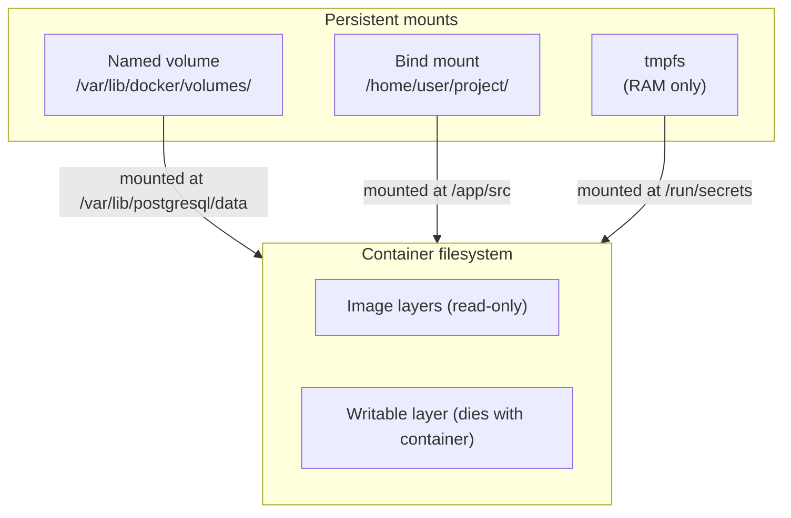
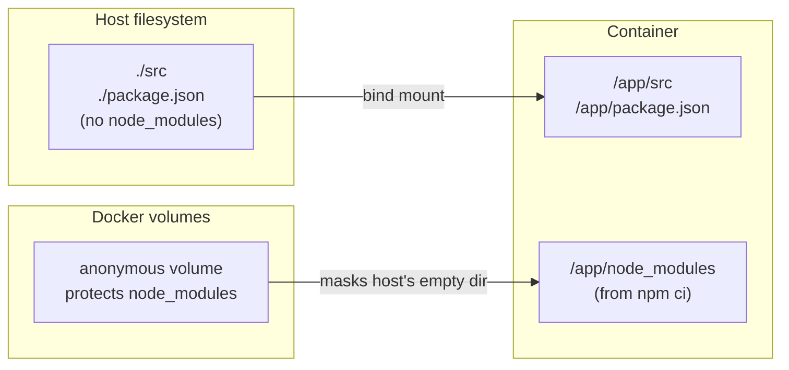

# Volumes & Storage

> Master persistent data with Docker — named volumes for production data, bind mounts for dev workflows, tmpfs for secrets, and backup/restore strategies.

## Mental model

Containers are **ephemeral**. When a container is removed, everything inside its writable layer — databases, uploaded files, logs — is gone forever. Docker provides three mount types to persist data beyond the container's lifetime.



The critical insight: **never store valuable data in the container's writable layer.** Always use a mount.

## Core concepts

### The three mount types

| Feature | Named volume | Bind mount | tmpfs |
|---------|-------------|------------|-------|
| Managed by | Docker | You (host filesystem) | Kernel (RAM) |
| Location | `/var/lib/docker/volumes/` | Anywhere on host | Memory only |
| Survives container removal | Yes | Yes (it's your files) | No |
| Pre-populated with image data | Yes | No (overwrites) | No |
| Performance | Native | Native (Linux), slower (macOS/Windows) | Fastest |
| Portable across hosts | Yes (with volume drivers) | No (path-dependent) | No |
| Use case | Production data, databases | Dev workflow, configs | Secrets, scratch, temp files |

### Named volumes

Named volumes are Docker's recommended way to persist production data. Docker manages the storage location, and volumes can be backed up, restored, and migrated.

```bash
# Create a named volume
docker volume create pgdata

# List all volumes
docker volume ls
# DRIVER    VOLUME NAME
# local     pgdata

# Inspect — shows the mountpoint on the host
docker volume inspect pgdata
# [
#     {
#         "CreatedAt": "2025-01-15T10:30:00Z",
#         "Driver": "local",
#         "Mountpoint": "/var/lib/docker/volumes/pgdata/_data",
#         "Name": "pgdata",
#         "Scope": "local"
#     }
# ]
```

#### Using volumes with containers

```bash
# Mount a named volume into a container
docker run -d --name db \
  -v pgdata:/var/lib/postgresql/data \   # volume-name:container-path
  -e POSTGRES_PASSWORD=secret \
  postgres:16-alpine

# The volume persists even after the container is removed
docker rm -f db
docker volume ls   # pgdata is still there

# Start a new container with the same volume — all data intact
docker run -d --name db2 \
  -v pgdata:/var/lib/postgresql/data \
  -e POSTGRES_PASSWORD=secret \
  postgres:16-alpine
```

::: tip
If the named volume is empty and the container image has data at the mount point, Docker **copies** that data into the volume on first use. This is called volume pre-population and only happens with named volumes, not bind mounts.
:::

#### Volume drivers

The default `local` driver stores data on the host filesystem. For production, you can use drivers that store data on network storage or cloud providers:

```bash
# Create a volume backed by NFS
docker volume create \
  --driver local \
  --opt type=nfs \
  --opt o=addr=192.168.1.100,rw \    # NFS server address
  --opt device=:/exports/data \       # NFS export path
  nfs-data

# Cloud volume drivers (installed as plugins)
docker plugin install rexray/ebs      # AWS EBS volumes
docker plugin install rexray/gce_pd   # GCP persistent disks
```

### Bind mounts

Bind mounts map a **specific host directory** into the container. They're the backbone of local development workflows.

#### Old -v syntax vs new --mount syntax

```bash
# -v syntax (short form) — the classic way
docker run -d \
  -v /home/user/project/src:/app/src \    # host-path:container-path
  my-app

# --mount syntax (explicit form) — clearer, recommended for new projects
docker run -d \
  --mount type=bind,source=/home/user/project/src,target=/app/src \
  my-app
```

::: info
The key difference: with `-v`, if the host path doesn't exist, Docker **creates it as an empty directory**. With `--mount`, Docker raises an **error**. Use `--mount` when you want fail-fast behavior.
:::

#### Read-only bind mounts

Mount configuration files as read-only to prevent the container from modifying them:

```bash
# Mount nginx config as read-only
docker run -d --name web \
  -v ./nginx.conf:/etc/nginx/nginx.conf:ro \   # :ro = read-only
  -p 8080:80 \
  nginx:alpine

# The container can read the config but cannot modify it
docker exec web sh -c 'echo "hacked" > /etc/nginx/nginx.conf'
# sh: can't create /etc/nginx/nginx.conf: Read-only file system
```

#### Dev workflow — live reload with bind mounts

The most common dev pattern: mount your source code so changes appear instantly inside the container.

```bash
# Mount current directory for live development
docker run -d --name dev \
  -v "$(pwd)":/app \        # mount project root into /app
  -w /app \                  # set working directory
  -p 3000:3000 \
  node:22-alpine \
  npm run dev                # start dev server with hot reload
```

#### The node_modules clobbering problem

When you bind-mount your project root, the host's `node_modules` (or lack thereof) **overwrites** the container's `node_modules` that were installed during `docker build`. This breaks the app.

```dockerfile
# Dockerfile
FROM node:22-alpine
WORKDIR /app
COPY package*.json ./
RUN npm ci                  # installs node_modules inside the image
COPY . .
CMD ["npm", "run", "dev"]
```

```bash
# BROKEN — host's empty node_modules overwrites the container's
docker run -v "$(pwd)":/app my-app
# Error: Cannot find module 'express'

# FIX — use an anonymous volume to protect node_modules
docker run \
  -v "$(pwd)":/app \                    # bind mount for source code
  -v /app/node_modules \                # anonymous volume preserves container's modules
  my-app
```



::: warning
The anonymous volume trick works but has a downside: when you add new dependencies, you need to rebuild the image or run `npm install` inside the container. The anonymous volume preserves the old `node_modules`.
:::

### tmpfs mounts

A **tmpfs mount** stores data in the host's memory (RAM). The data is never written to disk and disappears when the container stops.

```bash
# Mount a tmpfs at /run/secrets — data lives in RAM only
docker run -d --name secure-app \
  --tmpfs /run/secrets:rw,size=64m \    # 64 MB RAM limit
  my-app

# Using --mount syntax
docker run -d --name secure-app \
  --mount type=tmpfs,target=/run/secrets,tmpfs-size=67108864 \
  my-app
```

#### When to use tmpfs

| Scenario | Why tmpfs |
|----------|----------|
| Application secrets / API keys at runtime | Never written to disk — survives only in memory |
| Scratch space for data processing | Fast I/O, automatic cleanup on container stop |
| Session data / temp files | No disk wear, no cleanup needed |
| Unit test temp directories | Blazing fast, zero disk footprint |

::: tip
`tmpfs` mounts are Linux-only. On Docker Desktop (macOS/Windows), the mount exists inside the Linux VM, so the security benefit of "never touches disk" still applies within that VM.
:::

## Advanced topics

### Volume permissions and ownership

The most common frustration with volumes: **UID/GID mismatch**. The user inside the container doesn't match the owner of the files on the host.

```bash
# Common error: permission denied
docker run -v ./data:/app/data my-app
# Error: EACCES: permission denied, open '/app/data/output.txt'
```

This happens because:
- The host directory is owned by your user (UID 1000)
- The container process runs as `root` (UID 0) or a different user
- Or conversely, the container runs as UID 1000 but the volume has root-owned files

#### Solution 1: Match UIDs in the Dockerfile

```dockerfile
FROM node:22-alpine

# Create a user with the same UID as your host user
RUN addgroup -g 1000 appgroup && \
    adduser -u 1000 -G appgroup -D appuser

# Set ownership
RUN mkdir -p /app/data && chown -R appuser:appgroup /app/data

USER appuser
WORKDIR /app
```

#### Solution 2: Fix ownership at startup with an entrypoint

```bash
#!/bin/sh
# entrypoint.sh — fix permissions then drop to non-root
chown -R appuser:appgroup /app/data
exec gosu appuser "$@"          # gosu drops privileges cleanly
```

#### Solution 3: Use init containers (Compose)

```yaml
# docker-compose.yml
services:
  init-permissions:
    image: alpine
    volumes:
      - app-data:/data
    command: chown -R 1000:1000 /data   # fix ownership before app starts
    
  app:
    image: my-app
    user: "1000:1000"
    volumes:
      - app-data:/data
    depends_on:
      init-permissions:
        condition: service_completed_successfully

volumes:
  app-data:
```

### Volume backup, restore, and migration

Volumes live inside Docker's storage directory. You can't just `cp` them. Instead, use a helper container to create tarballs.

#### Backup a volume

```bash
# Back up the 'pgdata' volume to a tarball on the host
docker run --rm \
  -v pgdata:/source:ro \                        # mount the volume read-only
  -v "$(pwd)":/backup \                          # mount current dir for output
  alpine \
  tar czf /backup/pgdata-backup.tar.gz -C /source .   # compress everything

# Result: pgdata-backup.tar.gz in your current directory
ls -lh pgdata-backup.tar.gz
# -rw-r--r-- 1 root root 12M Jul 13 10:30 pgdata-backup.tar.gz
```

#### Restore into a fresh volume

```bash
# Create a new volume
docker volume create pgdata-restored

# Restore from the tarball
docker run --rm \
  -v pgdata-restored:/target \                   # mount the new volume
  -v "$(pwd)":/backup:ro \                        # mount backup dir read-only
  alpine \
  tar xzf /backup/pgdata-backup.tar.gz -C /target   # extract into the volume

# Use the restored volume
docker run -d --name db-restored \
  -v pgdata-restored:/var/lib/postgresql/data \
  -e POSTGRES_PASSWORD=secret \
  postgres:16-alpine
```

#### Migrate a volume to another host

```bash
# On source host: backup and transfer
docker run --rm -v pgdata:/source:ro -v "$(pwd)":/backup alpine \
  tar czf /backup/pgdata.tar.gz -C /source .
scp pgdata.tar.gz user@new-host:/backups/        # transfer to new host

# On target host: restore
docker volume create pgdata
docker run --rm -v pgdata:/target -v /backups:/backup:ro alpine \
  tar xzf /backup/pgdata.tar.gz -C /target
```

### Anonymous volumes vs named volumes

```bash
# Anonymous volume — Docker assigns a random hash name
docker run -v /app/data my-app
docker volume ls
# DRIVER    VOLUME NAME
# local     a1b2c3d4e5f6g7h8i9j0k1l2m3n4o5p6...  (not human-friendly)

# Named volume — you choose the name
docker run -v my-data:/app/data my-app
docker volume ls
# DRIVER    VOLUME NAME
# local     my-data                                (clear and manageable)
```

::: warning
Anonymous volumes are hard to identify, easy to forget, and accumulate as garbage. **Always use named volumes** for any data you care about. Anonymous volumes are only useful as the `node_modules` protection trick shown earlier.
:::

### Volume lifecycle

Volumes **survive container removal** — this is by design. Deleting a container does not delete its volumes.

```bash
# Create a container with a named volume
docker run -d --name db -v pgdata:/var/lib/postgresql/data postgres:16-alpine

# Remove the container — volume persists
docker rm -f db
docker volume ls   # pgdata is still here

# Remove an individual volume (fails if in use)
docker volume rm pgdata

# Nuclear option: remove ALL unused volumes
docker volume prune
# WARNING! This will remove all local volumes not used by at least one container.
# Are you sure you want to continue? [y/N]

# Remove everything — volumes, containers, images, networks
docker system prune --volumes
```

::: danger
`docker volume prune` is irreversible. It removes all volumes not currently attached to a running container. If you stopped a database container but didn't remove it, its volume is still considered "in use." But if you `docker rm`'d the container, the volume is now orphaned and **will be pruned**.
:::

### Storage drivers vs volume drivers

Don't confuse these two concepts:

| Concept | What it manages | Examples |
|---------|----------------|----------|
| **Storage driver** | The container's writable layer (OverlayFS) | `overlay2`, `btrfs`, `zfs` |
| **Volume driver** | Persistent volume backends | `local`, `nfs`, `rexray/ebs` |

The storage driver handles the ephemeral copy-on-write layer. The volume driver handles the persistent data you explicitly mount. You almost never need to change the storage driver (`overlay2` is the default and best choice for most setups).

## Checkpoint

You now understand:

- Containers are **ephemeral** — never store important data in the writable layer
- **Named volumes** are Docker-managed, survive container removal, and are the right choice for production data
- **Bind mounts** map host directories into containers — perfect for development with live reload
- **tmpfs** stores data in RAM only — use for secrets and scratch data
- The **node_modules clobbering problem** is solved with an anonymous volume mask
- **UID/GID mismatches** cause permission errors — match UIDs in your Dockerfile or fix at startup
- **Backup volumes** with a helper container and `tar` — restore by extracting into a new volume
- `docker volume prune` is irreversible — always back up before pruning
