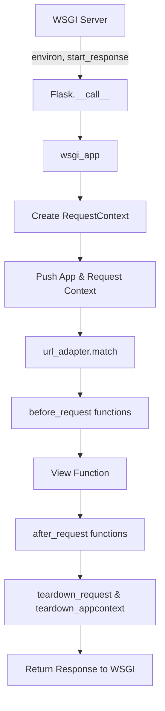
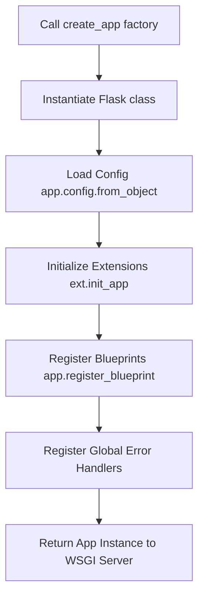

# Flask Fundamentals & Context

## 1. Explain the difference between Application Context and Request Context in Flask. <Badge type="warning" text="medium" />

::: details View Answer
In Flask, there are two distinct contexts that manage different scopes of data during a request lifecycle:
- **Application Context**: Manages application-level data. It's bound to the `current_app` and the `g` object. It exists so that extensions, templates, and handlers can access the current running application configuration and application-wide resources (like database connections stored in `g`) without needing to pass the app instance everywhere.
- **Request Context**: Manages request-level data. It's bound to the `request` and `session` objects. It holds information specific to the HTTP request being processed, such as form data, query parameters, and the client's IP address.

When a request comes in, Flask pushes the application context first, followed by the request context. When the request ends, they are popped.
:::

## 2. How does Flask use context locals to handle concurrent requests? <Badge type="danger" text="hard" />

::: details View Answer
Flask relies on Werkzeug's context local proxies (`LocalProxy`) to handle concurrent requests without leaking data between them. Historically, Werkzeug used a custom `Local` and `LocalStack` implementation which behaved like Python's `threading.local` but added support for greenlets (like Gevent).

In modern Flask (version 2.2+), Werkzeug's context locals are backed by standard Python `contextvars`. This allows variables like `request`, `g`, and `current_app` to be imported globally but dynamically point to the correct data for the active request in the current thread or asyncio task. This architectural design ensures thread-safety and asyncio-safety out-of-the-box.
:::

## 3. Explain the lifecycle of a Flask Request from WSGI server to the view function. <Badge type="danger" text="hard" />

::: details View Answer
When a WSGI server (like Gunicorn or uWSGI) passes an HTTP request to a Flask application, it follows a strict lifecycle:



1. **Flask.__call__ / wsgi_app**: The entry point for the WSGI server.
2. **Context Creation**: Flask creates a `RequestContext` object, which internally creates or pushes an `AppContext`.
3. **Routing**: The URL adapter matches the URL to a specific endpoint (routing).
4. **Pre-processing**: `before_request` handlers are executed.
5. **View Execution**: The matched view function is executed to return a response object.
6. **Post-processing**: `after_request` handlers run (if no unhandled exceptions occurred).
7. **Teardown**: The contexts are popped, triggering `teardown_request` and `teardown_appcontext` to clean up resources (even if exceptions occurred).
:::

## 4. What is the `g` object in Flask and how is its lifespan managed? <Badge type="warning" text="medium" />

::: details View Answer
The `g` object is a global namespace object provided by Flask for temporarily storing data during the lifespan of an application context. "g" stands for "global", but it is only global *within a specific application context*.

**Lifespan**:
- It is created when an application context is pushed.
- It is destroyed when the application context is popped (usually at the end of a request or CLI command).
- Common uses include storing a database connection, caching a fetched user object for the current request, or storing telemetry data.
:::

## 5. How does `current_app` work when multiple Flask applications are running in the same process? <Badge type="danger" text="hard" />

::: details View Answer
Using WSGI middlewares like `DispatcherMiddleware`, you can mount multiple Flask applications under different URL prefixes in the same process. 

Even though multiple apps are running, `current_app` is a `LocalProxy` that points to the application instance of the *currently active application context*. When a request comes in for a specific app, only that app's context is pushed to the current thread's `contextvars`. Thus, `current_app` will safely and dynamically resolve to the correct Flask application handling the current request, preventing cross-app data leakage.
:::

## 6. Describe the role of Werkzeug in a Flask application. <Badge type="tip" text="easy" />

::: details View Answer
Werkzeug is a comprehensive WSGI web application library and one of Flask's core dependencies. Its primary roles in Flask include:
- **Request and Response Objects**: Providing the underlying HTTP `Request` and `Response` wrapper classes.
- **Routing**: Providing the `Map` and `Rule` routing system used by Flask to match URLs to endpoints.
- **Context Locals**: Supplying the `LocalProxy` utilities used for `request`, `g`, `session`, and `current_app`.
- **WSGI Utilities**: Development server, debugging tools, and HTTP headers parsing.
:::

## 7. How does Werkzeug's routing map work under the hood? <Badge type="warning" text="medium" />

::: details View Answer
When you decorate a route using `@app.route('/path/<id>')`, Flask registers a Werkzeug `Rule` onto a Werkzeug `Map`. 

Under the hood:
1. Werkzeug compiles each `Rule` into a complex Regular Expression.
2. When a request arrives, a `MapAdapter` is created and bound to the WSGI environment.
3. The adapter calls its `.match()` method against the incoming URL path.
4. Werkzeug tests the compiled regexes and extracts URL variables, returning a tuple of `(endpoint_name, view_args)`.
Flask then uses the `endpoint_name` to look up the view function in its `view_functions` dictionary.
:::

## 8. What is the purpose of `app_ctx_var` and `request_ctx_var` (formerly LocalStack)? <Badge type="danger" text="hard" />

::: details View Answer
Historically, Flask used `_app_ctx_stack` and `_request_ctx_stack` (based on Werkzeug's `LocalStack`) to manage contexts. In modern Flask (2.2+), these were replaced by Python's native `contextvars` (`app_ctx_var` and `request_ctx_var`).

Their purpose is to keep track of the active contexts for the current executing flow (thread, asyncio task, or greenlet). By using `contextvars`, Flask can push an application or request context, execute the code, and then pop it. `LocalProxy` objects like `request` and `current_app` use these context variables to locate the data corresponding to the active execution context.
:::

## 9. Explain how to push an application context manually and why you might need to do it. <Badge type="warning" text="medium" />

::: details View Answer
You can push an application context manually using the `with` statement:

```python
with app.app_context():
    # Context is now active
    db.create_all()
    print(current_app.name)
```

**Why you might need it**:
Application contexts are automatically pushed during an HTTP request. However, if you are running code outside of a request lifecycle—such as in a background Celery worker, a custom Python thread, or a Python REPL—the context is missing. Extensions like SQLAlchemy rely on `current_app` to find their configuration. Pushing the context manually ensures that extensions and the `g` object function correctly in these offline scenarios.
:::

## 10. Can you modify the `request` object after the request context has been pushed? <Badge type="warning" text="medium" />

::: details View Answer
Technically, yes, but it is highly discouraged and often restricted by Werkzeug's data structures.
Many attributes of the Werkzeug `Request` object (like `request.args` and `request.form`) are `ImmutableMultiDict` instances, meaning they cannot be modified directly.

If you absolutely must modify request data (for example, in a WSGI middleware), you should modify the underlying WSGI `environ` dictionary *before* Flask wraps it in a `Request` object. During the request context, you can mutate `request.environ`, but it is safer to pass computed data via the `g` object rather than attempting to mutate the incoming request representation.
:::

## 11. What is a WSGI middleware and how can you wrap a Flask app with one? <Badge type="warning" text="medium" />

::: details View Answer
A WSGI middleware is a callable (usually a class) that wraps a WSGI application. It sits between the WSGI server and the Flask application, allowing you to intercept, inspect, or modify the WSGI `environ` before the request reaches Flask, or manipulate the response before it reaches the server.

**How to wrap a Flask app**:
```python
class SimpleMiddleware:
    def __init__(self, app):
        self.app = app

    def __call__(self, environ, start_response):
        environ['HTTP_X_CUSTOM_HEADER'] = 'Injected'
        return self.app(environ, start_response)

# Apply it by wrapping the wsgi_app attribute
app.wsgi_app = SimpleMiddleware(app.wsgi_app)
```
Notice that we wrap `app.wsgi_app`, not `app` itself, to preserve the standard Flask application object API.
:::

## 12. How does Flask distinguish between a blueprint's context and the main application's context? <Badge type="warning" text="medium" />

::: details View Answer
There is no separate "Blueprint Context." Blueprints are merely declarative configuration mechanisms used to organize application code. 

When a blueprint is registered on an application (`app.register_blueprint()`), Flask merges the blueprint's routes, error handlers, and before/after request functions into the main application. At runtime, when a request hits a blueprint route, it runs within the standard global application and request contexts. The only distinction is that Flask sets `request.blueprint` to the name of the active blueprint, allowing `before_request` handlers to conditionally execute logic based on the blueprint name.
:::

## 13. Describe what happens during the `teardown_request` and `teardown_appcontext` phases. <Badge type="warning" text="medium" />

::: details View Answer
These phases are designed for safe resource cleanup and are guaranteed to run when the contexts pop, regardless of whether the request succeeded or raised an unhandled exception.

- **`teardown_request`**: Executed when the request context is popped. Any functions registered with `@app.teardown_request` are called. It receives the exception object if an exception caused the teardown.
- **`teardown_appcontext`**: Executed immediately after, when the application context is popped. Functions registered with `@app.teardown_appcontext` run here. This is the recommended place to close database connections (like `db.session.remove()`), as the database might still be needed during `teardown_request`.
:::

## 14. How does Flask handle context in asynchronous views (using async/await)? <Badge type="danger" text="hard" />

::: details View Answer
Starting in Flask 2.0, asynchronous views (`async def`) are natively supported. 
Flask handles this via an asynchronous wrapper (using `asgiref`). Because modern Flask uses Python's `contextvars` for its context locals, the request and application contexts are natively propagated across `await` points in `asyncio` tasks. 

When Flask detects an `async` view function, it runs it within an asyncio event loop running on a background thread (or the main thread if using an async WSGI server bridge). The `contextvars` ensure that `request` and `current_app` resolve correctly within the coroutine.
:::

## 15. Explain how the `url_for` function resolves an endpoint to a URL in Werkzeug. <Badge type="warning" text="medium" />

::: details View Answer
`url_for` relies on Werkzeug's `MapAdapter.build()` method. 
When called, `url_for` takes the endpoint name (e.g., `'main.index'`) and keyword arguments.
1. It looks up the `Rule` associated with the endpoint.
2. It substitutes the variables in the rule's URL pattern with the provided keyword arguments.
3. If extra keyword arguments are provided that don't match URL variables, Werkzeug appends them as query string parameters (`?key=value`).
4. It relies on the current Request Context to resolve relative URLs, infer the current scheme (`http`/`https`), and prepend the `SERVER_NAME` or application root.
:::

## 16. What is the `LocalProxy` object in Werkzeug and how is it used in Flask? <Badge type="danger" text="hard" />

::: details View Answer
`LocalProxy` is a specialized Werkzeug utility class that acts as a proxy to an object stored in a context variable. 

In Flask, globals like `request`, `current_app`, `g`, and `session` are instances of `LocalProxy`.
When you do `request.method`, you aren't accessing an attribute on the proxy itself. Instead, `LocalProxy` dynamically intercepts the attribute access (using Python magic methods like `__getattr__`), fetches the actual current Request object from `request_ctx_var`, and forwards the `.method` call to it. This allows developers to import `request` once at the top of a file, while it dynamically points to different objects for different concurrent requests.
:::

## 17. Describe the initialization process of a Flask application. <Badge type="warning" text="medium" />

::: details View Answer
The initialization of a Flask app generally follows the Application Factory pattern:



1. **Instantiation**: The `Flask(__name__)` object is created.
2. **Configuration**: Environment variables and config objects are loaded into `app.config`.
3. **Extensions**: Extensions like Flask-SQLAlchemy are bound to the app using `.init_app(app)`.
4. **Blueprints**: Modules containing routes and views are registered.
5. **Serving**: The assembled application object is passed to a WSGI server to begin serving traffic.
:::

## 18. How do Flask extensions properly attach themselves to the application without tightly coupling to a single instance? <Badge type="warning" text="medium" />

::: details View Answer
Flask extensions use the **Application Factory** pattern to avoid tight coupling. 
Instead of passing the app instance to the extension upon creation (`ext = Extension(app)`), extensions are instantiated globally without an app (`ext = Extension()`).

Later, inside the `create_app()` factory, the extension is initialized via `ext.init_app(app)`.
Inside `init_app`, the extension sets up its configuration and stores its state inside the application instance's `app.extensions` dictionary (e.g., `app.extensions['my_ext'] = self`). When the extension needs to operate during a request, it looks up `current_app.extensions['my_ext']` to find its configuration, allowing a single extension instance to safely serve multiple Flask app instances simultaneously.
:::

## 19. What happens if an exception occurs during a request? How does Flask handle the context teardown? <Badge type="danger" text="hard" />

::: details View Answer
When an exception occurs during a view function or `before_request` handler:
1. Flask catches the exception and attempts to match it to a registered error handler (using `@app.errorhandler`).
2. If an error handler matches, it returns a response (like a 500 or 404 page).
3. If the exception is completely unhandled, Flask generates a default 500 Internal Server Error response.
4. **Crucially**, regardless of the exception, the context teardown process is guaranteed to run. Flask calls `teardown_request` and passes the exception object to the teardown functions. Finally, the context is popped. This guarantees that locks are released and database sessions are closed even during fatal crashes.
:::

## 20. Explain the concept of "Context Locals" in Werkzeug and why standard Python `threading.local` is not always sufficient. <Badge type="danger" text="hard" />

::: details View Answer
"Context Locals" are variables that are globally accessible but hold state specific to the current execution context.

Standard `threading.local` scopes data to a specific OS thread. However, many Python web servers use alternative concurrency models like Coroutines (`asyncio`) or Greenlets (Eventlet/Gevent) where multiple logical execution contexts share a single OS thread.
If Flask used `threading.local`, concurrent requests handled by different greenlets on the same thread would overwrite each other's `request` objects. Werkzeug's Context Locals (and modern `contextvars`) solve this by hooking into the specific concurrency mechanism, ensuring isolation per-request, whether the server is using threads, asyncio, or greenlets.
:::
