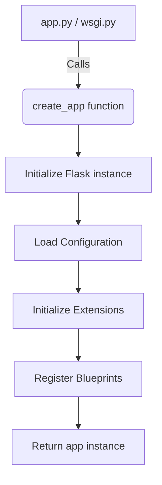
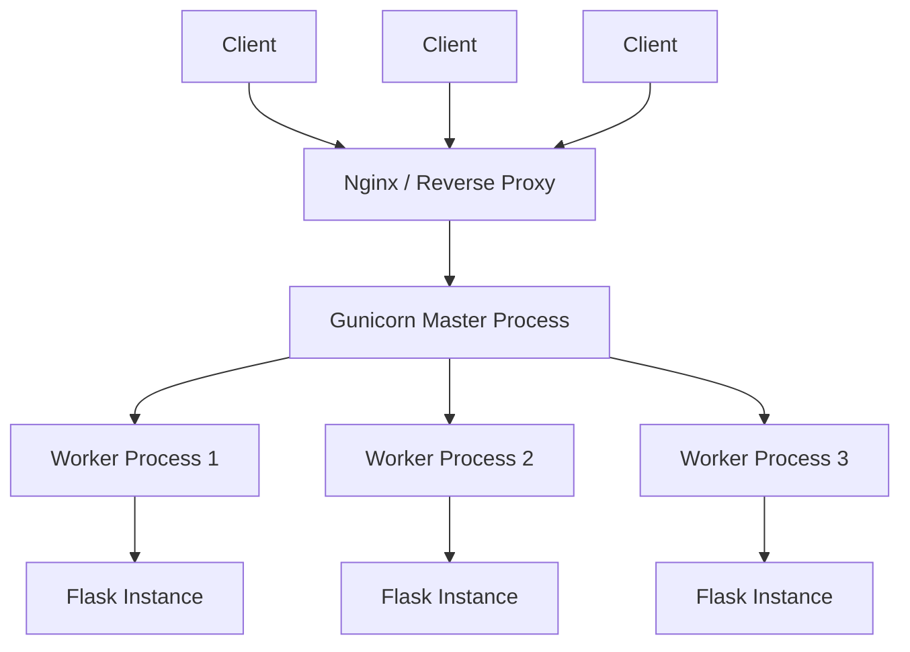

# Architecture, Blueprints & Deployment

## Explain the Application Factory pattern in Flask and its primary benefits. <Badge type="danger" text="hard" />

::: details View Answer
The Application Factory pattern involves creating the Flask application instance inside a function rather than globally. This pattern provides several crucial benefits for large applications:

1. **Testing**: You can create multiple instances of the application with different configurations (e.g., testing vs. development) in the same process.
2. **Multiple Instances**: It allows you to run multiple instances of the app if needed.
3. **Circular Imports**: By deferring the creation of the app instance, you can avoid circular import dependencies between your routes and the app instance itself.


:::

## What are Flask Blueprints, and how do they help in structuring large applications? <Badge type="warning" text="medium" />

::: details View Answer
Flask Blueprints are a way to organize a group of related views and other code. They do not represent a separate application; rather, they describe how to construct or extend an application.

Benefits:
- **Modularity**: Break down a large application into smaller, reusable components (e.g., `auth`, `blog`, `admin`).
- **URL Prefixing**: Easily mount a collection of routes under a specific URL prefix or subdomain.
- **Resource Grouping**: Group related static files and templates.
- **Registration**: Blueprints can be registered multiple times on an application or across different applications.
:::

## How does Flask handle circular imports when defining models, views, and the application instance? <Badge type="tip" text="easy" />

::: details View Answer
In smaller apps where the `app` instance is global, importing `app` into `views.py` and importing `views.py` into `app.py` causes circular imports.

Flask solves this through:
1. **Application Factory**: Moving `app` creation into a function. Views no longer need to import `app`; they are instead attached to Blueprints.
2. **Blueprints**: Views are registered to Blueprints, and Blueprints are registered to the app inside the factory function.
3. **Deferred Extension Initialization**: Extensions (like `db = SQLAlchemy()`) are defined globally but initialized later using `db.init_app(app)` inside the factory function.
:::

## Contrast Gunicorn and uWSGI when deploying a Flask application. Which would you choose and why? <Badge type="warning" text="medium" />

::: details View Answer
Both Gunicorn and uWSGI are WSGI HTTP servers used to serve Python applications.

- **Gunicorn**: Written in pure Python. It is simpler to configure, has a lower barrier to entry, and is widely adopted. It uses a pre-fork worker model and integrates well with async workers like Gevent.
- **uWSGI**: Written in C. It is extremely performant, feature-rich, and highly configurable (often considered complex). It supports multiple languages and protocols (including its native `uwsgi` protocol).

**Choice**: For most modern containerized applications, **Gunicorn** is preferred due to its simplicity, ease of configuration, and sufficient performance. uWSGI might be chosen for legacy deployments or when specific advanced routing/caching features native to uWSGI are required.
:::

## Explain the role of a reverse proxy (like Nginx) in front of Gunicorn/Flask. Why not serve Flask directly to the internet? <Badge type="warning" text="medium" />

::: details View Answer
While Gunicorn can bind to port 80/443, it is not designed to be an internet-facing server. A reverse proxy like Nginx is placed in front for several reasons:

1. **Security**: Nginx mitigates slow-client attacks (Slowloris) by buffering requests and only passing complete requests to Gunicorn.
2. **Static Files**: Nginx is highly optimized for serving static assets directly without hitting the Python process.
3. **SSL/TLS Termination**: Nginx efficiently handles HTTPS encryption/decryption.
4. **Load Balancing**: Can distribute traffic across multiple Gunicorn instances or different servers.
5. **Connection Management**: Handles thousands of concurrent connections efficiently, queuing them for the limited number of Gunicorn workers.
:::

## How does Flask 2.0+ support asynchronous programming (`async`/`await`), and what are the limitations? <Badge type="danger" text="hard" />

::: details View Answer
Flask 2.0 introduced native support for `async` route handlers, error handlers, and before/after request functions. You can define a route using `async def`.

**How it works**: Under the hood, Flask runs the `async` function using `asgiref.sync.async_to_sync`, executing the coroutine in an event loop on a separate thread, while the main Flask application remains synchronous (WSGI).

**Limitations**:
1. Flask is still fundamentally a **WSGI** (synchronous) application, not an ASGI application.
2. It does not provide the same concurrency benefits as native async frameworks like FastAPI or Quart because each request still ties up a WSGI worker thread/process.
3. It is primarily useful for reducing latency when a specific view needs to make multiple concurrent async I/O calls (e.g., fetching from multiple external APIs using `httpx`).
:::

## Walk through the process of integrating Celery with a Flask Application Factory. <Badge type="danger" text="hard" />

::: details View Answer
Integrating Celery with an App Factory is tricky because Celery needs to be initialized globally, but the Flask app configuration is loaded dynamically.

**Process**:
1. Initialize the `celery_app` globally using `Celery(__name__)`.
2. Inside the `create_app` factory, configure the `celery_app` using the Flask app's configuration (e.g., `celery_app.conf.update(app.config)`).
3. Create a custom Celery `Task` base class that wraps the task execution within the Flask application context. This is crucial so tasks can access the database, `current_app`, etc.

```python
class ContextTask(celery.Task):
    def __call__(self, *args, **kwargs):
        with app.app_context():
            return self.run(*args, **kwargs)
celery.Task = ContextTask
```
:::

## How do you handle configuration management across different environments (development, testing, production) in a Flask App Factory? <Badge type="tip" text="easy" />

::: details View Answer
Configuration should be decoupled from code. In an App Factory, you pass the configuration name or rely on environment variables:

1. **Environment Variables**: Use `dotenv` or standard `os.environ` to set variables like `FLASK_ENV`, `DATABASE_URI`, and `SECRET_KEY`.
2. **Config Classes**: Create a `config.py` with base `Config`, and subclasses `DevelopmentConfig`, `TestingConfig`, `ProductionConfig`.
3. **Factory Injection**:
   ```python
   def create_app(config_name='default'):
       app = Flask(__name__)
       app.config.from_object(config[config_name])
       # ...
   ```
4. **Instance Folder**: Flask supports an `instance/` folder for non-version-controlled config files (e.g., `app.config.from_pyfile('config.py', silent=True)`).
:::

## What is the execution model of a typical synchronous Flask app running under Gunicorn with synchronous workers? How does it handle concurrency? <Badge type="warning" text="medium" />

::: details View Answer
Gunicorn uses a **pre-fork worker model**. 

1. A master process starts and binds to a socket.
2. It forks a specified number of worker processes (typically `2 * cores + 1`).
3. Each sync worker handles one request at a time sequentially.

**Concurrency**: 
If you have 4 workers, your application can handle exactly 4 concurrent requests. If all 4 workers are blocked on I/O (e.g., waiting for a database query), the 5th request will queue until a worker is free. For high-I/O applications, sync workers scale poorly; you should switch to async workers (like Gevent) or use threading (`--threads`).


:::

## Describe how to containerize a production Flask application using Docker. What should a minimal `Dockerfile` include? <Badge type="tip" text="easy" />

::: details View Answer
Containerizing involves packaging the app with its dependencies to ensure consistent execution.

A minimal production `Dockerfile` should include:
1. **Base Image**: A lightweight Python image (e.g., `python:3.11-slim`).
2. **Working Directory**: Set a working directory (`WORKDIR /app`).
3. **Dependencies**: Copy `requirements.txt` and run `pip install --no-cache-dir -r requirements.txt`. (Do this before copying code to leverage Docker cache).
4. **Source Code**: Copy the application code (`COPY . .`).
5. **Non-root User**: Create and switch to a non-root user for security (`USER myuser`).
6. **Command**: Run the WSGI server, not the Flask dev server (`CMD ["gunicorn", "-w", "4", "-b", "0.0.0.0:8000", "wsgi:app"]`).
:::

## How can you implement health checks in a deployed Flask application for orchestration tools like Kubernetes? <Badge type="tip" text="easy" />

::: details View Answer
Orchestrators need to know if the application is running (liveness) and ready to receive traffic (readiness).

**Implementation**:
Create a dedicated Blueprint or simple routes for health checks:
- `/health/live`: Returns a simple `200 OK` JSON response (`{"status": "alive"}`). If this fails, Kubernetes restarts the pod.
- `/health/ready`: Checks critical dependencies like the database connection or Redis cache. If it succeeds, it returns `200 OK`. If dependencies are down, it returns `503 Service Unavailable`. If this fails, Kubernetes stops routing traffic to the pod.
:::

## What are the best practices for handling database connections and connection pooling in a scalable Flask application using SQLAlchemy? <Badge type="warning" text="medium" />

::: details View Answer
1. **Use Flask-SQLAlchemy**: It automatically manages the database session life cycle, removing sessions at the end of every request.
2. **Connection Pooling**: SQLAlchemy maintains a pool of connections. In production, tune `SQLALCHEMY_ENGINE_OPTIONS` (e.g., `pool_size`, `max_overflow`).
3. **Pgbouncer (PostgreSQL)**: For high-traffic apps scaling to many worker processes or containers, the database can exhaust connections. Use an external connection pooler like PgBouncer in front of the database.
4. **Avoid Global Sessions**: Do not share a single SQLAlchemy session across requests/threads.
:::

## How would you implement centralized error handling across multiple Blueprints in Flask? <Badge type="tip" text="easy" />

::: details View Answer
Instead of defining `errorhandler` on each Blueprint separately, you can handle errors globally using the application instance or the `app_errorhandler` decorator within a Blueprint.

**Method 1 (App Factory)**:
Register global error handlers directly on the app instance inside the factory function:
```python
@app.errorhandler(404)
def not_found_error(error):
    return jsonify({"error": "Not found"}), 404
```

**Method 2 (Blueprint App Error Handler)**:
If you want to define handlers inside a specific Blueprint but apply them globally:
```python
bp = Blueprint('errors', __name__)

@bp.app_errorhandler(500)
def internal_error(error):
    return jsonify({"error": "Internal server error"}), 500
```
:::

## Explain how to use Flask's `current_app` and `g` objects within Blueprints, and why they are necessary. <Badge type="danger" text="hard" />

::: details View Answer
In an App Factory pattern, the application instance (`app`) does not exist globally. Thus, views inside Blueprints cannot import it.

- **`current_app`**: A local proxy that points to the application handling the current request. It allows Blueprints to access app config, extensions, or logger (e.g., `current_app.config['SECRET_KEY']`).
- **`g` (Global context)**: An object provided by Flask to store data during a single application context (usually scoped to a request). It is useful for sharing data between functions during a request, like storing a database connection or an authenticated user object (`g.user = user`).

They are necessary because they act as safe thread-local variables in a highly concurrent environment.
:::

## What are thread-locals in Werkzeug, and how do they relate to Flask's Request Context and Application Context? <Badge type="danger" text="hard" />

::: details View Answer
Thread-locals are variables whose values are specific to the current executing thread. Werkzeug (Flask's underlying WSGI toolkit) provides custom context locals that work for both threads and greenlets (used by Gevent).

When a request comes in, Flask pushes two contexts to local stacks:
1. **Application Context**: Stores app-level data (`current_app`, `g`).
2. **Request Context**: Stores request-level data (`request`, `session`).

Because these are thread-local, multiple requests handled by different threads in the same process can access `request` or `current_app` simultaneously without their data colliding.
:::

## Discuss strategies for scaling a Flask application horizontally. What state needs to be managed externally? <Badge type="warning" text="medium" />

::: details View Answer
Horizontal scaling involves running multiple instances (containers/servers) of the Flask application behind a load balancer.

**Externalized State**:
1. **Sessions**: Flask uses client-side signed cookies for sessions by default, which works perfectly. However, if using server-side sessions, they must be stored in an external store like Redis, not in application memory.
2. **Database**: Use a centralized, scalable database cluster (e.g., PostgreSQL).
3. **Caching**: Memory caches (like Python dictionaries) will not be shared. Use external caches like Redis or Memcached.
4. **File Storage**: Uploaded files cannot be saved to the local disk of a container. Use object storage like AWS S3.
5. **Background Tasks**: Long-running processes must be offloaded to task queues like Celery with a broker like RabbitMQ/Redis.
:::

## How do you gracefully shut down a Flask application running on Gunicorn to ensure no requests are dropped during deployment? <Badge type="danger" text="hard" />

::: details View Answer
During a deployment or scaling down event, hard-killing processes will drop active HTTP requests.

**Graceful Shutdown**:
1. Send a `SIGTERM` signal to the Gunicorn master process.
2. Gunicorn stops accepting new connections on its socket.
3. It allows current workers to finish processing their active requests up to a timeout limit (`--graceful-timeout`, default 30s).
4. In Kubernetes, configure `preStop` hooks or rely on standard Pod termination lifecycle. Ensure the load balancer updates its routing table before the application actually stops accepting connections (often by adding a slight sleep in a preStop hook).
:::

## Explain the difference between `before_request`, `after_request`, and `teardown_request` decorators, especially in the context of Blueprints. <Badge type="tip" text="easy" />

::: details View Answer
- **`@before_request`**: Executes before the view function. If it returns a response, the view function is skipped, and the response is returned immediately. Useful for authentication checks.
- **`@after_request`**: Executes after the view function, *if no unhandled exceptions occurred*. It receives the response object and must return a response object. Useful for modifying headers (e.g., CORS).
- **`@teardown_request`**: Always executes after the request, *even if an exception occurred*. Useful for cleanup tasks like closing database connections.

**In Blueprints**: Using `@bp.before_request` runs the function only for routes belonging to that Blueprint. Using `@bp.before_app_request` runs it globally for all routes.
:::

## How would you architect a Flask application to serve both a RESTful API and a Server-Rendered HTML frontend? <Badge type="warning" text="medium" />

::: details View Answer
The cleanest architecture utilizes Blueprints to separate concerns:

1. **API Blueprint**: `api_bp = Blueprint('api', __name__, url_prefix='/api/v1')`. All routes return JSON responses using `jsonify`. Error handlers for this blueprint also return JSON.
2. **Frontend Blueprint**: `frontend_bp = Blueprint('frontend', __name__)`. All routes render HTML using `render_template`.
3. **Static & Templates**: Store templates in a centralized `templates/` folder and assets in `static/`.
4. **Authentication**: Use Session/Cookie auth for the Frontend Blueprint, and Token-based auth (JWT) for the API Blueprint, applying respective `@before_request` logic.
:::

## What is the impact of using async views in Flask compared to using Gevent/Eventlet workers with Gunicorn? <Badge type="danger" text="hard" />

::: details View Answer
- **Flask Async Views**: Flask handles async views by running the event loop in an isolated thread via `asgiref`. It does not make the WSGI server async. A long-running async HTTP request will still block the Gunicorn sync worker. It is beneficial primarily for executing multiple concurrent outgoing API calls *within a single request*.
- **Gevent/Eventlet Workers**: These replace standard blocking socket operations with async versions via "monkey-patching". When a worker performs I/O (like a DB query), it yields control to another greenlet, allowing a single OS process to handle thousands of concurrent requests.

**Impact**: Gevent fundamentally changes the concurrency model of the entire server to support massive parallel I/O, whereas Flask's `async` routes only organize asynchronous execution within the bounds of a standard sync request lifecycle.
:::
