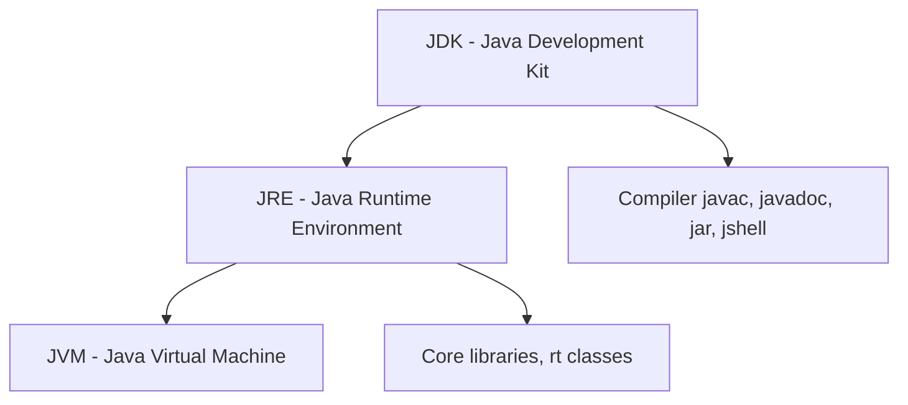

# Java Basics & Syntax

## 1. What is the difference between the JDK, JRE, and JVM? <Badge type="tip" text="easy" />

::: details View Answer
These three acronyms describe nested layers of the Java platform.



- **JVM:** The abstract machine that executes Java bytecode. It is platform-specific (different binaries per OS) and provides the runtime: class loading, bytecode verification, JIT compilation, and garbage collection.
- **JRE:** The JVM **plus** the standard class libraries needed to *run* applications. It contains no development tools.
- **JDK:** A superset of the JRE that adds development tools such as `javac` (compiler), `jar`, `javadoc`, `jshell`, and `jdb`.

Since Java 11, Oracle stopped shipping a standalone JRE; you ship a trimmed runtime built with `jlink` instead.
:::

## 2. How does Java achieve platform independence ("write once, run anywhere")? <Badge type="tip" text="easy" />

::: details View Answer
The Java compiler (`javac`) does **not** produce native machine code. It compiles `.java` source into platform-neutral **bytecode** stored in `.class` files.

- This bytecode targets the JVM instruction set, not any physical CPU.
- Each operating system has its own JVM implementation that interprets/JIT-compiles the same bytecode into native instructions at runtime.
- Therefore the *bytecode* is portable; the *JVM* is the platform-specific piece.

The trade-off is a startup cost and an extra abstraction layer, mitigated by Just-In-Time (JIT) compilation, which compiles hot methods to native code during execution.
:::

## 3. What is the full lifecycle of compiling and running a simple Java program? <Badge type="tip" text="easy" />

::: details View Answer
Given `Hello.java`:

```java
public class Hello {
    public static void main(String[] args) {
        System.out.println("Hello, World!");
    }
}
```

1. **Compile:** `javac Hello.java` produces `Hello.class` (bytecode).
2. **Run:** `java Hello` launches the JVM, which loads, verifies, links, and initializes the class, then invokes `main`.

In Java 11+ you can skip the explicit compile step for single-file programs: `java Hello.java` compiles in memory and runs directly. The `main` method must be `public static void` and accept a `String[]` (Java 21 previews a more relaxed instance `main` form).
:::

## 4. What are the eight primitive types in Java, and what are their wrapper classes? <Badge type="tip" text="easy" />

::: details View Answer
Java has exactly eight primitives, each with a fixed size independent of platform.

| Primitive | Size    | Wrapper     | Default |
|-----------|---------|-------------|---------|
| `boolean` | JVM-dep | `Boolean`   | `false` |
| `byte`    | 8-bit   | `Byte`      | `0`     |
| `short`   | 16-bit  | `Short`     | `0`     |
| `char`    | 16-bit  | `Character` | `'\u0000'`|
| `int`     | 32-bit  | `Integer`   | `0`     |
| `long`    | 64-bit  | `Long`      | `0L`    |
| `float`   | 32-bit  | `Float`     | `0.0f`  |
| `double`  | 64-bit  | `Double`    | `0.0d`  |

Primitives live on the stack (or inline in objects) and have no methods. Wrappers are full objects, can be `null`, and are required for generics and collections, which cannot hold primitives directly.
:::

## 5. What is autoboxing/unboxing, and what pitfalls does it introduce? <Badge type="warning" text="medium" />

::: details View Answer
**Autoboxing** is the automatic conversion of a primitive to its wrapper (`int` → `Integer`), and **unboxing** is the reverse, both inserted silently by the compiler.

Pitfalls:
- **NullPointerException on unboxing:** Unboxing a `null` wrapper throws NPE.
  ```java
  Integer x = null;
  int y = x; // NullPointerException
  ```
- **Identity vs equality:** The `Integer` cache reuses instances for values `-128..127`, so `==` comparisons behave inconsistently.
  ```java
  Integer a = 127, b = 127;
  System.out.println(a == b); // true  (cached)
  Integer c = 128, d = 128;
  System.out.println(c == d); // false (new objects)
  ```
  Always use `.equals()` for wrapper comparison.
- **Performance:** Boxing in tight loops creates garbage; prefer primitive streams or primitive-keyed collections.
:::

## 6. What does the `var` keyword do, and where can it not be used? <Badge type="warning" text="medium" />

::: details View Answer
Introduced in Java 10, `var` enables **local variable type inference**: the compiler infers the static type from the initializer. It is compile-time syntax sugar, not dynamic typing — the variable still has a fixed type.

```java
var list = new ArrayList<String>(); // ArrayList<String>
var total = 0L;                      // long
```

It **cannot** be used for:
- Fields, method parameters, or return types.
- Variables without an initializer (`var x;` is illegal).
- Initialization with `null` alone (no inferable type).
- Lambda targets without explicit types, and array shorthand (`var a = {1,2};`).

Use it to reduce noise when the type is obvious from the right-hand side; avoid it when it harms readability.
:::

## 7. Explain the difference between the stack and the heap in the JVM. <Badge type="warning" text="medium" />

::: details View Answer
- **Stack:** One per thread. Stores stack frames for method calls, each holding local variables (primitives and **references**) and partial results. Memory is reclaimed automatically when a method returns (LIFO). Exceeding it throws `StackOverflowError`.
- **Heap:** Shared across all threads. Stores all objects and arrays. Managed by the garbage collector. Exhaustion throws `OutOfMemoryError`.

```java
void demo() {
    int n = 5;                  // n on the stack
    String s = new String("hi");// reference on stack, object on heap
}
```

Class metadata and the runtime constant pool live in **Metaspace** (off-heap, since Java 8, replacing PermGen). Static fields are also stored with class metadata, referencing objects on the heap.
:::

## 8. What is the difference between value semantics and reference semantics in Java? <Badge type="warning" text="medium" />

::: details View Answer
- **Primitives** have **value semantics**: a variable holds the actual value. Assignment copies the value, so the two variables are independent.
- **Objects** are accessed via **references**: a variable holds a pointer to a heap object. Assignment copies the *reference*, so both variables alias the same object.

```java
int a = 1; int b = a; b = 2;      // a stays 1
int[] x = {1}; int[] y = x; y[0] = 2; // x[0] is now 2 (shared)
```

This distinction underlies the classic confusion about parameter passing and why mutating a passed object affects the caller's object.
:::

## 9. Is Java pass-by-value or pass-by-reference? <Badge type="warning" text="medium" />

::: details View Answer
Java is **always pass-by-value**. For object arguments, the value being copied is the **reference**, not the object.

```java
void mutate(StringBuilder sb) { sb.append("!"); } // affects caller's object
void reassign(StringBuilder sb) { sb = new StringBuilder("new"); } // no effect
```

- `mutate` changes the object both references point to — visible to the caller.
- `reassign` only rebinds the local copy of the reference — invisible to the caller.

The key insight: you can mutate the shared object, but you can never make the caller's variable point at a different object.
:::

## 10. What is the difference between `==` and `.equals()`? <Badge type="warning" text="medium" />

::: details View Answer
- `==` compares **identity** for objects (do both references point to the same instance?) and **value** for primitives.
- `.equals()` compares **logical equality** as defined by the class. The default `Object.equals()` falls back to `==`, so classes must override it to be meaningful.

```java
String a = new String("x");
String b = new String("x");
System.out.println(a == b);      // false (different objects)
System.out.println(a.equals(b)); // true  (same content)
```

Whenever you override `equals()`, you must override `hashCode()` consistently, or hash-based collections (`HashMap`, `HashSet`) break. `records` generate both automatically.
:::

## 11. What is the contract between `equals()` and `hashCode()`? <Badge type="danger" text="hard" />

::: details View Answer
The contract is:
- If `a.equals(b)` is `true`, then `a.hashCode() == b.hashCode()` **must** hold.
- The reverse is not required: equal hash codes do **not** imply equality (collisions are allowed).
- `hashCode()` must return the same value across calls as long as the object's `equals`-relevant state is unchanged.

Consequences of violating it:
- Equal objects with different hash codes may land in different buckets, so a `HashMap.get` for a logically-equal key returns `null`.
- Mutating a field used in `hashCode` after insertion into a `HashSet` "loses" the element.

```java
@Override public boolean equals(Object o) { /* compare fields */ }
@Override public int hashCode() { return Objects.hash(field1, field2); }
```
Use immutable fields for the key state to stay safe.
:::

## 12. What are the categories of operators in Java, and how does integer division differ from floating-point division? <Badge type="tip" text="easy" />

::: details View Answer
Main categories: arithmetic (`+ - * / %`), relational (`< > <= >= == !=`), logical (`&& || !`), bitwise (`& | ^ ~ << >> >>>`), assignment (`= +=` …), and the ternary `?:`.

Division differs by operand type:
```java
System.out.println(7 / 2);    // 3   (integer division truncates)
System.out.println(7.0 / 2);  // 3.5 (one double operand -> double)
System.out.println(7 % 3);    // 1   (remainder)
System.out.println(1 / 0);    // ArithmeticException
System.out.println(1.0 / 0);  // Infinity (no exception for doubles)
```

`>>` is arithmetic (sign-extending) right shift; `>>>` is logical (zero-filling) right shift, which matters for negative numbers.
:::

## 13. How do `&&`/`||` differ from `&`/`|`? <Badge type="warning" text="medium" />

::: details View Answer
- `&&` and `||` are **short-circuit** logical operators: the right operand is evaluated only if needed. `false && x()` skips `x()`; `true || x()` skips `x()`.
- `&` and `|` on booleans are **non-short-circuit**: both sides are always evaluated. On integers they are **bitwise** operators.

Short-circuiting enables safe guard patterns:
```java
if (obj != null && obj.isReady()) { ... } // avoids NPE
```
Using `&` here would evaluate `obj.isReady()` even when `obj` is null, throwing an NPE. Use `&`/`|` only when you intentionally need side effects from both operands, which is rare.
:::

## 14. What control-flow constructs does Java offer, and what is the enhanced switch? <Badge type="warning" text="medium" />

::: details View Answer
Java provides `if/else`, classic `switch`, `for`, enhanced `for-each`, `while`, `do-while`, plus `break`, `continue` (with optional labels), and `return`.

The **switch expression** (standard since Java 14) returns a value and uses arrow labels with no fall-through:

```java
int days = switch (month) {
    case JAN, MAR, MAY, JUL, AUG, OCT, DEC -> 31;
    case APR, JUN, SEP, NOV -> 30;
    case FEB -> isLeap ? 29 : 28;
};
```

For multi-statement arms, use a block with `yield`:
```java
case FEB -> { int d = isLeap ? 29 : 28; yield d; }
```
Arrow switches are exhaustive over enums/sealed types, eliminating accidental fall-through bugs from the colon form.
:::

## 15. How do arrays work in Java, including multi-dimensional arrays? <Badge type="warning" text="medium" />

::: details View Answer
Arrays are fixed-length, zero-indexed objects allocated on the heap; their `length` is a final field (not a method). Elements get default values on creation.

```java
int[] a = new int[3];          // {0, 0, 0}
int[] b = {1, 2, 3};           // initializer
int[][] grid = new int[2][3];  // 2x3
int[][] jagged = new int[2][]; // rows allocated independently
jagged[0] = new int[]{1, 2};
jagged[1] = new int[]{1, 2, 3};
```

Java has no true multi-dimensional arrays — a 2D array is an array of array references, which is why jagged arrays are possible. Indexing out of bounds throws `ArrayIndexOutOfBoundsException`. Arrays are **covariant** (`String[]` is an `Object[]`), which can cause `ArrayStoreException` at runtime.
:::

## 16. What are packages and imports, and what does a static import do? <Badge type="tip" text="easy" />

::: details View Answer
A **package** is a namespace that groups related types, declared with `package com.example.app;` as the first statement in a file. The directory structure on disk must mirror the package name.

**Imports** let you refer to types by their simple name:
```java
import java.util.List;          // single type
import java.util.*;             // on-demand (whole package)
import static java.lang.Math.PI;// static import of a member
import static java.lang.Math.*; // all static members
```

- `java.lang.*` is imported implicitly.
- On-demand imports do not import sub-packages and have no runtime cost (resolved at compile time).
- Static imports let you write `sqrt(x)` instead of `Math.sqrt(x)`; overuse harms readability.
:::

## 17. What are access modifiers and the default (package-private) visibility? <Badge type="tip" text="easy" />

::: details View Answer
Four levels, from most to least restrictive:

| Modifier      | Same class | Same package | Subclass | Everywhere |
|---------------|:----------:|:------------:|:--------:|:----------:|
| `private`     | yes        | no           | no       | no         |
| *(default)*   | yes        | yes          | no       | no         |
| `protected`   | yes        | yes          | yes      | no         |
| `public`      | yes        | yes          | yes      | yes        |

Omitting a modifier gives **package-private** visibility — accessible only within the same package. `protected` additionally grants access to subclasses in other packages. Top-level classes may only be `public` or package-private.
:::

## 18. What is the difference between `final`, `finally`, and `finalize()`? <Badge type="warning" text="medium" />

::: details View Answer
Three unrelated concepts that share a prefix:
- **`final`:** A modifier. A `final` variable cannot be reassigned, a `final` method cannot be overridden, and a `final` class cannot be subclassed.
- **`finally`:** A block in `try/catch/finally` that always executes (except on `System.exit` or JVM crash), used for cleanup. Prefer try-with-resources for closing resources.
- **`finalize()`:** A deprecated (since Java 9, removed in Java 18+) `Object` method the GC *might* call before reclaiming an object. It is unreliable and should never be used; use `Cleaner` or `AutoCloseable` instead.
:::

## 19. What is the difference between a `static` member and an instance member? <Badge type="tip" text="easy" />

::: details View Answer
- **Instance members** belong to each object; each instance has its own copy of instance fields, and instance methods operate on `this`.
- **Static members** belong to the class itself; there is one shared copy regardless of how many objects exist, and static methods have no `this`.

```java
class Counter {
    static int total;   // shared
    int id;             // per instance
    Counter() { id = ++total; }
}
```

Static methods cannot directly access instance fields and cannot be overridden (they are *hidden*, resolved by reference type at compile time, not by dynamic dispatch). Static initializer blocks (`static { ... }`) run once when the class is loaded.
:::

## 20. What happens with integer overflow, and how do you detect or avoid it? <Badge type="danger" text="hard" />

::: details View Answer
Java integer arithmetic **wraps around silently** in two's complement; it never throws on overflow by default.

```java
int max = Integer.MAX_VALUE;     // 2147483647
System.out.println(max + 1);     // -2147483648 (wraps)
```

Mitigations:
- Use `Math.addExact`, `multiplyExact`, etc., which throw `ArithmeticException` on overflow.
- Use a wider type (`long`) or `BigInteger` for unbounded math.
- Beware mixed-type expressions: `long result = a * b;` still overflows if `a` and `b` are `int` because the multiplication happens in `int` first. Cast one operand: `(long) a * b`.
:::

## 21. What is the difference between an expression, a statement, and a block? <Badge type="tip" text="easy" />

::: details View Answer
- **Expression:** A construct that evaluates to a value, e.g. `a + b`, `x.method()`, `i++`. Switch and lambdas can be expressions too.
- **Statement:** A complete unit of execution, often terminated by `;`. Includes expression statements, declarations, control-flow statements, etc.
- **Block:** A group of statements enclosed in `{ }` that defines a scope. Local variables declared in a block are visible only within it.

```java
int x = a + b;   // a+b is an expression; the whole line is a statement
{ int y = 1; }   // a block; y is not visible outside
```
:::

## 22. What is the difference between widening and narrowing conversions? <Badge type="warning" text="medium" />

::: details View Answer
- **Widening (implicit):** A smaller type is converted to a larger compatible type automatically and safely: `byte → short → int → long → float → double`. No cast needed.
  ```java
  int i = 100;
  long l = i;     // widening, implicit
  double d = l;   // widening (may lose precision for huge longs)
  ```
- **Narrowing (explicit):** A larger type to a smaller one requires an explicit cast and may lose data or change sign.
  ```java
  double d = 9.99;
  int n = (int) d;   // 9, fractional part truncated
  int big = 300;
  byte b = (byte) big; // 44, overflow/wraparound
  ```

`char` is unsigned 16-bit, so converting between `char` and `byte`/`short` is always narrowing in at least one direction.
:::
