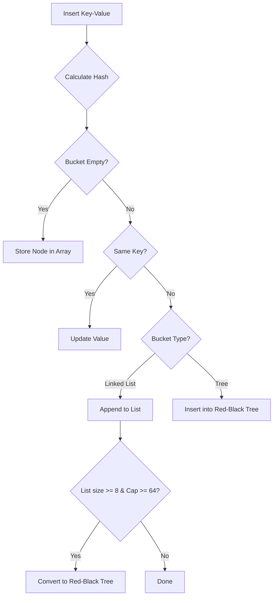
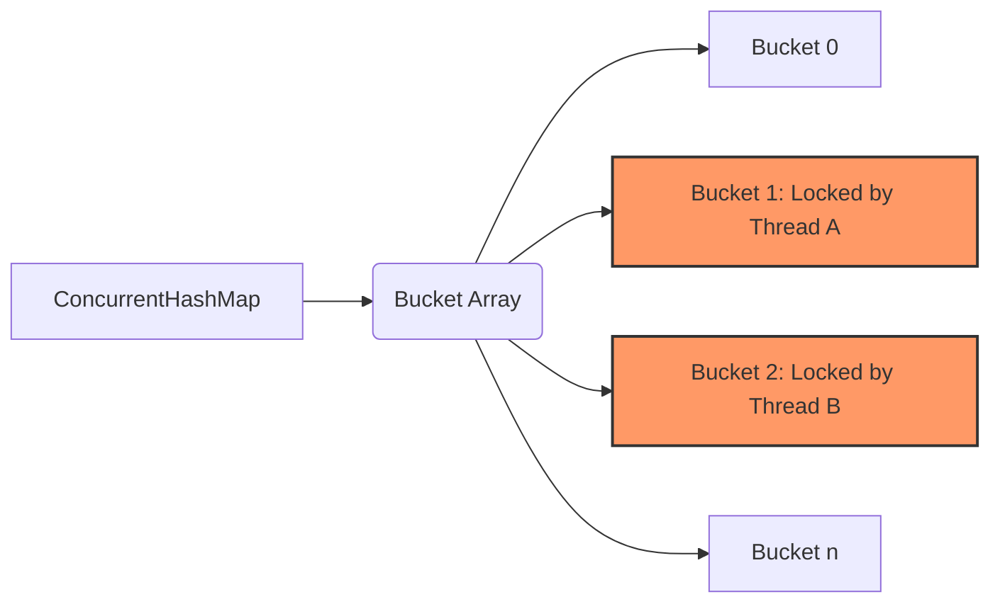

# Collections & Data Structures

## 1. How is `HashMap` implemented internally in Java 8, and what happens during a collision? <Badge type="danger" text="hard" />

::: details View Answer
In Java 8, `HashMap` is backed by an array of nodes (buckets).
When a key-value pair is inserted:
1. The `hashCode()` of the key is computed and perturbed (to reduce collisions).
2. The index in the array is calculated using `(n - 1) & hash`.
3. If the bucket is empty, a new `Node` is placed.
4. If a collision occurs (multiple keys map to the same bucket):
   - It initially uses a **Linked List** to resolve the collision.
   - If the number of nodes in a single bucket reaches the `TREEIFY_THRESHOLD` (default 8) and the total table capacity is at least `MIN_TREEIFY_CAPACITY` (default 64), the linked list is converted into a **Red-Black Tree**.
   - This improves worst-case search time from $O(n)$ to $O(\log n)$.

:::

## 2. Explain the internal working of `ConcurrentHashMap` in Java 8. How does it differ from Java 7? <Badge type="danger" text="hard" />

::: details View Answer
**Java 7:**
`ConcurrentHashMap` used **Segment-based locking** (or lock striping). The map was divided into 16 segments by default, each guarded by an independent `ReentrantLock`. This meant up to 16 threads could write concurrently.

**Java 8:**
The segment architecture was abandoned to improve concurrency. Instead, it uses **CAS (Compare-And-Swap)** operations and synchronizes only on the first node (head) of a specific bucket (bin) using the `synchronized` keyword.
- Reads are fully lock-free.
- Writes lock only the specific bucket being modified, allowing virtually unlimited concurrent writers (up to the number of buckets).
- Like `HashMap`, it uses Red-Black trees for bins that become too large.

:::

## 3. What is the difference between Fail-Fast and Fail-Safe Iterators? <Badge type="warning" text="medium" />

::: details View Answer
**Fail-Fast Iterators:**
- Fail-fast iterators operate directly on the collection itself.
- If the collection is structurally modified (elements added or removed) while iterating, it immediately throws a `ConcurrentModificationException`.
- It tracks structural changes using an internal `modCount` variable.
- Examples: Iterators for `ArrayList`, `HashMap`, `HashSet`.

**Fail-Safe (Weakly Consistent) Iterators:**
- Fail-safe iterators operate on a clone of the collection or use algorithms that can tolerate modifications.
- They do not throw `ConcurrentModificationException` if the collection is modified.
- They do not guarantee that modifications made after the iterator was created will be visible.
- Examples: Iterators for `CopyOnWriteArrayList`, `ConcurrentHashMap`.
:::

## 4. What is a `Spliterator` and how does it differ from `Iterator`? <Badge type="warning" text="medium" />

::: details View Answer
`Spliterator` (Splitable Iterator) was introduced in Java 8 to support parallel programming and the Stream API.

**Key Differences:**
- **Concurrency:** `Iterator` is designed for sequential iteration. `Spliterator` is designed to be partitioned; the `trySplit()` method splits the elements into another `Spliterator`, allowing parallel processing.
- **Characteristics:** `Spliterator` provides characteristics (e.g., `SIZED`, `ORDERED`, `DISTINCT`, `SORTED`) that allow the Stream API to optimize operations.
- **Iteration:** `Iterator` uses `hasNext()` and `next()`. `Spliterator` uses `tryAdvance(Consumer)` which combines the check and the action, and `forEachRemaining(Consumer)` for bulk operations.
:::

## 5. How does `ArrayList` grow internally? What is its Big-O performance? <Badge type="tip" text="easy" />

::: details View Answer
`ArrayList` is backed by a dynamically resizing array.
- **Default Initial Capacity:** 10 (allocated lazily on first addition).
- **Growth Strategy:** When the array is full, `ArrayList` creates a new array that is **1.5 times** the size of the old one (`oldCapacity + (oldCapacity >> 1)`). It then copies elements using `Arrays.copyOf()` (which calls native `System.arraycopy`).

**Big-O Performance:**
- **Access by index:** $O(1)$
- **Insert at end:** Amortized $O(1)$ (worst-case $O(n)$ during resizing)
- **Insert/Delete in middle:** $O(n)$ (requires shifting elements)
:::

## 6. Compare `ArrayList` and `LinkedList`. When would you choose one over the other? <Badge type="warning" text="medium" />

::: details View Answer
- **Underlying Structure:** `ArrayList` uses a dynamic array; `LinkedList` uses a doubly-linked list.
- **Access:** `ArrayList` offers $O(1)$ random access. `LinkedList` requires $O(n)$ traversal.
- **Insert/Delete:** `ArrayList` requires $O(n)$ shifts unless modifying the end. `LinkedList` offers $O(1)$ insertion/deletion *if the node reference is already known*; otherwise, finding the node takes $O(n)$.
- **Memory Overhead:** `ArrayList` has minimal overhead per element. `LinkedList` has significant overhead (node object, next/prev pointers).
- **Cache Locality:** `ArrayList` is cache-friendly because array elements are contiguous in memory. `LinkedList` nodes are scattered, leading to frequent CPU cache misses.

**Conclusion:** Use `ArrayList` for 99% of use cases. Only use `LinkedList` if you heavily insert/delete at both ends (like a Queue/Deque, though `ArrayDeque` is still generally better).
:::

## 7. How are `TreeMap` and `TreeSet` implemented? <Badge type="warning" text="medium" />

::: details View Answer
`TreeMap` is implemented using a **Red-Black Tree**, a self-balancing binary search tree.
- Keys are sorted either by their natural ordering (implementing `Comparable`) or by a provided `Comparator`.
- Performance for `get`, `put`, `remove`, and `containsKey` operations is $O(\log n)$.
- It does not allow `null` keys.

`TreeSet` is internally backed by a `TreeMap`. When you add an element to `TreeSet`, it is inserted as a key into the `TreeMap` with a dummy object as the value.
:::

## 8. Explain the internal working of `HashSet`. <Badge type="tip" text="easy" />

::: details View Answer
`HashSet` is internally backed by a `HashMap`.
- When an element is added to `HashSet`, it is placed as a **key** in the underlying `HashMap`.
- The **value** is a static dummy object (`private static final Object PRESENT = new Object();`).
- Since `HashMap` guarantees unique keys, `HashSet` inherently guarantees unique elements.
- Performance characteristics ($O(1)$ average time for add, remove, contains) are identical to `HashMap`.
:::

## 9. What is `LinkedHashMap` and how does it maintain insertion order? <Badge type="warning" text="medium" />

::: details View Answer
`LinkedHashMap` extends `HashMap` and maintains a doubly-linked list running through all its entries.
- It preserves either **insertion order** (default) or **access order** (if configured via constructor).
- This linked list defines the iteration ordering, which is normally the order in which keys were inserted.
- **LRU Cache:** By setting `accessOrder` to true and overriding the `removeEldestEntry()` method, `LinkedHashMap` can be trivially used to implement a Least Recently Used (LRU) cache.
:::

## 10. How does `PriorityQueue` work in Java? <Badge type="danger" text="hard" />

::: details View Answer
`PriorityQueue` is implemented as a **binary min-heap** (by default) backed by a dynamically resizing array.
- Elements are ordered according to their natural ordering or by a `Comparator`.
- The root of the tree (array index 0) always contains the smallest element (head of the queue).
- **Time Complexity:**
  - $O(1)$ for retrieving the head (`peek`).
  - $O(\log n)$ for enqueuing (`offer`) and dequeuing (`poll`) because it requires bubbling up/down to maintain the heap property.
  - $O(n)$ for `remove(Object)` and `contains(Object)`.
:::

## 11. What is `CopyOnWriteArrayList` and when should it be used? <Badge type="danger" text="hard" />

::: details View Answer
`CopyOnWriteArrayList` is a thread-safe variant of `ArrayList`.
- **How it works:** All mutative operations (`add`, `set`, `remove`) are implemented by creating a **fresh copy** of the underlying array. The volatile reference to the array is then updated.
- **Iterators:** Iterators operate on the snapshot of the array taken when the iterator was created. They do not throw `ConcurrentModificationException` and do not reflect modifications made to the list after the iterator was created.
- **Use Case:** It is ideal for scenarios where **reads vastly outnumber writes** (e.g., managing a list of event listeners). Writing is very expensive ($O(n)$ array copy).
:::

## 12. Compare `synchronizedMap` with `ConcurrentHashMap`. <Badge type="warning" text="medium" />

::: details View Answer
**`Collections.synchronizedMap()`:**
- Wraps any map and synchronizes every single method on a single lock (the wrapper object itself).
- Thread-safe, but highly contentious. Only one thread can read or write at a time.
- Requires manual synchronization when iterating to prevent `ConcurrentModificationException`.

**`ConcurrentHashMap`:**
- Designed for high concurrency.
- Uses fine-grained locking (locks at the bucket level) and lock-free reads.
- Multiple threads can read and write simultaneously.
- Iterators are weakly consistent and never throw `ConcurrentModificationException`.
- Much better performance in multi-threaded environments.
:::

## 13. Why is it critical to override `hashCode()` if you override `equals()`? <Badge type="tip" text="easy" />

::: details View Answer
The contract for `Object` states that if two objects are equal according to `equals()`, they **must** have the same `hashCode()`.
If you use objects as keys in hash-based collections (`HashMap`, `HashSet`) and break this contract:
1. `put()` will compute a hash code and place the object in bucket A.
2. `get()` will search for an equal object. If the equal object generates a different hash code (because `hashCode` wasn't overridden), the map will look in bucket B and fail to find the entry.
Result: You will "lose" data in your collections.
:::

## 14. What is `ArrayDeque` and why is it preferred over `Stack` and `LinkedList`? <Badge type="warning" text="medium" />

::: details View Answer
`ArrayDeque` is a resizable-array implementation of the `Deque` (Double Ended Queue) interface.
- It operates as a circular buffer.
- **Why it's better than `Stack`:** `Stack` extends `Vector`, meaning all its methods are `synchronized`, which introduces unnecessary overhead in single-threaded environments. `ArrayDeque` is not synchronized and is faster.
- **Why it's better than `LinkedList`:** While both implement `Deque`, `ArrayDeque` is much more cache-friendly due to contiguous memory allocation and doesn't incur the memory overhead of node allocation for each element.
:::

## 15. Explain `WeakHashMap` and its typical use case. <Badge type="danger" text="hard" />

::: details View Answer
`WeakHashMap` is a hash table implementation that holds **weak references** to its keys.
- If a key is no longer strongly referenced anywhere else in the application, the garbage collector is allowed to reclaim it.
- When the key is garbage collected, the corresponding key-value pair is automatically removed from the `WeakHashMap`.
- **Use Case:** It is commonly used for caching metadata about objects where the map shouldn't prevent the object from being garbage collected (e.g., keeping track of supplementary data for objects whose lifecycle is managed elsewhere).
:::

## 16. What is `IdentityHashMap` and how does it differ from `HashMap`? <Badge type="danger" text="hard" />

::: details View Answer
`IdentityHashMap` is a specialized map implementation.
- **Difference:** While `HashMap` uses the `equals()` method to compare keys, `IdentityHashMap` uses **reference equality** (`==`).
- Two keys are considered equal only if they are the exact same object instance in memory.
- It uses `System.identityHashCode()` instead of the overridden `hashCode()`.
- **Use Case:** Used in serialization/deep-copy frameworks or graph traversals to keep track of object instances already processed and detect cycles.
:::

## 17. How does lazy evaluation work in the Java Stream API? <Badge type="warning" text="medium" />

::: details View Answer
The Stream API divides operations into **Intermediate** (`filter`, `map`, `sorted`) and **Terminal** (`collect`, `forEach`, `reduce`) operations.
- **Lazy Evaluation:** Intermediate operations do not execute immediately. Instead, they build up a pipeline of operations.
- The pipeline is only executed when a terminal operation is invoked.
- This allows the JVM to optimize processing, such as fusing multiple operations (e.g., `filter` and `map` in a single pass) and short-circuiting (e.g., `findFirst()` will stop processing once the first match is found, avoiding processing the entire stream).
:::

## 18. How does `parallelStream()` work under the hood? <Badge type="danger" text="hard" />

::: details View Answer
`parallelStream()` partitions the data into multiple chunks using the `Spliterator` interface.
- It processes these chunks concurrently using the common `ForkJoinPool`.
- The common `ForkJoinPool` size is equal to the number of available CPU cores minus one (`Runtime.getRuntime().availableProcessors() - 1`).
- **Warning:** Because it uses a shared thread pool, running blocking I/O operations inside a `parallelStream()` can exhaust the pool and freeze other parallel streams in the entire JVM.
:::

## 19. Why are `EnumMap` and `EnumSet` much faster than their standard counterparts? <Badge type="warning" text="medium" />

::: details View Answer
`EnumMap` and `EnumSet` are specialized collections for enum types.
- **`EnumMap`:** Internally backed by a simple array. Since enums have a fixed size and ordinal values (0, 1, 2...), the ordinal is used directly as the array index. This provides extremely fast $O(1)$ access without calculating hashes or handling collisions.
- **`EnumSet`:** Internally represented as a single `long` primitive (a bit vector) if the enum has 64 or fewer elements (which is almost always true). Operations like union and intersection are executed using incredibly fast bitwise operations (`|`, `&`).
:::

## 20. Analyze the Time Complexity of `ConcurrentSkipListMap` vs `TreeMap`. <Badge type="danger" text="hard" />

::: details View Answer
Both implement `NavigableMap` and keep elements sorted.
- **`TreeMap`:** Uses a Red-Black tree.
  - Time complexity: $O(\log n)$ for `get`, `put`, `remove`.
  - Not thread-safe.

- **`ConcurrentSkipListMap`:** Uses a Skip List (a probabilistic data structure based on parallel linked lists with forward pointers).
  - Time complexity: Expected average $O(\log n)$ for `get`, `put`, `remove`.
  - Fully thread-safe and lock-free (uses CAS).
  - Offers better concurrency than a lock-based Red-Black tree because modifications in a skip list are localized, whereas rebalancing a Red-Black tree can require holding locks across a significant portion of the tree.
:::
