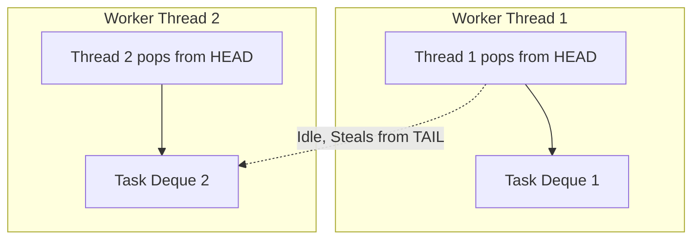
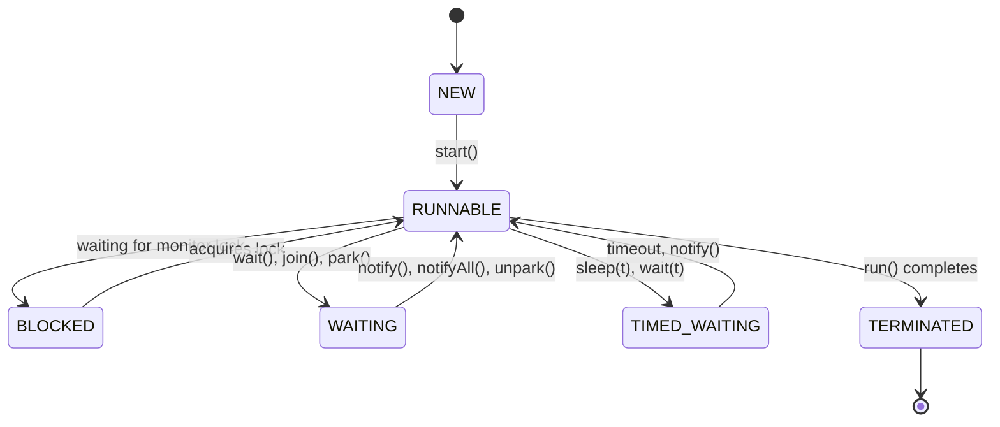

# Concurrency & Multithreading

## 1. What is the "happens-before" relationship in Java Memory Model (JMM)? <Badge type="danger" text="hard" />

::: details View Answer
The "happens-before" relationship is a guarantee provided by the Java Memory Model that ensures memory writes by one specific statement are visible to another specific statement. If action A happens-before action B, then the memory effects of A will be visible to B, and A will be executed before B in the perceived order.

Key happens-before rules include:
1. **Program Order Rule:** Each action in a single thread happens-before every action in that thread that comes later in the program order.
2. **Monitor Lock Rule:** An unlock on a monitor lock happens-before every subsequent lock on that same monitor lock.
3. **Volatile Variable Rule:** A write to a `volatile` field happens-before every subsequent read of that same `volatile` field.
4. **Thread Start Rule:** A call to `Thread.start()` happens-before any action in the started thread.
5. **Thread Termination Rule:** Any action in a thread happens-before any other thread detects that thread has terminated (e.g., via `Thread.join()`).
6. **Transitivity:** If A happens-before B, and B happens-before C, then A happens-before C.
:::

## 2. Explain how `volatile` works under the hood and when it is sufficient for thread safety. <Badge type="warning" text="medium" />

::: details View Answer
The `volatile` keyword in Java guarantees two things:
1. **Visibility:** Changes to a `volatile` variable are always visible to other threads immediately. When a thread writes to a `volatile` variable, the JMM forces the write to be flushed directly to main memory. When a thread reads a `volatile` variable, it must read it directly from main memory, bypassing the CPU cache.
2. **Ordering (Prevention of Instruction Reordering):** The compiler and the CPU are prevented from reordering instructions across volatile reads/writes. A volatile write acts as a store barrier, and a volatile read acts as a load barrier.

**When is it sufficient?**
`volatile` is sufficient ONLY when the operation on the variable is atomic. For example:
- A boolean flag used for graceful shutdown (e.g., `while (!shutdown) { ... }`).
- Reading/writing object references (assignment is atomic).

It is **NOT sufficient** for compound operations like `i++` (read-modify-write). For `i++`, you must use synchronization or `AtomicInteger`.
:::

## 3. How does `ReentrantLock` differ from `synchronized` blocks? When would you choose the former? <Badge type="warning" text="medium" />

::: details View Answer
Both `ReentrantLock` and `synchronized` provide mutually exclusive locking. However, `ReentrantLock` offers several advanced features:

1. **Fairness:** `ReentrantLock` can be constructed to be fair (`new ReentrantLock(true)`), meaning the longest-waiting thread gets the lock next. `synchronized` is always unfair.
2. **Interruptible locking:** You can use `lockInterruptibly()`, allowing a thread waiting for a lock to be interrupted, preventing deadlocks.
3. **Timeout locking:** `tryLock(long timeout, TimeUnit unit)` allows a thread to attempt acquiring a lock but give up if it cannot do so within a specified time.
4. **Non-blocking try lock:** `tryLock()` returns immediately with `true` or `false` without blocking.
5. **Multiple Condition Variables:** A `ReentrantLock` can have multiple `Condition` objects, allowing more granular wait/notify semantics compared to the single implicit monitor condition in `synchronized`.

**When to choose `ReentrantLock`:** Choose it when you need any of the advanced features listed above. If you just need simple mutual exclusion, `synchronized` is preferred because it's more readable, syntactically simpler (no need for `try-finally` blocks to unlock), and highly optimized by the JVM (lock elision/coarsening).
:::

## 4. What is a Deadlock, and how can you detect and prevent it in Java? <Badge type="warning" text="medium" />

::: details View Answer
A **Deadlock** occurs when two or more threads are blocked forever, waiting for each other to release locks.

**Necessary Conditions for Deadlock (Coffman Conditions):**
1. Mutual Exclusion
2. Hold and Wait
3. No Preemption
4. Circular Wait

**Detection:**
- **Thread Dumps:** Generating a thread dump using `jstack <pid>` or `jcmd <pid> Thread.print` will explicitly highlight deadlocked threads.
- **JConsole / VisualVM:** These JVM monitoring tools can detect deadlocks visually.
- **ThreadMXBean:** Programmatically check for deadlocks using `ManagementFactory.getThreadMXBean().findDeadlockedThreads()`.

**Prevention Strategies:**
1. **Lock Ordering:** Ensure all threads acquire locks in the exact same global order. This prevents the "Circular Wait" condition.
2. **Lock Timeout:** Use `ReentrantLock.tryLock(timeout)` instead of unconditional locking. If the timeout expires, the thread can back off and retry later, preventing "Hold and Wait."
3. **Avoid nested locks:** Don't acquire a lock while already holding another lock if possible.
:::

## 5. Compare `CountDownLatch` and `CyclicBarrier`. <Badge type="warning" text="medium" />

::: details View Answer
Both are synchronization aids used to coordinate multiple threads, but they serve different purposes.

- **CountDownLatch:**
  - Used when one or more threads need to wait for a set of operations being performed by other threads to complete.
  - Initialized with a count. Threads call `await()` to block until the count reaches zero. Other threads call `countDown()` to decrement the count.
  - **One-time use:** Once the count reaches zero, it cannot be reset.

- **CyclicBarrier:**
  - Used when a fixed number of threads must wait for each other to reach a common barrier point before they can all proceed.
  - Initialized with the number of parties (threads). Threads call `await()` and block until all parties have called `await()`.
  - **Reusable:** Once the barrier is tripped (all threads arrived), it resets automatically and can be used again.
  - Supports an optional `Runnable` action that executes once per barrier point, before the blocked threads are released.
:::

## 6. What is the Fork/Join Framework and how does its Work-Stealing algorithm operate? <Badge type="danger" text="hard" />

::: details View Answer
The **Fork/Join Framework** (`ForkJoinPool`) is designed for tasks that can be recursively split into smaller subtasks (divide-and-conquer). It implements the `ExecutorService` interface but is highly optimized for multi-processor environments.

**Work-Stealing Algorithm:**
- Every worker thread in the `ForkJoinPool` maintains its own local **double-ended queue (deque)** of tasks.
- When a task spawns a subtask (`fork()`), it pushes it onto the **head** of its own deque.
- The worker thread processes tasks from the **head** of its own deque (LIFO order, typical for recursive algorithms).
- **Stealing:** If a worker thread empties its own deque, it acts as a "thief" and randomly chooses another busy worker thread, stealing tasks from the **tail** of the victim's deque (FIFO order).

This minimizes contention because the owner operates on the head (LIFO) while thieves steal from the tail (FIFO).


:::

## 7. How does `CompletableFuture` differ from `Future`? <Badge type="warning" text="medium" />

::: details View Answer
`Future` (introduced in Java 5) represents the result of an asynchronous computation, but its API is limited:
- To get the result, you must call `.get()`, which is a **blocking** call.
- You cannot chain multiple asynchronous operations natively.
- You cannot manually complete a `Future`.

`CompletableFuture` (introduced in Java 8) implements `Future` and `CompletionStage`. It solves the limitations of `Future`:
1. **Non-blocking Callbacks:** You can attach callbacks (`thenApply`, `thenAccept`, `thenRun`) that execute when the computation completes, avoiding blocking.
2. **Chaining and Composition:** You can chain multiple asynchronous tasks sequentially (`thenCompose`) or run them in parallel and combine their results (`thenCombine`, `allOf`, `anyOf`).
3. **Manual Completion:** You can explicitly complete the future with a value (`complete()`) or an exception (`completeExceptionally()`).
4. **Exception Handling:** Provides functional exception handling via `exceptionally()`, `handle()`, and `whenComplete()`.
:::

## 8. What are Virtual Threads (Project Loom), and how do they differ from Platform Threads? <Badge type="danger" text="hard" />

::: details View Answer
**Virtual Threads** (introduced in Java 21 via Project Loom) are lightweight threads managed by the JVM rather than the OS.

- **Platform Threads:** Wrappers around OS threads. They are heavy, have large memory footprints (typically 1-2 MB stack size), and OS context switching is expensive. You cannot have millions of them; they are a scarce resource.
- **Virtual Threads:** Managed entirely by the JVM runtime. They are extremely lightweight and fast to create. You can literally create millions of them without exhausting OS memory.

**How they work:**
Virtual threads execute on top of Platform Threads (called **carrier threads**). When a Virtual Thread performs a blocking I/O operation (like network or file I/O), the JVM automatically "unmounts" the virtual thread from its carrier thread. The state of the virtual thread is saved to the heap. The carrier thread is then free to execute another virtual thread. Once the blocking operation completes, the virtual thread is scheduled back onto an available carrier thread to resume execution.

This allows writing highly scalable, high-throughput concurrent applications using the simple, familiar "thread-per-request" blocking programming model, without the overhead of traditional OS threads or the cognitive complexity of reactive programming.
:::

## 9. How do you gracefully shut down an `ExecutorService`? <Badge type="warning" text="medium" />

::: details View Answer
A standard two-phase shutdown is recommended to gracefully shut down an `ExecutorService`:

```java
void shutdownAndAwaitTermination(ExecutorService pool) {
    // Phase 1: Stop accepting new tasks
    pool.shutdown(); 
    try {
        // Wait a while for existing tasks to terminate
        if (!pool.awaitTermination(60, TimeUnit.SECONDS)) {
            // Phase 2: Cancel currently executing tasks
            pool.shutdownNow(); 
            // Wait a while for tasks to respond to being cancelled
            if (!pool.awaitTermination(60, TimeUnit.SECONDS)) {
                System.err.println("Pool did not terminate");
            }
        }
    } catch (InterruptedException ex) {
        // (Re-)Cancel if current thread also interrupted
        pool.shutdownNow();
        // Preserve interrupt status
        Thread.currentThread().interrupt();
    }
}
```

- `shutdown()`: Rejects new tasks but allows previously submitted tasks to execute.
- `shutdownNow()`: Rejects new tasks, attempts to stop currently executing tasks (via Thread interruption), and returns a list of tasks that were awaiting execution.
:::

## 10. What is a `ThreadLocal` and what are the potential memory leak issues associated with it? <Badge type="danger" text="hard" />

::: details View Answer
`ThreadLocal` provides thread-local variables. Each thread that accesses a `ThreadLocal` has its own, independently initialized copy of the variable. It's heavily used in web frameworks (e.g., storing user sessions or transaction contexts per request).

**How it works:**
Every `Thread` object contains a `ThreadLocalMap`. The keys in this map are `ThreadLocal` references (using `WeakReference`), and the values are the objects you store.

**Memory Leak Issue:**
While the *keys* are weak references, the *values* are strong references held by the `Thread` object.
In an application server (like Tomcat), threads are typically pooled. If a web application deploys, sets a value in a `ThreadLocal`, and fails to remove it (`ThreadLocal.remove()`), the pooled thread will hold a strong reference to that value forever (or until the thread dies). 

If the value belongs to the web application's classloader, this strong reference prevents the classloader (and all classes/statics it loaded) from being garbage collected upon undeployment, leading to a massive `OutOfMemoryError: Metaspace`.

**Rule:** Always call `remove()` on a `ThreadLocal` in a `finally` block when you are done using it.
:::

## 11. Explain thread states and the transitions between them. <Badge type="warning" text="medium" />

::: details View Answer
A Java thread can be in one of the following states (defined in `Thread.State` enum):

1. **NEW:** Created but `start()` has not been called.
2. **RUNNABLE:** Executing in the JVM (may be waiting for OS resources like CPU).
3. **BLOCKED:** Waiting to acquire a monitor lock (e.g., entering a `synchronized` block).
4. **WAITING:** Waiting indefinitely for another thread to perform a specific action (e.g., `Object.wait()`, `Thread.join()`, `LockSupport.park()`).
5. **TIMED_WAITING:** Waiting for another thread to perform an action for up to a specified waiting time (e.g., `Thread.sleep()`, `Object.wait(timeout)`).
6. **TERMINATED:** The run method has exited.


:::

## 12. What is False Sharing and how does `@Contended` fix it? <Badge type="danger" text="hard" />

::: details View Answer
**False Sharing** is a performance degradation issue in multiprocessor systems.
CPUs cache data in "cache lines" (typically 64 bytes). If multiple threads modify independent variables that happen to reside in the same cache line, the hardware cache coherency protocol forces the entire cache line to be invalidated across all CPUs whenever *any* variable in it is modified.
Even though the threads are operating on distinct variables, they effectively contend for the cache line, completely ruining CPU cache efficiency.

**The Fix:**
To prevent false sharing, you need to add padding bytes around highly contended variables so they reside on separate cache lines.
In Java 8+, you can use the `@jdk.internal.vm.annotation.Contended` annotation (requires `-XX:-RestrictContended` JVM flag). This instructs the JVM to automatically pad the annotated field during object layout, ensuring it sits in its own cache line, dramatically improving throughput in highly concurrent scenarios (e.g., inside `ConcurrentHashMap` or `LongAdder`).
:::

## 13. Compare `ConcurrentHashMap` to `Collections.synchronizedMap()`. <Badge type="warning" text="medium" />

::: details View Answer
`Collections.synchronizedMap()` returns a wrapper over an existing Map. All methods in the wrapper are `synchronized` on the same object (the map itself). This means only one thread can access the map at a time, creating a severe bottleneck under high contention.

`ConcurrentHashMap` is designed for massive concurrent access:
- **Java 7:** Used "lock striping." The map was divided into segments (default 16), each with its own lock. Read operations were lock-free, and write operations locked only the affected segment.
- **Java 8+:** Moved away from segments. It uses a combination of CAS (Compare-And-Swap) operations and `synchronized` blocks localized to the very specific bucket node (head of the linked list or tree) being modified.
- Reads (`get()`) are completely lock-free.
- It never throws `ConcurrentModificationException` during iteration.

Always prefer `ConcurrentHashMap` for concurrent data access.
:::

## 14. What are atomic classes (e.g., `AtomicInteger`) and how do they achieve atomicity without locks? <Badge type="danger" text="hard" />

::: details View Answer
Atomic classes (`AtomicInteger`, `AtomicReference`, etc.) in `java.util.concurrent.atomic` provide lock-free thread-safe operations on single variables.

They achieve atomicity using **Compare-And-Swap (CAS)** operations provided directly by the underlying hardware CPU instructions (e.g., `cmpxchg` on x86).

**How CAS works:**
CAS takes three arguments: a memory location, an expected old value, and a new value.
It atomically updates the memory location to the new value ONLY IF the current value in memory matches the expected old value. If it matches, it succeeds. If it doesn't match (meaning another thread modified it in the meantime), it fails.

Atomic classes use CAS inside an infinite loop (a spin-lock):
```java
public final int incrementAndGet() {
    for (;;) {
        int current = get(); // Read current value
        int next = current + 1; // Calculate new value
        if (compareAndSet(current, next)) { // CAS operation
            return next; // Success!
        }
    }
}
```
This lock-free approach avoids the context-switching overhead of OS-level locks.
:::

## 15. What is the ABA problem, and how can it be resolved? <Badge type="danger" text="hard" />

::: details View Answer
The **ABA problem** is an anomaly that occurs with lock-free synchronization (specifically CAS - Compare-And-Swap).

**Scenario:**
1. Thread T1 reads a value `A` from memory.
2. Thread T1 is suspended.
3. Thread T2 changes the value in memory from `A` to `B`.
4. Thread T2 changes the value in memory back to `A`.
5. Thread T1 wakes up, executes CAS, sees the value is still `A`, and successfully swaps it.

T1 thinks nothing has changed, but the state *did* change. This is problematic in structures like concurrent linked lists, where `A` might be a pointer to a reused/reallocated node.

**Resolution in Java:**
Java provides `AtomicStampedReference` and `AtomicMarkableReference` to solve this.
`AtomicStampedReference` pairs the object reference with an integer "stamp" (version number). When updating, both the reference and the stamp must match. Every update increments the stamp, so an A -> B -> A transition results in stamps 1 -> 2 -> 3. The CAS will fail because the stamp is now 3, not 1, detecting the ABA anomaly.
:::

## 16. What is `ReadWriteLock` and under what conditions does it boost performance? <Badge type="warning" text="medium" />

::: details View Answer
`ReadWriteLock` (typically `ReentrantReadWriteLock`) maintains a pair of locks: one for read-only operations and one for writing.

- **Read Lock:** Can be held simultaneously by multiple threads, provided no thread holds the write lock.
- **Write Lock:** Exclusive. Only one thread can hold it, and no read locks can be held at the same time.

**Performance Boost Condition:**
It only boosts performance when the data structure is **read-mostly** and operations are reasonably time-consuming. If reads vastly outnumber writes, allowing concurrent readers improves throughput over a standard exclusive lock.
However, `ReentrantReadWriteLock` has a high internal overhead. If operations are very fast or writes are frequent, a standard `ReentrantLock` often performs better due to lower overhead.

*Note: In Java 8, `StampedLock` was introduced as a faster, optimistic alternative to `ReadWriteLock`.*
:::

## 17. How does `LockSupport.park()` and `unpark()` work? <Badge type="danger" text="hard" />

::: details View Answer
`LockSupport` is the foundational concurrency utility used to build higher-level synchronizers (like `ReentrantLock` and `Semaphore` via AQS).

- `park()`: Disables the current thread for thread scheduling purposes (blocks it) unless the "permit" is available.
- `unpark(Thread thread)`: Makes the permit available for the given thread, unblocking it.

**Difference from `wait()`/`notify()`:**
1. **No Monitor Needed:** `park/unpark` do not require the thread to hold a `synchronized` monitor block.
2. **Permit System:** It works on a binary permit concept (0 or 1).
3. **No Lost Wakeups:** If `unpark()` is called *before* `park()`, the permit is granted. When the thread subsequently calls `park()`, it will consume the permit and return immediately without blocking. `notify()` before `wait()` is lost, potentially deadlocking the waiting thread.
:::

## 18. What is the AQS (AbstractQueuedSynchronizer)? <Badge type="danger" text="hard" />

::: details View Answer
`AbstractQueuedSynchronizer` (AQS) is the core framework underlying most of the synchronizers in `java.util.concurrent` (e.g., `ReentrantLock`, `CountDownLatch`, `Semaphore`, `ReentrantReadWriteLock`).

AQS provides a framework for implementing blocking locks and related synchronizers that rely on FIFO wait queues.

**Core Mechanics:**
1. **State:** It uses a single atomic `int` variable (modified via CAS) to represent the synchronization state (e.g., 0 = unlocked, 1 = locked in ReentrantLock; count in CountDownLatch).
2. **CLH Queue:** Threads that fail to acquire the lock are wrapped in "Node" objects and enqueued into a thread-safe, non-blocking FIFO linked list (a variant of the CLH lock queue).
3. **Blocking:** AQS uses `LockSupport.park()` to block threads in the queue and `LockSupport.unpark()` to wake up the head of the queue when the state changes.

Implementers of AQS only need to define the `tryAcquire()` and `tryRelease()` methods to dictate what the `int` state means for their specific logic.
:::

## 19. How do you analyze a Java Thread Dump? <Badge type="warning" text="medium" />

::: details View Answer
A thread dump is a snapshot of exactly what every thread in the JVM is doing at a specific moment.

**Steps to analyze:**
1. **Generate:** Use `jstack <pid>`, `jcmd <pid> Thread.print`, or kill -3 (Linux).
2. **Look for Deadlocks:** At the bottom of the dump, the JVM explicitly lists cycles of deadlocked threads.
3. **Analyze Thread States:**
   - **RUNNABLE:** High CPU usage? See what code is executing. Is it stuck in an infinite loop?
   - **BLOCKED:** The thread is waiting on a monitor lock. Look at the `waiting to lock <0x...>` line and find which thread currently `locked <0x...>`. That is your bottleneck.
   - **WAITING / TIMED_WAITING:** Normal for thread pools, but if business logic threads are stuck here, they might be waiting on slow downstream external services, database connection pools, or deadlocked in `CountDownLatch`/`CompletableFuture`.
4. **Identify the root cause thread:** Follow the chain of BLOCKED threads until you find the single RUNNABLE/WAITING thread holding the lock everyone else wants.
:::

## 20. What is a "Thread Leak" and how does it manifest? <Badge type="warning" text="medium" />

::: details View Answer
A **Thread Leak** occurs when an application continuously creates new threads without properly terminating old ones, or when threads are created in an unbounded manner but become permanently stuck (e.g., infinite waiting without timeouts).

**Manifestation:**
1. **`OutOfMemoryError: unable to create new native thread`**: The OS strictly limits the number of threads a user can create. Once you hit the OS limit (`ulimit -u` in Linux) or exhaust RAM for thread stacks, the JVM crashes with this error.
2. **High Memory Usage:** Each thread consumes memory outside the Java heap (typically 1MB for the call stack). Leaking threads drains native RAM.
3. **CPU Context Switching Thrashing:** Too many threads cause the OS scheduler to spend more time context-switching between threads than executing actual code, leading to system-wide CPU starvation and unresponsiveness.

**Prevention:** Never use `new Thread(Runnable).start()` directly in production code. Always use bounded `ExecutorService` thread pools, and always set timeouts on blocking network/I/O calls.
:::
