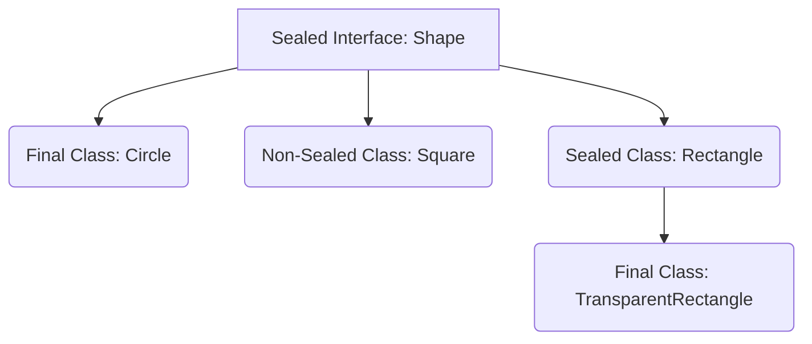
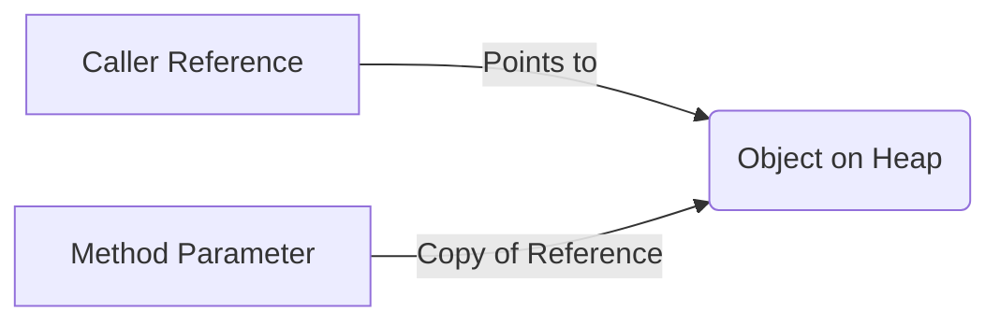

# Java Core Language

## 1. What are the key differences between a `record` and a traditional POJO class, and how does serialization work for records? <Badge type="warning" text="medium" />

::: details View Answer
A `record` (introduced in Java 14/16) is a transparent carrier for immutable data.
Key differences:
- **Immutability:** All record components are implicitly `private final`.
- **Boilerplate:** The compiler automatically generates `equals()`, `hashCode()`, `toString()`, and accessor methods.
- **Inheritance:** Records are implicitly `final` and cannot extend other classes (they extend `java.lang.Record`), but can implement interfaces.
- **Serialization:** Serialization of records relies strictly on the record's canonical constructor. It bypasses the traditional readObject/writeObject mechanisms, making it much safer against serialization vulnerabilities.
:::

## 2. Explain Pattern Matching for `switch` introduced in Java 21. How does it handle nulls and dominance? <Badge type="danger" text="hard" />

::: details View Answer
Pattern matching for `switch` (Java 21) allows a `switch` statement or expression to test a value against a series of patterns, rather than just constants.

- **Null Handling:** Historically, `switch` threw a `NullPointerException` if the selector was null. In Java 21, you can explicitly handle `null` using `case null ->`.
- **Dominance Checking:** The compiler enforces that a pattern does not "dominate" a subsequent pattern. For example, `case Object o` cannot appear before `case String s` because `Object` would catch all strings, rendering the `String` case unreachable.
- **Guard clauses:** You can use `when` clauses to add conditions to a case, e.g., `case String s when s.length() > 5 ->`.
:::

## 3. How do Sealed Classes work, and what problem do they solve? <Badge type="warning" text="medium" />

::: details View Answer
Sealed classes and interfaces restrict which other classes or interfaces may extend or implement them.



They solve the problem of exhaustiveness in domain modeling. Before sealed classes, a superclass could be extended by any arbitrary class (unless it was package-private). With `sealed`, the author explicitly defines the permitted subclasses using the `permits` clause.
When combined with pattern matching in `switch`, the compiler can check for exhaustiveness, meaning no `default` branch is needed if all permitted subclasses are covered.
:::

## 4. What is the difference between `String`, `StringBuilder`, and `StringBuffer`? How does the String Pool work in Java? <Badge type="tip" text="easy" />

::: details View Answer
- `String`: Immutable sequence of characters. Any modification creates a new object.
- `StringBuilder`: Mutable sequence of characters, not thread-safe, but faster.
- `StringBuffer`: Mutable and thread-safe (methods are synchronized), but slower due to locking overhead.

**String Pool:** A special memory region in the JVM heap that stores unique string literals. When a string literal is created, the JVM checks the pool. If it exists, a reference to the pooled instance is returned. Otherwise, a new instance is added to the pool. You can manually pool a string using `String.intern()`.
:::

## 5. How does Record Pattern Matching work in Java 21? <Badge type="danger" text="hard" />

::: details View Answer
Record patterns allow you to deconstruct a record directly in a pattern match.
Instead of doing:
```java
if (obj instanceof Point p) {
    int x = p.x();
    int y = p.y();
}
```
You can write:
```java
if (obj instanceof Point(int x, int y)) {
    System.out.println(x + y);
}
```
This can also be nested, allowing deep extraction of data from complex object graphs directly within `instanceof` or `switch` cases.
:::

## 6. What are Unnamed Variables and Patterns (Java 21/22)? <Badge type="tip" text="easy" />

::: details View Answer
Unnamed variables, denoted by an underscore `_`, allow developers to declare variables that are intentionally not used.
This is useful in:
- Exceptions: `catch (Exception _) { ... }`
- Enhanced for loops: `for (var _ : elements)`
- Record Patterns: `if (obj instanceof Point(int x, int _))`

This signals intent to the compiler and maintainers that the variable is ignored, and suppresses unused variable warnings.
:::

## 7. Explain Sequenced Collections introduced in Java 21. <Badge type="warning" text="medium" />

::: details View Answer
Java 21 introduced new interfaces (`SequencedCollection`, `SequencedSet`, `SequencedMap`) to represent collections that have a defined encounter order.
Historically, getting the last element of a `LinkedHashSet` or `List` required varying, cumbersome approaches.
Sequenced Collections provide uniform methods:
- `addFirst()`, `addLast()`
- `getFirst()`, `getLast()`
- `removeFirst()`, `removeLast()`
- `reversed()` (returns a reverse-ordered view of the collection)
:::

## 8. What is the difference between Checked and Unchecked Exceptions? Why is the distinction controversial? <Badge type="warning" text="medium" />

::: details View Answer
- **Checked Exceptions:** Inherit from `Exception` (but not `RuntimeException`). They must be declared in the method signature or handled in a `try-catch` block. They represent anticipated recoverable conditions (e.g., `IOException`).
- **Unchecked Exceptions:** Inherit from `RuntimeException`. They do not need to be declared or caught. They typically represent programming errors (e.g., `NullPointerException`).

**Controversy:** Java is one of the few languages with checked exceptions. Critics argue they lead to verbose boilerplate, empty catch blocks, and impedance mismatches when working with functional interfaces (Streams/Lambdas), which do not throw checked exceptions natively.
:::

## 9. Explain the limitations of the `var` keyword for local variable type inference. <Badge type="tip" text="easy" />

::: details View Answer
Introduced in Java 10, `var` allows the compiler to infer the type of a local variable from its initializer.
Limitations:
- It can only be used for local variables in methods. Not for fields, method parameters, or return types.
- The variable must be initialized at the time of declaration.
- It cannot be initialized with `null` directly (e.g., `var x = null;` is invalid).
- It cannot be used with array initializer shorthand without specifying the type on the right side.
:::

## 10. Does Java use pass-by-value or pass-by-reference? Explain using objects. <Badge type="warning" text="medium" />

::: details View Answer
Java is strictly **pass-by-value**.
When passing a primitive, a copy of the primitive value is passed.
When passing an object, a copy of the **reference** to the object is passed.
This means you can modify the internal state of the object being pointed to, but you cannot change the caller's reference to point to a completely different object.


:::

## 11. What is the purpose of the `Cleaner` API, and how does it relate to `finalize()`? <Badge type="danger" text="hard" />

::: details View Answer
`Object.finalize()` was historically used to perform cleanup before garbage collection. However, it was unpredictable, prone to resurrection, and caused performance issues. It was deprecated in Java 9.
The `java.lang.ref.Cleaner` API was introduced as a safer alternative. A `Cleaner` manages a set of object references and their corresponding cleaning actions. The cleaning action is executed on a separate background thread when the object becomes phantom reachable. Importantly, the cleaning action must not hold a reference to the object being cleaned, avoiding resurrection.
:::

## 12. Explain the difference between `yield` and `return` in Switch Expressions. <Badge type="tip" text="easy" />

::: details View Answer
In Java 14's switch expressions, `yield` is used to return a value from a switch block.
- `return` exits the entire method in which the switch expression is contained.
- `yield` exits only the switch expression block, providing the value to the variable the expression is assigned to.
When using the arrow syntax `->` with a single expression, `yield` is implicit. It is only explicitly required when using a block `{}` inside a `case`.
:::

## 13. What are Text Blocks in Java, and how do they handle indentation? <Badge type="tip" text="easy" />

::: details View Answer
Text Blocks (introduced in Java 15) allow multi-line string literals using `"""`.
They automatically manage incidental indentation. The compiler determines the minimum common leading whitespace on all non-blank lines and strips it from every line.
New escape sequences like `\` (to suppress a newline) and `\s` (to explicitly indicate a space and prevent trailing whitespace stripping) were also introduced to aid formatting.
:::

## 14. What is the try-with-resources statement, and what does it require of the resource? <Badge type="tip" text="easy" />

::: details View Answer
Try-with-resources (Java 7) automates the closing of resources (like files, sockets) at the end of the `try` block, preventing resource leaks.
Any object used in a try-with-resources block must implement the `java.lang.AutoCloseable` interface (or its sub-interface `java.io.Closeable`).
In Java 9+, if a resource is effectively final, it can be passed directly into the `try` clause without needing a new variable declaration.
:::

## 15. How do Default Methods in Interfaces resolve multiple inheritance conflicts? <Badge type="warning" text="medium" />

::: details View Answer
Java 8 allowed interfaces to have method implementations using `default`. If a class implements two interfaces that both provide a default method with the same signature, a compilation error occurs due to the "diamond problem".
To resolve this, the implementing class must explicitly override the method. Within the overridden method, it can choose to delegate to one of the interface implementations using `InterfaceName.super.methodName()`.
:::

## 16. What is the `instanceof` pattern matching feature introduced in Java 16? <Badge type="tip" text="easy" />

::: details View Answer
Pattern matching for `instanceof` removes the need for explicit casting after type checking.
Old way:
```java
if (obj instanceof String) {
    String s = (String) obj;
    System.out.println(s.length());
}
```
New way:
```java
if (obj instanceof String s) {
    System.out.println(s.length());
}
```
The scope of the binding variable `s` is determined by flow typing (it is only in scope where it is guaranteed to be matched).
:::

## 17. How does Java handle effectively final variables inside lambda expressions? <Badge type="warning" text="medium" />

::: details View Answer
Lambdas can capture variables from their enclosing scope, but those variables must be "effectively final"—meaning their value is never changed after initialization, even if not explicitly marked `final`.
If you attempt to modify the variable inside or outside the lambda, the compiler will throw an error. This restriction exists because lambdas might execute on different threads at different times, and capturing mutable local variables (which reside on the stack) would lead to unpredictable thread-safety issues.
:::

## 18. What are the rules for extending a Sealed Class across different packages or modules? <Badge type="danger" text="hard" />

::: details View Answer
The rules for subclasses of a sealed class depend on whether the application uses the Java Module System:
- **Unnamed Module:** The sealed class and all of its permitted subclasses must belong to the same package.
- **Named Module:** The sealed class and all of its permitted subclasses must belong to the same module (but can be in different packages within that module).
Additionally, every permitted subclass must explicitly declare itself as `final`, `sealed`, or `non-sealed`.
:::

## 19. Explain the concept of Type Erasure in Java Generics. <Badge type="danger" text="hard" />

::: details View Answer
Generics were introduced in Java 5 to provide compile-time type safety. However, to maintain backward compatibility with older Java versions, the JVM uses Type Erasure.
During compilation, all type parameters are replaced by their bounds or `Object` if unbounded. Therefore, `List<String>` and `List<Integer>` both become `List` at runtime.
This means you cannot check `obj instanceof List<String>` at runtime, nor can you instantiate generic types directly like `new T()`.
:::

## 20. How do hidden classes work in Java 15, and what are their use cases? <Badge type="danger" text="hard" />

::: details View Answer
Hidden classes are classes that cannot be used directly by the bytecode of other classes. They are designed for frameworks that generate classes dynamically at runtime and use them via reflection (e.g., lambda expressions, proxy generation in Spring or Hibernate).
Benefits:
- They are not discoverable via `Class.forName()`.
- They can be aggressively unloaded by the JVM since they are strongly tied to the ClassLoader of the defining class.
- They reduce memory footprint and improve performance for dynamically generated code.
:::
