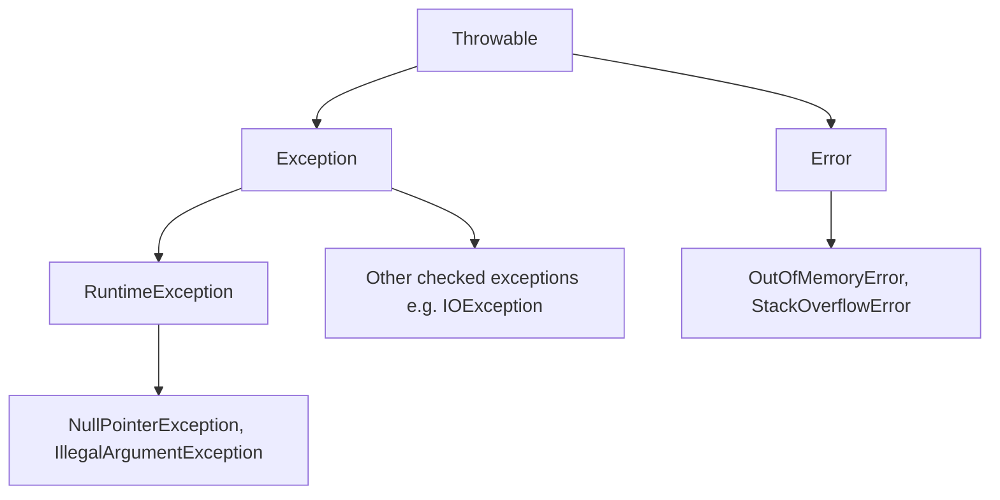

# Exceptions & Error Handling

## 1. Describe the `Throwable` class hierarchy in Java. <Badge type="tip" text="easy" />

::: details View Answer
`Throwable` is the root of everything that can be thrown with `throw` or caught with `catch`. It has two direct subclasses:



- **`Error`** — serious problems a normal application should not try to catch (`OutOfMemoryError`, `StackOverflowError`).
- **`Exception`** — conditions an application might want to handle. Its subclass `RuntimeException` marks *unchecked* exceptions; all other `Exception` subclasses are *checked*.

`Throwable` also carries the stack trace, a message, a `cause` (for chaining), and suppressed exceptions.
:::

## 2. What is the difference between checked and unchecked exceptions? <Badge type="tip" text="easy" />

::: details View Answer
- **Checked exceptions** extend `Exception` but not `RuntimeException`. The compiler forces you to either catch them or declare them with `throws`. They model recoverable, anticipated conditions (`IOException`, `SQLException`).
- **Unchecked exceptions** extend `RuntimeException`. They need no declaration and typically signal programming bugs (`NullPointerException`, `IllegalStateException`).

The check is purely a *compile-time* contract — at runtime the JVM treats both identically.
:::

## 3. What is the difference between `Error` and `Exception`? Should you ever catch an `Error`? <Badge type="warning" text="medium" />

::: details View Answer
`Error` represents abnormal conditions in the JVM itself that an application is generally not expected to recover from (heap exhaustion, stack overflow, linkage failures). `Exception` represents conditions the application can reasonably anticipate and handle.

You should almost never catch `Error`. The state of the JVM after an `OutOfMemoryError` or `StackOverflowError` is unpredictable, and attempting recovery often makes things worse. A narrow exception: top-level frameworks (servers, supervisors) may catch `Throwable` to log a fatal failure and shut down gracefully, but they should not try to *continue* normal operation.
:::

## 4. Explain how `try`/`catch`/`finally` executes, including the order of multiple `catch` blocks. <Badge type="tip" text="easy" />

::: details View Answer
- The `try` block runs first. If an exception is thrown, the JVM searches the `catch` blocks **top to bottom** for the first compatible type.
- Catch blocks must be ordered **most-specific first**; a broader type before a subtype is a compile error (unreachable catch).
- `finally` runs **always** — whether the try completed normally, threw, or even executed a `return`/`break`/`continue`. The only things that skip `finally` are `System.exit()`, JVM crash, or daemon-thread death.

```java
try {
    risky();
} catch (FileNotFoundException e) {   // specific
    ...
} catch (IOException e) {              // broader, must come after
    ...
} finally {
    cleanup();                         // always runs
}
```
:::

## 5. What is try-with-resources and what contract must a resource satisfy? <Badge type="warning" text="medium" />

::: details View Answer
Try-with-resources (Java 7) declares resources in the `try (...)` header and guarantees they are closed automatically when the block exits, in **reverse order of declaration**.

A resource must implement `java.lang.AutoCloseable` (one method, `close()`), or its subinterface `java.io.Closeable` (whose `close()` is idempotent and throws `IOException`).

```java
try (var in = Files.newInputStream(p);
     var out = Files.newOutputStream(q)) {   // out closed first, then in
    in.transferTo(out);
}
```

Since Java 9 you can list an *effectively final* variable directly in the header without re-declaring it:
```java
var conn = open();
try (conn) { ... }
```
:::

## 6. What are suppressed exceptions and where do they come from? <Badge type="danger" text="hard" />

::: details View Answer
Suppressed exceptions arise primarily from try-with-resources. If the `try` body throws an exception **and** a resource's `close()` *also* throws, Java keeps the body's exception as primary and attaches the close() exception via `Throwable.addSuppressed()`. Without this mechanism the original (usually more meaningful) exception would be silently lost.

```java
try (var r = new Noisy()) {   // close() throws
    throw new RuntimeException("primary");
}
// caller sees "primary"; the close() exception is in getSuppressed()
```

Retrieve them with `Throwable.getSuppressed()`. By contrast, a manual `finally { close(); }` that throws would *replace* and hide the original exception — one of the key reasons to prefer try-with-resources.
:::

## 7. Explain multi-catch. What restriction applies to the caught variable? <Badge type="tip" text="easy" />

::: details View Answer
Multi-catch (Java 7) lets one `catch` handle several unrelated exception types, separated by `|`, eliminating duplicated handling code:

```java
try {
    parse();
} catch (NumberFormatException | DateTimeParseException e) {
    log.warn("bad input", e);
}
```

Restrictions:
- The exception variable (`e`) is **implicitly final** — you cannot reassign it.
- The alternatives must **not** be subclasses of one another (e.g. `IOException | FileNotFoundException` is a compile error since the second is redundant).
- The static type of `e` is the least-upper-bound of the alternatives, so you can only call members common to all of them.
:::

## 8. How do you create a custom exception, and when should it be checked vs unchecked? <Badge type="warning" text="medium" />

::: details View Answer
Extend `RuntimeException` (unchecked) or `Exception` (checked) and provide constructors that forward to the superclass, including one that accepts a `cause`:

```java
public class OrderNotFoundException extends RuntimeException {
    public OrderNotFoundException(String msg)            { super(msg); }
    public OrderNotFoundException(String msg, Throwable cause) { super(msg, cause); }
}
```

Guidance:
- Prefer **unchecked** for most domain/application errors — they keep APIs clean and compose well with streams and lambdas.
- Use **checked** only when the caller can realistically recover and you want to *force* handling.
- Carry useful context (IDs, codes) as fields rather than stuffing everything into the message.
- Reuse standard exceptions (`IllegalArgumentException`, `IllegalStateException`, `UnsupportedOperationException`) when they fit instead of inventing new ones.
:::

## 9. What is exception chaining and why does it matter? <Badge type="warning" text="medium" />

::: details View Answer
Chaining wraps a low-level exception in a higher-level one while preserving the original as the **cause**, so you don't lose the root-cause stack trace when translating between abstraction layers.

```java
try {
    jdbcTemplate.query(...);
} catch (SQLException e) {
    throw new DataAccessException("failed to load user", e); // e becomes the cause
}
```

Set the cause via the `(message, cause)` constructor or `initCause()`. The printed stack trace shows `Caused by:` sections so you see both the abstract failure and the underlying technical reason. **Never** swallow the original (`throw new X(e.getMessage())` discards the cause's trace).
:::

## 10. What is exception translation and the principle behind it? <Badge type="warning" text="medium" />

::: details View Answer
Exception translation means catching a lower-layer exception and rethrowing one that is meaningful at the *current* abstraction layer (usually with the original as cause). This honors the principle that a method should not leak the implementation details of its dependencies through its exception contract.

For example, a repository interface should throw a `RepositoryException`, not a `SQLException` or `MongoException`, so callers aren't coupled to the storage technology. Spring's `DataAccessException` hierarchy is a classic example: it translates vendor-specific `SQLException`s into a consistent, unchecked hierarchy.
:::

## 11. What happens when a `return` (or exception) occurs inside both `try` and `finally`? <Badge type="danger" text="hard" />

::: details View Answer
A `return`, `break`, `continue`, or thrown exception inside `finally` **overrides** whatever the `try`/`catch` was about to do — including swallowing a pending exception:

```java
static int f() {
    try {
        return 1;            // value 1 computed and held
    } finally {
        return 2;            // OVERRIDES: method returns 2
    }
}
```

```java
static int g() {
    try {
        throw new RuntimeException("boom");
    } finally {
        return 0;            // exception is SILENTLY DISCARDED, returns 0
    }
}
```

Because of this, **never** use control-flow statements (`return`/`throw`/`break`) inside `finally`. A `finally` that throws masks the real error and is a notorious source of bugs. Keep `finally` limited to cleanup.
:::

## 12. Why is catching `Throwable` or `Exception` broadly considered an anti-pattern? <Badge type="warning" text="medium" />

::: details View Answer
- Catching `Throwable`/`Exception` also catches things you didn't intend to handle: `Error`s (OOM, stack overflow) and, critically, `InterruptedException` — swallowing the latter breaks thread cancellation.
- It hides programming bugs (`NullPointerException`) that should surface and be fixed.
- It defeats the compiler's ability to tell you what can actually be thrown.

Catch the **narrowest** type you can actually handle. If you must catch broadly at a boundary (e.g., a request handler), log with full context and either rethrow or convert to a controlled response — never an empty catch.
:::

## 13. How should `InterruptedException` be handled? <Badge type="danger" text="hard" />

::: details View Answer
`InterruptedException` signals that a blocked thread has been asked to stop. Catching it **clears** the thread's interrupt flag, so you must not swallow it. Two correct responses:

1. **Propagate** it — declare `throws InterruptedException` and let the caller decide.
2. If you cannot propagate (e.g., inside `Runnable.run()`), **restore the flag and stop**:

```java
try {
    queue.take();
} catch (InterruptedException e) {
    Thread.currentThread().interrupt(); // restore interrupt status
    return; // or break out of the loop
}
```

Swallowing it without restoring the flag means higher-level code can never learn the thread was interrupted, leading to unresponsive shutdowns.
:::

## 14. What is the cost of throwing exceptions, and how does `fillInStackTrace` relate? <Badge type="danger" text="hard" />

::: details View Answer
The expensive part of an exception is **not** the throw/catch unwinding — it's capturing the stack trace in the constructor (`fillInStackTrace()`), which walks the entire call stack. In hot paths where exceptions are used for control flow (an anti-pattern, but sometimes unavoidable), this dominates.

Mitigations:
- Override `fillInStackTrace()` to return `this` for stackless exceptions, or use the protected `Throwable(msg, cause, enableSuppression, writableStackTrace)` constructor with `writableStackTrace=false`.
- Better: don't use exceptions for ordinary control flow. Reserve them for exceptional conditions.

The JIT can also elide allocations for some implicit exceptions, but you shouldn't rely on that.
:::

## 15. List key best practices for exception handling in production code. <Badge type="warning" text="medium" />

::: details View Answer
- **Fail fast** — validate arguments early and throw `IllegalArgumentException`/`NullPointerException` (or use `Objects.requireNonNull`).
- **Catch specific** types; never empty-catch.
- **Preserve the cause** when wrapping (`new X(msg, cause)`).
- **Don't log-and-rethrow** the same exception repeatedly — it produces duplicate noise. Log once, at the boundary that handles it.
- **Don't use exceptions for control flow.**
- **Clean up with try-with-resources**, not manual `finally`.
- **Throw early, catch late** — handle where you have enough context to act.
- Include actionable context in messages (identifiers, state), but **no secrets**.
:::

## 16. What is the difference between `throw` and `throws`? <Badge type="tip" text="easy" />

::: details View Answer
- **`throw`** is a *statement* that actually raises an exception instance at runtime: `throw new IllegalArgumentException("x");`
- **`throws`** is part of a *method signature* declaring which checked exceptions the method may propagate: `void read() throws IOException`.

You `throw` an object; you declare with `throws` a type. A method can declare `throws` for unchecked exceptions too (as documentation), but it's not required.
:::

## 17. How does `Objects.requireNonNull` improve error handling? <Badge type="tip" text="easy" />

::: details View Answer
`Objects.requireNonNull(x, "x must not be null")` throws a `NullPointerException` immediately with a clear message if `x` is null, returning the value otherwise so it can be used inline:

```java
this.repo = Objects.requireNonNull(repo, "repo");
```

This **fails fast** at the boundary where the bad value enters, rather than letting `null` propagate and blow up somewhere distant and confusing. Java 14+ also adds *helpful NullPointerExceptions* that name the exact variable/expression that was null, even without explicit checks.
:::

## 18. What is the difference between recoverable and unrecoverable conditions, and how does it guide design? <Badge type="warning" text="medium" />

::: details View Answer
- **Recoverable** — the caller can take a meaningful alternative action (retry, fall back, prompt the user). Model these as exceptions (often checked, or unchecked domain exceptions) and provide enough context to recover.
- **Unrecoverable** — programming errors (precondition violations, illegal state) or fatal JVM conditions. These should propagate and crash the operation; trying to "handle" them masks bugs.

The design rule: an exception type's existence should imply that *some* caller can do something about it. If nobody can act on it, it probably indicates a bug, so prefer an unchecked exception and let it bubble to a top-level handler.
:::

## 19. How do exceptions interact with lambdas and the Stream API? <Badge type="danger" text="hard" />

::: details View Answer
Standard functional interfaces (`Function`, `Consumer`, `Supplier`) do **not** declare checked exceptions, so you cannot throw a checked exception directly from a lambda used in a stream:

```java
list.stream().map(f -> Files.readString(f)); // compile error: checked IOException
```

Common solutions:
- Wrap into an unchecked exception inside the lambda:
  ```java
  .map(f -> { try { return Files.readString(f); }
              catch (IOException e) { throw new UncheckedIOException(e); } })
  ```
- Use a custom "throwing function" wrapper that rethrows unchecked.
- Use `UncheckedIOException`, which exists specifically to bridge `IOException` into stream pipelines.

Unchecked exceptions thrown mid-stream propagate out of the terminal operation as usual, but partial side effects may already have occurred.
:::

## 20. What are assertions and how do they differ from exceptions? <Badge type="warning" text="medium" />

::: details View Answer
`assert condition : message;` checks an invariant and throws `AssertionError` if false. Key differences from exceptions:

- Assertions are **disabled by default** at runtime; you must enable them with the `-ea` JVM flag. So they must **never** be used to validate public method arguments or any condition that affects program correctness in production.
- Use them for internal invariants and developer sanity checks during testing.
- For real argument/state validation that must always run, use `IllegalArgumentException`/`IllegalStateException` or `Objects.requireNonNull` instead.
:::

## 21. What is `UncheckedIOException` and why was it introduced? <Badge type="tip" text="easy" />

::: details View Answer
`UncheckedIOException` (Java 8) wraps an `IOException` as an unchecked exception. It was introduced because the new Stream and functional APIs (e.g., `Files.lines()`, `BufferedReader.lines()`) needed to surface I/O failures from inside lambdas that cannot declare checked exceptions.

```java
Files.lines(path)            // may throw UncheckedIOException lazily during iteration
     .forEach(System.out::println);
```

Its constructor requires the original `IOException` as cause, so the root information is preserved and retrievable via `getCause()`.
:::

## 22. How should you design exception handling at API/service boundaries (e.g., a REST controller)? <Badge type="warning" text="medium" />

::: details View Answer
- Let domain code throw meaningful, typed exceptions; **don't** scatter try/catch everywhere.
- Centralize translation at the boundary — e.g., a Spring `@ControllerAdvice`/`@ExceptionHandler` mapping each exception type to an HTTP status and a structured error response.
- Map: validation/illegal-argument → 400, not-found → 404, conflict/illegal-state → 409, auth → 401/403, unexpected → 500.
- Log full detail (with cause and trace) server-side; return a **sanitized** message to the client with a correlation/trace id, never internal stack traces or secrets.
- Ensure unexpected exceptions still produce a controlled 500 rather than leaking implementation details.
:::
