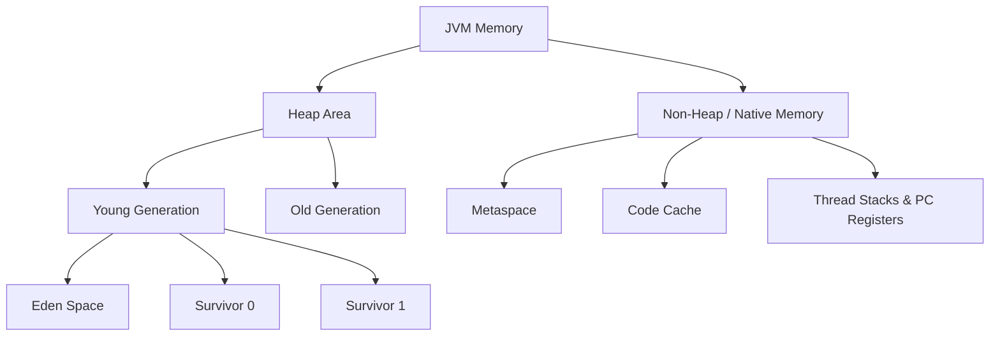
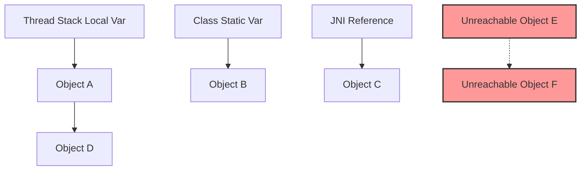

# Java Memory Model & JVM

Below is an overview of the typical JVM Memory layout.

## 1. Explain the "happens-before" relationship in the Java Memory Model. <Badge type="danger" text="hard" />

::: details View Answer
The "happens-before" relationship is a guarantee provided by the Java Memory Model (JMM) that dictates the visibility of memory operations across threads. If operation A happens-before operation B, then the results of A are guaranteed to be visible to B, and A is ordered before B. 
Key happens-before rules include:
- **Program Order Rule:** Each action in a thread happens-before every action in that thread that comes later in the program order.
- **Monitor Lock Rule:** An unlock on a monitor happens-before every subsequent lock on that same monitor.
- **Volatile Variable Rule:** A write to a volatile field happens-before every subsequent read of that volatile field.
- **Thread Start Rule:** A call to `Thread.start()` happens-before any actions in the started thread.
- **Thread Join Rule:** All actions in a thread happen-before any other thread successfully returns from a `Thread.join()` on that thread.
:::

## 2. Describe the modern JVM Memory Layout. What belongs in Heap vs Native Memory? <Badge type="warning" text="medium" />

::: details View Answer
The JVM memory is broadly divided into Heap Memory and Native (Non-Heap) Memory.
- **Heap Memory:** The runtime data area from which memory for all class instances and arrays is allocated. It is managed by the Garbage Collector. Modern GCs like G1 divide it into regions, while older GCs split it into Young (Eden, Survivor) and Old generations.
- **Native Memory:** 
  - **Metaspace:** Stores class metadata (methods, bytecode, constant pool). It uses native memory and grows dynamically.
  - **Code Cache:** Stores compiled native code (JIT compiled methods).
  - **Thread Stacks:** Each thread has a private JVM stack storing local variables, method calls, and partial results.
  - **Direct Buffers:** NIO byte buffers allocated outside the Java heap.
:::

## 3. Compare G1GC, ZGC, and Shenandoah Garbage Collectors. When would you choose one over the others? <Badge type="danger" text="hard" />

::: details View Answer
- **G1GC (Garbage-First):** The default GC since Java 9. It divides the heap into equal-sized regions and collects regions with the most garbage first. It aims for a balance between latency and throughput, targeting a configurable pause time. Best for general-purpose applications with large heaps.
- **ZGC (Z Garbage Collector):** A scalable, low-latency GC that performs expensive work concurrently with application threads. Pause times do not exceed a millisecond, regardless of heap size (up to terabytes). Best for ultra-low latency applications.
- **Shenandoah:** Similar goals to ZGC (ultra-low pause times) but implemented differently (using load reference barriers). It also performs concurrent compaction.
**Choice:** Use G1GC for most workloads. Use ZGC/Shenandoah for large heap applications where consistent ultra-low latency (sub-millisecond) is critical, at the cost of a slight throughput penalty.
:::

## 4. Why was PermGen removed and replaced with Metaspace in Java 8? <Badge type="warning" text="medium" />

::: details View Answer
PermGen (Permanent Generation) was a fixed-size contiguous memory space in the heap used to store class metadata. It frequently caused `java.lang.OutOfMemoryError: PermGen space` when applications loaded many classes dynamically (e.g., in application servers or dynamic languages) because its maximum size (`-XX:MaxPermSize`) was hard to tune.
**Metaspace** replaced it. It resides in native memory rather than the Java heap. Metaspace can auto-expand up to the available system memory (unless bounded by `-XX:MaxMetaspaceSize`), significantly reducing class-metadata OOM errors and making tuning easier.
:::

## 5. What are GC Roots in Java? Explain how the Garbage Collector uses them. <Badge type="tip" text="medium" />

::: details View Answer
GC Roots are special objects that are always reachable and cannot be garbage collected. They serve as the starting point for the Garbage Collector's reachability analysis.
Types of GC Roots include:
- **Local variables:** Objects referenced by local variables in active thread stacks.
- **Active Java threads.**
- **Static variables:** Objects referenced by static fields of loaded classes.
- **JNI References:** Objects created using Java Native Interface.

The GC traverses the object graph starting from these roots. Any object not reachable from a GC root is considered garbage and is eligible for collection.

:::

## 6. How does G1GC manage the heap differently than the Parallel GC? <Badge type="warning" text="medium" />

::: details View Answer
Unlike Parallel GC, which uses contiguous blocks of memory for Young and Old generations, G1GC partitions the heap into numerous smaller, fixed-size **regions**.
Each region can act as Eden, Survivor, or Old generation memory on the fly. 
G1 tracks the amount of live data in each region. During a collection pause, it selects a collection set of regions—prioritizing those with the most garbage (hence "Garbage First")—to reclaim memory efficiently while attempting to meet a user-defined pause-time goal (`-XX:MaxGCPauseMillis`). Furthermore, large objects are allocated in special contiguous "Humongous" regions.
:::

## 7. What is a Thread Local Allocation Buffer (TLAB)? <Badge type="danger" text="hard" />

::: details View Answer
A TLAB is a small, thread-exclusive memory area allocated in the Eden space. 
Object allocation in a multithreaded environment usually requires synchronization to avoid multiple threads claiming the same memory space. TLABs solve this by giving each thread its own buffer. Threads allocate objects sequentially within their TLAB without acquiring locks, drastically speeding up object creation. When a thread's TLAB is full, it requests a new one with proper synchronization.
:::

## 8. Explain Escape Analysis and Scalar Replacement. <Badge type="danger" text="hard" />

::: details View Answer
**Escape Analysis** is an optimization performed by the JIT compiler to determine if an object allocated inside a method "escapes" the method or thread scope (e.g., returned to the caller or assigned to a global field).
If the JIT confirms an object does not escape:
- **Scalar Replacement:** The JIT decomposes the object into its individual fields (scalars) and allocates them in CPU registers or on the thread's stack instead of the heap.
- **Lock Elision:** If the object is synchronized but doesn't escape the thread, the JIT removes the synchronization locks.
This reduces heap allocations and GC pressure.
:::

## 9. What is a Safepoint in the JVM? <Badge type="danger" text="hard" />

::: details View Answer
A safepoint is a state in which all application threads have reached a known, safe state where their execution is paused, and the JVM can safely inspect or modify their stacks and the heap.
Safepoints are required for operations like:
- Stop-The-World (STW) Garbage Collection pauses.
- JIT deoptimization.
- Thread dump generation.
- Class redefinition (e.g., hot-swapping).
Threads poll a global safepoint flag at specific points (e.g., method returns, loop back-edges). A "Time To Safepoint" (TTSP) issue occurs when a thread takes too long to reach a safepoint (e.g., a massive counted loop), delaying the GC pause for all other threads.
:::

## 10. How would you diagnose a memory leak in a production Java application? <Badge type="warning" text="medium" />

::: details View Answer
1. **Monitor Metrics:** Observe heap usage trends via APM tools, JMX, or GC logs. A sawtooth pattern with a steadily increasing baseline indicates a leak.
2. **Heap Dump:** Capture a heap dump.
   - Use `jmap -dump:live,format=b,file=heap.bin <pid>` or `jcmd <pid> GC.heap_dump heap.bin`.
   - Alternatively, configure `-XX:+HeapDumpOnOutOfMemoryError` to automatically generate a dump on crash.
3. **Analyze:** Open the dump using Eclipse Memory Analyzer Tool (MAT) or VisualVM.
   - Run the "Leak Suspects" report.
   - Look at the **Dominator Tree** to find objects retaining the most memory (Retained Heap).
   - Trace the path to GC Roots to find the reference preventing garbage collection (e.g., an unbounded `HashMap` or `ThreadLocal`).
:::

## 11. What is Java Flight Recorder (JFR) and how does it differ from traditional profiling via JMX? <Badge type="warning" text="medium" />

::: details View Answer
**JFR** is an event-based, low-overhead profiling and diagnostic framework built directly into the JVM. It records events related to JVM internals, GC, CPU, memory, and thread behavior. Because it's integrated into the JVM, its overhead is typically <2%, making it safe for continuous production use.
**Difference:** JMX primarily exposes point-in-time metrics and relies on external polling, which can introduce overhead and miss transient events. JFR records highly granular, continuous historical data which can be analyzed later using JDK Mission Control (JMC) to find memory allocations, lock contention, and network I/O bottlenecks.
:::

## 12. What is the JVM Code Cache, and what happens if it fills up? <Badge type="tip" text="medium" />

::: details View Answer
The Code Cache is an area of native memory used by the JVM to store JIT-compiled native code. 
If the Code Cache fills up (because of too many compiled methods):
- The JVM logs a warning: `CodeCache is full. Compiler has been disabled.`
- The JIT compiler is disabled, meaning no more methods will be compiled to native code.
- The application will experience severe performance degradation because it falls back to executing bytecodes via the interpreter.
You can monitor it via JMX or JFR, and increase its size using `-XX:ReservedCodeCacheSize`.
:::

## 13. What is False Sharing in Java, and how can the `@Contended` annotation help? <Badge type="danger" text="hard" />

::: details View Answer
**False Sharing** occurs when multiple threads independently modify different variables that happen to reside on the same CPU cache line (typically 64 bytes). The CPU hardware treats the cache line as a single unit, so a write by one thread invalidates the entire cache line for other threads, causing a massive performance hit due to cache coherence traffic.
The `@Contended` annotation (introduced internally in Java 8) instructs the JVM to pad the annotated field or class with empty bytes, ensuring it resides on its own CPU cache line. This isolates the variable and eliminates false sharing.
:::

## 14. Explain the semantics of the `volatile` keyword in the JMM. <Badge type="warning" text="medium" />

::: details View Answer
The `volatile` keyword guarantees two things in the Java Memory Model:
1. **Visibility:** A write to a `volatile` variable is immediately flushed to main memory, and reads bypass local thread caches to fetch directly from main memory. This ensures all threads see the most up-to-date value.
2. **Ordering (Instruction No-Reordering):** It prevents the compiler and CPU from reordering memory operations around the volatile read/write. It establishes a happens-before relationship: a write to a volatile variable happens-before all subsequent reads of that variable.
Note: `volatile` does *not* provide atomicity (e.g., `i++` is not thread-safe even if `i` is volatile).
:::

## 15. Explain the trade-off between GC Pause Time and Throughput. <Badge type="tip" text="medium" />

::: details View Answer
- **Throughput** is the percentage of total time the JVM spends executing application code versus performing garbage collection. A GC tuned for throughput (like Parallel GC) will maximize overall application work but may cause infrequent, long Stop-The-World (STW) pauses.
- **Pause Time (Latency)** is the maximum duration the application is completely halted for a GC cycle. A GC tuned for low latency (like ZGC or G1GC) performs work concurrently or in frequent, short increments. 
**Trade-off:** Lowering pause times generally requires the GC to run concurrently with the application, stealing CPU cycles and memory bandwidth, which reduces overall application throughput.
:::

## 16. How do `PhantomReference` and `ReferenceQueue` improve upon overriding the `finalize()` method? <Badge type="danger" text="hard" />

::: details View Answer
Overriding `finalize()` is deprecated and highly discouraged because it is unpredictable, severely impacts GC performance, and can resurrect objects if they pass a reference to themselves inside the finalizer.
`PhantomReference`, paired with a `ReferenceQueue`, provides a safer mechanism for post-mortem cleanup.
When the GC determines an object is only phantom-reachable, it enqueues the `PhantomReference` into the `ReferenceQueue`. A background thread can poll this queue to execute cleanup logic (like closing native file descriptors or memory). Unlike finalizers, the target object cannot be resurrected (the `get()` method of a `PhantomReference` always returns `null`), and it doesn't delay the reclamation of the object's memory.
:::

## 17. How does the Java String Pool work in modern JVMs, and what does `String.intern()` do? <Badge type="tip" text="medium" />

::: details View Answer
The String Pool is a special cache of String literals. In modern JVMs (Java 7+), it resides in the normal Heap memory (previously in PermGen). When a String literal is created (`String s = "hello"`), the JVM checks the pool; if it exists, the reference is returned, saving memory.
The `intern()` method allows dynamically created Strings (e.g., `new String("hello")`) to be added to the pool. When `intern()` is called, if the pool already contains a string equal to this `String` object, the reference from the pool is returned. Otherwise, the reference to this `String` object is added to the pool.
:::

## 18. What are Large Pages (HugePages) and how do they benefit JVM performance? <Badge type="danger" text="hard" />

::: details View Answer
Modern OS memory is divided into pages (typically 4KB). The CPU uses a Translation Lookaside Buffer (TLB) to cache mappings from virtual to physical memory addresses. For JVMs with massive heaps (e.g., 32GB+), a 4KB page size means a huge number of pages, leading to frequent TLB misses.
Large Pages (or HugePages in Linux, often 2MB or 1GB) significantly reduce the number of memory pages. This reduces the size of the page table, drastically lowers TLB misses, and improves memory access performance. You enable it in the JVM via `-XX:+UseLargePages`.
:::

## 19. What causes a `java.lang.OutOfMemoryError: Metaspace`, and how do you troubleshoot it? <Badge type="warning" text="medium" />

::: details View Answer
This error occurs when the native memory allocated for class metadata is exhausted.
**Causes:**
1. Dynamic class generation at runtime (e.g., heavy use of reflection, CGLib, ASM) without proper class unloading.
2. Memory leaks in custom ClassLoaders (e.g., hot-deploying in Tomcat without properly disposing of old application classloaders).
3. `-XX:MaxMetaspaceSize` configured too low.
**Troubleshooting:**
- Check if the application intentionally loads many classes. If so, increase `-XX:MaxMetaspaceSize`.
- Generate a heap dump and analyze it for ClassLoader leaks. Look for multiple instances of `WebappClassLoader` or framework-specific classloaders.
- Use `jcmd <pid> GC.class_stats` or `-XX:+TraceClassLoading` and `-XX:+TraceClassUnloading` to monitor class lifecycle.
:::

## 20. What is Native Memory Tracking (NMT) and how is it used? <Badge type="danger" text="hard" />

::: details View Answer
Native Memory Tracking (NMT) is a JVM feature that tracks internal memory usage for the JVM itself (excluding the Java Heap, but including Metaspace, Code Cache, Thread Stacks, and Direct Buffers).
It is essential for diagnosing OS-level memory leaks where the Java heap is stable, but the Java process's total memory footprint (RSS) keeps growing.
**Usage:**
- Start the JVM with `-XX:NativeMemoryTracking=summary` or `detail`.
- Create a baseline: `jcmd <pid> VM.native_memory baseline`.
- Later, compare current memory to the baseline: `jcmd <pid> VM.native_memory summary.diff`.
This will highlight which JVM subsystem (e.g., Compiler, Thread, Internal) is leaking native memory.
:::
