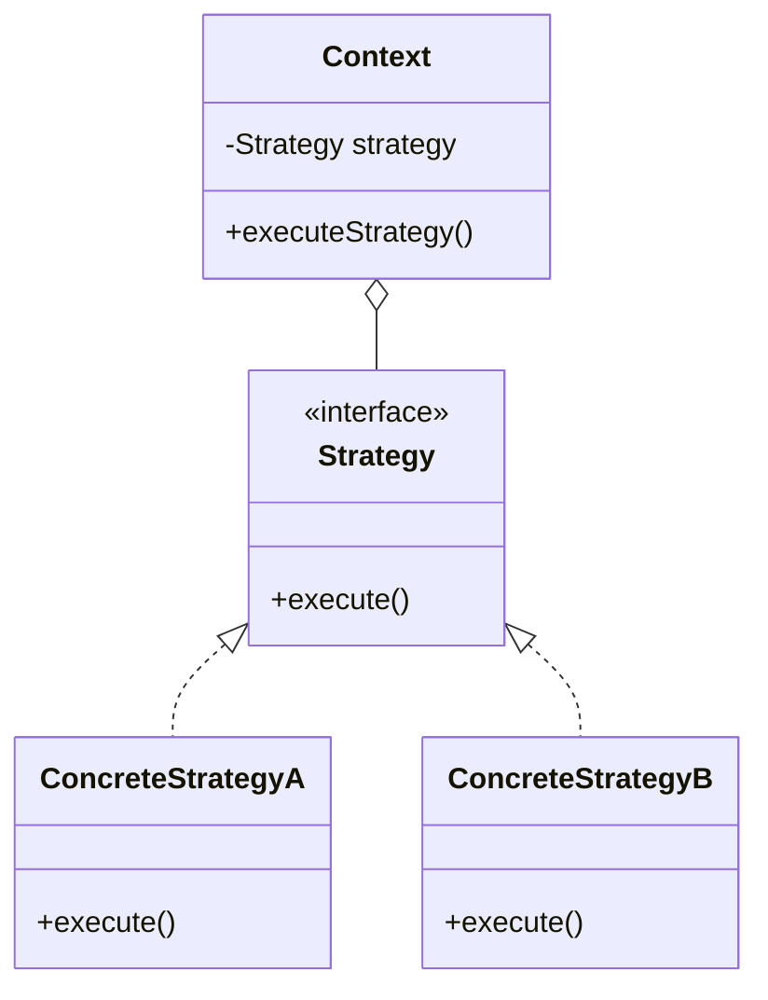
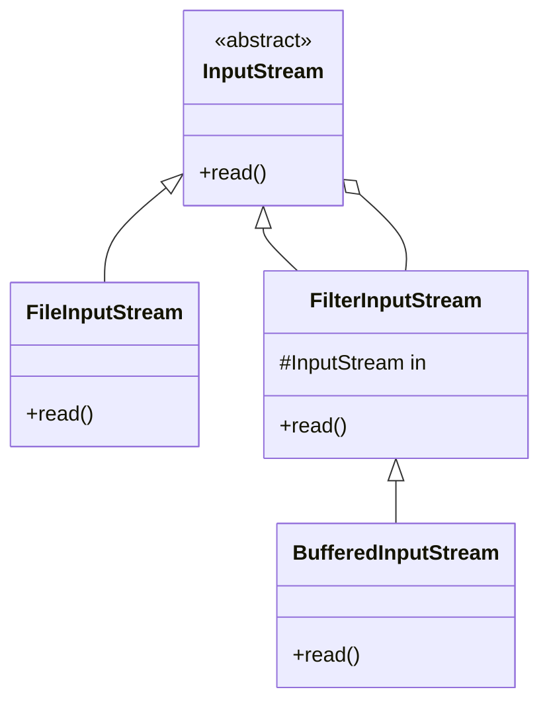

# OOP & Design Patterns

## 1. What is the Liskov Substitution Principle (LSP) and how is it violated in Java? <Badge type="danger" text="hard" />

::: details View Answer
The Liskov Substitution Principle states that objects of a superclass shall be replaceable with objects of its subclasses without breaking the application. That requires the objects of your subclasses to behave in the same way as the objects of your superclass.

A common violation in Java is the classic Rectangle-Square problem. If `Square` extends `Rectangle`, it might override `setWidth` and `setHeight` to modify both dimensions to maintain squareness. 

```java
public class Rectangle {
    private int width, height;
    public void setWidth(int width) { this.width = width; }
    public void setHeight(int height) { this.height = height; }
    public int getArea() { return width * height; }
}

public class Square extends Rectangle {
    @Override
    public void setWidth(int width) {
        super.setWidth(width);
        super.setHeight(width);
    }
    // Same for setHeight
}
```

If a client expects a `Rectangle` and sets width to 5 and height to 4, they expect an area of 20, but with a `Square` instance, the area becomes 16. This violates LSP because `Square` cannot reliably substitute `Rectangle`. To fix this, favor Composition over Inheritance, or abstract a common `Shape` interface.
:::

## 2. Compare the Strategy and State design patterns. When would you use each? <Badge type="warning" text="medium" />

::: details View Answer
Both Strategy and State patterns are behavioral patterns with similar class structures (they both encapsulate behavior behind an interface), but their intents are different.

- **Strategy Pattern**: Encapsulates a family of algorithms and makes them interchangeable. The client usually decides which strategy to pass to the context. It is used to vary the behavior of a class.
- **State Pattern**: Allows an object to alter its behavior when its internal state changes. The object will appear to change its class. State transitions are typically managed by the states themselves or the context, and clients are largely unaware of the states.



Use **Strategy** when you have different ways of doing the same thing (e.g., sorting algorithms, payment methods).
Use **State** when an object's behavior depends on its state, and it must change its behavior at runtime depending on that state (e.g., a Vending Machine, Media Player).
:::

## 3. What is the difference between Dependency Inversion Principle (DIP) and Dependency Injection (DI)? <Badge type="warning" text="medium" />

::: details View Answer
While often confused, DIP and DI are distinct concepts in software design:

- **Dependency Inversion Principle (DIP)**: A SOLID principle stating that high-level modules should not depend on low-level modules; both should depend on abstractions. Also, abstractions should not depend on details; details should depend on abstractions. It's a *design principle*.
- **Dependency Injection (DI)**: A *design pattern* and technique used to implement Inversion of Control (IoC), allowing the creation of dependent objects outside of a class and providing those objects to a class in various ways (constructor, setter, or field injection).

DIP is the architectural goal of decoupling, and DI is the mechanical means to achieve it.
:::

## 4. How do you implement a thread-safe Singleton in Java? Why is Enum Singleton preferred? <Badge type="warning" text="medium" />

::: details View Answer
Implementing a thread-safe Singleton can be done in a few ways:

1. **Eager Initialization**: Creating the instance at class loading.
2. **Double-Checked Locking**:
```java
public class Singleton {
    private static volatile Singleton instance;
    private Singleton() {}
    public static Singleton getInstance() {
        if (instance == null) {
            synchronized (Singleton.class) {
                if (instance == null) {
                    instance = new Singleton();
                }
            }
        }
        return instance;
    }
}
```
3. **Bill Pugh Singleton (Initialization-on-demand holder idiom)**: Uses a static inner helper class.
4. **Enum Singleton**:
```java
public enum EnumSingleton {
    INSTANCE;
    public void doSomething() { /* logic */ }
}
```

**Why Enum is preferred**: Enums handle serialization inherently and prevent multiple instances from being created during deserialization. They also naturally defend against reflection attacks, making it the most robust way to implement Singleton in Java according to Joshua Bloch (Effective Java).
:::

## 5. How has the Observer pattern evolved in modern Java? <Badge type="tip" text="easy" />

::: details View Answer
Traditionally, Java provided `java.util.Observer` and `java.util.Observable`, but these were deprecated in Java 9 because they were not rich enough for modern event-driven, asynchronous applications.

In modern Java, the Observer pattern is implemented using:
1. **The Flow API (Java 9+)**: `java.util.concurrent.Flow` provides interfaces (`Publisher`, `Subscriber`, `Subscription`, `Processor`) supporting reactive streams and backpressure.
2. **PropertyChangeListener**: Still widely used in JavaBeans.
3. **Modern UI/Reactive Frameworks**: Such as Project Reactor (`Flux`, `Mono`) or RxJava, which are built entirely around the observable pattern with rich functional APIs.
:::

## 6. Explain the Decorator pattern. How is it heavily utilized in Java IO? <Badge type="warning" text="medium" />

::: details View Answer
The Decorator pattern attaches additional responsibilities to an object dynamically, providing a flexible alternative to subclassing for extending functionality.

In `java.io`, you wrap streams within other streams to add features like buffering or filtering.



Example: `new BufferedInputStream(new FileInputStream("data.txt"))`. `FileInputStream` reads raw bytes. `BufferedInputStream` decorates it by reading chunks into memory to minimize disk access, adding buffering functionality without changing the `FileInputStream` class.
:::

## 7. Differentiate between Factory Method and Abstract Factory patterns. <Badge type="warning" text="medium" />

::: details View Answer
- **Factory Method**: Defines an interface for creating an object, but lets subclasses decide which class to instantiate. It uses inheritance and relies on a derived class to implement the factory method.
  *Example*: `java.util.Calendar.getInstance()` or overriding `createUIElement()` in different OS-specific factory subclasses.
  
- **Abstract Factory**: Provides an interface for creating families of related or dependent objects without specifying their concrete classes. It uses composition and typically contains multiple factory methods.
  *Example*: A `GUIFactory` with `createButton()` and `createCheckbox()` methods, having concrete implementations like `WindowsGUIFactory` and `MacGUIFactory`.
:::

## 8. Can Java 14+ Records replace the Builder pattern? <Badge type="danger" text="hard" />

::: details View Answer
Java Records provide a concise syntax for immutable data carriers. They automatically generate constructors, accessors, `equals`, `hashCode`, and `toString`.

**Records do not replace the Builder pattern entirely.**
- Records require you to pass all arguments to the constructor. If an object has 15 fields, a constructor with 15 arguments is error-prone and hard to read.
- The Builder pattern shines when dealing with many optional parameters, making instantiation fluent and readable.

However, you can combine them! You can define a Builder inside a Record:
```java
public record User(String name, int age, String email) {
    public static class Builder {
        // Builder implementation
        public User build() { return new User(name, age, email); }
    }
}
```
Records replace boilerplate POJOs, but Builder is still needed for complex construction logic.
:::

## 9. What is the Proxy pattern and how do Dynamic Proxies work in Java? <Badge type="danger" text="hard" />

::: details View Answer
The Proxy pattern provides a surrogate or placeholder for another object to control access to it (e.g., lazy loading, access control, logging).

**Java Dynamic Proxies** (`java.lang.reflect.Proxy`) allow you to dynamically create a proxy class at runtime that implements one or more interfaces. Instead of manually writing proxy classes, you provide an `InvocationHandler`.

```java
InvocationHandler handler = (proxy, method, args) -> {
    System.out.println("Before method");
    Object result = method.invoke(target, args);
    System.out.println("After method");
    return result;
};
MyInterface proxy = (MyInterface) Proxy.newProxyInstance(
    MyInterface.class.getClassLoader(),
    new Class<?>[] { MyInterface.class },
    handler
);
```
Dynamic Proxies are heavily used in frameworks like Spring (for AOP, Transactions) and Hibernate (for lazy loading entities).
:::

## 10. Why is "Composition over Inheritance" recommended in OOP? <Badge type="warning" text="medium" />

::: details View Answer
Inheritance breaks encapsulation because subclasses depend on the implementation details of their superclasses. If the superclass changes, it can easily break subclasses (the Fragile Base Class problem). Inheritance is also static at compile-time and doesn't support multiple inheritance of state in Java.

Composition delegates behavior to other objects. It allows you to change behavior at runtime (by swapping the composed objects) and keeps classes focused on single responsibilities. It results in loosely coupled, highly cohesive systems. Use inheritance only when there is a strict "is-a" relationship, and use composition for "has-a" or "uses-a" relationships.
:::

## 11. How do Lambdas simplify the Command pattern? <Badge type="tip" text="easy" />

::: details View Answer
The Command pattern encapsulates a request as an object. Traditionally, this requires creating an interface `Command` and multiple concrete classes implementing `execute()`.

With Java 8+ Lambdas, the `Command` interface acts as a Functional Interface. Instead of boilerplate classes, you can pass lambdas or method references:

```java
// Traditional
Command click = new PrintCommand();
button.onClick(click);

// With Lambdas
button.onClick(() -> System.out.println("Clicked!"));
```
This reduces the proliferation of small, single-use classes and makes the code more concise.
:::

## 12. Explain Covariance and Contravariance in Java Generics. <Badge type="danger" text="hard" />

::: details View Answer
These terms describe how type hierarchies relate to generic parameters.

- **Covariance** (`? extends T`): You can accept a generic type of `T` or any of its subclasses. You can *read* from these structures (you know it will at least be a `T`), but you cannot safely *write* to them because you don't know the exact subtype.
  *Example*: `List<? extends Number>` can hold a `List<Integer>`.
  
- **Contravariance** (`? super T`): You can accept a generic type of `T` or any of its superclasses. You can *write* to these structures (you can safely add `T` or its subclasses), but you cannot safely *read* from them as a specific type (other than `Object`).
  *Example*: `List<? super Integer>` can hold a `List<Number>`.

Remember the **PECS** rule: **P**roducer **E**xtends, **C**onsumer **S**uper.
:::

## 13. Describe the Adapter pattern. How does it differ from Facade? <Badge type="warning" text="medium" />

::: details View Answer
- **Adapter**: Converts the interface of a class into another interface the clients expect. It lets classes work together that couldn't otherwise because of incompatible interfaces. It wraps an existing class to match a target interface.
- **Facade**: Provides a simplified, higher-level interface to a complex subsystem. It doesn't modify interfaces; it provides a convenient, easy-to-use unified interface to a set of interfaces in a subsystem.

Adapter is about *making things work together* after they've been designed. Facade is about *simplifying an existing complex system*.
:::

## 14. What problem does the Facade pattern solve? Give a Java example. <Badge type="tip" text="easy" />

::: details View Answer
The Facade pattern minimizes complexity by providing a unified, simplified interface to a large body of code, such as a class library or framework. It reduces dependencies of outside code on the inner workings of a library.

**Example**: A video conversion library might have `VideoFile`, `OggCompressionCodec`, `MPEG4CompressionCodec`, `AudioMixer`, etc. The client just wants to convert a file. You create a `VideoConverterFacade` with a simple method `convertVideo(filename, format)` which handles wiring all the complex classes together internally.
:::

## 15. How does the Template Method pattern differ from the Strategy pattern? <Badge type="warning" text="medium" />

::: details View Answer
Both patterns manage algorithms, but they do it differently.

- **Template Method**: Based on *inheritance*. It defines the skeleton of an algorithm in a base abstract class and lets subclasses override specific steps without changing the algorithm's structure.
- **Strategy**: Based on *composition*. It defines a family of algorithms, encapsulates each one, and makes them interchangeable at runtime. The entire algorithm is delegated to the strategy object.

Use Template Method when you have a fixed algorithm sequence but want to alter parts of it. Use Strategy when you want to switch out the entire algorithm dynamically.
:::

## 16. Explain the Chain of Responsibility pattern. Where is it used in Java web development? <Badge type="warning" text="medium" />

::: details View Answer
The Chain of Responsibility passes a request along a chain of potential handlers until one of them handles the request or it reaches the end of the chain. This decouples the sender of a request from its receiver.

**Java Web Example**: The `javax.servlet.Filter` or Spring Security's `FilterChain`. 
When an HTTP request comes in, it passes through a chain of filters (e.g., LoggingFilter, AuthenticationFilter, AuthorizationFilter) before reaching the Servlet. Each filter can process the request, pass it down the chain (`chain.doFilter()`), or halt the chain entirely and return a response.
:::

## 17. What is the difference between an Anemic Domain Model and a Rich Domain Model? <Badge type="danger" text="hard" />

::: details View Answer
- **Anemic Domain Model**: A domain model where entities are little more than data bags (getters and setters) with no business logic. The logic is pushed into "Service" classes. It's often considered an anti-pattern in pure OOP because it separates state and behavior.
- **Rich Domain Model**: A domain model where entities contain both state and the business rules/behavior that govern that state. Services only orchestrate the flow (loading entities, calling domain methods, saving entities).

While Rich Models are truer to OOP principles, Anemic Models are very common in Java Enterprise (Spring/Hibernate) architectures due to the ease of transaction boundary management and mapping to relational databases.
:::

## 18. What is the Flyweight pattern? How does Java implement it internally? <Badge type="warning" text="medium" />

::: details View Answer
The Flyweight pattern minimizes memory usage by sharing as much data as possible with similar objects. It splits object state into intrinsic (shared, immutable) and extrinsic (context-specific, passed in).

**Java Internal Implementations**:
1. **String Pool**: String literals are cached. If you create `"hello"` multiple times, Java reuses the same memory reference.
2. **Integer Cache**: `Integer.valueOf(int)` caches values between -128 and 127. `Integer a = 100; Integer b = 100;` means `a == b` evaluates to true because they point to the same Flyweight instance.
:::

## 19. Explain the Iterator pattern. What is a `Spliterator` introduced in Java 8? <Badge type="warning" text="medium" />

::: details View Answer
The Iterator pattern provides a way to access the elements of an aggregate object sequentially without exposing its underlying representation. In Java, this is `java.util.Iterator`.

**Spliterator** (Splitable Iterator) was introduced in Java 8 to support parallel processing of streams. 
While an `Iterator` traverses elements sequentially, a `Spliterator` can traverse elements but also partition off a portion of its elements (using `trySplit()`) to create a new `Spliterator`. This allows different threads to process different parts of a collection simultaneously, enabling the power of `parallelStream()`.
:::

## 20. What is the Interface Segregation Principle (ISP)? <Badge type="tip" text="easy" />

::: details View Answer
The Interface Segregation Principle states that no client should be forced to depend on methods it does not use. Large, fat interfaces should be split into smaller, more specific ones.

**Example**: Instead of a massive `Machine` interface with `print()`, `scan()`, and `fax()`, you should create `Printer`, `Scanner`, and `Fax` interfaces. An all-in-one machine can implement all three, but a simple printer only implements `Printer`, avoiding dummy implementations of `scan()` and `fax()`.
:::
