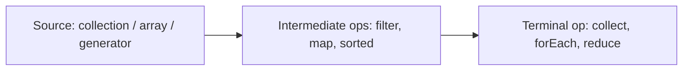

# Streams & Functional Programming

## 1. What is a lambda expression and how does it relate to functional interfaces? <Badge type="tip" text="easy" />

::: details View Answer
A **lambda** is a concise way to express an instance of a **functional interface** — an interface with exactly one abstract method (SAM).

```java
Runnable r = () -> System.out.println("run");
Comparator<String> byLen = (a, b) -> a.length() - b.length();
```

The compiler infers the parameter types from the target functional interface (target typing). A lambda is **not** simply an anonymous class:
- It captures `this` from the enclosing instance (no new `this`).
- It compiles to an `invokedynamic` call site (via `LambdaMetafactory`), not a separate `.class` file per lambda.
- It can only implement a functional interface, never a class.

Lambdas may capture **effectively final** local variables (read-only closures).
:::

## 2. What is a functional interface, and what are the key ones in `java.util.function`? <Badge type="tip" text="easy" />

::: details View Answer
A functional interface has a single abstract method; `@FunctionalInterface` documents and enforces this at compile time. `default` and `static` methods don't count against the SAM rule.

Core interfaces:
| Interface          | Signature        | Purpose            |
|--------------------|------------------|--------------------|
| `Supplier<T>`      | `() -> T`        | produce a value    |
| `Consumer<T>`      | `T -> void`      | consume a value    |
| `Function<T,R>`    | `T -> R`         | transform          |
| `Predicate<T>`     | `T -> boolean`   | test               |
| `UnaryOperator<T>` | `T -> T`         | same-type map      |
| `BiFunction<T,U,R>`| `(T,U) -> R`     | two-arg transform  |

There are primitive specializations (`IntFunction`, `ToIntFunction`, `IntPredicate`, …) to avoid boxing.
:::

## 3. What are the four kinds of method references? <Badge type="warning" text="medium" />

::: details View Answer
Method references are shorthand for lambdas that just call an existing method.

```java
// 1. Static method:           Class::staticMethod
Function<String,Integer> p = Integer::parseInt;
// 2. Instance method of a particular object:  obj::method
Consumer<String> log = System.out::println;
// 3. Instance method of an arbitrary object of a type:  Class::instanceMethod
Function<String,Integer> len = String::length;   // s -> s.length()
// 4. Constructor:             Class::new
Supplier<List<String>> make = ArrayList::new;
```

The tricky case is #3: the first lambda parameter becomes the receiver. `String::compareTo` is a `Comparator<String>` because `(a, b) -> a.compareTo(b)`.
:::

## 4. What is a stream, and how does it differ from a collection? <Badge type="tip" text="easy" />

::: details View Answer
A **stream** is a sequence of elements supporting aggregate operations; it is a pipeline of computation, not a data structure.

Differences from a collection:
- **No storage:** A stream doesn't hold elements; it pulls them from a source on demand.
- **Functional/no mutation:** Operations produce new streams; the source is untouched.
- **Lazy:** Intermediate operations build a pipeline executed only on a terminal operation.
- **Single-use:** A stream can be traversed once; reusing throws `IllegalStateException`.
- **Possibly unbounded:** `Stream.iterate`/`generate` can be infinite.

```java
long n = List.of(1,2,3,4).stream().filter(x -> x % 2 == 0).count(); // 2
```
:::

## 5. Explain the structure of a stream pipeline and the role of laziness. <Badge type="warning" text="medium" />

::: details View Answer
A pipeline has three parts:



- **Intermediate operations** (`map`, `filter`, `sorted`, `distinct`, `limit`) are **lazy** — they return a new stream and do no work until a terminal op runs.
- **Terminal operations** (`collect`, `count`, `forEach`, `reduce`, `findFirst`) trigger execution and consume the stream.

Laziness enables **fusion** (elements flow through all stages one at a time) and **short-circuiting**:
```java
Optional<Integer> first = Stream.iterate(1, n -> n + 1)
    .map(n -> n * n)
    .filter(n -> n > 50)
    .findFirst();           // stops as soon as one matches; infinite source is fine
```
:::

## 6. What is the difference between `map` and `flatMap`? <Badge type="warning" text="medium" />

::: details View Answer
- `map` applies a one-to-one transform: `Stream<T>` → `Stream<R>`.
- `flatMap` applies a one-to-many transform, mapping each element to a **stream** and then **flattening** all of them into one stream: `Stream<T>` → `Stream<R>`.

```java
List<List<Integer>> nested = List.of(List.of(1,2), List.of(3,4));
List<Integer> flat = nested.stream()
    .flatMap(List::stream)        // flatten
    .toList();                    // [1, 2, 3, 4]

List<String> words = List.of("hello", "world");
List<Character> chars = words.stream()
    .flatMap(w -> w.chars().mapToObj(c -> (char) c))
    .toList();
```

Use `flatMap` to unwrap nested collections, expand each element, or flatten `Optional`s/`Stream`s. Java 16 added `mapMulti` as a lower-allocation alternative.
:::

## 7. How does `reduce` work, and what are its three forms? <Badge type="warning" text="medium" />

::: details View Answer
`reduce` combines elements into a single result using an associative accumulator.

```java
// 1. identity + accumulator -> T
int sum = nums.stream().reduce(0, Integer::sum);

// 2. accumulator only -> Optional<T> (empty stream has no value)
Optional<Integer> max = nums.stream().reduce(Integer::max);

// 3. identity + accumulator + combiner -> U (different result type / parallel)
int totalLen = words.stream()
    .reduce(0, (acc, w) -> acc + w.length(), Integer::sum);
```

Requirements for correctness (especially in parallel):
- The **identity** must satisfy `combiner(identity, x) == x`.
- The accumulator/combiner must be **associative** and **stateless**.

The three-arg form's **combiner** merges partial results from parallel substreams; it must be consistent with the accumulator.
:::

## 8. What is `collect`, and how does the `Collector` abstraction work? <Badge type="warning" text="medium" />

::: details View Answer
`collect` is a **mutable reduction**: instead of combining immutable values, it accumulates elements into a mutable container (List, Map, StringBuilder).

A `Collector` has four parts: a **supplier** (new container), an **accumulator** (add element), a **combiner** (merge containers for parallel), and a **finisher** (transform the result).

```java
List<String> list = stream.collect(Collectors.toList());
String joined   = stream.collect(Collectors.joining(", ", "[", "]"));
Map<Boolean,List<Integer>> parts =
    nums.stream().collect(Collectors.partitioningBy(n -> n % 2 == 0));
```

Java 16+ offers `stream.toList()` as a shorthand for an **unmodifiable** list (note `Collectors.toList()` makes no immutability guarantee). You can build custom collectors with `Collector.of(...)`.
:::

## 9. How does `Collectors.groupingBy` work, including downstream collectors? <Badge type="danger" text="hard" />

::: details View Answer
`groupingBy` partitions elements into a `Map` keyed by a classifier function; an optional **downstream collector** post-processes each group.

```java
record Emp(String dept, int salary) {}
List<Emp> emps = ...;

// 1. simple: Map<String, List<Emp>>
var byDept = emps.stream().collect(groupingBy(Emp::dept));

// 2. downstream: count per dept -> Map<String, Long>
var counts = emps.stream().collect(groupingBy(Emp::dept, counting()));

// 3. nested + map values -> Map<String, Double> average salary
var avg = emps.stream()
    .collect(groupingBy(Emp::dept, averagingInt(Emp::salary)));

// 4. multi-level grouping with a map factory
var nested = emps.stream().collect(groupingBy(Emp::dept,
    TreeMap::new, mapping(Emp::salary, toList())));
```

Common downstreams: `counting()`, `mapping()`, `summingInt()`, `averagingDouble()`, `maxBy()`, `reducing()`, `filtering()` (Java 9), `teeing()` (Java 12).
:::

## 10. What are primitive streams and why do they exist? <Badge type="warning" text="medium" />

::: details View Answer
`IntStream`, `LongStream`, and `DoubleStream` operate on primitives directly, **avoiding boxing** overhead and offering numeric conveniences.

```java
int sum = IntStream.rangeClosed(1, 100).sum();        // 5050
OptionalDouble avg = IntStream.of(1,2,3).average();
IntSummaryStatistics stats = nums.stream()
    .mapToInt(Integer::intValue).summaryStatistics();  // min/max/sum/avg/count
```

Conversions:
- Object → primitive: `mapToInt`, `mapToLong`, `mapToDouble`.
- Primitive → object: `boxed()` or `mapToObj(...)`.
- Primitive → primitive: `asLongStream()`, `asDoubleStream()`.

They add terminal helpers (`sum`, `average`, `summaryStatistics`) that object streams lack, since `Stream<T>` has no notion of "sum."
:::

## 11. What is `Optional`, and what problem does it solve? <Badge type="tip" text="easy" />

::: details View Answer
`Optional<T>` is a container that may or may not hold a non-null value, used to make the *absence* of a result explicit in an API's type rather than relying on `null`.

```java
Optional<User> findUser(String id);

String name = findUser("42")
    .map(User::name)
    .filter(n -> !n.isBlank())
    .orElse("anonymous");
```

Key methods: `of`, `ofNullable`, `empty`, `isPresent`/`isEmpty`, `get` (avoid), `orElse`, `orElseGet`, `orElseThrow`, `map`, `flatMap`, `filter`, `ifPresent`, `ifPresentOrElse` (Java 9), `or` (Java 9), `stream` (Java 9).

It primarily targets **return types**; the goal is to force callers to consider the empty case.
:::

## 12. What are the anti-patterns when using `Optional`? <Badge type="warning" text="medium" />

::: details View Answer
- **Calling `get()` without checking** — defeats the purpose and risks `NoSuchElementException`. Prefer `orElse`/`orElseThrow`/`map`.
- **`Optional` fields or method parameters** — adds overhead and nullability of the Optional itself; use it for return types.
- **`Optional` in collections** — use an empty collection instead.
- **`opt.isPresent() ? opt.get() : default`** — replace with `opt.orElse(default)`.
- **`orElse(expensive())` for a costly default** — `orElse` always evaluates its argument; use `orElseGet(() -> expensive())` for lazy evaluation.

```java
// eager - createDefault() always runs:
config.orElse(createDefault());
// lazy - only runs when empty:
config.orElseGet(this::createDefault);
```
- Avoid `Optional<Optional<T>>` and serializing Optionals.
:::

## 13. What is the difference between `findFirst` and `findAny`, and between `forEach` and `forEachOrdered`? <Badge type="warning" text="medium" />

::: details View Answer
- **`findFirst`** returns the first element in encounter order; deterministic, but may need coordination in parallel.
- **`findAny`** may return any element; in parallel it can be faster because it doesn't honor order.

```java
Optional<Integer> a = list.parallelStream().filter(x -> x > 5).findAny();
```

- **`forEach`** does not guarantee order, especially in parallel.
- **`forEachOrdered`** processes elements in encounter order even in parallel (at a performance cost).

For sequential streams the pairs behave the same; the distinction matters once you go parallel. Note `forEach` should not mutate shared state — prefer `collect`/`reduce` for results.
:::

## 14. How do parallel streams work, and when should you use them? <Badge type="danger" text="hard" />

::: details View Answer
`parallelStream()` (or `.parallel()`) splits the source via a `Spliterator` and processes chunks on the shared **`ForkJoinPool.commonPool`**, then merges results.

Use them only when:
- The dataset is **large** and the per-element work is **non-trivial** (CPU-bound).
- The source **splits efficiently** (`ArrayList`, arrays, `IntStream.range` — not `LinkedList`).
- Operations are **stateless, associative, and side-effect-free**.

Pitfalls:
- Shared mutable state causes races; never `forEach` into a non-concurrent collection.
- `reduce`/`collect` need associative ops and a correct combiner.
- All parallel streams share one common pool by default — a blocking task (I/O) can starve unrelated parallel work. Wrap in a custom `ForkJoinPool` if needed.

Measure before parallelizing — overhead often outweighs gains for small or cheap workloads.
:::

## 15. What does it mean for stream operations to be stateless vs stateful? <Badge type="danger" text="hard" />

::: details View Answer
- **Stateless** operations (`map`, `filter`, `flatMap`, `peek`) process each element independently — no memory of previously seen elements.
- **Stateful** operations (`sorted`, `distinct`, `limit`, `skip`) may need to see other elements (or buffer all of them) to produce results.

Implications:
- Stateful ops can **break short-circuiting** and require buffering, increasing memory use; `sorted` on an infinite stream never terminates.
- Stateful ops can become **barriers** in parallel pipelines, hurting parallel performance.

```java
Stream.iterate(1, n -> n + 1)
    .filter(n -> n % 2 == 0)  // stateless, fine
    // .sorted()              // would hang: needs the whole (infinite) stream
    .limit(5)                 // stateful but bounded -> ok
    .forEach(System.out::println);
```
The accumulator/lambda you pass should also be stateless (no external mutable captures).
:::

## 16. What is the difference between `Stream.iterate`, `Stream.generate`, and `Stream.of`? <Badge type="warning" text="medium" />

::: details View Answer
```java
// of: fixed elements
Stream<String> a = Stream.of("x", "y", "z");

// generate: infinite, supplier-driven (no relation between elements)
Stream<Double> rnd = Stream.generate(Math::random).limit(5);

// iterate (2-arg): infinite, each element from the previous (seed, f)
Stream<Integer> pow = Stream.iterate(1, n -> n * 2).limit(10); // 1,2,4,...

// iterate (3-arg, Java 9): bounded, like a functional for-loop
Stream<Integer> upTo = Stream.iterate(0, n -> n < 100, n -> n + 10);
```

`generate` and the 2-arg `iterate` are **infinite** — you must add `limit` or a short-circuiting terminal. The 3-arg `iterate` has a built-in predicate so it terminates on its own. Use `generate` for stateless/random sources, `iterate` when each value depends on the prior one.
:::

## 17. Can a lambda capture and mutate local variables? <Badge type="warning" text="medium" />

::: details View Answer
A lambda can **capture** local variables only if they are **effectively final** (assigned once, never reassigned). It cannot mutate them.

```java
int base = 10;
Function<Integer,Integer> f = x -> x + base; // ok: base effectively final
// base = 20;  // would make the above illegal
```

To accumulate, don't fight the compiler with a one-element array or `AtomicInteger` hack inside `forEach` — use a proper reduction:

```java
// anti-pattern:
int[] sum = {0};
nums.forEach(n -> sum[0] += n);   // works sequentially, breaks in parallel

// idiomatic:
int sum = nums.stream().mapToInt(Integer::intValue).sum();
```

This restriction exists because captured variables are copied into the lambda; mutable capture would create confusing, thread-unsafe semantics.
:::

## 18. How do default and static methods on functional interfaces enable composition? <Badge type="warning" text="medium" />

::: details View Answer
Functional interfaces ship `default`/`static` helpers to combine behaviors without breaking the single-abstract-method rule.

```java
Predicate<String> nonEmpty = s -> !s.isEmpty();
Predicate<String> shortStr = s -> s.length() < 5;
Predicate<String> both = nonEmpty.and(shortStr).negate();

Function<Integer,Integer> inc = x -> x + 1;
Function<Integer,Integer> dbl = x -> x * 2;
inc.andThen(dbl).apply(3); // (3+1)*2 = 8
inc.compose(dbl).apply(3); // (3*2)+1 = 7

Comparator<Emp> cmp = Comparator
    .comparing(Emp::dept)
    .thenComparing(Emp::salary, reverseOrder());
```

`Predicate` has `and`/`or`/`negate`, `Function` has `andThen`/`compose`, `Consumer` has `andThen`, and `Comparator` has a rich fluent API — all enabling declarative composition.
:::

## 19. What is the `teeing` collector and when is it useful? <Badge type="danger" text="hard" />

::: details View Answer
`Collectors.teeing` (Java 12) feeds each element to **two** downstream collectors and merges their results with a `BiFunction` — a single-pass way to compute two aggregates at once.

```java
record Stats(long count, int sum) {}

Stats result = Stream.of(1, 2, 3, 4)
    .collect(Collectors.teeing(
        Collectors.counting(),          // -> Long
        Collectors.summingInt(i -> i),  // -> Integer
        (count, sum) -> new Stats(count, sum)));
// Stats[count=4, sum=10]

double average = Stream.of(1, 2, 3, 4)
    .collect(Collectors.teeing(
        summingDouble(i -> i), counting(),
        (sum, n) -> sum / n));          // 2.5
```

It avoids iterating the stream twice when you need, say, both a min and a max, or a sum and a count to compute an average in one pass.
:::

## 20. What is `peek`, and why should it be used carefully? <Badge type="warning" text="medium" />

::: details View Answer
`peek` is an intermediate operation that runs a `Consumer` on each element as it flows through, returning the same stream — intended mainly for **debugging/logging**.

```java
List<String> out = Stream.of("a", "b", "c")
    .peek(s -> System.out.println("before: " + s))
    .map(String::toUpperCase)
    .toList();
```

Cautions:
- Because streams are **lazy**, `peek` only runs for elements actually pulled by the terminal op. With short-circuiting (`limit`, `findFirst`) it may run fewer times than expected.
- The JVM may **skip** `peek` entirely if the result is provably unneeded (e.g. `count()` on a sized stream).
- Don't use it to mutate state or drive side effects in production — that's a `forEach` (terminal) concern.
:::

## 21. How does short-circuiting work with infinite streams? <Badge type="danger" text="hard" />

::: details View Answer
Short-circuiting terminal operations (`findFirst`, `findAny`, `anyMatch`, `allMatch`, `noneMatch`) and the intermediate `limit` can stop processing before consuming the whole stream, which makes **infinite streams** practical.

```java
// first prime above 1000, from an infinite source:
int p = IntStream.iterate(1001, n -> n + 1)
    .filter(Streams::isPrime)
    .findFirst()
    .getAsInt();

boolean any = Stream.generate(Math::random)
    .anyMatch(d -> d > 0.99);   // stops at first hit
```

`allMatch` stops at the first `false`; `anyMatch` at the first `true`. Because evaluation is element-by-element (pull-based), only as many elements as needed are generated. Combining a **stateful, non-short-circuiting** op like `sorted` with an infinite source, however, hangs forever.
:::

## 22. What is the difference between `Collectors.toMap` and `groupingBy`, and how do you handle duplicate keys? <Badge type="danger" text="hard" />

::: details View Answer
- **`toMap`** expects a **unique key per element** and maps each element to a single value. Duplicate keys throw `IllegalStateException` unless you supply a **merge function**.
- **`groupingBy`** maps each key to a **collection (or downstream reduction) of all** elements with that key — duplicates are expected.

```java
// toMap with merge function to resolve collisions:
Map<String,Integer> byName = people.stream()
    .collect(Collectors.toMap(Person::name, Person::age,
             (a, b) -> a,                 // keep first on conflict
             LinkedHashMap::new));        // optional map supplier

// groupingBy naturally handles multiples:
Map<String,List<Person>> grouped = people.stream()
    .collect(Collectors.groupingBy(Person::name));
```

Rule of thumb: use `toMap` for a true key→value index, `groupingBy` when keys repeat. Also beware `toMap` rejects `null` values (it calls `Map.merge` internally), whereas `groupingBy` values are containers.
:::
