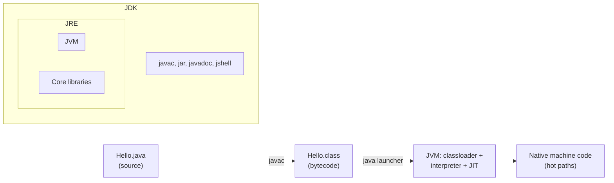
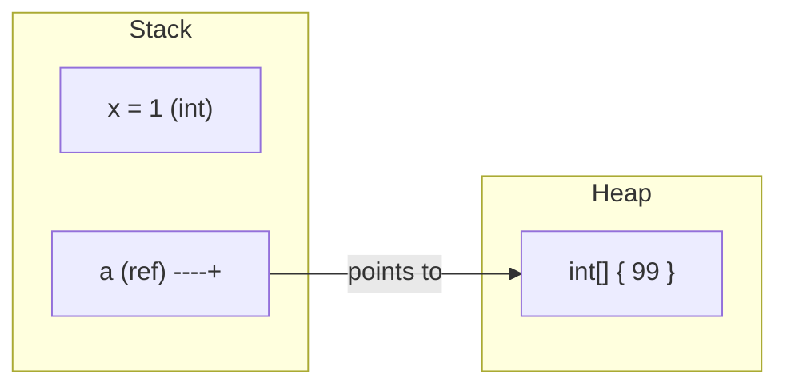

# Java Basics & Syntax

> From source to running bytecode — understand the JVM toolchain, primitives and wrappers, `var` inference, control flow, arrays, packages, and the value-vs-reference rules that trip up every newcomer.

## Mental model

Java is **compile-then-run**: `javac` turns `.java` source into platform-neutral **bytecode** (`.class`), and the **JVM** executes that bytecode, JIT-compiling hot paths to native code. The three acronyms layer up: the **JDK** (compiler + tools) contains the **JRE** (libraries + launcher) which contains the **JVM** (the execution engine). "Write once, run anywhere" works because the bytecode is the portable artifact, not the source.

At runtime your data lives in two places: the **stack** holds method frames with local variables and primitive values, while the **heap** holds objects. A reference variable sits on the stack but *points at* an object on the heap — the single most important fact for reasoning about `==`, mutation, and aliasing.



## Core concepts

### JDK, JRE, JVM and the toolchain

The **JDK** is what you install to develop: it ships `javac`, `jar`, `javadoc`, `jshell`, and (bundled) the JRE. The **JRE** is enough to *run* a program. The **JVM** is the abstract machine that loads classes, verifies bytecode, manages memory (garbage collection), and JIT-compiles. Target the LTS releases — **Java 17** and **Java 21**.

```java
// Hello.java
public class Hello {
    public static void main(String[] args) {
        System.out.println("Java " + System.getProperty("java.version"));
    }
}
```

```bash
javac Hello.java     # produces Hello.class (bytecode)
java Hello           # runs it  => Java 21.0.x

# Single-file source mode (Java 11+): compile + run in one step, no .class kept
java Hello.java      # => Java 21.0.x
```

::: tip
Single-file source mode (`java Hello.java`) is perfect for scripts and learning — no explicit `javac` step. The file may even be named differently from the class in this mode. For real projects, use a build tool (Maven/Gradle) that drives `javac` for you.
:::

### Primitive types and wrappers

Java has **eight primitives** stored by value, plus **wrapper classes** that box them into objects for use in generics and collections. Autoboxing/unboxing converts between the two automatically.

```java
// The eight primitives with their sizes
byte    b = 127;            // 8-bit
short   s = 32_000;         // 16-bit  (underscores are legal digit separators)
int     i = 1_000_000;      // 32-bit  (default for integer literals)
long    l = 9_000_000_000L; // 64-bit  (note the L suffix)
float   f = 3.14f;          // 32-bit  (note the f suffix)
double  d = 3.14159;        // 64-bit  (default for decimal literals)
char    c = 'A';            // 16-bit UTF-16 code unit  => 65 as int
boolean flag = true;        // true / false

// Wrappers + autoboxing
Integer boxed   = 42;        // autobox: int -> Integer
int     back    = boxed;     // unbox:   Integer -> int
Integer parsed  = Integer.valueOf("100");
System.out.println(Integer.MAX_VALUE);   // => 2147483647
```

::: warning
Autoboxing has two sharp edges. **(1)** Unboxing a `null` wrapper throws `NullPointerException` — `Integer x = null; int y = x;` blows up. **(2)** `==` on wrappers compares references, not values. `Integer.valueOf` caches −128..127, so `Integer a = 127, b = 127; a == b` is `true`, but at `128` it is `false`. Always use `.equals()` (or compare unboxed `int`s).
:::

### `var` — local variable type inference

Since Java 10, `var` infers a local variable's type from its initializer. The variable is still **statically typed** — this is not dynamic typing. Use it where the type is obvious from the right-hand side.

```java
var count = 10;                         // inferred int
var name  = "Ada";                      // inferred String
var list  = new ArrayList<String>();    // inferred ArrayList<String>
var entry = Map.entry("k", 42);         // inferred Map.Entry<String,Integer>

for (var s : list) { /* s is String */ }

// Illegal: no initializer to infer from, and not allowed for fields/params
// var x;            // compile error
// var y = null;     // compile error: cannot infer
```

::: info
`var` is only for **local variables** (and `for`/try-with-resources). It cannot be used for fields, method parameters, or return types. Prefer it when the initializer makes the type self-evident; spell out the type when it aids readability.
:::

### Operators and precedence

Java's operators follow C-style precedence. When in doubt, parenthesize — it costs nothing and prevents bugs.

```java
int a = 2 + 3 * 4;           // => 14  (* before +)
int b = (2 + 3) * 4;         // => 20
boolean ok = a > 10 && b < 30;   // && short-circuits: right side skipped if left false

int x = 5;
int post = x++;              // post: assign 5, then x becomes 6
int pre  = ++x;              // pre:  x becomes 7, then assign 7

// Integer division truncates; mixing with double promotes
System.out.println(7 / 2);    // => 3
System.out.println(7 / 2.0);  // => 3.5
System.out.println(7 % 3);    // => 1   (modulo)

// Ternary
String parity = (a % 2 == 0) ? "even" : "odd";   // => even
```

High-to-low (abbreviated): postfix `x++` → unary `!x ++x` → `* / %` → `+ -` → relational `< > instanceof` → equality `== !=` → `&&` → `||` → ternary `?:` → assignment `=`.

### Control flow: if, switch, loops

Modern Java has both classic `switch` statements and `switch` **expressions** with arrow labels (no fall-through, returns a value).

```java
int score = 82;
String grade;
if (score >= 90)      grade = "A";
else if (score >= 80) grade = "B";
else                  grade = "C";

// switch EXPRESSION (Java 14+): arrow labels, no break, yields a value
String day = switch (3) {
    case 1, 7 -> "weekend-ish";
    case 2, 3, 4, 5, 6 -> "weekday";
    default -> "unknown";
};                                    // => weekday

// Loops
for (int n = 0; n < 3; n++) System.out.print(n);    // => 012
int n = 0;
while (n < 3) { n++; }
do { n++; } while (n < 3);            // body runs at least once

for (String s : List.of("a", "b")) System.out.print(s);  // enhanced for => ab
```

::: tip
Prefer the **switch expression** with `->` arrows: it cannot fall through, the compiler enforces exhaustiveness for enums/sealed types, and it produces a value directly. Reserve the old `case:` + `break` form for legacy code.
:::

### Arrays

Arrays are fixed-length, zero-indexed objects living on the heap. Their length is a final field (`.length`, no parentheses). Default values are `0`/`0.0`/`false`/`null`.

```java
int[] nums = new int[3];           // {0, 0, 0}
int[] primes = {2, 3, 5, 7};       // array literal
System.out.println(primes.length); // => 4   (field, not method)
System.out.println(primes[0]);     // => 2

int[][] grid = { {1, 2}, {3, 4} }; // 2D (array of arrays)
System.out.println(grid[1][0]);    // => 3

String joined = java.util.Arrays.toString(primes); // => [2, 3, 5, 7]
int[] copy = java.util.Arrays.copyOf(primes, 6);   // padded with 0s
java.util.Arrays.sort(primes);                     // in-place sort
// primes[4] -> ArrayIndexOutOfBoundsException
```

### The `main` method, packages, and imports

Execution starts at `public static void main(String[] args)`. A **package** is a namespace mapped to a directory; **imports** bring other packages' types into scope.

```java
package com.example.app;                 // must match the folder structure

import java.util.List;                   // single type
import java.util.*;                      // whole package (avoid in production)
import static java.lang.Math.max;        // static import: use max() directly

public class App {
    public static void main(String[] args) {
        List<String> args2 = List.of(args);    // command-line args
        System.out.println(max(3, 9));         // => 9  (no Math. prefix)
    }
}
```

::: info
`java.lang` (`String`, `System`, `Math`, `Integer`...) is imported automatically — you never import it. A `public` class must live in a file matching its name (`App.java`).
:::

### Value vs reference semantics

Primitives hold their value directly; object variables hold a **reference** (a pointer) to a heap object. Java is **always pass-by-value** — but for objects, the *value passed is the reference*, so the callee can mutate the shared object while reassigning the parameter has no effect outside.

```java
static void tweak(int n, int[] arr) {
    n = 99;          // local copy — caller unaffected
    arr[0] = 99;     // mutates the shared array — caller SEES this
}

int x = 1;
int[] a = {1};
tweak(x, a);
System.out.println(x);     // => 1   (primitive copied)
System.out.println(a[0]);  // => 99  (same array object mutated)
```



### `==` vs `.equals()`

`==` compares **identity** (same object / same primitive value). `.equals()` compares **logical equality** as defined by the class. For objects, this distinction is everything.

```java
String a = new String("hi");
String b = new String("hi");
System.out.println(a == b);        // => false  (different heap objects)
System.out.println(a.equals(b));   // => true   (same characters)

String c = "hi";                   // string literal -> interned pool
String d = "hi";
System.out.println(c == d);        // => true   (same interned object)

Integer m = 1000, n = 1000;
System.out.println(m == n);        // => false  (outside cache, two objects)
System.out.println(m.equals(n));   // => true
```

::: danger
Never use `==` to compare object content — including `String`. It works "by accident" for interned literals and cached small `Integer`s, then fails silently in production with dynamic values. Use `.equals()` (or `Objects.equals(a, b)` to be null-safe).
:::

### Stack vs heap, briefly

The **stack** is per-thread, stores method frames (locals + primitives + references), and unwinds automatically when a method returns. The **heap** is shared across threads, stores all objects, and is reclaimed by the **garbage collector** when no live reference remains. A `StackOverflowError` means runaway recursion; an `OutOfMemoryError` means the heap is exhausted.

```java
static long factorial(long n) {        // each call adds a stack frame
    return n <= 1 ? 1 : n * factorial(n - 1);
}
// Deep unbounded recursion -> StackOverflowError

byte[] big = new byte[64 * 1024 * 1024];   // allocated on the heap
// Allocating without releasing references -> OutOfMemoryError
```

## Common pitfalls

- **Comparing objects with `==`.** It tests identity, not content. *Fix:* use `.equals()` or `Objects.equals()`.
- **Unboxing a `null` wrapper.** `int x = someInteger;` throws NPE if the `Integer` is null. *Fix:* check for null or keep it boxed.
- **Integer division surprise.** `1 / 2` is `0`, not `0.5`. *Fix:* make one operand a `double` (`1 / 2.0`).
- **Reassigning a parameter expecting it to escape.** Java is pass-by-value; reassigning a reference parameter does nothing to the caller. *Fix:* mutate the object or return a new value.
- **`arr.length()` vs `str.length()`.** Arrays use the field `length` (no parens); `String` uses the method `length()`. *Fix:* memorize the asymmetry.
- **Off-by-one / out-of-bounds.** Valid indices are `0` to `length - 1`. *Fix:* loop with `i < arr.length`.
- **`float` for money.** Binary floating point can't represent `0.1` exactly. *Fix:* use `BigDecimal` for currency.

## Best practices

- Target the LTS releases (17 or 21) and use modern syntax (switch expressions, `var`).
- Use `var` only where the initializer makes the type obvious; otherwise spell it out.
- Prefer `int`/`long` over wrappers in hot loops to avoid boxing overhead.
- Always compare objects with `.equals()` / `Objects.equals()`; reserve `==` for primitives and intentional identity checks.
- Use underscores in large numeric literals (`1_000_000`) for readability.
- Avoid wildcard imports (`import java.util.*`) in committed code — they hide what you depend on.
- Let a build tool (Maven/Gradle) own compilation for anything beyond a scratch file.

## Interview quick-reference

| Concept | Key point |
| --- | --- |
| JDK / JRE / JVM | Dev kit ⊃ runtime ⊃ execution engine; bytecode is the portable artifact |
| `javac` / `java` | Compile to `.class`; run by class name. `java File.java` = single-file mode |
| Primitives | 8 of them; stored by value on the stack |
| Wrappers / autoboxing | Object forms; auto-convert, but `==` compares refs and `null` unboxing NPEs |
| `var` | Local-only static type inference; needs an initializer |
| `switch` expression | Arrow labels, no fall-through, yields a value, exhaustive |
| Arrays | Fixed-length heap objects; `.length` field, 0-indexed |
| `main` | `public static void main(String[])` is the entry point |
| Packages / imports | Namespace = directory; `java.lang` auto-imported |
| Pass-by-value | Always — for objects, the reference is copied |
| `==` vs `.equals()` | Identity vs logical equality; never `==` for content |
| Stack vs heap | Frames/locals vs objects; GC reclaims the heap |

See the [interview questions](../questions/basics) for drilling.
