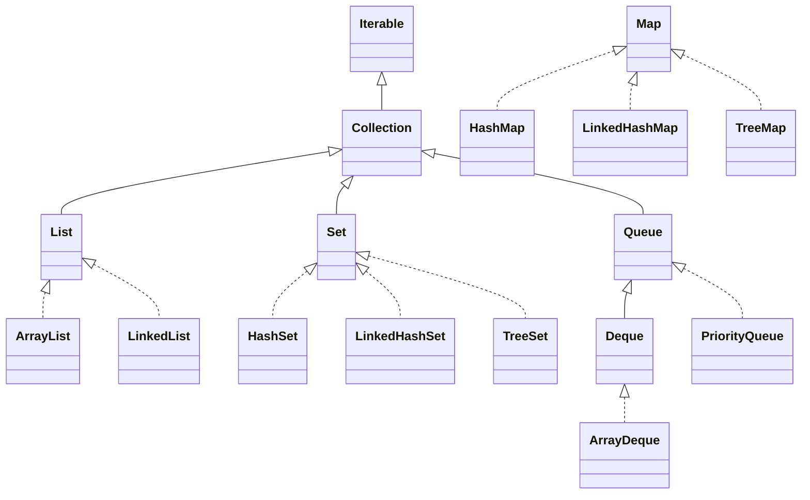
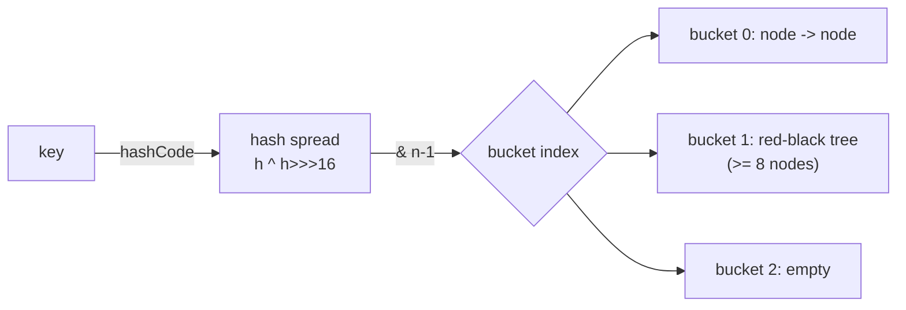

# Collections Framework

> Pick the right data structure on purpose — know the hierarchy, the Big-O, and the internals (hashing, treeification, resize) that decide whether your code is O(1) or O(n).

## Mental model

The Java Collections Framework is a set of interfaces (`Collection`, `List`, `Set`, `Queue`, `Deque`, `Map`) and a family of concrete implementations behind them. Program to the **interface**, choose the **implementation** for its performance and ordering guarantees.

Two roots: `Collection` (a group of elements) and `Map` (key→value associations — *not* a `Collection`). Under `Collection` you find:

- **List** — ordered, indexed, allows duplicates (`ArrayList`, `LinkedList`).
- **Set** — no duplicates (`HashSet`, `LinkedHashSet`, `TreeSet`).
- **Queue / Deque** — insertion/removal at ends, FIFO/LIFO (`ArrayDeque`, `LinkedList`, `PriorityQueue`).



::: info
`Map` does not extend `Collection`. It is its own hierarchy. `SortedMap`/`NavigableMap` add ordering; `SortedSet`/`NavigableSet` mirror that on the `Set` side.
:::

## Core concepts

### List: `ArrayList` vs `LinkedList`

`ArrayList` is a growable array: O(1) random access, cache-friendly, but inserting/removing in the middle shifts elements. `LinkedList` is a doubly-linked list: O(1) insert/remove *at a known node*, but O(n) to reach an index and terrible cache locality.

```java
List<String> al = new ArrayList<>();   // default capacity 10, grows ~1.5x
al.add("a");
al.add("b");
al.add(1, "x");          // shifts "b" right
System.out.println(al);  // => [a, x, b]
System.out.println(al.get(0)); // => a  (O(1))

List<Integer> ll = new LinkedList<>();
ll.add(1); ll.add(2);
System.out.println(ll.get(1)); // => 2  (O(n) — walks the chain)
```

::: tip
Use `ArrayList` ~99% of the time. `LinkedList` only pays off as a `Deque`/queue with heavy head/tail churn — and even there `ArrayDeque` is usually faster. Pre-size with `new ArrayList<>(expectedSize)` to avoid repeated resizes.
:::

### Set: `HashSet`, `LinkedHashSet`, `TreeSet`

All reject duplicates; they differ in ordering and cost.

```java
Set<String> hash = new HashSet<>();        // no order, O(1) add/contains
Set<String> linked = new LinkedHashSet<>();// insertion order, O(1)
Set<String> tree = new TreeSet<>();        // sorted order, O(log n)

for (var s : List.of("b", "a", "c", "a")) { hash.add(s); linked.add(s); tree.add(s); }
System.out.println(linked); // => [b, a, c]   (insertion order, dup dropped)
System.out.println(tree);   // => [a, b, c]   (sorted)
```

`HashSet` is backed by a `HashMap` (elements are keys, a dummy value fills the slot). `TreeSet` is backed by a red-black tree and needs elements to be `Comparable` or a `Comparator`.

### `HashMap` internals

A `HashMap` is an array of **buckets**. A key's `hashCode()` is spread (`h ^ (h >>> 16)`) to mix high bits, then `& (n-1)` selects a bucket. Collisions chain in a **linked list**; once a single bucket exceeds **8 nodes** (and the table is ≥ 64), it **treeifies** into a red-black tree, turning worst-case lookup from O(n) to O(log n).



**Load factor** (default 0.75) is the fill threshold: when `size > capacity * loadFactor`, the table **resizes** (doubles) and rehashes everything. Default capacity is 16, so resize happens at 12 entries.

```java
Map<String, Integer> m = new HashMap<>();
m.put("a", 1);
m.merge("a", 10, Integer::sum);          // => a -> 11
m.computeIfAbsent("b", k -> 0);          // => b -> 0
m.getOrDefault("z", -1);                 // => -1 (no mutation)
System.out.println(m);                   // => {a=11, b=0}
```

::: warning
A key's `hashCode`/`equals` must be **stable** while it's in the map, and equal objects must have equal hash codes. Mutating a key after insertion (so its hash changes) makes the entry unreachable. Prefer immutable keys (`String`, `record`, boxed numbers).
:::

::: tip
Size up front: `new HashMap<>(expected / 0.75 + 1)` (or `HashMap.newHashMap(expected)` in Java 19+) avoids mid-build resizes.
:::

### `LinkedHashMap` and LRU caches

`LinkedHashMap` keeps a doubly-linked list across entries, giving predictable iteration order — insertion order by default, or **access order** when constructed with `accessOrder=true`. Override `removeEldestEntry` for a tiny LRU cache.

```java
class LruCache<K, V> extends LinkedHashMap<K, V> {
    private final int cap;
    LruCache(int cap) { super(16, 0.75f, true); this.cap = cap; } // access order
    @Override protected boolean removeEldestEntry(Map.Entry<K, V> e) {
        return size() > cap;
    }
}

var cache = new LruCache<Integer, String>(2);
cache.put(1, "a"); cache.put(2, "b");
cache.get(1);            // 1 becomes most-recently-used
cache.put(3, "c");      // evicts 2 (least recently used)
System.out.println(cache.keySet()); // => [1, 3]
```

### `TreeMap` and `NavigableMap`

`TreeMap` keeps keys **sorted** and exposes range/navigation queries in O(log n): `floorKey`, `ceilingKey`, `headMap`, `tailMap`, `subMap`, `firstEntry`/`lastEntry`.

```java
NavigableMap<Integer, String> tm = new TreeMap<>();
tm.put(10, "a"); tm.put(20, "b"); tm.put(30, "c");
System.out.println(tm.floorKey(25));   // => 20  (largest key <= 25)
System.out.println(tm.ceilingKey(25)); // => 30  (smallest key >= 25)
System.out.println(tm.headMap(20));    // => {10=a}  (keys < 20)
System.out.println(tm.firstEntry());   // => 10=a
```

### Queue, Deque, and `PriorityQueue`

`Queue` is FIFO; `Deque` is a double-ended queue usable as both stack and queue. Prefer `ArrayDeque` over the legacy `Stack` (synchronized, array-backed via `Vector`) and over `LinkedList`.

```java
Deque<Integer> stack = new ArrayDeque<>();
stack.push(1); stack.push(2);
System.out.println(stack.pop());      // => 2 (LIFO)

Queue<Integer> q = new ArrayDeque<>();
q.offer(1); q.offer(2);
System.out.println(q.poll());         // => 1 (FIFO)

PriorityQueue<Integer> pq = new PriorityQueue<>(Comparator.reverseOrder());
pq.addAll(List.of(3, 1, 2));
System.out.println(pq.poll());        // => 3 (max-heap via reverse comparator)
```

::: info
`PriorityQueue` is a binary heap: O(log n) insert/poll, O(1) peek. Its iterator does **not** visit elements in priority order — only `poll()` does.
:::

### Iterators: fail-fast vs fail-safe

Most `java.util` collections are **fail-fast**: structurally modifying them during iteration (except via the iterator's own `remove`) throws `ConcurrentModificationException`. Concurrent collections like `CopyOnWriteArrayList` and `ConcurrentHashMap` are **fail-safe** (weakly consistent) — they iterate over a snapshot or tolerate concurrent change.

```java
List<Integer> list = new ArrayList<>(List.of(1, 2, 3, 4));

// WRONG: throws ConcurrentModificationException
// for (Integer n : list) if (n % 2 == 0) list.remove(n);

list.removeIf(n -> n % 2 == 0);       // correct, safe bulk removal
System.out.println(list);             // => [1, 3]

Iterator<Integer> it = list.iterator();
while (it.hasNext()) { if (it.next() == 1) it.remove(); } // iterator.remove OK
System.out.println(list);             // => [3]
```

### `Comparable` vs `Comparator`

`Comparable` defines a type's **natural order** via `compareTo` (one ordering, baked into the class). `Comparator` is an **external** strategy — many orderings, composable, no source access needed.

```java
record Person(String name, int age) implements Comparable<Person> {
    public int compareTo(Person o) { return Integer.compare(age, o.age); } // natural: by age
}

var people = new ArrayList<>(List.of(
    new Person("Bo", 30), new Person("Al", 30), new Person("Cy", 25)));

people.sort(null);                                   // natural order: by age
var byNameThenAge = Comparator.comparing(Person::name)
                              .thenComparing(Person::age);
people.sort(byNameThenAge.reversed());
System.out.println(people.stream().map(Person::name).toList());
// => [Cy, Bo, Al]
```

::: warning
Keep `compareTo`/`compare` **consistent with `equals`**. If `a.compareTo(b) == 0` but `!a.equals(b)`, a `TreeSet`/`TreeMap` will treat them as duplicates and silently drop one — even if a `HashSet` would keep both.
:::

### Immutable and unmodifiable collections

`List.of`, `Set.of`, `Map.of` (Java 9+) build compact **immutable** collections — null-hostile and throwing on mutation. `Collections.unmodifiableList` wraps an existing list as a read-only **view** (the backing list can still change).

```java
List<Integer> imm = List.of(1, 2, 3);
// imm.add(4);   -> UnsupportedOperationException

List<Integer> backing = new ArrayList<>(List.of(1, 2));
List<Integer> view = Collections.unmodifiableList(backing);
backing.add(3);
System.out.println(view);             // => [1, 2, 3] (view reflects backing!)

List<Integer> copy = List.copyOf(backing); // true defensive snapshot
```

### Choosing the right collection — Big-O

| Collection | get/contains | add | remove | next/iterate | ordering |
| --- | --- | --- | --- | --- | --- |
| `ArrayList` | O(1) index / O(n) search | O(1)* amortized | O(n) | O(1) | insertion |
| `LinkedList` | O(n) | O(1) ends | O(1) at node | O(1) | insertion |
| `HashSet`/`HashMap` | O(1) avg | O(1) avg | O(1) avg | O(capacity) | none |
| `LinkedHashSet`/`Map` | O(1) avg | O(1) avg | O(1) avg | O(n) | insertion/access |
| `TreeSet`/`TreeMap` | O(log n) | O(log n) | O(log n) | O(n) | sorted |
| `ArrayDeque` | O(n) search | O(1) ends | O(1) ends | O(1) | insertion |
| `PriorityQueue` | O(n) contains | O(log n) | O(log n) poll | O(n) | heap |

*Amortized — individual adds can trigger an O(n) resize.

## Common pitfalls

- **Removing during a for-each** — throws `ConcurrentModificationException`; use `Iterator.remove` or `removeIf`.
- **Mutable keys** — changing a key's hash/state after insertion loses the entry.
- **`compareTo` inconsistent with `equals`** — `TreeSet`/`TreeMap` drop "equal" elements.
- **`Arrays.asList(...)` is fixed-size** — `add`/`remove` throw; wrap in `new ArrayList<>(...)` to grow.
- **`List.of(...)` rejects nulls** and is immutable — don't reach for it when you need mutation.
- **Default `HashMap` capacity then bulk-loading** — repeated resizes; size up front.
- **Using `Stack`/`Vector`** — legacy synchronized classes; prefer `ArrayDeque`/`ArrayList`.
- **Boxing in hot loops** — `Map<Integer, Integer>` boxes every key/value; consider primitive-specialized libraries for tight numeric code.

## Best practices

- Declare variables by interface (`List`, `Map`), construct the concrete type.
- Default to `ArrayList`, `HashMap`, `HashSet`, `ArrayDeque` — reach for others only for a specific guarantee.
- Make map/set keys immutable with correct `equals`/`hashCode` (records are ideal).
- Pre-size collections when the count is known.
- Use `computeIfAbsent`, `merge`, `getOrDefault` instead of get-check-put dances.
- Return `List.copyOf(...)` (a snapshot) from getters, not a live internal list.
- For concurrency use `ConcurrentHashMap`/`CopyOnWriteArrayList`, not `Collections.synchronizedXxx` + manual locking.

## Interview quick-reference

| Concept | Key point |
| --- | --- |
| `Collection` vs `Map` | Map is a separate root — not a `Collection` |
| `ArrayList` vs `LinkedList` | Array (O(1) get) vs linked nodes (O(1) node ops, O(n) index) |
| `HashSet`/`HashMap` | O(1) average via hashing; no ordering |
| Treeification | Bucket of ≥8 nodes (table ≥64) becomes a red-black tree |
| Load factor / resize | 0.75 default; doubles & rehashes at capacity*0.75 |
| `LinkedHashMap` | Insertion or access order; LRU via `removeEldestEntry` |
| `TreeMap`/`NavigableMap` | Sorted keys, O(log n), floor/ceiling/subMap |
| `ArrayDeque` | Preferred stack & queue; faster than `Stack`/`LinkedList` |
| `PriorityQueue` | Binary heap; only `poll` is ordered |
| fail-fast vs fail-safe | `ConcurrentModificationException` vs snapshot/weakly-consistent |
| `Comparable` vs `Comparator` | Natural order in-class vs external composable strategy |
| `List.of` vs `unmodifiableList` | Immutable value vs read-only view of mutable backing |

See the [interview questions](../questions/collections) for drilling.
