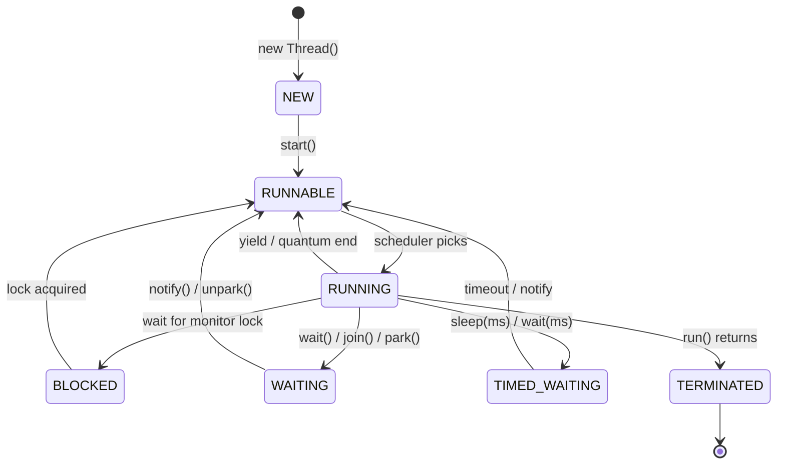
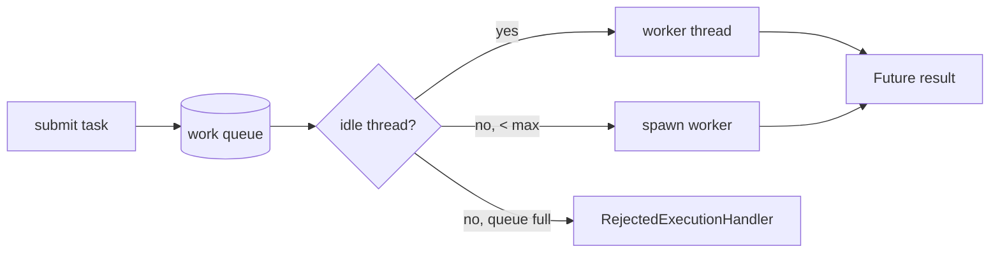
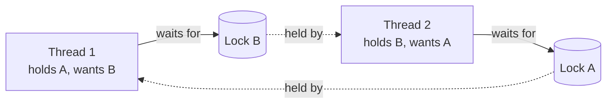

# Concurrency & Multithreading

> Master the JVM threading model from intrinsic locks and the Java Memory Model up to virtual threads and structured concurrency in Java 21.

## Mental model

A thread is an independent path of execution scheduled by the OS, with its own call stack but sharing the **heap** with every other thread in the process. That shared heap is both the power and the peril of Java concurrency: communication is free (just touch the same object), but every shared mutable field is a race waiting to happen unless you establish a **happens-before** relationship.

There are three problems you are always solving at once:

- **Safety** — no two threads corrupt shared state (use locks, atomics, immutability, confinement).
- **Visibility** — a write by one thread is actually *seen* by another (the Java Memory Model governs this, not intuition).
- **Liveness** — the program keeps making progress (avoid deadlock, livelock, starvation).

Modern Java pushes you up the abstraction ladder: prefer `java.util.concurrent` (executors, `CompletableFuture`, concurrent collections) over raw `Thread` and `synchronized`, and in Java 21 prefer **virtual threads** for blocking I/O work.



## Core concepts

### Thread vs Runnable

A `Thread` *is* a unit of execution; a `Runnable` is just the *task* it runs. Prefer passing a `Runnable` (or a lambda) so the task is decoupled from the threading mechanism — and in practice prefer an `ExecutorService` over creating threads by hand entirely.

```java
// Option A: subclass Thread (rarely the right choice — couples task to thread)
class Worker extends Thread {
    @Override public void run() { System.out.println("hi from " + getName()); }
}

// Option B: implement Runnable, hand it to a Thread (better: task is separable)
Runnable task = () -> System.out.println("hi from " + Thread.currentThread().getName());
Thread t = new Thread(task, "worker-1");
t.start();          // start() schedules run() on a NEW thread
// t.run();         // => DON'T: runs on the CALLING thread, no concurrency
t.join();           // caller blocks until t finishes
// => hi from worker-1
```

::: warning
Calling `run()` directly executes the body on the current thread — a classic bug. Only `start()` creates a new thread. A thread can be started **exactly once**; calling `start()` twice throws `IllegalThreadStateException`.
:::

### `synchronized` and intrinsic locks

Every Java object has an **intrinsic lock** (monitor). `synchronized` acquires it on entry and releases it on exit (even on exception). It provides both mutual exclusion *and* a memory barrier: the unlock happens-before the next lock.

```java
class Counter {
    private long count = 0;

    public synchronized void increment() {  // locks on 'this'
        count++;                            // read-modify-write made atomic
    }

    public long get() {
        synchronized (this) {               // explicit block: same lock as above
            return count;
        }
    }
}
```

::: tip
Lock on a **private final** object, not on `this` or a `String`/`Integer`, to avoid external code (or the pool of interned objects) accidentally sharing your lock.

```java
private final Object lock = new Object();
void update() { synchronized (lock) { /* ... */ } }
```
:::

### The Java Memory Model: happens-before & visibility

Without synchronization, there is **no guarantee** one thread ever sees another's writes — the JIT and CPU may reorder and cache freely. The JMM defines *happens-before* edges that force visibility and ordering:

- Unlock of a monitor → subsequent lock of the same monitor.
- A write to a `volatile` field → subsequent read of that field.
- `Thread.start()` → everything in the started thread; everything in a thread → another thread's `join()` return.

```java
class Flag {
    private volatile boolean ready = false;   // volatile = visibility + no reorder
    private int data = 0;

    void publisher() {
        data = 42;        // (1) happens-before (2) because of the volatile write
        ready = true;     // (2) volatile write
    }

    void consumer() {
        if (ready) {      // (3) volatile read sees (2)
            assert data == 42;  // GUARANTEED visible; without volatile, may read 0
        }
    }
}
```

::: danger
`volatile` guarantees **visibility and ordering**, not atomicity. `volatileCounter++` is still a race — it is read-modify-write. Use an atomic or a lock for compound actions.
:::

### Atomics and compare-and-swap (CAS)

`java.util.concurrent.atomic` types use a hardware **compare-and-swap** instruction for lock-free, thread-safe updates. CAS reads the current value, computes the new one, and swaps *only if* the value is unchanged — retrying on contention.

```java
import java.util.concurrent.atomic.AtomicInteger;

AtomicInteger counter = new AtomicInteger(0);
counter.incrementAndGet();                 // atomic ++, no lock
counter.compareAndSet(1, 100);             // set to 100 only if currently 1 => true
int v = counter.updateAndGet(x -> x * 2);  // atomic functional update => 200

// LongAdder beats AtomicLong under high write contention (striped cells):
import java.util.concurrent.atomic.LongAdder;
LongAdder hits = new LongAdder();
hits.increment();
long total = hits.sum();                    // => 1
```

::: info
Under heavy contention many threads spin retrying CAS. `LongAdder`/`DoubleAdder` spread updates across internal cells and sum on read — far better for hot counters where you write often and read rarely.
:::

### ExecutorService, thread pools, Future & CompletableFuture

Never manage raw threads for real work. An `ExecutorService` decouples task submission from thread lifecycle and lets you reuse a bounded pool.

```java
import java.util.concurrent.*;

ExecutorService pool = Executors.newFixedThreadPool(4);
try {
    Future<Integer> f = pool.submit(() -> 6 * 7);
    System.out.println(f.get());            // => 42 (blocks until done)
} finally {
    pool.shutdown();                        // stop accepting; finish queued tasks
    pool.awaitTermination(10, TimeUnit.SECONDS);
}
```

`CompletableFuture` composes async pipelines without blocking on `get()`:

```java
import java.util.concurrent.CompletableFuture;

CompletableFuture
    .supplyAsync(() -> fetchUser(7))                 // runs on ForkJoinPool.commonPool
    .thenApply(user -> user.email())                 // transform when ready
    .thenCompose(email -> CompletableFuture          // chain another async call
        .supplyAsync(() -> sendWelcome(email)))
    .exceptionally(ex -> { log(ex); return null; })  // handle failures
    .thenAccept(System.out::println);
```

::: warning
The default `Executors.newFixedThreadPool` uses an **unbounded** `LinkedBlockingQueue` — a flood of tasks can OOM. Prefer a `ThreadPoolExecutor` with a *bounded* queue and an explicit `RejectedExecutionHandler`, or size pools deliberately.
:::



### Explicit locks: ReentrantLock & ReadWriteLock

`ReentrantLock` is `synchronized` with superpowers: `tryLock` (with timeout), interruptible acquisition, fairness, and multiple `Condition`s. You must `unlock()` in a `finally`.

```java
import java.util.concurrent.locks.ReentrantLock;

ReentrantLock lock = new ReentrantLock();
if (lock.tryLock(2, TimeUnit.SECONDS)) {    // bounded wait avoids deadlock
    try { /* critical section */ }
    finally { lock.unlock(); }              // ALWAYS unlock in finally
}
```

`ReadWriteLock` allows many concurrent readers but exclusive writers — ideal for read-heavy state. `StampedLock` (Java 8+) adds optimistic reads.

```java
import java.util.concurrent.locks.ReentrantReadWriteLock;

var rw = new ReentrantReadWriteLock();
rw.readLock().lock();   try { /* many readers in parallel */ } finally { rw.readLock().unlock(); }
rw.writeLock().lock();  try { /* exclusive */ }              finally { rw.writeLock().unlock(); }
```

### Concurrent collections

A plain `HashMap` corrupts under concurrent writes (and historically could infinite-loop). Use the `java.util.concurrent` collections, which are designed for it.

```java
import java.util.concurrent.*;

ConcurrentHashMap<String, Integer> map = new ConcurrentHashMap<>();
map.merge("a", 1, Integer::sum);         // atomic upsert, no external lock
map.computeIfAbsent("b", k -> expensiveInit(k));  // computed once, atomically

BlockingQueue<String> queue = new LinkedBlockingQueue<>(1000);
queue.put("job");                        // blocks if full (back-pressure)
String job = queue.take();               // blocks if empty => "job"
```

::: tip
`ConcurrentHashMap`'s `computeIfAbsent`, `merge`, and `compute` are atomic per key — use them instead of the racy `if (!map.containsKey(k)) map.put(k, v)` pattern. A `BlockingQueue` is the backbone of the producer/consumer pattern and gives you natural back-pressure.
:::

### Coordination: CountDownLatch, Semaphore, CyclicBarrier

```java
// CountDownLatch: wait for N events ONCE (e.g., wait for services to warm up)
CountDownLatch ready = new CountDownLatch(3);
for (int i = 0; i < 3; i++) pool.submit(() -> { warmUp(); ready.countDown(); });
ready.await();                            // unblocks when count hits 0

// Semaphore: cap concurrent access to a resource (e.g., 5 DB connections)
Semaphore permits = new Semaphore(5);
permits.acquire();
try { callRateLimitedApi(); } finally { permits.release(); }

// CyclicBarrier: N threads rendezvous, then all proceed; REUSABLE each cycle
CyclicBarrier barrier = new CyclicBarrier(4, () -> System.out.println("phase done"));
// each worker calls barrier.await(); the last to arrive runs the barrier action
```

::: info
`CountDownLatch` is **one-shot** (count only goes down). `CyclicBarrier` **resets** and reuses after every party arrives — use it for iterative/phased algorithms. A `Semaphore(1)` acts like a lock that any thread can release (a binary semaphore).
:::

### Liveness failures: deadlock, livelock, starvation

```java
// DEADLOCK: two threads acquire the same locks in opposite order
// Thread 1: synchronized(A) { synchronized(B) {...} }
// Thread 2: synchronized(B) { synchronized(A) {...} }   <-- circular wait
```

- **Deadlock** — threads wait on each other's locks forever. Fix: acquire locks in a **global order**, or use `tryLock` with timeout.
- **Livelock** — threads keep reacting to each other and never progress (two people stepping aside in a hallway). Fix: add randomized backoff.
- **Starvation** — a thread never gets CPU/lock time (e.g., always-busy higher-priority threads). Fix: fair locks, bounded critical sections.



### ThreadLocal

`ThreadLocal` gives each thread its own copy of a value — confinement instead of locking. Common for non-thread-safe objects like `SimpleDateFormat` or per-request context.

```java
private static final ThreadLocal<SimpleDateFormat> FMT =
    ThreadLocal.withInitial(() -> new SimpleDateFormat("yyyy-MM-dd"));

String today = FMT.get().format(new Date());   // each thread has its own formatter
// In thread pools you MUST clean up to avoid leaks / stale data:
FMT.remove();
```

::: danger
On a **thread pool**, threads are reused, so a `ThreadLocal` you forget to `remove()` leaks memory and bleeds stale data into the next task that runs on that thread. Always `remove()` in a `finally`. Note: `ThreadLocal` does *not* propagate to virtual threads' carriers — prefer `ScopedValue` (Java 21 preview) for that model.
:::

### Virtual threads & structured concurrency (Java 21)

**Virtual threads** are lightweight threads scheduled by the JVM onto a small pool of OS carrier threads. A blocking call (I/O, `sleep`) parks the *virtual* thread and frees the carrier — so you can run **millions** of them. Write simple blocking code; get async-level scalability.

```java
// One virtual thread PER TASK — cheap to create, blocking is fine here.
try (var executor = Executors.newVirtualThreadPerTaskExecutor()) {
    List<Future<String>> results = executor.invokeAll(
        urls.stream().map(u -> (Callable<String>) () -> httpGet(u)).toList());
}   // try-with-resources awaits all tasks on close

// Or directly:
Thread vt = Thread.ofVirtual().start(() -> System.out.println("on a virtual thread"));
vt.join();
```

**Structured concurrency** (preview in 21) ties the lifetime of subtasks to a scope: if one fails, siblings are cancelled, and the parent waits for all.

```java
import java.util.concurrent.StructuredTaskScope;

try (var scope = new StructuredTaskScope.ShutdownOnFailure()) {
    var user  = scope.fork(() -> fetchUser(id));     // subtasks run concurrently
    var order = scope.fork(() -> fetchOrder(id));
    scope.join();                 // wait for both
    scope.throwIfFailed();        // propagate the first failure, cancel siblings
    return new Page(user.get(), order.get());
}                                 // scope auto-closes; no leaked threads
```

::: tip
Use virtual threads for **blocking I/O-bound** work (web handlers, DB calls, HTTP fan-out). For **CPU-bound** work they offer nothing — a bounded platform-thread pool sized to core count is still correct.
:::

::: warning
A virtual thread "pins" its carrier if it blocks inside a `synchronized` block or a native call, defeating scalability. In hot paths replace `synchronized` with `ReentrantLock` so blocking can unmount cleanly. (Java 24 reduces pinning, but on 21 it matters.)
:::

## Common pitfalls

- **Calling `run()` instead of `start()`** — runs on the current thread, no concurrency.
- **Assuming `volatile` makes `++` atomic** — it doesn't; use atomics or locks for compound actions.
- **No happens-before edge** — reading a non-volatile field written by another thread may see a stale value forever.
- **`HashMap` shared across threads** — corruption; use `ConcurrentHashMap`.
- **Unbounded thread pools / queues** — task floods cause OOM; bound them.
- **Forgetting `lock.unlock()` outside `finally`** — an exception leaves the lock held forever.
- **Inconsistent lock ordering** — the #1 cause of deadlock.
- **`ThreadLocal` not removed in a pool** — memory leak and stale state across tasks.
- **`synchronized` inside virtual threads** — pins the carrier; use `ReentrantLock`.
- **Swallowing `InterruptedException`** — restore the flag with `Thread.currentThread().interrupt()`.

## Best practices

- Prefer immutability and thread confinement first; share less, lock less.
- Use `ExecutorService`/`CompletableFuture` instead of raw `Thread`.
- Reach for `java.util.concurrent` data structures over manual `synchronized` wrappers.
- Hold locks for the **shortest** possible scope; never do I/O while holding a lock.
- Always acquire multiple locks in a consistent global order; prefer `tryLock` with timeout.
- Make compound map updates atomic with `computeIfAbsent`/`merge`.
- Use virtual threads for I/O-bound concurrency; bounded platform pools for CPU-bound.
- Adopt structured concurrency to bound subtask lifetimes and propagate failures cleanly.
- Always honor interruption: handle or re-assert the interrupt flag.

## Interview quick-reference

| Concept | Key point |
| --- | --- |
| Thread vs Runnable | Runnable is the task; Thread runs it. `start()` ≠ `run()` |
| Intrinsic lock | Every object has a monitor; `synchronized` gives mutual exclusion + memory barrier |
| Happens-before | JMM rule that forces visibility/ordering across threads |
| volatile | Visibility + no reordering; NOT atomic for `++` |
| CAS / atomics | Lock-free update via compare-and-swap; retries on contention |
| LongAdder | Striped counter; beats AtomicLong under write contention |
| ExecutorService | Decouples task submission from thread lifecycle; pool reuse |
| CompletableFuture | Non-blocking async composition (thenApply/thenCompose/exceptionally) |
| ReentrantLock | tryLock, timeout, interruptible, fairness, Conditions |
| ReadWriteLock | Many readers OR one writer; for read-heavy state |
| ConcurrentHashMap | Atomic per-key compute/merge; no full-map lock |
| BlockingQueue | Producer/consumer backbone with back-pressure |
| CountDownLatch vs CyclicBarrier | One-shot count-down vs reusable rendezvous |
| Semaphore | Caps N concurrent holders; binary semaphore ≈ lock |
| Deadlock | Circular wait on locks; fix with ordering / tryLock |
| ThreadLocal | Per-thread value; must `remove()` in pools |
| Virtual threads | Cheap JVM-scheduled threads; blocking I/O scales to millions |
| Structured concurrency | Scope ties subtask lifetimes; cancels siblings on failure |

See the [interview questions](../questions/concurrency) for drilling.
