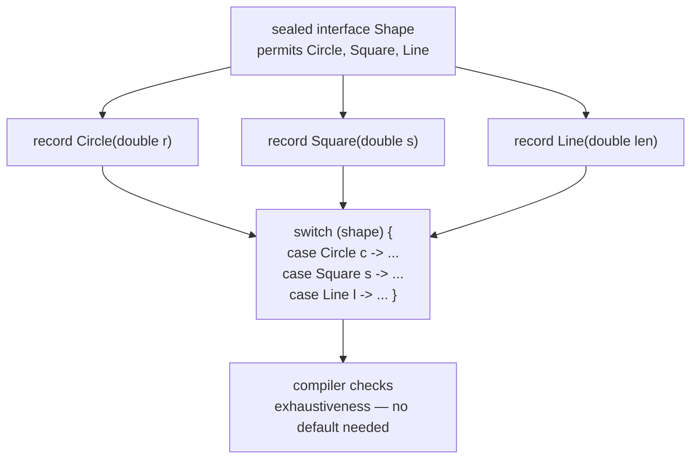
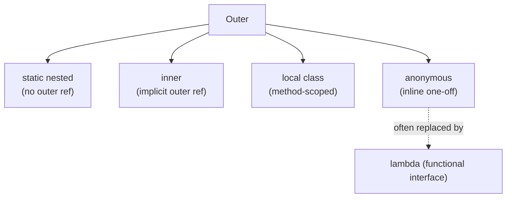

# Core Language & Modern Java

> The Java 17/21 toolkit that makes code shorter and safer — records, sealed types, pattern matching for `instanceof` and `switch`, switch expressions, text blocks, enhanced enums, `Optional`, and the nested-class family.

## Mental model

Modern Java (the 17 and 21 LTS releases) pushes two themes: **less ceremony** (records, `var`, text blocks remove boilerplate) and **data-oriented programming** (sealed hierarchies + records + pattern matching let you model a closed set of shapes and exhaustively destructure them). Together, sealed interfaces and records form **algebraic data types**, and `switch` pattern matching is how you consume them with compiler-checked completeness.



## Core concepts

### Records — concise immutable data carriers

A `record` (Java 16+) generates a canonical constructor, `private final` fields, accessors, and value-based `equals`/`hashCode`/`toString`. It is the idiomatic DTO / value object.

```java
public record Point(int x, int y) {

    // Compact canonical constructor: validate/normalize, no field assignment needed
    public Point {
        if (x < 0 || y < 0) throw new IllegalArgumentException("non-negative only");
    }

    // You may add static factories and extra methods
    public static Point origin() { return new Point(0, 0); }
    public double distanceTo(Point o) { return Math.hypot(x - o.x, y - o.y); }
}

var p = new Point(3, 4);
System.out.println(p.x());          // => 3   (accessor named after the component)
System.out.println(p);              // => Point[x=3, y=4]  (generated toString)
System.out.println(p.equals(new Point(3, 4)));   // => true (value equality)
```

::: info
Records are implicitly `final`, cannot extend a class (they already extend `java.lang.Record`), and their components are immutable. They *can* implement interfaces. Use them for data, not for entities with identity-based equality.
:::

### Sealed classes and interfaces

A `sealed` type (Java 17) restricts which classes may extend/implement it via `permits`. Each permitted subtype must be `final`, `sealed`, or `non-sealed`. This creates a *closed* hierarchy the compiler can reason about exhaustively.

```java
public sealed interface Shape permits Circle, Square, Line {}

public record Circle(double radius) implements Shape {}
public record Square(double side)   implements Shape {}
public record Line(double length)   implements Shape {}

// A class hierarchy can be sealed too:
public sealed class Payment permits Card, Cash {}
public final class Card extends Payment {}
public non-sealed class Cash extends Payment {}   // re-opens this branch
```

::: tip
Pair `sealed` interfaces with `record`s to model a fixed set of variants. Because the compiler knows every permitted subtype, a `switch` over them needs no `default` and will *fail to compile* if you add a variant and forget to handle it — turning a runtime bug into a compile error.
:::

### Pattern matching for `instanceof`

Pattern matching (Java 16) binds and casts in one step, eliminating the redundant cast after a type check.

```java
Object obj = "hello";

// Old way
if (obj instanceof String) {
    String s = (String) obj;            // redundant cast
    System.out.println(s.length());
}

// Pattern matching: bind `s` directly, scoped where the test is true
if (obj instanceof String s && s.length() > 3) {
    System.out.println(s.toUpperCase());   // => HELLO
}
```

### Pattern matching for `switch` and record deconstruction

`switch` (standard in Java 21) matches on type patterns, deconstructs records, and supports `when` guards — giving exhaustive, type-safe dispatch over sealed hierarchies.

```java
static String describe(Shape shape) {
    return switch (shape) {
        case Circle c when c.radius() > 10 -> "big circle";
        case Circle c            -> "circle r=" + c.radius();
        case Square(double side) -> "square s=" + side;   // record deconstruction
        case Line l              -> "line len=" + l.length();
        // no default needed: Shape is sealed and all variants are covered
    };
}

System.out.println(describe(new Circle(5)));    // => circle r=5.0
System.out.println(describe(new Circle(20)));   // => big circle
System.out.println(describe(new Square(4)));    // => square s=4.0
```

::: warning
`switch` pattern matching adds a `null` case to the picture: a traditional `switch` throws NPE on `null`, but you can now write `case null ->` explicitly. If you don't, a `null` selector still throws `NullPointerException` — handle it deliberately.
:::

### Switch expressions and arrow labels

Beyond patterns, plain `switch` *expressions* (Java 14) return a value, use `->` arrows (no fall-through), group labels with commas, and use `yield` for multi-statement blocks.

```java
enum Day { MON, TUE, WED, THU, FRI, SAT, SUN }

static int hours(Day d) {
    return switch (d) {
        case SAT, SUN -> 0;                    // grouped labels
        case FRI -> 6;
        default -> {
            System.out.println("regular day");
            yield 8;                            // yield returns from a block
        }
    };
}
System.out.println(hours(Day.SAT));   // => 0
```

### Text blocks

A text block (Java 15) is a multi-line string literal delimited by `"""`, preserving formatting without escaping — ideal for JSON, SQL, and HTML.

```java
String json = """
        {
          "name": "Ada",
          "role": "engineer"
        }
        """;                              // incidental leading whitespace stripped

String sql = """
        SELECT id, name
        FROM users
        WHERE active = true""";           // no trailing newline (closing """ on text line)

System.out.println(json.lines().count());   // => 4
```

::: tip
The closing `"""` position sets the baseline indentation — everything to its left is stripped as "incidental" whitespace. Use `\` at line end to suppress the newline and `\s` to preserve a trailing space.
:::

### Enhanced enums

Java enums are full classes: they can hold fields, constructors, methods, and even per-constant method bodies — far more than C-style named integers.

```java
public enum Planet {
    EARTH(5.976e24, 6.37814e6),
    MARS (6.421e23, 3.3972e6);

    private final double mass;
    private final double radius;

    Planet(double mass, double radius) {   // constructor runs per constant
        this.mass = mass;
        this.radius = radius;
    }

    public double gravity() {               // behavior on the enum
        return 6.67300E-11 * mass / (radius * radius);
    }
}

System.out.printf("%.2f%n", Planet.EARTH.gravity());   // => 9.80
System.out.println(Planet.values().length);            // => 2
System.out.println(Planet.valueOf("MARS"));            // => MARS
```

### `var` with modern syntax

`var` infers local types, pairing naturally with records, streams, and enhanced `for`. It is static typing, just inferred.

```java
var points = java.util.List.of(new Point(1, 1), new Point(2, 2));
for (var pt : points) {                  // pt inferred Point
    System.out.println(pt.x());
}
var total = points.stream().mapToInt(Point::x).sum();   // inferred int
System.out.println(total);               // => 3
```

### `Optional` — explicit absence

`Optional<T>` (Java 8) models "a value that may be absent" in the type system, replacing null-returning methods at API boundaries.

```java
import java.util.Optional;

Optional<String> found = Optional.of("Ada");
Optional<String> empty = Optional.empty();

System.out.println(found.map(String::toUpperCase).orElse("none"));  // => ADA
System.out.println(empty.map(String::toUpperCase).orElse("none"));  // => none

empty.ifPresentOrElse(
    v -> System.out.println("got " + v),
    () -> System.out.println("absent"));                            // => absent
```

::: danger
Don't call `.get()` without checking presence — it throws `NoSuchElementException`, recreating the null problem. Use `orElse`, `orElseGet`, `orElseThrow`, `map`, or `ifPresent`. Never use `Optional` for fields or method parameters; reserve it for return types.
:::

### Nested, inner, local, and anonymous classes

Java offers four kinds of nested class, plus static and instance initializer blocks.

```java
public class Outer {
    private int value = 10;

    static class StaticNested {           // no link to an Outer instance
        int square(int n) { return n * n; }
    }

    class Inner {                          // holds an implicit Outer reference
        int read() { return value; }       // can access Outer's instance state
    }

    Runnable makeLocalAndAnon() {
        class Local implements Runnable {  // local class: scoped to this method
            public void run() { System.out.println("local " + value); }
        }
        Runnable anon = new Runnable() {   // anonymous class: one-off subtype
            public void run() { System.out.println("anon " + value); }
        };
        new Local().run();
        return anon;
    }
}
```



### Static vs instance initializers

A `static { }` block runs once when the class is loaded; an instance `{ }` block runs before each constructor body. Use them for non-trivial field setup.

```java
public class Config {
    static final java.util.Map<String, String> DEFAULTS;
    private final long createdAt;

    static {                               // runs once at class load
        DEFAULTS = new java.util.HashMap<>();
        DEFAULTS.put("env", "prod");
    }

    {                                      // runs before every constructor
        createdAt = System.nanoTime();
    }

    public Config() { /* createdAt already set */ }
}
```

## Common pitfalls

- **`Optional.get()` without a presence check.** Throws on empty. *Fix:* use `orElse`/`orElseThrow`/`map`.
- **`Optional` as a field or parameter.** Adds overhead and awkward APIs. *Fix:* use it only for return types.
- **Missing a sealed variant in `switch`.** Without exhaustiveness you'd need `default`. *Fix:* keep types sealed so the compiler enforces coverage; avoid a catch-all `default` that hides new cases.
- **Mutable record components.** A record holding a `List` is not deeply immutable. *Fix:* defensively copy in the compact constructor.
- **`null` in pattern `switch`.** Still throws NPE unless you add `case null`. *Fix:* handle `null` explicitly when the input can be null.
- **Inner class memory leaks.** A non-static inner class pins its `Outer` instance. *Fix:* make it `static` when it doesn't need outer state.
- **Treating records as JPA entities.** Records can't have mutable identity-based state. *Fix:* use records for DTOs/values, classes for entities.

## Best practices

- Use `record`s for immutable data carriers; add validation in the compact constructor.
- Model closed variant sets with `sealed` interfaces + records, then consume with exhaustive `switch`.
- Prefer pattern matching `instanceof`/`switch` over manual casts and `if`/`else` chains.
- Reach for switch *expressions* with arrows; reserve `yield`/blocks for multi-statement cases.
- Use text blocks for embedded JSON/SQL/HTML.
- Return `Optional` (never null) from lookups that may find nothing; never use it for fields.
- Make nested classes `static` unless they genuinely need the enclosing instance; prefer lambdas over anonymous classes.

## Interview quick-reference

| Concept | Key point |
| --- | --- |
| Record | Immutable carrier: auto constructor, accessors, `equals`/`hashCode`/`toString` |
| Sealed type | `permits` a closed set; subtypes `final`/`sealed`/`non-sealed` |
| `instanceof` pattern | Test + bind + cast in one; scoped to where true |
| `switch` pattern | Type/record patterns + `when` guards; exhaustive over sealed types |
| Switch expression | Arrow labels, no fall-through, returns a value, `yield` for blocks |
| Text block | `"""` multi-line literal; closing quotes set indentation |
| Enhanced enum | Full class: fields, constructors, methods, per-constant bodies |
| `var` | Local static type inference; needs an initializer |
| `Optional` | Models absence; return-only, avoid `.get()` |
| Nested classes | static nested / inner / local / anonymous; static avoids outer-ref leaks |
| Initializers | `static {}` once at load; `{}` before each constructor |

See the [interview questions](../questions/core-language) for drilling.
