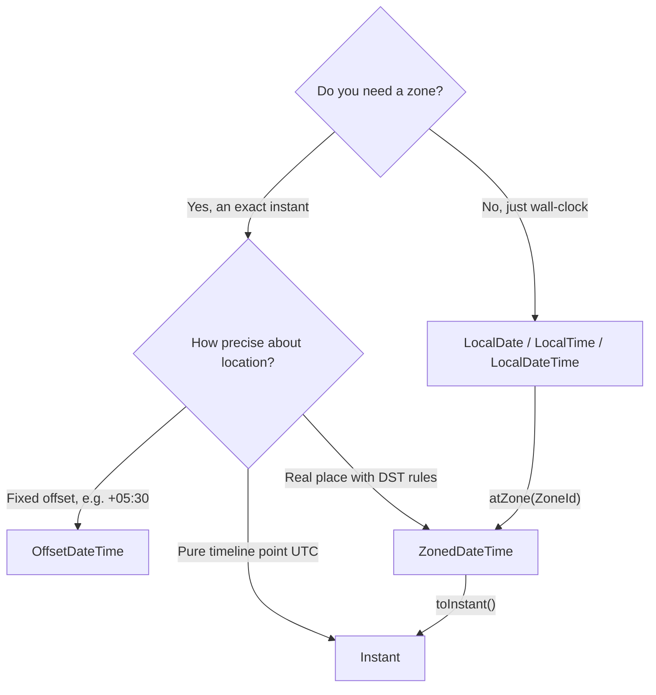
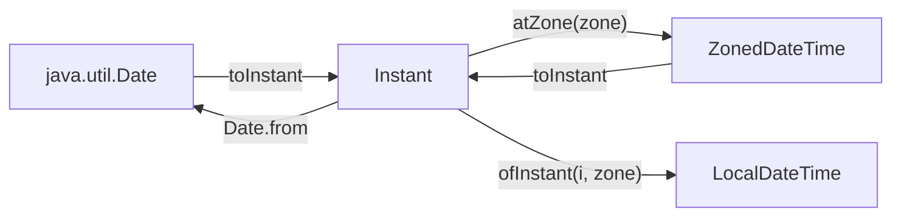

# Date & Time API

> Replace the broken legacy `Date`/`Calendar` with the immutable, well-designed `java.time` API — and handle time zones, offsets, and DST without the classic bugs.

## Mental model

The legacy `java.util.Date` and `Calendar` were error-prone: mutable, not thread-safe, zero-based months, and `Date` actually models an *instant* despite its name. The `java.time` package (JSR-310, Java 8) fixes all of it with a clear separation of concepts and **immutable** types.

Pick the type by **what you actually mean**:

- **`LocalDate` / `LocalTime` / `LocalDateTime`** — a date/time **without** a zone ("a meeting at 9:00", a birthday). No instant in time until you attach a zone.
- **`Instant`** — an exact point on the timeline (UTC epoch nanoseconds). Use for timestamps, logs, "now".
- **`ZonedDateTime`** — an instant **with** a zone and its DST rules (a wall-clock time in a place).
- **`OffsetDateTime`** — an instant with a fixed UTC offset (no DST rules) — ideal for storage and APIs.



## Core concepts

### The legacy `Date` / `Calendar` problems

```java
import java.util.*;

Date d = new Date(2026 - 1900, 5, 28);   // YEAR offset by 1900, MONTH is 0-based (5 = June!)
Calendar c = Calendar.getInstance();
c.set(2026, Calendar.JUNE, 28);          // must use constants to stay sane
// SimpleDateFormat is NOT thread-safe -> shared instance corrupts output under load
```

::: danger
`java.util.Date` is **mutable** and `SimpleDateFormat` is **not thread-safe** — a shared formatter across threads silently produces wrong/garbled dates. Months are zero-based, years offset by 1900, and `Date` confusingly models an instant. Avoid all of it in new code.
:::

### `java.time` core types

```java
import java.time.*;

LocalDate date = LocalDate.of(2026, 6, 28);          // 2026-06-28 (month is 1-based!)
LocalTime time = LocalTime.of(9, 30);                // 09:30
LocalDateTime dt = LocalDateTime.of(date, time);     // 2026-06-28T09:30
Instant now = Instant.now();                         // exact UTC point, e.g. 2026-06-28T12:00:00Z

ZoneId tokyo = ZoneId.of("Asia/Tokyo");
ZonedDateTime zdt = dt.atZone(tokyo);                // 2026-06-28T09:30+09:00[Asia/Tokyo]
OffsetDateTime odt = OffsetDateTime.of(dt, ZoneOffset.ofHours(9));  // 2026-06-28T09:30+09:00

System.out.println(date.plusDays(5));                // => 2026-07-03
System.out.println(date.getDayOfWeek());             // => SUNDAY
```

::: tip
Months are **1-based** in `java.time` (June = 6), unlike `Calendar`. Use the `Month` enum (`Month.JUNE`) and `DayOfWeek` for readable, mistake-proof code.
:::

### Duration vs Period

Both represent spans, but at different scales: **`Duration`** is time-based (seconds/nanos — for machines/instants); **`Period`** is date-based (years/months/days — for calendars).

```java
import java.time.*;

Duration d = Duration.ofHours(2).plusMinutes(30);     // PT2H30M (time-based)
Instant later = Instant.now().plus(d);
long secs = Duration.between(Instant.now(), later).getSeconds();  // => 9000

Period p = Period.of(1, 2, 3);                        // P1Y2M3D (1 year, 2 months, 3 days)
LocalDate due = LocalDate.of(2026, 1, 1).plus(p);     // => 2026-03-04
Period age = Period.between(LocalDate.of(1990, 5, 1), LocalDate.now());
System.out.println(age.getYears());                   // calendar-aware years
```

::: warning
Don't use `Duration` for calendar arithmetic. `Duration.ofDays(1)` is **exactly 24 hours**, but a calendar day can be 23 or 25 hours across a DST boundary. For "tomorrow" use `Period`/`plusDays` on a `ZonedDateTime`, not `plus(Duration.ofDays(1))`.
:::

### Time zones: `ZoneId` & offsets

A `ZoneId` (e.g. `Europe/Paris`) carries the full **DST rule history**; a `ZoneOffset` (e.g. `+02:00`) is just a fixed displacement from UTC. Always use **region IDs**, not fixed offsets, for real places.

```java
import java.time.*;

ZonedDateTime ny = ZonedDateTime.of(2026, 1, 15, 12, 0, 0, 0, ZoneId.of("America/New_York"));
ZonedDateTime london = ny.withZoneSameInstant(ZoneId.of("Europe/London"));
// Same instant, different wall clock:
System.out.println(ny);      // => 2026-01-15T12:00-05:00[America/New_York]
System.out.println(london);  // => 2026-01-15T17:00Z[Europe/London]

System.out.println(ZoneId.getAvailableZoneIds().size());  // hundreds of IANA zones
```

::: info
`withZoneSameInstant` keeps the *same point in time* and recomputes the wall clock. `withZoneSameLocal` keeps the *same wall-clock numbers* and changes the instant — rarely what you want. Zone rules come from the IANA tz database bundled with the JDK; keep your JDK updated for current rules.
:::

### Formatting & parsing with `DateTimeFormatter`

`DateTimeFormatter` is **immutable and thread-safe** (unlike `SimpleDateFormat`) — share one static instance freely.

```java
import java.time.*;
import java.time.format.*;
import java.util.Locale;

DateTimeFormatter ISO = DateTimeFormatter.ISO_LOCAL_DATE_TIME;
LocalDateTime dt = LocalDateTime.parse("2026-06-28T09:30:00");   // ISO parse

DateTimeFormatter custom = DateTimeFormatter
    .ofPattern("dd MMM yyyy HH:mm", Locale.ENGLISH);             // pass a Locale!
System.out.println(dt.format(custom));        // => 28 Jun 2026 09:30
LocalDateTime back = LocalDateTime.parse("28 Jun 2026 09:30", custom);

// Localized, zone-aware formatting:
DateTimeFormatter human = DateTimeFormatter
    .ofLocalizedDateTime(FormatStyle.MEDIUM).withLocale(Locale.US);
```

::: tip
Always pass a `Locale` to `ofPattern` — month/day names and ordering are locale-sensitive, and the default locale differs across environments. Pattern letters are case-sensitive: `MM` = month, `mm` = minutes, `yyyy` = year-of-era, `HH` = 24-hour, `hh` = 12-hour.
:::

### `TemporalAdjusters`

Adjusters express calendar logic declaratively: "last day of month", "next Monday", "first day of next year".

```java
import java.time.*;
import java.time.temporal.TemporalAdjusters;
import java.time.DayOfWeek;

LocalDate d = LocalDate.of(2026, 6, 28);
System.out.println(d.with(TemporalAdjusters.lastDayOfMonth()));         // => 2026-06-30
System.out.println(d.with(TemporalAdjusters.next(DayOfWeek.MONDAY)));   // => 2026-06-29
System.out.println(d.with(TemporalAdjusters.firstDayOfNextMonth()));    // => 2026-07-01
```

### Immutability of `java.time`

Every `java.time` type is **immutable**; "mutators" return a new instance. This makes them thread-safe and safe to share, but the return value matters.

```java
import java.time.LocalDate;

LocalDate d = LocalDate.of(2026, 6, 28);
d.plusDays(10);                    // result DISCARDED — d is unchanged
System.out.println(d);             // => 2026-06-28
LocalDate d2 = d.plusDays(10);     // capture the new instance
System.out.println(d2);            // => 2026-07-08
```

::: warning
Because the types are immutable, ignoring the return value of `plusDays`/`with*`/`minus*` is a no-op bug. Always assign the result.
:::

### Converting legacy ↔ modern

When integrating old APIs, bridge via `Instant`.

```java
import java.time.*;
import java.util.Date;

// legacy -> modern
Date legacy = new Date();
Instant instant = legacy.toInstant();
ZonedDateTime zdt = instant.atZone(ZoneId.systemDefault());
LocalDateTime ldt = LocalDateTime.ofInstant(instant, ZoneId.of("UTC"));

// modern -> legacy
Date back = Date.from(zdt.toInstant());

// java.sql.Timestamp <-> Instant
java.sql.Timestamp ts = java.sql.Timestamp.from(Instant.now());
Instant fromTs = ts.toInstant();
```



### Epoch & UTC handling

`Instant` is anchored to the **epoch** (1970-01-01T00:00:00Z). Convert to/from epoch counts explicitly.

```java
import java.time.*;

long epochSecs = Instant.now().getEpochSecond();      // seconds since 1970 UTC
long epochMs   = Instant.now().toEpochMilli();        // millis since 1970 UTC
Instant fromMs = Instant.ofEpochMilli(1_750_000_000_000L);

// Store and transmit in UTC; convert to local only for display:
Instant stored = Instant.now();                       // persist this (UTC)
ZonedDateTime display = stored.atZone(ZoneId.of("Asia/Kolkata"));  // render per-user
```

::: tip
**Store timestamps in UTC (`Instant`), convert to a zone only at the display edge.** This is the single most important rule for correct global time handling. In databases use `timestamptz` / store `Instant`, never a zone-naive local time.
:::

### Common pitfalls: zone-naive math & DST

```java
import java.time.*;

// DST gap: clocks spring forward; 2:30 AM may NOT EXIST on that day.
ZoneId ny = ZoneId.of("America/New_York");
ZonedDateTime springForward = ZonedDateTime.of(2026, 3, 8, 2, 30, 0, 0, ny);
System.out.println(springForward);   // => auto-adjusted to 03:30-04:00 (the gap is skipped)

// Adding a calendar day across DST keeps the wall time correct:
ZonedDateTime before = ZonedDateTime.of(2026, 3, 7, 12, 0, 0, 0, ny);
System.out.println(before.plusDays(1));            // => 2026-03-08T12:00 (still noon, offset shifts)
System.out.println(before.plus(Duration.ofHours(24)));  // => 2026-03-08T13:00 (24h literal!)
```

::: danger
Across a DST transition, `plusDays(1)` (calendar-aware, keeps wall time) and `plus(Duration.ofHours(24))` (exact 24h, wall time shifts) give **different** results. Mixing them is a classic scheduling bug. Use `ZonedDateTime` + `Period`/`plusDays` for calendar intent; use `Duration` only for elapsed-time intent.
:::

## Common pitfalls

- **Using `Date`/`Calendar`/`SimpleDateFormat`** in new code — mutable, zero-based months, not thread-safe.
- **Ignoring the return value** of `plusDays`/`with*` — they're immutable; the call is a no-op without assignment.
- **Using `Duration` for calendar days** — 24h ≠ a calendar day across DST.
- **Fixed offsets for real places** — `+02:00` loses DST rules; use a `ZoneId` region.
- **Forgetting `Locale`** in `ofPattern` — locale-dependent names/ordering break.
- **Confusing `mm` and `MM`** — minutes vs month in patterns.
- **Storing local time** instead of UTC — ambiguous across zones and DST.
- **`withZoneSameLocal` vs `withZoneSameInstant`** — the former silently shifts the instant.

## Best practices

- Use `java.time` exclusively; never `Date`/`Calendar` in new code.
- Store and transmit instants in **UTC** (`Instant`/`OffsetDateTime`); convert to a zone only for display.
- Pick the type by meaning: `LocalDate` for dates, `Instant` for timestamps, `ZonedDateTime` for placed wall-clock.
- Always capture the result of immutable mutator calls.
- Use `Period` for calendar arithmetic, `Duration` for elapsed time.
- Use region `ZoneId`s, never fixed offsets, for real locations.
- Share a static `DateTimeFormatter` (thread-safe) and always pass a `Locale`.
- Use `TemporalAdjusters` for declarative calendar logic.

## Interview quick-reference

| Concept | Key point |
| --- | --- |
| Legacy problems | Date/Calendar mutable, 0-based months, SimpleDateFormat not thread-safe |
| LocalDate/Time | Wall-clock, no zone; months are 1-based |
| Instant | Exact UTC point on the timeline; for timestamps |
| ZonedDateTime | Instant + zone with DST rules |
| OffsetDateTime | Instant + fixed offset (no DST); good for storage/APIs |
| Duration vs Period | Time-based (sec/nanos) vs date-based (Y/M/D) |
| ZoneId vs ZoneOffset | Region with DST rules vs fixed displacement |
| DateTimeFormatter | Immutable, thread-safe; pass a Locale; case-sensitive patterns |
| TemporalAdjusters | Declarative "last day of month", "next Monday" |
| Immutability | Mutators return new instances; assign the result |
| Legacy bridge | Convert via Instant (toInstant / Date.from / ofInstant) |
| Epoch/UTC | Store UTC Instant; convert to zone only for display |
| DST pitfall | plusDays(1) ≠ plus(Duration.ofHours(24)) across DST |

See the [interview questions](../questions/datetime) for drilling.
