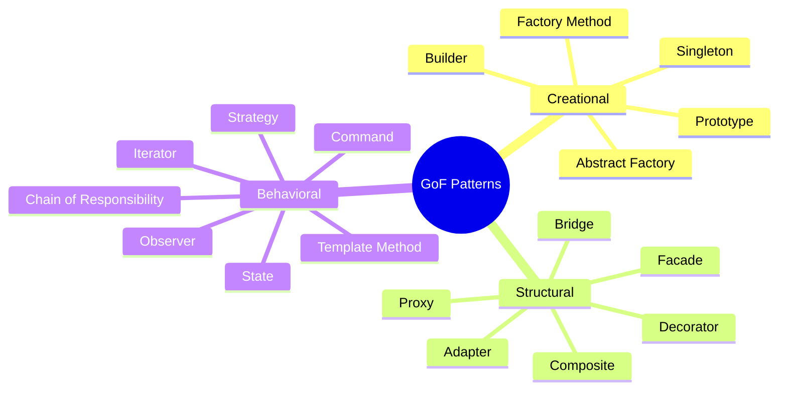
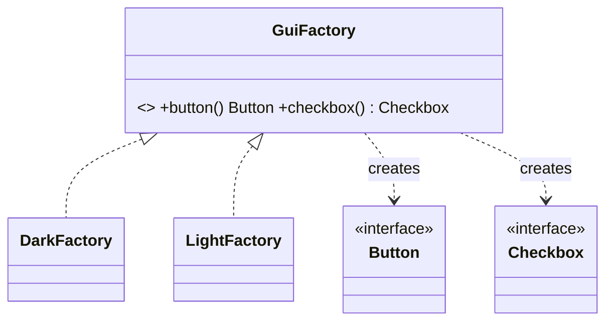
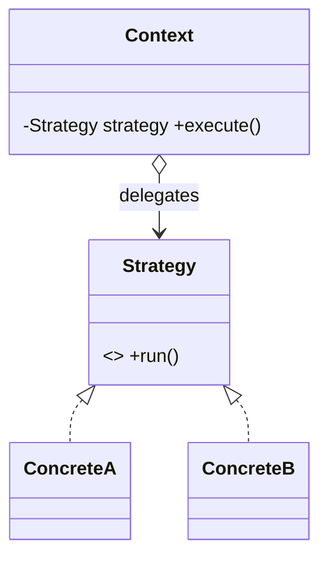
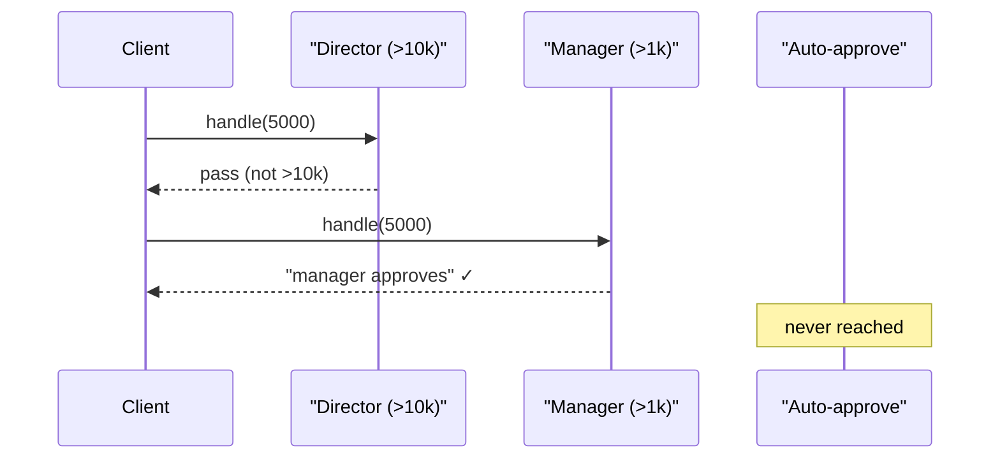

# Design Patterns in Java

> The Gang of Four patterns are named, battle-tested solutions to recurring design problems — learn their intent, an idiomatic Java implementation, and where modern Java (lambdas, records, sealed types, enums) makes the classic boilerplate disappear.

## Mental model

A **design pattern** is not code you copy but a *shape* you recognize: a problem context, the forces at play, and a structure that resolves them. The GoF catalog splits into three families by what they organize:

- **Creational** — *how objects get made*: decouple construction from use (Singleton, Factory Method, Abstract Factory, Builder, Prototype).
- **Structural** — *how objects compose*: assemble larger structures while keeping them flexible (Adapter, Decorator, Facade, Proxy, Composite, Bridge).
- **Behavioral** — *how objects collaborate*: assign responsibility and communication (Strategy, Observer, Template Method, Command, Iterator, State, Chain of Responsibility).

The deeper lesson is the principles patterns encode — *program to an interface, favor composition over inheritance, encapsulate what varies*. Modern Java often expresses these with far less ceremony: a `Strategy` is frequently just a lambda, a `Command` a `Runnable`, an immutable value a `record`, and a closed type hierarchy a `sealed interface`.



## Core concepts

## Creational patterns

### Singleton

**Intent:** ensure a class has exactly one instance and provide a global access point.

The **enum singleton** is the safest form — the JVM guarantees a single instance, and it is serialization- and reflection-proof for free.

```java
public enum Config {
    INSTANCE;
    private final Map<String, String> values = new ConcurrentHashMap<>();
    public String get(String key) { return values.get(key); }
    public void set(String key, String v) { values.put(key, v); }
}

Config.INSTANCE.set("env", "prod");
System.out.println(Config.INSTANCE.get("env"));   // => prod
```

When you need lazy initialization, use the **initialization-on-demand holder idiom** — thread-safe with zero synchronization, leveraging the class-loading guarantee.

```java
public final class Registry {
    private Registry() {}
    private static class Holder {                 // loaded only on first access
        static final Registry INSTANCE = new Registry();
    }
    public static Registry getInstance() {
        return Holder.INSTANCE;                    // safe lazy init, no locking
    }
}
```

::: warning
Avoid double-checked locking unless the field is `volatile` — without it, a partially constructed object can leak to another thread. The holder idiom or an enum sidesteps the whole problem.
:::

::: danger
Singletons are global mutable state: they hide dependencies, complicate testing, and can pin memory. Prefer a DI container managing a single bean over a hard-coded singleton.
:::

### Factory Method

**Intent:** define an interface for creating an object, but let subclasses decide which class to instantiate.

```java
sealed interface Notification permits Email, Sms {}
record Email(String to) implements Notification {}
record Sms(String number) implements Notification {}

abstract class NotificationCreator {
    abstract Notification create(String target);     // the factory method
    void notifyUser(String target) {
        Notification n = create(target);             // base logic uses the product
        System.out.println("sending " + n);
    }
}

class EmailCreator extends NotificationCreator {
    Notification create(String target) { return new Email(target); }
}

new EmailCreator().notifyUser("a@b.com");
// => sending Email[to=a@b.com]
```

::: tip
For simple cases a **static factory method** (Effective Java Item 1) — `Notification.email(...)` returning the interface — is more idiomatic than a subclass hierarchy: named constructors, cached instances, and a returnable subtype.
:::

### Abstract Factory

**Intent:** create *families* of related objects without specifying their concrete classes — swap the whole family by swapping the factory.

```java
interface Button { String render(); }
interface Checkbox { String render(); }

interface GuiFactory {                              // the abstract factory
    Button button();
    Checkbox checkbox();
}

class DarkFactory implements GuiFactory {
    public Button button() { return () -> "[dark button]"; }
    public Checkbox checkbox() { return () -> "[dark checkbox]"; }
}

GuiFactory f = new DarkFactory();
System.out.println(f.button().render());           // => [dark button]
```



### Builder

**Intent:** construct a complex object step by step, separating construction from representation — ideal for many optional parameters and immutable results.

```java
public final class HttpRequest {
    private final String url;
    private final String method;
    private final Map<String, String> headers;

    private HttpRequest(Builder b) {
        this.url = b.url; this.method = b.method; this.headers = b.headers;
    }

    public static Builder to(String url) { return new Builder(url); }

    public static final class Builder {
        private final String url;
        private String method = "GET";
        private final Map<String, String> headers = new HashMap<>();
        private Builder(String url) { this.url = url; }
        public Builder method(String m) { this.method = m; return this; }   // fluent
        public Builder header(String k, String v) { headers.put(k, v); return this; }
        public HttpRequest build() { return new HttpRequest(this); }
    }
}

HttpRequest req = HttpRequest.to("/api")
        .method("POST")
        .header("Accept", "application/json")
        .build();
```

::: tip
A `record` covers immutable data with *required* fields concisely. Reach for a Builder when there are many optional fields, validation, or you want a readable fluent API. The JDK's own `HttpRequest.newBuilder()` and `Stream.Builder` follow this exact shape.
:::

### Prototype

**Intent:** create new objects by copying an existing instance rather than constructing from scratch.

```java
record Point(int x, int y) {
    Point withX(int newX) { return new Point(newX, y); }   // copy-with
}

Point p = new Point(1, 2);
Point moved = p.withX(9);
System.out.println(moved);                          // => Point[x=9, y=2]
```

::: warning
The classic `Cloneable`/`clone()` mechanism is widely considered broken (shallow copies, no constructor call, awkward checked exception). Prefer a **copy constructor**, a static `copyOf`, or — for immutables — `record` "wither" methods.
:::

## Structural patterns

### Adapter

**Intent:** convert the interface of a class into another interface clients expect — make incompatible types collaborate.

```java
interface PaymentGateway { boolean pay(int cents); }

class LegacyStripe {                                // the adaptee (fixed API)
    boolean charge(double dollars) { System.out.println("charged $" + dollars); return true; }
}

class StripeAdapter implements PaymentGateway {     // the adapter
    private final LegacyStripe legacy;
    StripeAdapter(LegacyStripe legacy) { this.legacy = legacy; }
    public boolean pay(int cents) { return legacy.charge(cents / 100.0); }
}

PaymentGateway gw = new StripeAdapter(new LegacyStripe());
gw.pay(2599);                                       // => charged $25.99
```

### Decorator

**Intent:** attach responsibilities to an object dynamically by wrapping it — a flexible alternative to subclassing.

```java
interface Coffee { int cost(); String desc(); }

record Espresso() implements Coffee {
    public int cost() { return 200; }
    public String desc() { return "espresso"; }
}

abstract class CoffeeDecorator implements Coffee {
    protected final Coffee inner;
    CoffeeDecorator(Coffee inner) { this.inner = inner; }
}

class Milk extends CoffeeDecorator {
    Milk(Coffee c) { super(c); }
    public int cost() { return inner.cost() + 50; }
    public String desc() { return inner.desc() + " + milk"; }
}

Coffee c = new Milk(new Milk(new Espresso()));
System.out.println(c.desc() + " = " + c.cost());
// => espresso + milk + milk = 300
```

::: info
`java.io` is the canonical decorator stack: `new BufferedReader(new InputStreamReader(new FileInputStream(f)))` — each wrapper adds behavior over the same `Reader`/`InputStream` interface.
:::

### Facade

**Intent:** provide a simplified, unified interface over a complex subsystem.

```java
class VideoFacade {                                 // hides codec/audio/muxer details
    String convert(String file, String format) {
        // new CodecFactory(); new AudioMixer(); new BitrateReader(); ...
        return file.replaceAll("\\.\\w+$", "") + "." + format;
    }
}

System.out.println(new VideoFacade().convert("clip.avi", "mp4"));  // => clip.mp4
```

### Proxy

**Intent:** provide a surrogate for another object to control access — lazy loading, access control, caching, or remoting.

```java
interface Image { void render(); }

class RealImage implements Image {
    private final String file;
    RealImage(String file) { this.file = file; System.out.println("loading " + file); }
    public void render() { System.out.println("rendering " + file); }
}

class LazyImage implements Image {                  // virtual proxy
    private final String file;
    private RealImage real;
    LazyImage(String file) { this.file = file; }
    public void render() {
        if (real == null) real = new RealImage(file);   // defer expensive load
        real.render();
    }
}

Image img = new LazyImage("big.png");               // nothing loaded yet
img.render();
// => loading big.png
// => rendering big.png
```

::: info
Decorator and Proxy share a structure (both wrap the same interface) but differ in *intent*: a Decorator *adds behavior*; a Proxy *controls access*. Spring AOP, lazy JPA entities, and `Collections.unmodifiableList` are all proxies.
:::

### Composite

**Intent:** compose objects into tree structures and treat individual objects and compositions uniformly.

```java
sealed interface FsNode permits File, Dir {
    int size();
}
record File(String name, int size) implements FsNode {
    public int size() { return size; }
}
record Dir(String name, List<FsNode> children) implements FsNode {
    public int size() {                              // recurse over the tree
        return children.stream().mapToInt(FsNode::size).sum();
    }
}

FsNode root = new Dir("root", List.of(
        new File("a.txt", 100),
        new Dir("sub", List.of(new File("b.txt", 250)))));
System.out.println(root.size());                    // => 350
```

### Bridge

**Intent:** decouple an abstraction from its implementation so the two vary independently — avoid a combinatorial class explosion.

```java
interface Renderer { String draw(String shape); }   // implementation side
class Vector implements Renderer { public String draw(String s){ return "vector:"+s; } }
class Raster implements Renderer { public String draw(String s){ return "raster:"+s; } }

abstract class Shape {                               // abstraction side
    protected final Renderer renderer;
    Shape(Renderer r) { this.renderer = r; }
    abstract String render();
}
class Circle extends Shape {
    Circle(Renderer r) { super(r); }
    String render() { return renderer.draw("circle"); }
}

System.out.println(new Circle(new Raster()).render());  // => raster:circle
```

## Behavioral patterns

### Strategy

**Intent:** define a family of interchangeable algorithms and select one at runtime.

In modern Java a strategy is usually just a **lambda** behind a functional interface — no concrete classes needed.

```java
import java.util.*;
import java.util.function.Comparator;

record Order(String id, int total) {}

List<Order> orders = new ArrayList<>(List.of(
        new Order("A", 30), new Order("B", 10), new Order("C", 20)));

Comparator<Order> byTotal = Comparator.comparingInt(Order::total);  // a strategy
orders.sort(byTotal);
System.out.println(orders.stream().map(Order::id).toList());  // => [B, C, A]
```



### Observer

**Intent:** define a one-to-many dependency so that when one object changes state, all dependents are notified.

```java
import java.util.*;
import java.util.function.Consumer;

class EventBus<T> {
    private final List<Consumer<T>> subscribers = new ArrayList<>();
    void subscribe(Consumer<T> s) { subscribers.add(s); }       // observers as lambdas
    void publish(T event) { subscribers.forEach(s -> s.accept(event)); }
}

EventBus<String> bus = new EventBus<>();
bus.subscribe(e -> System.out.println("logger: " + e));
bus.subscribe(e -> System.out.println("emailer: " + e));
bus.publish("user.created");
// => logger: user.created
// => emailer: user.created
```

::: warning
The old `java.util.Observer`/`Observable` was deprecated in Java 9 (untyped, not thread-safe). Use listener interfaces, `PropertyChangeListener`, `Flow`/reactive streams, or a simple `List<Consumer<T>>` as above.
:::

### Template Method

**Intent:** define the skeleton of an algorithm in a base method, deferring specific steps to subclasses.

```java
abstract class DataJob {
    public final void run() {                       // the template — fixed order
        var data = read();
        var result = process(data);
        write(result);
    }
    abstract String read();
    abstract String process(String data);
    void write(String r) { System.out.println("wrote: " + r); }  // hook with default
}

class UpperJob extends DataJob {
    String read() { return "hello"; }
    String process(String d) { return d.toUpperCase(); }
}

new UpperJob().run();                               // => wrote: HELLO
```

### Command

**Intent:** encapsulate a request as an object — enabling queuing, logging, and undo.

A `Runnable`/`Supplier`/lambda is the lightweight modern Command.

```java
import java.util.*;

class Editor {
    private final StringBuilder text = new StringBuilder();
    private final Deque<Runnable> undos = new ArrayDeque<>();

    void type(String s) {
        text.append(s);
        undos.push(() -> text.delete(text.length() - s.length(), text.length()));
    }
    void undo() { if (!undos.isEmpty()) undos.pop().run(); }
    public String toString() { return text.toString(); }
}

Editor e = new Editor();
e.type("Hello");
e.type(" World");
e.undo();
System.out.println(e);                              // => Hello
```

### Iterator

**Intent:** access elements of a collection sequentially without exposing its internal representation. Java builds this in via `Iterable`/`Iterator`.

```java
class Range implements Iterable<Integer> {
    private final int end;
    Range(int end) { this.end = end; }
    public Iterator<Integer> iterator() {
        return new Iterator<>() {
            int i = 0;
            public boolean hasNext() { return i < end; }
            public Integer next() { return i++; }
        };
    }
}

for (int n : new Range(3)) System.out.print(n);     // => 012
```

### State

**Intent:** let an object alter its behavior when its internal state changes — it appears to change class.

```java
sealed interface State permits Draft, Published {}
record Draft() implements State {}
record Published() implements State {}

class Article {
    private State state = new Draft();
    void publish() {
        state = switch (state) {                     // transitions via sealed switch
            case Draft d -> { System.out.println("publishing"); yield new Published(); }
            case Published p -> { System.out.println("already live"); yield p; }
        };
    }
}

Article a = new Article();
a.publish();                                        // => publishing
a.publish();                                        // => already live
```

::: tip
Sealed interfaces + exhaustive `switch` (Java 21 pattern matching) make State machines compile-time-safe: add a state and every `switch` that forgot it fails to compile.
:::

### Chain of Responsibility

**Intent:** pass a request along a chain of handlers until one handles it — decouples sender from receiver.

```java
import java.util.*;
import java.util.function.*;

record Request(String user, int amount) {}

// each handler returns true if handled; chain as a list of predicates/functions
List<Function<Request, Optional<String>>> chain = List.of(
    r -> r.amount() > 10_000 ? Optional.of("director approves") : Optional.empty(),
    r -> r.amount() > 1_000  ? Optional.of("manager approves")  : Optional.empty(),
    r -> Optional.of("auto-approved")
);

Request req = new Request("ada", 5_000);
String decision = chain.stream()
        .flatMap(h -> h.apply(req).stream())
        .findFirst().orElseThrow();
System.out.println(decision);                       // => manager approves
```



## Common pitfalls

- **Pattern-itis** — forcing a pattern where a plain method or lambda suffices adds indirection without value.
- **Mutable Singletons** — global state that breaks tests and hides dependencies; prefer DI-managed single instances.
- **Double-checked locking without `volatile`** — leaks partially constructed objects; use the holder idiom or enum.
- **Confusing Decorator and Proxy** — same structure, different intent (add behavior vs control access).
- **Telescoping constructors** instead of a Builder when there are many optional parameters.
- **`Cloneable`/`clone()` for Prototype** — broken contract; use copy constructors or record withers.
- **Deep inheritance for variation** that Strategy/Bridge (composition) would model more flexibly.
- **Leaking observers** — un-removed listeners keep objects alive; offer `unsubscribe` and weak references where needed.

## Best practices

- Program to interfaces; inject collaborators rather than `new`-ing them inside.
- Prefer **composition over inheritance** — most structural/behavioral patterns are composition in disguise.
- Use **lambdas** for single-method Strategy/Command/Observer/Callback instead of boilerplate classes.
- Use **records** for immutable value objects (Prototype/DTO) and **sealed interfaces** for closed hierarchies (State/Composite) with exhaustive `switch`.
- Use **enum** for Singleton; the **holder idiom** when laziness is required.
- Recognize patterns already in the JDK (`Comparator`, `java.io` streams, `Stream.Builder`, `HttpRequest.Builder`, `Iterable`) and reuse rather than reinvent.
- Let your DI container (Spring) own object lifecycles instead of hand-rolled factories/singletons.

## Interview quick-reference

| Pattern | Intent |
| --- | --- |
| Singleton | One instance, global access — prefer enum / holder idiom |
| Factory Method | Subclasses decide which class to instantiate |
| Abstract Factory | Create families of related objects via a swappable factory |
| Builder | Step-by-step construction of complex/immutable objects |
| Prototype | Create by copying an existing instance (copy ctor / record wither) |
| Adapter | Convert one interface into another clients expect |
| Decorator | Add responsibilities by wrapping (e.g. `java.io`) |
| Facade | Simplified unified interface over a subsystem |
| Proxy | Surrogate controlling access — lazy/caching/remote/security |
| Composite | Treat individual objects and trees uniformly |
| Bridge | Decouple abstraction from implementation (avoid class explosion) |
| Strategy | Interchangeable algorithms — usually a lambda |
| Observer | One-to-many change notification (listeners / `Flow`) |
| Template Method | Algorithm skeleton with overridable steps |
| Command | Request as an object — queue/log/undo (`Runnable`) |
| Iterator | Sequential access without exposing internals (`Iterable`) |
| State | Behavior changes with state — sealed types + `switch` |
| Chain of Responsibility | Pass request along handlers until one handles it |

See the [interview questions](../questions/design-patterns) for drilling.
