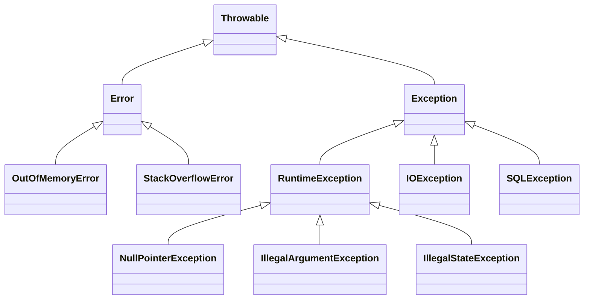
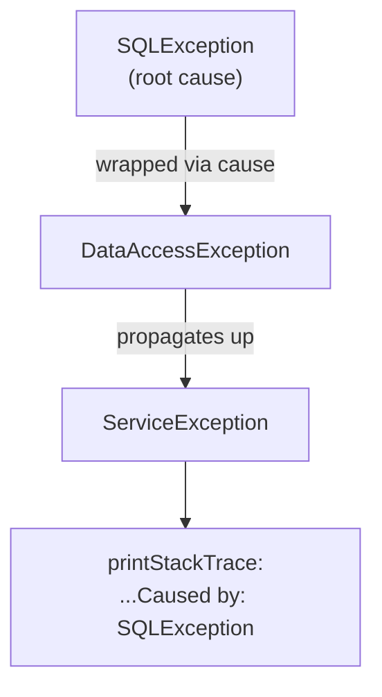

# Exceptions & Error Handling

> Fail loudly and recover deliberately — master the Throwable hierarchy, try-with-resources, exception chaining, and the checked-vs-unchecked design calls that keep error handling honest.

## Mental model

Everything throwable in Java descends from `Throwable`, which splits into two branches with very different intent:

- **`Error`** — serious JVM-level problems you're *not* expected to catch (`OutOfMemoryError`, `StackOverflowError`).
- **`Exception`** — application-level conditions you *can* handle. It further splits into:
  - **Checked exceptions** (extend `Exception`, not `RuntimeException`) — the compiler forces you to `catch` or `throws` them (`IOException`, `SQLException`).
  - **Unchecked exceptions** (`RuntimeException` and subclasses) — programming errors, not enforced by the compiler (`NullPointerException`, `IllegalArgumentException`).



::: info
Checked vs unchecked is a *compile-time* distinction only. At runtime they propagate identically up the call stack until a matching `catch` is found, or the thread dies and prints the stack trace.
:::

## Core concepts

### `try`/`catch`/`finally`

`try` guards risky code, `catch` handles specific types (most specific first), `finally` always runs — for cleanup that must happen regardless of success, failure, or `return`.

```java
public int parse(String s) {
    try {
        return Integer.parseInt(s);          // may throw NumberFormatException
    } catch (NumberFormatException e) {
        System.out.println("bad input: " + e.getMessage());
        return -1;
    } finally {
        System.out.println("done");          // runs in all cases
    }
}
// parse("42") => prints "done", returns 42
// parse("x")  => prints "bad input: ...", "done", returns -1
```

::: warning
Order `catch` blocks from most specific to most general. A broad `catch (Exception e)` before `catch (IOException e)` won't compile — the second is unreachable.
:::

### try-with-resources & `AutoCloseable`

Any resource implementing `AutoCloseable` is closed automatically at the end of the `try` block — in **reverse** order of declaration — even on exception. This replaces error-prone manual `finally` cleanup.

```java
// Resources closed automatically, reverse order, even if body throws
try (var in = Files.newBufferedReader(Path.of("in.txt"));
     var out = Files.newBufferedWriter(Path.of("out.txt"))) {
    String line;
    while ((line = in.readLine()) != null) {
        out.write(line.toUpperCase());
        out.newLine();
    }
} catch (IOException e) {
    throw new UncheckedIOException("copy failed", e);
}
// out is closed first, then in
```

```java
class Connection implements AutoCloseable {
    Connection() { System.out.println("open"); }
    public void close() { System.out.println("close"); } // called automatically
}

try (var c = new Connection()) {
    System.out.println("use");
}
// => open / use / close
```

::: tip
If the body throws *and* `close()` throws, the body's exception wins and the close exception is attached as a **suppressed** exception — retrievable via `Throwable.getSuppressed()`. With manual `finally`, a throwing `close()` would silently mask the real error.
:::

### Multi-catch

Handle unrelated exception types with one block when the response is identical — no duplicated handler.

```java
try {
    doRiskyWork();
} catch (IOException | SQLException e) {     // one handler, two types
    log.error("I/O or DB failure", e);
    throw new ServiceException("work failed", e);
}
```

::: warning
In a multi-catch the parameter `e` is **effectively final** — you can't reassign it. And the types listed must not be subclasses of one another (that would be redundant).
:::

### Custom exceptions

Define domain-specific exceptions to convey intent. Extend `RuntimeException` for programming/recoverable-by-caller-rarely cases; extend `Exception` only when the caller is genuinely expected to recover and you want compiler enforcement.

```java
public class InsufficientFundsException extends RuntimeException {
    private final BigDecimal shortfall;

    public InsufficientFundsException(BigDecimal shortfall) {
        super("short by " + shortfall);      // message
        this.shortfall = shortfall;
    }
    public BigDecimal getShortfall() { return shortfall; }
}

void withdraw(Account a, BigDecimal amt) {
    if (a.balance().compareTo(amt) < 0)
        throw new InsufficientFundsException(amt.subtract(a.balance()));
}
```

### Exception chaining (the `cause`)

Wrap a low-level exception in a higher-level one while **preserving** the original via the cause — never discard the root error. The full chain prints in the stack trace as "Caused by:".

```java
try {
    repository.load(id);
} catch (SQLException e) {
    // pass e as the cause — keeps the original stack trace
    throw new DataAccessException("failed to load " + id, e);
}
```



::: danger
`throw new DataAccessException("failed")` *without* passing `e` throws away the original stack trace and message — the hardest debugging mistake to undo. Always chain: `new XException(msg, cause)`.
:::

### `finally` pitfalls

A `return` (or `throw`) inside `finally` **overrides** any return/exception from the `try` or `catch` — silently swallowing exceptions and surprising readers.

```java
int broken() {
    try {
        throw new RuntimeException("real error");
    } finally {
        return 42;        // BUG: swallows the exception, returns 42
    }
}
System.out.println(broken()); // => 42  (exception vanished!)
```

::: danger
Never `return`, `break`, `continue`, or `throw` from a `finally` block. It discards in-flight exceptions and return values. Use try-with-resources for cleanup so you never need logic in `finally`.
:::

### Stack traces

A stack trace records the call chain at the point the exception was created. Read it top-down: the top frame is where it was thrown; "Caused by:" sections reveal the wrapped root cause.

```java
try {
    Integer.parseInt("oops");
} catch (NumberFormatException e) {
    log.error("parse failed", e);            // log the throwable — keeps the trace
    // e.getMessage()    -> "For input string: \"oops\""
    // e.getStackTrace() -> StackTraceElement[]
}
```

::: tip
Log the exception object (`log.error("msg", e)`), not `e.getMessage()` — passing the message string alone loses the stack trace. And don't `e.printStackTrace()` in production code; route through your logger.
:::

### Rethrowing and precise propagation

Sometimes you catch to add context or clean up, then rethrow. Since Java 7, the compiler does **precise rethrow analysis**: catching a broad type and rethrowing it lets `throws` declare only the specific types that can actually flow through.

```java
// Caller's throws clause can be `throws IOException, SQLException`
// even though we catch the broad Exception — precise rethrow analysis.
void process() throws IOException, SQLException {
    try {
        readFile();   // throws IOException
        query();      // throws SQLException
    } catch (Exception e) {
        log.warn("processing failed, rethrowing", e);
        throw e;      // type narrowed to IOException | SQLException
    }
}
```

::: tip
Wrap-and-rethrow when you cross an abstraction boundary (DB → service); plain rethrow (after logging/cleanup) when the caller already understands the exception type. Avoid catch-log-rethrow at *every* layer — it produces duplicate stack traces in the logs.
:::

### Resources declared elsewhere (Java 9+)

Try-with-resources can use an **effectively final** variable declared before the `try`, not just one declared inside the parentheses.

```java
var reader = Files.newBufferedReader(Path.of("data.txt")); // effectively final
try (reader) {                 // Java 9+: reuse the existing variable
    System.out.println(reader.readLine());
}                              // reader.close() still called automatically
```

### Checked vs unchecked — the design debate

Checked exceptions force callers to acknowledge recoverable failures at compile time, but they leak through APIs, fight with streams/lambdas (functional interfaces don't declare them), and tempt developers into empty `catch` blocks. Modern frameworks (Spring) and most new APIs lean **unchecked**.

```java
// Checked: caller MUST handle or declare
void readConfig() throws IOException { Files.readString(Path.of("c.cfg")); }

// Unchecked wrapper: cleaner for callers, common in modern code
String readConfigUnchecked() {
    try { return Files.readString(Path.of("c.cfg")); }
    catch (IOException e) { throw new UncheckedIOException(e); }
}
```

::: info
Rule of thumb: use **unchecked** for programming errors and conditions the caller usually can't fix (`IllegalArgumentException`, `IllegalStateException`). Reserve **checked** for genuinely recoverable, expected conditions where you want the compiler to enforce handling. When in doubt, prefer unchecked.
:::

## Common pitfalls

- **Swallowing exceptions** — an empty `catch {}` hides failures; at minimum log, ideally rethrow.
- **Catching `Exception`/`Throwable` broadly** — masks bugs and `Error`s; catch the narrowest type.
- **Losing the cause** — rethrow with `new X(msg, cause)`, never bare `new X(msg)`.
- **`return`/`throw` in `finally`** — silently discards in-flight exceptions.
- **Manual close in `finally`** — leaks on exceptions and masks errors; use try-with-resources.
- **Exceptions for control flow** — they're costly (stack capture) and obscure intent; use conditionals.
- **`printStackTrace()` in production** — goes to stderr, bypasses logging; use a logger.
- **Catching `NullPointerException`** to paper over a missing null check — fix the cause instead.

## Best practices

- Throw early, catch late — validate inputs at the boundary, handle where you can actually recover.
- Always preserve the cause via exception chaining.
- Use try-with-resources for anything `AutoCloseable`.
- Prefer unchecked exceptions for new APIs; reserve checked for recoverable conditions.
- Make exception messages actionable — include the offending value/id.
- Define a small set of meaningful custom exceptions instead of generic `RuntimeException`.
- Log the throwable object (with stack trace), and log it once — don't log-and-rethrow at every layer.
- Fail fast: detect invalid state immediately rather than letting corruption propagate.

## Interview quick-reference

| Concept | Key point |
| --- | --- |
| `Throwable` | Root of `Error` and `Exception` |
| `Error` | JVM-level, don't catch (`OutOfMemoryError`) |
| Checked | Extends `Exception`; compiler enforces catch/throws |
| Unchecked | Extends `RuntimeException`; not enforced |
| `finally` | Always runs; never `return`/`throw` from it |
| try-with-resources | Auto-closes `AutoCloseable` in reverse order |
| Suppressed exceptions | Close-time errors attached via `getSuppressed()` |
| Multi-catch | One handler, multiple unrelated types; `e` is final |
| Exception chaining | Wrap with cause to preserve the root stack trace |
| Custom exceptions | Domain intent; usually extend `RuntimeException` |
| Checked vs unchecked design | Unchecked for bugs/unrecoverable; checked for recoverable |
| Best practice | Don't swallow, preserve cause, fail fast, log the throwable |

See the [interview questions](../questions/exceptions) for drilling.
