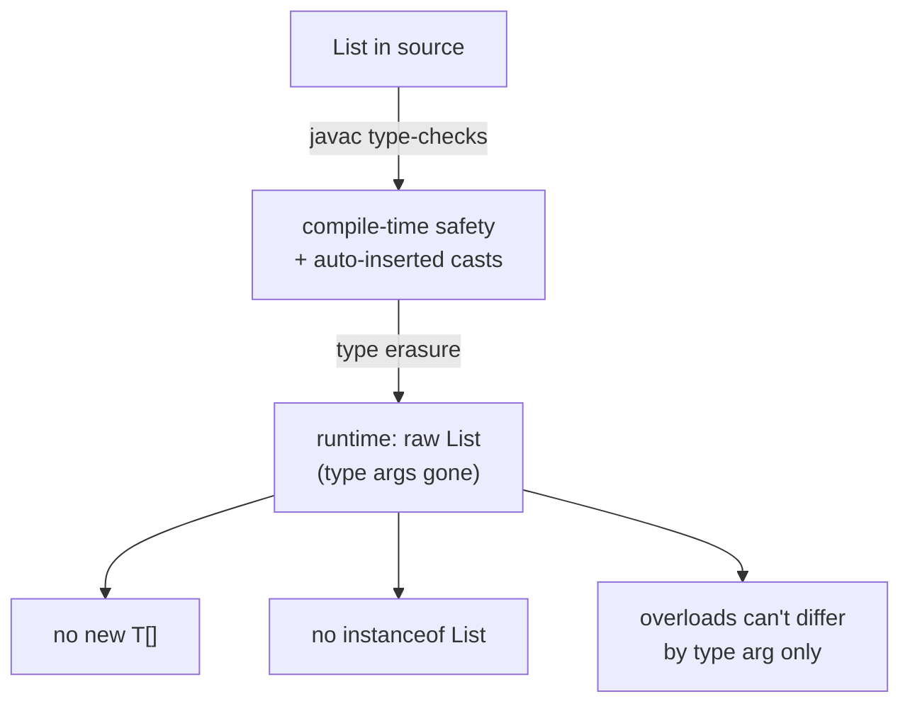
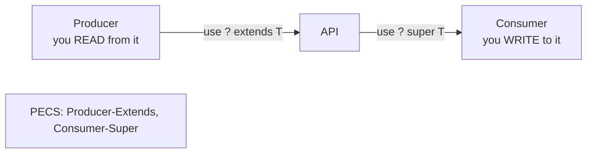

# Generics

> Type-safe abstraction over types — generic classes and methods, bounded type parameters, wildcards, the PECS rule, and the type-erasure reality that explains every generics quirk in Java.

## Mental model

Generics let you write code parameterized by type, so the **compiler** enforces type safety and inserts casts for you — `List<String>` can only hold `String`s, checked at compile time. The catch is **type erasure**: generics exist only during compilation. At runtime `List<String>` and `List<Integer>` are both just `List`; the type arguments are erased. Every generics surprise — no `new T[]`, no `instanceof List<String>`, unchecked-cast warnings — traces back to erasure.

The other core idea is **variance**. `List<String>` is *not* a subtype of `List<Object>` (generics are invariant). Wildcards (`? extends`, `? super`) reintroduce controlled variance, and the **PECS** rule tells you which to use.



## Core concepts

### Generic classes

A generic class declares one or more **type parameters** in angle brackets. Conventional names: `T` (type), `E` (element), `K`/`V` (key/value), `R` (result), `N` (number).

```java
public class Box<T> {
    private T value;
    public Box(T value) { this.value = value; }
    public T get() { return value; }
    public void set(T value) { this.value = value; }
}

var sBox = new Box<>("hi");          // diamond <> infers Box<String>
String s = sBox.get();               // no cast needed — compiler guarantees String
System.out.println(s);               // => hi

var iBox = new Box<Integer>(42);
int n = iBox.get();
// sBox.set(42);                      // compile error: not a String
```

### Generic methods

A method can declare its own type parameters (before the return type), independent of any class type parameters. The compiler usually **infers** them from the arguments.

```java
public class Util {
    // <T> declared before the return type
    public static <T> T firstOrNull(java.util.List<T> list) {
        return list.isEmpty() ? null : list.get(0);
    }

    public static <K, V> java.util.Map<V, K> invert(java.util.Map<K, V> in) {
        var out = new java.util.HashMap<V, K>();
        in.forEach((k, v) -> out.put(v, k));
        return out;
    }
}

String first = Util.firstOrNull(java.util.List.of("a", "b"));   // T inferred String
System.out.println(first);                                       // => a
// Explicit witness if inference can't help: Util.<String>firstOrNull(list)
```

### Bounded type parameters

`<T extends Bound>` constrains `T` to a subtype, unlocking that type's methods inside the generic code. Multiple bounds use `&` (at most one class, then interfaces).

```java
// T must be Comparable so we can call compareTo
public static <T extends Comparable<T>> T max(T a, T b) {
    return a.compareTo(b) >= 0 ? a : b;
}

System.out.println(max(3, 9));        // => 9
System.out.println(max("apple", "pear"));   // => pear

// Multiple bounds: class/interface(s) joined by &
public static <T extends Number & Comparable<T>> T clampToZero(T n) {
    return n.doubleValue() < 0 ? null : n;   // Number methods + Comparable available
}
```

::: info
`extends` in a bound means "is a subtype of" for both classes *and* interfaces — there is no `implements` keyword in generic bounds. `<T extends Comparable<T>>` is the canonical "must be orderable" constraint.
:::

### Wildcards: `?`, upper-bounded, lower-bounded

A wildcard `?` is an *unknown* type, used at a variable/parameter position (not in a class/method type-parameter declaration). It reintroduces variance that invariance forbids.

```java
// Unbounded: read structure but not element type
static void printSize(java.util.List<?> list) {
    System.out.println(list.size());     // ok: size() doesn't depend on element type
    // list.add(something);              // illegal except null — type is unknown
}

// Upper-bounded: "some subtype of Number" — you can READ Numbers out
static double sum(java.util.List<? extends Number> nums) {
    double total = 0;
    for (Number n : nums) total += n.doubleValue();   // safe to read as Number
    return total;
}

// Lower-bounded: "some supertype of Integer" — you can WRITE Integers in
static void addInts(java.util.List<? super Integer> sink) {
    sink.add(1);
    sink.add(2);                         // safe to write Integers
}

System.out.println(sum(java.util.List.of(1, 2.5, 3L)));   // => 6.5
var dest = new java.util.ArrayList<Number>();
addInts(dest);
System.out.println(dest);               // => [1, 2]
```

### PECS — Producer Extends, Consumer Super

The rule for choosing a wildcard: if a parameter **produces** values you read out, use `? extends T`; if it **consumes** values you put in, use `? super T`. `Collections.copy(dest, src)` is the textbook case.

```java
// src PRODUCES T's (extends); dest CONSUMES T's (super)
public static <T> void copy(java.util.List<? super T> dest,
                            java.util.List<? extends T> src) {
    for (int i = 0; i < src.size(); i++) {
        dest.set(i, src.get(i));        // read from src, write to dest
    }
}

var src  = java.util.List.of(1, 2, 3);                 // List<Integer> (producer)
var dest = new java.util.ArrayList<Number>(            // List<Number>  (consumer)
        java.util.List.of(0, 0, 0));
copy(dest, src);
System.out.println(dest);               // => [1, 2, 3]
```



::: tip
Memory hook: **PECS — Producer Extends, Consumer Super.** A `? extends T` collection is read-only for elements (you can't safely add); a `? super T` collection is write-only-ish (reads come back as `Object`). If a parameter is both produced and consumed, use an exact type `T` (no wildcard).
:::

### Type erasure and its consequences

Generics are a **compile-time** feature. The compiler checks types, inserts casts, then *erases* type parameters to their bounds (`T` → `Object`, `T extends Number` → `Number`). The bytecode has no generic type info.

```java
var a = new java.util.ArrayList<String>();
var b = new java.util.ArrayList<Integer>();
System.out.println(a.getClass() == b.getClass());   // => true — both just ArrayList

// Consequences that all stem from erasure:
// 1) Can't test a parameterized type at runtime:
//    if (a instanceof List<String>) {}   // compile error (use List<?>)
// 2) Can't create a generic array:
//    T[] arr = new T[10];                // compile error
// 3) Can't overload on type args alone:
//    void f(List<String> s){} void f(List<Integer> i){}  // same erasure — clash
// 4) Static fields can't use the class type parameter (one class, all params share it)
```

::: warning
Because of erasure you'll meet **unchecked cast** warnings (e.g. `(List<String>) someRawList`) — the compiler can't verify them, so the burden is on you. Suppress *narrowly* with `@SuppressWarnings("unchecked")` on the smallest scope, and only after you've reasoned that the cast is actually safe.
:::

### `Class<T>` type tokens

Since the runtime type is erased, pass a `Class<T>` token when you need the actual type at runtime — for reflection, deserialization, or `cast`. This is the standard workaround for "I need `T` at runtime".

```java
public static <T> T parse(String json, Class<T> type) {
    // a real parser would use `type`; here we just demo runtime knowledge of T
    System.out.println("decoding into " + type.getSimpleName());
    return type.cast(makeInstance(type));
}

// Usage mirrors Jackson's objectMapper.readValue(json, User.class)
record User(String name) {}
// User u = parse(jsonString, User.class);   // => decoding into User
```

### Generic inheritance and invariance

Generics are **invariant**: `List<String>` is not a `List<Object>`, even though `String` is an `Object`. This prevents a real hole — otherwise you could insert an `Integer` into a `List<String>`. Subtyping flows through the *raw* type (`ArrayList<String>` is a `List<String>`), not through the type argument.

```java
java.util.List<String> strings = new java.util.ArrayList<>();   // ArrayList<String> IS-A List<String>
// java.util.List<Object> objs = strings;     // COMPILE ERROR — invariance

// Why it must be forbidden (the hole it prevents):
// objs.add(42);            // would smuggle an Integer into a List<String>
// String s = strings.get(0);   // ...and explode here

// Use a wildcard when you genuinely want "list of some type":
java.util.List<? extends Object> any = strings;   // ok, read-only for elements
```

### Generic constraints in practice: self-referential bounds

A recurring interview pattern is the **self-referential** (recursive) generic bound `<T extends Comparable<T>>` — and its cousin, the "curiously recurring template pattern" used for fluent builders that return the right subtype.

```java
// Sort needs each element to be comparable to its own type:
public static <T extends Comparable<T>> T maxOf(java.util.List<T> items) {
    T best = items.get(0);
    for (T item : items) if (item.compareTo(best) > 0) best = item;
    return best;
}
System.out.println(maxOf(java.util.List.of(3, 9, 1)));   // => 9

// Fluent builder that stays type-correct across a subclass hierarchy:
abstract class Builder<T extends Builder<T>> {
    protected abstract T self();
    T common() { /* ... */ return self(); }   // returns the concrete subtype
}
class UserBuilder extends Builder<UserBuilder> {
    protected UserBuilder self() { return this; }
    UserBuilder name(String n) { return this; }
}
// new UserBuilder().common().name("Ada");   // chaining keeps UserBuilder type
```

::: info
`<T extends Comparable<T>>` reads as "T must be comparable *to itself*". This is why `Collections.sort`, `max`, and `min` constrain their element type — it guarantees `a.compareTo(b)` is type-correct.
:::

### Common pitfalls: arrays vs generics, raw types

Arrays are **covariant** and reified (they know their element type at runtime); generics are invariant and erased. Mixing them is the classic trap, alongside dropping to **raw types** which disables all generic checking.

```java
// Arrays are covariant + reified -> runtime failure, not compile failure:
Object[] arr = new String[3];
arr[0] = 42;             // compiles! throws ArrayStoreException at runtime

// You cannot create generic arrays (erasure):
// List<String>[] bad = new List<String>[10];   // compile error

// Raw types defeat generics — avoid:
java.util.List raw = new java.util.ArrayList();   // raw: no type checking
raw.add("ok");
raw.add(42);             // compiles, but corrupts the list
// String s = (String) raw.get(1);   // ClassCastException at runtime
```

::: danger
Never use **raw types** (`List` instead of `List<...>`) in new code — they silently turn off compile-time type checking and resurrect `ClassCastException`s. And never expose a generic API that internally stores into an `Object[]`-backed structure without guarding casts; prefer a `List<T>` over a homemade generic array.
:::

## Common pitfalls

- **Raw types.** `List` instead of `List<T>` disables type checking. *Fix:* always parameterize; use `<?>` if the type is truly unknown.
- **Expecting runtime generic info.** `instanceof List<String>` and `new T[]` don't compile because of erasure. *Fix:* use `List<?>` for the check and pass a `Class<T>` token when you need the type.
- **Wrong wildcard direction.** Trying to `add` to a `? extends T` list, or reading specific types from `? super T`. *Fix:* apply PECS — extends to produce, super to consume.
- **Array/generic mixing.** Covariant arrays throw `ArrayStoreException`; generic arrays don't compile. *Fix:* prefer `List<T>` over arrays in generic code.
- **Ignoring unchecked warnings.** They flag casts the compiler can't verify. *Fix:* eliminate them or suppress narrowly after proving safety.
- **Type parameter in a static field.** `static T field;` is illegal — `T` is per-instance. *Fix:* make the method generic, or use a different design.
- **Overloading on type args only.** Two methods differing only by `List<String>` vs `List<Integer>` clash after erasure. *Fix:* rename one.

## Best practices

- Always parameterize types; never use raw types in new code.
- Prefer generic methods with inference over explicit type witnesses; use the diamond `<>` on construction.
- Bound type parameters (`<T extends Comparable<T>>`) to unlock needed operations.
- Apply PECS: `? extends T` for producers you read, `? super T` for consumers you write, exact `T` when both.
- Pass `Class<T>` tokens when you need the type at runtime (reflection/deserialization).
- Favor `List<T>` over arrays inside generic code to avoid covariance traps.
- Keep `@SuppressWarnings("unchecked")` to the narrowest possible scope, with a comment justifying safety.

## Interview quick-reference

| Concept | Key point |
| --- | --- |
| Generic class | `class Box<T>` — type-safe container, no casts |
| Generic method | `<T> T m(...)` declares its own type param; usually inferred |
| Bounded type | `<T extends Number & Comparable<T>>` — `extends` covers classes & interfaces |
| Wildcard `?` | Unknown type at use site; reintroduces variance |
| `? extends T` | Upper bound — producer, read-only for elements |
| `? super T` | Lower bound — consumer, safe to write |
| PECS | Producer Extends, Consumer Super; exact `T` if both |
| Type erasure | Generics are compile-time only; runtime is raw |
| Erasure effects | No `new T[]`, no `instanceof List<String>`, no type-arg-only overloads |
| `Class<T>` token | Recover the runtime type for reflection/deserialization |
| Invariance | `List<String>` is not `List<Object>`; arrays are covariant (`ArrayStoreException`) |
| Raw types | Disable type checking — never use in new code |

See the [interview questions](../questions/generics) for drilling.
