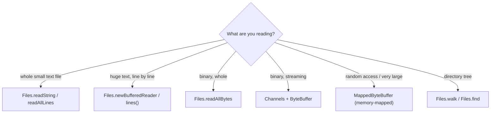

# I/O, Files & NIO.2

> Choose the right stream, manage resources with try-with-resources, and use the modern `java.nio.file` API for files, channels, buffers, and memory-mapped I/O.

## Mental model

Java I/O comes in two layers that solve different problems:

- **Streams (`java.io`)** model a *sequential flow of data*. `InputStream`/`OutputStream` move **bytes**; `Reader`/`Writer` move **characters** (bytes decoded through a charset). You compose them with **decorators** — wrap a raw stream in a buffer, then in a higher-level reader.
- **NIO / NIO.2 (`java.nio`)** is **buffer-oriented**, not stream-oriented. Data lives in a `ByteBuffer` and moves through a `Channel`. `java.nio.file` (NIO.2, Java 7) adds the modern `Path`/`Files` API that replaces the legacy `File` class.

The decision tree: text or bytes? small or huge? one-shot read or streaming? Always wrap I/O in **try-with-resources** so handles close deterministically.



## Core concepts

### Byte streams vs character streams

`InputStream`/`OutputStream` handle raw bytes (images, serialized data). `Reader`/`Writer` handle text and need a **charset** to decode bytes into `char`s. Always specify the charset explicitly — never rely on the platform default.

```java
import java.io.*;
import java.nio.charset.StandardCharsets;

// Byte stream: copy raw bytes
try (InputStream in = new FileInputStream("a.bin");
     OutputStream out = new FileOutputStream("b.bin")) {
    in.transferTo(out);                 // Java 9+: efficient byte pump
}

// Character stream: ALWAYS pass a charset (default is platform-dependent!)
try (Reader r = new InputStreamReader(new FileInputStream("a.txt"), StandardCharsets.UTF_8)) {
    int c = r.read();                   // reads one decoded char (or -1 at EOF)
}
```

::: warning
`new FileReader("a.txt")` (without a charset) uses the **platform default** charset — a top source of "works on my machine" bugs across OSes. Since Java 11, `FileReader`/`FileWriter` accept a `Charset`; use it, or prefer the `Files` helpers which default to UTF-8.
:::

### Buffering & try-with-resources

Unbuffered streams hit the OS on every byte — catastrophically slow. Wrap them in a `Buffered*` decorator, which reads/writes in chunks. `try-with-resources` guarantees `close()` (and a final flush) even on exception, in reverse order of declaration.

```java
import java.io.*;
import java.nio.charset.StandardCharsets;

try (BufferedReader br = new BufferedReader(
        new InputStreamReader(new FileInputStream("big.txt"), StandardCharsets.UTF_8))) {
    String line;
    while ((line = br.readLine()) != null) {   // buffered: one syscall per chunk
        process(line);
    }
}   // br.close() called automatically, even if process() throws
```

::: tip
Any object implementing `AutoCloseable` works in try-with-resources. Declare multiple resources separated by `;` — they close in reverse order. If both the body and `close()` throw, the body's exception wins and the close exception is attached as a **suppressed** exception (`Throwable#getSuppressed`).
:::

### `java.nio.file`: Path & Files

`Path` represents a filesystem location (replaces `File`); `Files` is a utility class of static operations. This is the modern API — richer, with real exceptions instead of boolean returns.

```java
import java.nio.file.*;
import java.nio.charset.StandardCharsets;

Path dir  = Path.of("/var/data");           // Path.of (Java 11) or Paths.get
Path file = dir.resolve("report.csv");      // /var/data/report.csv

Files.createDirectories(dir);               // mkdir -p, no error if it exists
boolean exists = Files.exists(file);
long size = Files.size(file);
Files.copy(file, dir.resolve("backup.csv"), StandardCopyOption.REPLACE_EXISTING);
Files.move(file, dir.resolve("archive.csv"), StandardCopyOption.ATOMIC_MOVE);
Files.delete(file);                         // throws NoSuchFileException if absent
```

::: info
`File#delete()` returned `false` silently on failure; `Files.delete()` throws a descriptive `IOException`. Prefer `Files`/`Path` everywhere in new code — the old `java.io.File` API swallows errors as booleans.
:::

### Reading & writing text (Java 11+ helpers)

For small-to-medium files, the one-liners are unbeatable. They default to **UTF-8** since Java 11+.

```java
import java.nio.file.*;
import java.util.List;

Path p = Path.of("notes.txt");

Files.writeString(p, "hello\nworld\n");          // Java 11: write whole string
String all = Files.readString(p);                // Java 11: read whole file => "hello\nworld\n"

List<String> lines = Files.readAllLines(p);      // List of lines (loads all into memory)
Files.write(p, List.of("a", "b"), StandardOpenOption.APPEND);  // append lines
```

For large files, **stream lazily** so you never load everything at once:

```java
try (var stream = Files.lines(p)) {              // lazy, must be closed (try-with-resources)
    long blanks = stream.filter(String::isBlank).count();
}
```

::: warning
`Files.readAllLines`/`readString`/`readAllBytes` load the **entire file into memory** — fine for config files, a disaster for multi-GB logs. Use `Files.lines()` or a `BufferedReader` for large inputs, and remember `Files.lines()` returns a `Stream` you must close.
:::

### Reading & writing binary

```java
import java.nio.file.*;

byte[] data = Files.readAllBytes(Path.of("image.png"));   // whole file as bytes
Files.write(Path.of("copy.png"), data);

// Streaming binary with explicit buffer:
try (var in = Files.newInputStream(Path.of("in.bin"));
     var out = Files.newOutputStream(Path.of("out.bin"))) {
    byte[] buf = new byte[8192];
    int n;
    while ((n = in.read(buf)) != -1) out.write(buf, 0, n);
}
```

### Walking the file tree

```java
import java.nio.file.*;
import java.util.stream.Stream;

// Recursively find .java files (lazy, depth-limited, must close the stream)
try (Stream<Path> paths = Files.walk(Path.of("src"))) {
    paths.filter(p -> p.toString().endsWith(".java"))
         .forEach(System.out::println);
}

// Files.find with a matcher predicate:
try (Stream<Path> hits = Files.find(Path.of("src"), Integer.MAX_VALUE,
        (path, attrs) -> attrs.isRegularFile() && attrs.size() > 1_000_000)) {
    hits.forEach(System.out::println);          // files > 1 MB
}
```

::: tip
`Files.walk` follows the tree but does **not** follow symlinks by default and can throw mid-stream on an unreadable directory. For robust traversal with per-error control, use `Files.walkFileTree` with a `SimpleFileVisitor` and override `visitFileFailed`.
:::

### Serialization, `transient`, and its risks

Java's built-in serialization (`Serializable`) turns an object graph into bytes. `transient` fields are skipped. It is convenient but **dangerous** and largely discouraged for external data.

```java
import java.io.*;

class Session implements Serializable {
    private static final long serialVersionUID = 1L;  // pin the version explicitly
    String user;
    transient String password;        // NOT serialized (security/sensitivity)
}

try (var out = new ObjectOutputStream(Files.newOutputStream(Path.of("s.ser")))) {
    out.writeObject(new Session());
}
```

::: danger
**Never deserialize untrusted data** with `ObjectInputStream` — crafted byte streams trigger gadget-chain remote code execution (one of the most exploited Java vulnerabilities). Prefer a data format like **JSON (Jackson)** or **Protobuf**. If you must use Java serialization, apply a `setObjectInputFilter` (Java 9+) allowlist. Forgetting `serialVersionUID` means a generated value that breaks compatibility on any class change.
:::

### Channels & buffers (ByteBuffer)

NIO works with `Channel`s (bidirectional, to files/sockets) and `ByteBuffer`s. A buffer has **position**, **limit**, and **capacity**; you write into it, then **flip()** to read out.

```java
import java.nio.*;
import java.nio.channels.*;
import java.nio.file.*;

try (FileChannel ch = FileChannel.open(Path.of("data.bin"), StandardOpenOption.READ)) {
    ByteBuffer buf = ByteBuffer.allocate(1024);
    int n = ch.read(buf);          // fills buffer; position advances to n
    buf.flip();                    // limit=position, position=0 -> ready to READ
    while (buf.hasRemaining()) {
        byte b = buf.get();        // consume
    }
    buf.clear();                   // position=0, limit=capacity -> ready to WRITE again
}
```

::: info
The buffer dance: **write → flip() → read → clear() (or compact())**. `flip()` prepares a freshly-written buffer for reading; `clear()` resets for the next write (it does *not* erase data). `allocateDirect()` creates an off-heap buffer that avoids a copy for channel I/O but costs more to allocate.
:::

### Memory-mapped files

`MappedByteBuffer` maps a file region directly into virtual memory, letting the OS page data in on demand — extremely fast for large files and random access.

```java
import java.nio.*;
import java.nio.channels.*;
import java.nio.file.*;

try (FileChannel ch = FileChannel.open(Path.of("huge.dat"),
        StandardOpenOption.READ, StandardOpenOption.WRITE)) {
    MappedByteBuffer mm = ch.map(FileChannel.MapMode.READ_WRITE, 0, ch.size());
    byte first = mm.get(0);        // direct memory access, no read() syscall
    mm.put(0, (byte) 42);          // write back through the OS page cache
}
```

::: warning
A `MappedByteBuffer`'s underlying mapping is released only when the buffer is GC'd — non-deterministic. On Windows the file may stay locked until then. For controlled lifetime and large mappings, prefer the Java 21 **Foreign Function & Memory API** (`Arena`/`MemorySegment.map`).
:::

### Blocking vs non-blocking I/O

Classic streams and `FileChannel` are **blocking**: the thread waits for the data. NIO `Selector` + non-blocking `SocketChannel`s let one thread manage thousands of connections (the basis of Netty).

```java
// Non-blocking socket: register channels with a Selector, react to readiness events
selector.select();                 // blocks once, then returns ready keys
for (SelectionKey key : selector.selectedKeys()) {
    if (key.isReadable()) { /* read without blocking the thread */ }
}
```

::: tip
With Java 21 **virtual threads**, the classic "blocking is wasteful" argument weakens: a blocking read on a virtual thread parks cheaply and frees its carrier. For most server code, **blocking I/O on virtual threads** is now simpler than a `Selector` event loop and scales comparably.
:::

### `InputStream.transferTo`

`transferTo(OutputStream)` (Java 9) pumps an entire stream efficiently in one call — replacing hand-rolled buffer loops.

```java
import java.io.*;
import java.nio.file.*;

try (InputStream in = new URL("https://example.com/f.zip").openStream();
     OutputStream out = Files.newOutputStream(Path.of("f.zip"))) {
    long bytes = in.transferTo(out);   // returns total bytes copied
    System.out.println(bytes + " bytes");
}
```

## Common pitfalls

- **Omitting the charset** on readers/writers — platform-default decoding corrupts text across OSes.
- **Unbuffered streams** — per-byte syscalls; always wrap in a `Buffered*` decorator.
- **Not closing resources** — leaks file handles; use try-with-resources (and close `Files.lines()`/`Files.walk()` streams).
- **`readAllLines`/`readString` on huge files** — OOM; stream with `Files.lines()`.
- **Deserializing untrusted data** — remote code execution via gadget chains.
- **Forgetting `serialVersionUID`** — generated value breaks compatibility on any change.
- **Forgetting `buffer.flip()`** — you read garbage or nothing from a NIO buffer.
- **Assuming `MappedByteBuffer` frees promptly** — mapping released only at GC; file may stay locked.
- **Using `java.io.File`** for new code — swallows failures as booleans; prefer `Path`/`Files`.

## Best practices

- Default to `java.nio.file` (`Path`/`Files`) over the legacy `File`.
- Always specify `StandardCharsets.UTF_8` explicitly for text I/O.
- Wrap raw streams in buffered decorators; manage everything with try-with-resources.
- Use the Java 11 one-liners (`readString`/`writeString`/`readAllBytes`) for small files; stream large ones.
- Use `transferTo` instead of manual copy loops.
- Avoid Java serialization for external data — use JSON/Protobuf; if unavoidable, install an `ObjectInputFilter` allowlist.
- For high-concurrency servers, prefer blocking I/O on virtual threads over a hand-written `Selector` loop.
- Close NIO `Stream` results (`Files.lines`, `Files.walk`) explicitly.

## Interview quick-reference

| Concept | Key point |
| --- | --- |
| Byte vs char streams | InputStream/OutputStream = bytes; Reader/Writer = chars + charset |
| Charset | Always pass UTF-8; default is platform-dependent |
| Buffering | Buffered* decorators turn per-byte syscalls into chunked I/O |
| try-with-resources | Auto-closes AutoCloseable; suppressed exceptions on double-throw |
| Path / Files | Modern NIO.2 API; throws real exceptions vs File's booleans |
| readString/writeString | Java 11 one-liners, default UTF-8, whole-file in memory |
| Files.lines / walk | Lazy streams for large files/trees; must be closed |
| Serialization | Serializable + transient; pin serialVersionUID |
| Deserialization risk | Untrusted ObjectInputStream = RCE; use JSON/Protobuf |
| Channel + ByteBuffer | Buffer flow: write → flip → read → clear |
| MappedByteBuffer | File mapped to memory; freed only at GC |
| Blocking vs non-blocking | Selector for many sockets; or blocking on virtual threads (21) |
| transferTo | Java 9 efficient stream-to-stream copy |

See the [interview questions](../questions/io-nio) for drilling.
