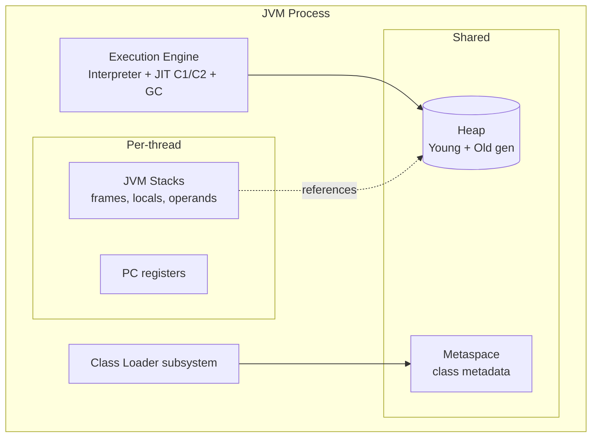

# Memory, JVM Internals & Garbage Collection

> Understand how the JVM loads classes, lays out objects across stack and heap, and how modern collectors (G1, ZGC, Shenandoah) reclaim memory — plus how to tune and diagnose it.

## Mental model

The JVM is a stack-based virtual machine that turns bytecode into native execution and manages memory automatically. Two ideas explain almost everything:

1. **Memory is partitioned by lifetime and ownership.** Each thread gets a private **stack** (frames, locals, operands — fast, auto-reclaimed on return). All threads share the **heap** (objects) and **metaspace** (class metadata). Local *references* live on the stack; the *objects* they point to live on the heap.
2. **GC is driven by reachability and the generational hypothesis.** An object is garbage when it is unreachable from any GC root. Because most objects die young, the heap is split into a **young** generation (collected often and cheaply) and an **old** generation (collected rarely).



## Core concepts

### JVM architecture: class loader & runtime data areas

Class loading is **lazy** and follows a parent-delegation model: a request goes up to Bootstrap → Platform → Application loader; each delegates to its parent before trying itself. Loading runs three phases: **Loading → Linking (verify, prepare, resolve) → Initialization** (`<clinit>` runs static initializers, exactly once, thread-safely).

```java
public class Demo {
    static { System.out.println("init Demo"); }  // runs once, on first active use
    static int X = compute();                      // static fields prepared then initialized
    static int compute() { return 42; }
}
// Referencing Demo.X for the first time triggers loading + initialization.
```

::: info
Parent delegation is why you can't override `java.lang.String`: the Bootstrap loader always loads core classes first. The runtime data areas are: the **method area/metaspace** (class structures), the **heap** (objects), per-thread **stacks**, **PC registers**, and **native method stacks**.
:::

### Stack vs heap

The stack holds method frames; each frame has the method's local variables and operand stack. Primitives and *references* live here and vanish when the method returns. Objects always live on the heap.

```java
void example() {
    int n = 10;                 // primitive 'n' on the stack frame
    int[] data = new int[1000]; // reference 'data' on stack; the array on the HEAP
    Point p = new Point(1, 2);  // 'p' on stack; Point object on the HEAP
}   // frame popped: n, data, p references gone; objects become garbage if unreachable
```

::: warning
Deep or infinite recursion exhausts the per-thread stack and throws `StackOverflowError` (not `OutOfMemoryError`). Tune thread stack size with `-Xss` (e.g. `-Xss1m`); larger stacks mean fewer threads fit in memory.
:::

### Method area / Metaspace

Since Java 8 the permanent generation is gone; class metadata lives in **Metaspace**, allocated from **native memory** (outside the heap), growing on demand by default.

```bash
# Cap metaspace so a class-loader leak fails fast instead of eating native memory
-XX:MetaspaceSize=128m      # initial high-water mark that triggers a GC
-XX:MaxMetaspaceSize=512m   # hard cap; exceeding it => OOM: Metaspace
```

::: danger
A `java.lang.OutOfMemoryError: Metaspace` usually means a **class-loader leak** — frameworks that redeploy or generate proxies/classes repeatedly without releasing old loaders. The heap can be fine while metaspace explodes.
:::

### Object layout & references

A heap object has a **header** (mark word + class pointer; ~12–16 bytes) followed by fields, padded to an 8-byte boundary. With **compressed oops** (default below ~32 GB heap) references are 4 bytes instead of 8.

```bash
# Below the compressed-oops threshold, references are 32-bit -> big memory saving.
# Crossing ~32GB of heap silently disables compressed oops and can use MORE memory
# at 33GB than at 31GB. Stay under the threshold or jump well past it.
-XX:+UseCompressedOops      # on by default when heap < ~32GB
```

::: tip
Use JOL (Java Object Layout) to inspect real sizes: an empty object is ~16 bytes, and an `Integer` is ~16 bytes vs 4 for an `int`. Boxing in hot collections is a hidden memory and GC cost.
:::

### GC fundamentals: reachability & the generational hypothesis

An object is **live** if reachable from a **GC root** (active stack locals, static fields, JNI refs, etc.). The collector traces from roots; everything not reached is reclaimed. The **weak generational hypothesis** — most objects die young — justifies splitting the heap:

- **Young gen** = Eden + two Survivor spaces (S0/S1). New objects go in Eden. A **minor GC** copies survivors between survivor spaces, aging them.
- **Old gen** = objects that survived enough minor GCs (the *tenuring threshold*). Collected by slower **major/full GC**.


### GC algorithms

| Collector | Flag | Best for |
| --- | --- | --- |
| Serial | `-XX:+UseSerialGC` | Single core, small heaps, containers with 1 CPU |
| Parallel (throughput) | `-XX:+UseParallelGC` | Batch jobs; max throughput, pauses OK |
| G1 (default since 11) | `-XX:+UseG1GC` | General-purpose; balanced latency/throughput |
| ZGC | `-XX:+UseZGC` | Very large heaps, sub-millisecond pauses |
| Shenandoah | `-XX:+UseShenandoahGC` | Low pause, concurrent compaction (OpenJDK) |

**G1** divides the heap into equal **regions** and collects the regions with the most garbage first ("garbage first"), targeting a pause goal. **ZGC** and **Shenandoah** do concurrent marking *and* compaction using load/read barriers, keeping pauses ~sub-millisecond regardless of heap size.

```bash
# G1 aiming for ~50ms pauses
java -XX:+UseG1GC -XX:MaxGCPauseMillis=50 -Xmx4g App

# ZGC (generational since Java 21) for a huge heap with tiny pauses
java -XX:+UseZGC -XX:+ZGenerational -Xmx32g App
```

::: info
Since Java 21, ZGC is **generational** (`-XX:+ZGenerational`), giving it young/old separation for much better throughput than the single-gen ZGC while keeping pauses under a millisecond. Pauses no longer scale with heap size.
:::

### GC tuning & flags

Measure before tuning. Start by setting the heap and a collector, then observe.

```bash
-Xms2g -Xmx2g                 # set min=max to avoid resize pauses in servers
-XX:+UseG1GC
-XX:MaxGCPauseMillis=200      # G1 soft pause target
-Xlog:gc*:file=gc.log:time,uptime:filecount=5,filesize=10m  # unified GC logging
-XX:+HeapDumpOnOutOfMemoryError -XX:HeapDumpPath=/var/dumps  # capture on OOM
```

::: tip
Set `-Xms` equal to `-Xmx` on long-running servers: it pre-commits the heap, avoids resize stalls, and surfaces memory problems at startup rather than under load. In containers, prefer `-XX:MaxRAMPercentage=75.0` so the JVM respects cgroup limits.
:::

### `-Xmx` / `-Xms` and container awareness

```bash
-Xms512m -Xmx512m                 # fixed heap
-XX:MaxRAMPercentage=75.0         # OR: use 75% of the container's memory limit
```

::: warning
Heap is only part of the picture. Total RSS = heap + metaspace + thread stacks + JIT code cache + direct/native buffers + GC structures. A container killed with OOMKilled (exit 137) while heap looks fine usually means **off-heap** memory (direct `ByteBuffer`, metaspace, too many threads) blew the cgroup limit. Use Native Memory Tracking (`-XX:NativeMemoryTracking=summary`).
:::

### Escape analysis & JIT (C1/C2)

The JVM interprets bytecode first, then the JIT compiles **hot** methods to native code. **C1** (client) compiles fast with light optimization; **C2** (server) compiles aggressively. Tiered compilation uses both: C1 for quick startup, C2 for hot paths.

**Escape analysis** is a C2 optimization: if an object provably never escapes a method, the JVM can **scalar-replace** it (allocate fields in registers/stack) — effectively no heap allocation.

```java
double distance(double x, double y) {
    Point p = new Point(x, y);   // C2 may prove p doesn't escape -> NO heap alloc
    return Math.sqrt(p.x*p.x + p.y*p.y);
}
```

```bash
-XX:+PrintCompilation         # see methods as they get JIT-compiled
-XX:+TieredCompilation        # default: C1 then C2
-XX:ReservedCodeCacheSize=256m # JIT code cache; "CodeCache is full" disables JIT
```

::: info
JIT optimizations are **speculative** and can deoptimize: C2 inlines based on observed types, and if assumptions break it falls back to the interpreter. This is why micro-benchmarks need warmup (use JMH) — early measurements catch interpreted/C1 code.
:::

### Memory leaks in Java

GC frees *unreachable* objects, so a "leak" in Java means you accidentally keep objects **reachable**. Classic culprits:

```java
// 1) Unbounded static cache — entries never evicted
static final Map<Key, Value> CACHE = new HashMap<>();  // grows forever => use a bounded cache

// 2) Listeners/callbacks registered but never removed
bus.register(this);   // forgotten unregister keeps 'this' alive

// 3) ThreadLocal in a pool not removed (carrier thread keeps the value)

// 4) Custom keys without equals/hashCode -> map entries you can never find or remove
```

::: danger
Diagnose with a heap dump (`jmap -dump:live,format=b,file=heap.hprof <pid>`) analyzed in Eclipse MAT — find the **dominator tree** and the GC roots holding the suspect. Bounded caches (Caffeine) and weak references break common leaks.
:::

### Reference types: strong, soft, weak, phantom

| Reference | Collected when | Use case |
| --- | --- | --- |
| Strong | Never while reachable | Normal references |
| Soft | Only under memory pressure | Memory-sensitive caches |
| Weak | At next GC if only weakly reachable | Canonicalizing maps, `WeakHashMap` |
| Phantom | After finalization, enqueued | Cleanup actions (replace finalizers) |

```java
import java.lang.ref.*;

Object o = new Object();
WeakReference<Object> weak = new WeakReference<>(o);
o = null;                         // only the weak ref remains
System.gc();
System.out.println(weak.get());   // => null (likely cleared at next GC)

// PhantomReference + Cleaner for deterministic native-resource cleanup:
Cleaner cleaner = Cleaner.create();
cleaner.register(resource, () -> freeNativeHandle());  // runs when resource is GC'd
```

::: tip
Prefer `java.lang.ref.Cleaner` over `finalize()` (deprecated for removal). Finalizers are unpredictable, slow GC, and can resurrect objects. `WeakHashMap` keys are weakly held — handy for metadata that should die with its subject.
:::

### OutOfMemoryError types

Not all OOMs are the same; the message tells you where to look.

```bash
java.lang.OutOfMemoryError: Java heap space        # heap too small or a leak -> dump it
java.lang.OutOfMemoryError: GC overhead limit exceeded  # >98% time in GC, <2% reclaimed
java.lang.OutOfMemoryError: Metaspace              # class-loader leak / too many classes
java.lang.OutOfMemoryError: Direct buffer memory   # off-heap NIO buffers; tune -XX:MaxDirectMemorySize
java.lang.OutOfMemoryError: unable to create native thread  # OS thread limit / -Xss too large
```

## Common pitfalls

- **Confusing `StackOverflowError` with `OutOfMemoryError`** — the former is stack depth, the latter heap/native exhaustion.
- **Sizing only `-Xmx`** — forgetting metaspace, direct buffers, and thread stacks count toward container RSS.
- **Crossing the ~32 GB compressed-oops boundary** — 33 GB heap can hold *less* than 31 GB.
- **Calling `System.gc()`** — usually a code smell; it can force a full GC and stall the app.
- **Treating reachable objects as freeable** — Java leaks are reachability bugs (static maps, listeners, ThreadLocals).
- **Relying on `finalize()`** — non-deterministic and deprecated; use `Cleaner`/try-with-resources.
- **Benchmarking without warmup** — you measure the interpreter, not JIT-compiled code.
- **Unbounded caches** — the most common production leak.

## Best practices

- Set `-Xms == -Xmx` on servers; use `-XX:MaxRAMPercentage` in containers.
- Pick the collector by goal: throughput → Parallel; latency → G1; huge heap + tiny pauses → ZGC/Shenandoah.
- Always enable `-XX:+HeapDumpOnOutOfMemoryError` and unified GC logging in production.
- Use bounded caches (Caffeine) and weak/soft references to cap memory growth.
- Replace finalizers with `Cleaner` or try-with-resources for resource cleanup.
- Track total native footprint with Native Memory Tracking, not just heap.
- Profile with JFR/async-profiler and analyze heap dumps in MAT before tuning flags.
- Minimize boxing in hot paths to cut allocation and GC pressure.

## Interview quick-reference

| Concept | Key point |
| --- | --- |
| Class loading | Lazy, parent-delegation; Load → Link → Initialize (`<clinit>` once) |
| Stack vs heap | Stack: per-thread frames/locals/refs; Heap: shared objects |
| Metaspace | Class metadata in native memory (replaced PermGen in Java 8) |
| Compressed oops | 4-byte refs below ~32GB heap; saves memory |
| GC roots / reachability | Live = reachable from roots; unreachable = collectible |
| Generational hypothesis | Most objects die young → young/old gen split |
| Minor vs major GC | Minor: young gen, cheap; major/full: old gen, costly |
| G1 | Region-based, garbage-first, pause-target driven; default |
| ZGC / Shenandoah | Concurrent compaction; sub-ms pauses; ZGC generational in 21 |
| -Xms/-Xmx | Min/max heap; set equal on servers to avoid resize pauses |
| Escape analysis | C2 scalar-replaces non-escaping objects (no heap alloc) |
| JIT C1/C2 | Tiered: C1 fast startup, C2 aggressive hot-path optimization |
| Memory leak | Accidental reachability (static maps, listeners, ThreadLocal) |
| Reference types | Strong/soft/weak/phantom — collected at different pressures |
| OOM variants | Heap space, Metaspace, GC overhead, Direct buffer, native thread |
| Cleaner vs finalize | Use Cleaner/try-with-resources; finalize is deprecated |

See the [interview questions](../questions/memory-jvm) for drilling.
