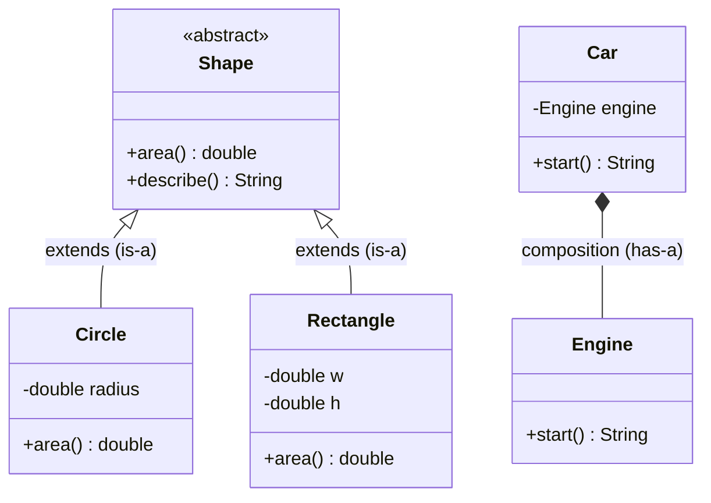
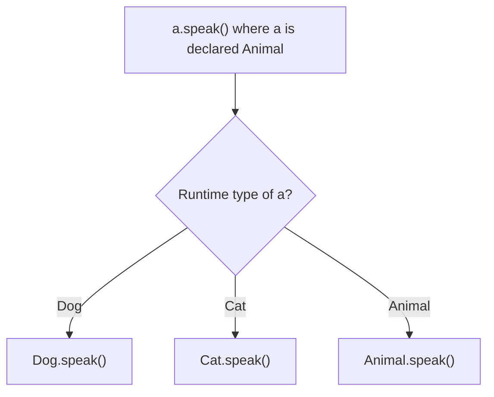

# Object-Oriented Programming & Design

> The four pillars in Java's type system — encapsulation, inheritance, polymorphism, abstraction — plus constructors, overriding rules, the `equals`/`hashCode`/`toString` contracts, immutability, and SOLID design.

## Mental model

A **class** is a blueprint bundling state (fields) with behavior (methods); an **object** is an instance with its own state on the heap. Java expresses the four OOP pillars through specific language features: **encapsulation** via access modifiers and accessors, **inheritance** via `extends`, **polymorphism** via virtual method dispatch (overriding), and **abstraction** via `abstract` classes and `interface`s.

The deepest practical lesson is **composition over inheritance**: model "has-a" relationships by *holding* collaborators rather than forcing everything into an "is-a" hierarchy. Inheritance couples a subclass to its parent's implementation; composition keeps pieces swappable and testable.



## Core concepts

### Classes, objects, and constructors

A constructor initializes a new instance. If you declare none, the compiler supplies a no-arg default; declaring *any* constructor removes that default. Constructors can be overloaded and chained with `this(...)`.

```java
public class Point {
    private final int x;
    private final int y;

    public Point(int x, int y) {   // primary constructor
        this.x = x;                // `this` disambiguates field from parameter
        this.y = y;
    }

    public Point() {               // overloaded, delegates via this(...)
        this(0, 0);                // must be the first statement
    }

    public int x() { return x; }
    public int y() { return y; }
}

var origin = new Point();          // (0, 0)
var p = new Point(3, 4);
System.out.println(p.x());         // => 3
```

### Encapsulation and access modifiers

Encapsulation hides internal state behind a controlled API. Java has four access levels controlling visibility.

```java
public class Account {
    private double balance;        // hidden — only this class touches it directly

    public void deposit(double amount) {     // public API enforces invariants
        if (amount <= 0) throw new IllegalArgumentException("amount must be > 0");
        balance += amount;
    }

    public double balance() { return balance; }   // read-only accessor
}
```

| Modifier | Same class | Same package | Subclass | World |
| --- | --- | --- | --- | --- |
| `private` | yes | no | no | no |
| *(package-private)* | yes | yes | no | no |
| `protected` | yes | yes | yes | no |
| `public` | yes | yes | yes | yes |

::: tip
Default to the most restrictive modifier that works — usually `private` fields with `public` methods. Widen access only when a real collaborator needs it. Package-private (no keyword) is an underused sweet spot for intra-module helpers.
:::

### Inheritance, `this` and `super`

A subclass `extends` one parent (Java has single class inheritance), reusing and specializing it. `super(...)` calls a parent constructor; `super.method()` calls the parent's version.

```java
public class Animal {
    protected final String name;
    public Animal(String name) { this.name = name; }
    public String speak() { return "..."; }
}

public class Dog extends Animal {
    private final String breed;
    public Dog(String name, String breed) {
        super(name);               // must be first; runs Animal's constructor
        this.breed = breed;
    }
    @Override
    public String speak() {
        return super.speak() + " woof";   // extend, don't fully replace
    }
}

System.out.println(new Dog("Rex", "Lab").speak());   // => ... woof
```

::: warning
Constructors are **not inherited**. If the parent has no no-arg constructor, every subclass constructor must explicitly call `super(...)` — otherwise the implicit `super()` fails to compile.
:::

### Polymorphism: overloading vs overriding

**Overloading** is compile-time (static) dispatch: same method name, different parameter lists. **Overriding** is runtime (dynamic) dispatch: a subclass replaces an inherited method; the actual object's type decides which runs.

```java
public class Printer {
    void print(int x)    { System.out.println("int " + x); }     // overload
    void print(String s) { System.out.println("str " + s); }     // overload
}

Animal a = new Dog("Rex", "Lab");   // declared Animal, actual Dog
System.out.println(a.speak());      // => ... woof  (override -> Dog's version wins)
```



::: info
Always annotate overrides with `@Override`. The compiler then rejects accidental near-misses (wrong signature, typo) that would otherwise silently become a *new* overloaded method instead of an override.
:::

### Abstract classes vs interfaces

An **abstract class** can hold state and partial implementation but can't be instantiated. An **interface** is a pure contract — though since Java 8 it can carry `default` and `static` methods, and since Java 9 `private` helpers. A class extends one class but implements many interfaces.

```java
public abstract class Shape {
    public abstract double area();             // subclasses must implement
    public String describe() {                 // shared concrete behavior
        return "area=" + area();
    }
}

public interface Drawable {
    void draw();                               // implicitly public abstract

    default void render() {                     // Java 8+: default method
        log("rendering");
        draw();
    }
    static Drawable blank() { return () -> {}; } // Java 8+: static factory
    private void log(String m) { System.out.println(m); } // Java 9+: private helper
}

public class Circle extends Shape implements Drawable {
    private final double r;
    public Circle(double r) { this.r = r; }
    @Override public double area() { return Math.PI * r * r; }
    @Override public void draw() { System.out.println("O"); }
}
```

::: tip
Choose an **interface** for a capability/contract that unrelated types can share ("can be compared", "can be drawn") and to allow multiple implementation. Choose an **abstract class** when subclasses share real state or a substantial common implementation. Prefer interfaces by default.
:::

### Composition over inheritance

Inheritance is the strongest coupling in OOP: a subclass depends on its parent's internals and is locked to one hierarchy. Composition holds collaborators as fields, allowing swap, reuse, and easy testing.

```java
public interface Engine { String start(); }

public class ElectricEngine implements Engine {
    public String start() { return "hum"; }
}

public class Car {
    private final Engine engine;               // Car HAS-A Engine
    public Car(Engine engine) { this.engine = engine; }   // injected -> swappable
    public String start() { return engine.start(); }
}

System.out.println(new Car(new ElectricEngine()).start());   // => hum
```

### `final` — variables, methods, classes

`final` means "assign once / cannot change". On a field it forces single assignment (key to immutability), on a method it forbids overriding, on a class it forbids subclassing (`String`, `Integer` are `final`).

```java
final int MAX = 100;          // constant local
// MAX = 200;                  // compile error

public final class Money { }   // cannot be subclassed

public class Base {
    public final void audit() { }   // subclasses cannot override
}
```

### `equals`, `hashCode`, and `toString` contracts

Override `equals` for logical equality, and **always** override `hashCode` alongside it: equal objects must have equal hash codes, or they break in `HashMap`/`HashSet`. `toString` gives a readable representation.

```java
import java.util.Objects;

public final class User {
    private final String email;
    private final String name;
    public User(String email, String name) { this.email = email; this.name = name; }

    @Override public boolean equals(Object o) {
        if (this == o) return true;
        if (!(o instanceof User u)) return false;   // pattern matching (Java 16+)
        return email.equals(u.email);               // identity = email
    }
    @Override public int hashCode() { return Objects.hash(email); }  // same field!
    @Override public String toString() { return "User[" + email + "]"; }
}

var a = new User("a@x.com", "Ann");
var b = new User("a@x.com", "Anne");
System.out.println(a.equals(b));   // => true
System.out.println(a.hashCode() == b.hashCode());   // => true (contract holds)
```

::: danger
Overriding `equals` without `hashCode` is a classic bug: two "equal" objects land in different hash buckets, so `set.contains(equalObject)` returns `false` and map lookups miss. The `equals` contract also requires reflexive, symmetric, transitive, and consistent behavior — base equality on the **same fields** used in `hashCode`.
:::

### Immutability

An immutable object can't change after construction — inherently thread-safe, cacheable, and safe to share. Make the class `final`, all fields `private final`, set them only in the constructor, and defensively copy mutable inputs/outputs. **Records** (Java 16+) automate this.

```java
import java.util.List;

public record Order(String id, List<String> items) {
    public Order {                              // compact canonical constructor
        items = List.copyOf(items);             // defensive immutable copy
    }
}

var o = new Order("o1", List.of("a", "b"));
System.out.println(o.items());     // => [a, b]
// o.items().add("c");             // UnsupportedOperationException — truly immutable
```

### SOLID principles

Five design guidelines for maintainable OO code:

- **S**ingle Responsibility — a class has one reason to change.
- **O**pen/Closed — open for extension, closed for modification (add behavior via new types, not edits).
- **L**iskov Substitution — subtypes must be usable wherever the base type is expected, without surprises.
- **I**nterface Segregation — many small, focused interfaces beat one fat one.
- **D**ependency Inversion — depend on abstractions, not concretions.

```java
// Dependency Inversion + Open/Closed: high-level code depends on an interface,
// new notifiers plug in without touching NotificationService.
public interface Notifier { void send(String msg); }

public class EmailNotifier implements Notifier {
    public void send(String msg) { System.out.println("email: " + msg); }
}

public class NotificationService {
    private final Notifier notifier;            // abstraction, not a concrete class
    public NotificationService(Notifier notifier) { this.notifier = notifier; }
    public void alert(String msg) { notifier.send(msg); }
}

new NotificationService(new EmailNotifier()).alert("hi");   // => email: hi
```

## Common pitfalls

- **`equals` without `hashCode`.** Breaks hash-based collections. *Fix:* override both on the same fields (or use a record).
- **Forgetting `@Override`.** A typo silently creates an overload, not an override. *Fix:* always annotate; let the compiler verify.
- **Calling overridable methods from a constructor.** The subclass override runs before its fields are initialized. *Fix:* make such methods `private`/`final`, or don't call them during construction.
- **Deep inheritance hierarchies.** Fragile and rigid. *Fix:* prefer composition; keep hierarchies shallow.
- **Leaking mutable state.** Returning the internal `List` lets callers mutate your object. *Fix:* return `List.copyOf(...)` or an unmodifiable view.
- **Violating Liskov.** A subclass that throws on an inherited operation surprises callers. *Fix:* don't subclass when the "is-a" doesn't fully hold.
- **Protected/public fields.** Expose state directly and break encapsulation. *Fix:* keep fields `private`, expose behavior.

## Best practices

- Make fields `private final` and prefer immutability; reach for `record` for data carriers.
- Favor composition over inheritance; inject collaborators through the constructor.
- Program to interfaces; depend on abstractions (Dependency Inversion).
- Always pair `equals`/`hashCode` and provide a `toString` for debuggability.
- Annotate every override with `@Override`.
- Keep classes single-responsibility and interfaces small and focused.
- Use the narrowest access modifier that compiles.

## Interview quick-reference

| Concept | Key point |
| --- | --- |
| Four pillars | Encapsulation, inheritance, polymorphism, abstraction |
| Constructor | Initializes instance; `this()` chains, `super()` calls parent (first stmt) |
| Access modifiers | `private` < package-private < `protected` < `public` |
| Overload vs override | Compile-time (signatures) vs runtime (dynamic dispatch) |
| Abstract class vs interface | Shared state/impl vs contract; one class, many interfaces |
| Interface methods | `default`, `static` (8), `private` (9) beyond abstract |
| Composition over inheritance | "has-a" is more flexible than deep "is-a" |
| `final` | One-time assign / no override / no subclass |
| `equals`/`hashCode` | Override together on the same fields; reflexive, symmetric, transitive |
| Immutability | `final` class + `final` fields + defensive copies; records automate it |
| SOLID | SRP, Open/Closed, Liskov, Interface Segregation, Dependency Inversion |

See the [interview questions](../questions/oop-design) for drilling.
