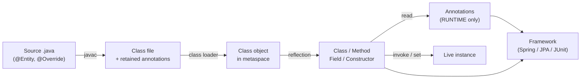
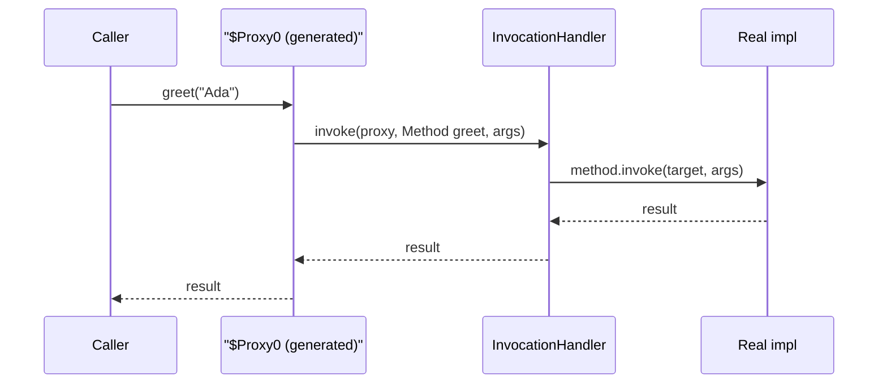
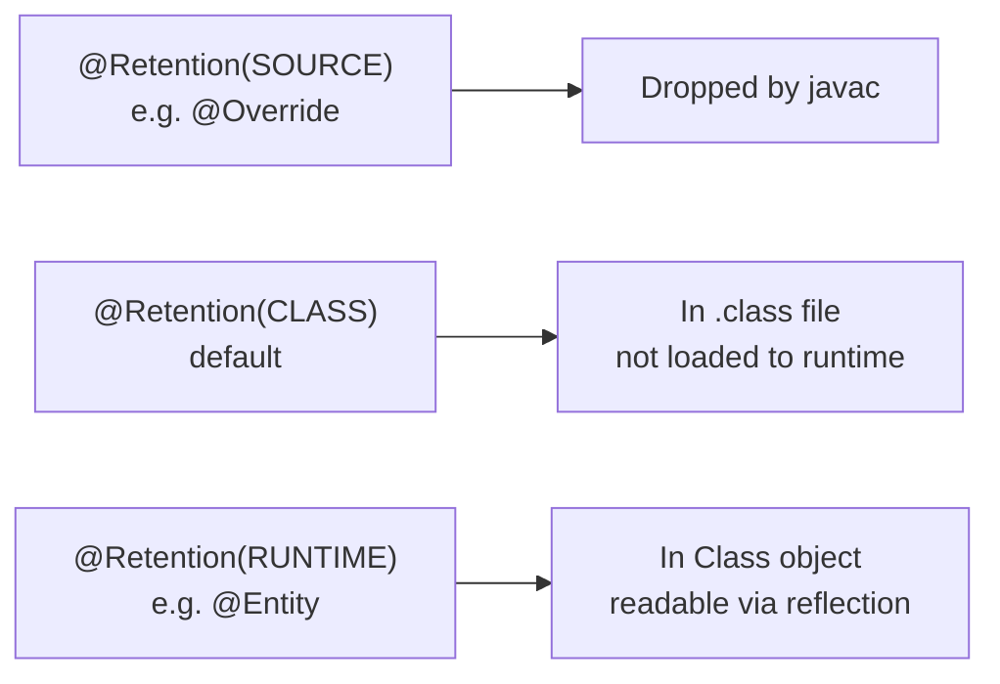

# Reflection & Annotations

> Inspect and manipulate classes, methods, and fields at runtime; attach declarative metadata with annotations; and understand the proxy-and-reflection machinery that powers Spring, JPA, Jackson, and JUnit.

## Mental model

Java is statically typed and compiled, yet at runtime every loaded type carries a live description of itself — its **`Class` object** in the JVM's metaspace. **Reflection** is the API that reads that description: enumerate constructors, methods, and fields, read their modifiers and generic types, then *invoke* or *mutate* them without compile-time knowledge of the concrete type. **Annotations** are typed metadata you attach to declarations; with `RUNTIME` retention they survive into that same `Class` object, where reflection can read them. Together they are the foundation of "convention over configuration": a framework scans your classes, finds annotations, and reflectively wires behavior you never explicitly called.



## Core concepts

### Obtaining a `Class` object

Every type has exactly one `Class` instance per class loader. There are three ways in; they differ in *when* the class is resolved and initialized.

```java
// 1. Compile-time literal — does NOT run static initializers
Class<String> c1 = String.class;

// 2. From an instance — the runtime type (not the declared type)
Object o = "hello";
Class<?> c2 = o.getClass();              // => class java.lang.String

// 3. By name — loads AND initializes the class; throws if absent
Class<?> c3 = Class.forName("java.util.ArrayList");

System.out.println(c1.getName());        // => java.lang.String
System.out.println(c1.getSimpleName());  // => String
System.out.println(c3.getPackageName()); // => java.util
```

::: info
`Class.forName(name)` runs static initializers; the JDBC `Class.forName("com.mysql.cj.Driver")` idiom relied on that side effect to register the driver. The two-arg `Class.forName(name, false, loader)` loads *without* initializing.
:::

### Inspecting structure: methods, fields, constructors

`getXxx()` returns **public** members including inherited ones; `getDeclaredXxx()` returns **all** members declared on that class (any visibility) but *not* inherited ones.

```java
import java.lang.reflect.*;

Class<?> c = java.util.ArrayList.class;

for (Method m : c.getDeclaredMethods()) {
    if (m.getName().equals("add")) {
        System.out.println(m.getName()
            + " params=" + m.getParameterCount()
            + " returns=" + m.getReturnType().getSimpleName()
            + " public=" + Modifier.isPublic(m.getModifiers()));
    }
}
// => add params=1 returns=boolean public=true
// => add params=2 returns=void public=true

Field size = c.getDeclaredField("size");          // private int size
System.out.println(Modifier.isPrivate(size.getModifiers())); // => true

Constructor<?> ctor = c.getDeclaredConstructor(int.class);
System.out.println(ctor.getParameterTypes()[0]);  // => int
```

| Call | Visibility | Inherited? |
| --- | --- | --- |
| `getMethods()` | public only | yes |
| `getDeclaredMethods()` | all (private/protected/package) | no |
| `getFields()` | public only | yes |
| `getDeclaredFields()` | all | no |

### Creating instances and invoking methods

Prefer `getDeclaredConstructor().newInstance()` over the deprecated `Class.newInstance()` — the latter swallows constructor exceptions and only handles no-arg public constructors.

```java
import java.lang.reflect.*;

Class<?> c = StringBuilder.class;
Object sb = c.getDeclaredConstructor(String.class).newInstance("Re");

Method append = c.getMethod("append", String.class);
append.invoke(sb, "flection");          // mutates sb in place

Method toString = c.getMethod("toString");
System.out.println(toString.invoke(sb)); // => Reflection
```

`invoke` returns `Object` (primitives are autoboxed); a checked exception thrown inside the target surfaces wrapped in an `InvocationTargetException` — unwrap with `getCause()`.

### Generics and arrays at runtime

Generic *type arguments* are erased, but declared generic signatures of fields, methods, and supertypes are retained and reachable.

```java
import java.lang.reflect.*;
import java.util.*;

class Box { List<String> items; }

Field f = Box.class.getDeclaredField("items");
ParameterizedType pt = (ParameterizedType) f.getGenericType();
System.out.println(pt.getActualTypeArguments()[0]); // => class java.lang.String

Object arr = Array.newInstance(int.class, 3);        // reflective array
Array.set(arr, 0, 42);
System.out.println(Array.get(arr, 0));               // => 42
```

### Accessing private members and `setAccessible`

Reflection can read and write `private` members after a successful `setAccessible(true)` — invaluable for testing, serialization, and DI, but it punches through encapsulation.

```java
import java.lang.reflect.Field;

class Secret { private String token = "hidden"; }

Secret s = new Secret();
Field f = Secret.class.getDeclaredField("token");
f.setAccessible(true);                  // suppress Java access checks
System.out.println(f.get(s));           // => hidden
f.set(s, "rotated");
System.out.println(f.get(s));           // => rotated
```

::: warning
Since the **Java Platform Module System (Java 9+)**, `setAccessible(true)` on JDK internals or non-`open` modules throws `InaccessibleObjectException`. A module must `opens com.pkg;` (or `opens ... to some.module;`) to allow deep reflection. Application classes on the unnamed classpath are still open by default, which is why most app-level reflection "just works".
:::

::: danger
`setAccessible` also bypasses `final` semantics in surprising ways and breaks invariants the class author relied on. Mutating a `final` field via reflection is undefined for fields the JIT may have constant-folded (notably `String` internals). Treat deep reflection as a last resort, not a routine API.
:::

### Dynamic proxies

`java.lang.reflect.Proxy` synthesizes, at runtime, a class implementing a set of **interfaces**; every call is funneled into a single `InvocationHandler.invoke`. This is exactly how Spring's JDK proxies, MyBatis mappers, and mocking libraries intercept calls.

```java
import java.lang.reflect.*;

interface Service { String greet(String name); }

InvocationHandler handler = (proxy, method, args) -> {
    long start = System.nanoTime();
    Object result = "Hello, " + args[0];          // "real" logic or delegate
    System.out.println(method.getName() + " took "
        + (System.nanoTime() - start) + "ns");
    return result;
};

Service svc = (Service) Proxy.newProxyInstance(
    Service.class.getClassLoader(),
    new Class<?>[]{ Service.class },
    handler);

System.out.println(svc.greet("Ada"));
// => greet took 1234ns
// => Hello, Ada
```



::: info
JDK proxies require an **interface**. To proxy a concrete class, frameworks fall back to bytecode subclassing (CGLIB / ByteBuddy) — which is why Spring beans without interfaces get CGLIB proxies and cannot be `final`.
:::

### Built-in annotations

The compiler ships a handful of annotations that change *compilation*, not runtime behavior.

```java
class Base { void run() {} }

class Impl extends Base {
    @Override                    // compile error if it doesn't actually override
    void run() {}

    @Deprecated                  // warns callers; document the replacement
    void oldApi() {}

    @SafeVarargs                 // suppress unchecked-varargs warning on a safe method
    static <T> List<T> of(T... xs) { return List.of(xs); }
}

@FunctionalInterface             // compile error if it has != 1 abstract method
interface Transformer { String apply(String s); }
```

| Annotation | Effect |
| --- | --- |
| `@Override` | Enforces that a method overrides a supertype method |
| `@Deprecated` | Marks API as obsolete; compiler/IDE warnings |
| `@SuppressWarnings` | Silences named compiler warnings |
| `@FunctionalInterface` | Enforces a single abstract method |
| `@SafeVarargs` | Asserts a generic-varargs method is heap-pollution-safe |

### Meta-annotations: annotations on annotations

Meta-annotations configure how *your* annotations behave.

```java
import java.lang.annotation.*;

@Retention(RetentionPolicy.RUNTIME)   // keep at runtime so reflection sees it
@Target({ElementType.TYPE, ElementType.METHOD})  // where it may be placed
@Documented                            // include in Javadoc
@Inherited                             // subclasses inherit it (TYPE targets only)
public @interface Audited {
    String value() default "";
}
```

| Meta-annotation | Purpose |
| --- | --- |
| `@Retention` | How long it survives: `SOURCE` / `CLASS` / `RUNTIME` |
| `@Target` | Legal locations: `TYPE`, `METHOD`, `FIELD`, `PARAMETER`, ... |
| `@Documented` | Appears in generated Javadoc |
| `@Inherited` | A subclass inherits a class-level annotation from its superclass |
| `@Repeatable` | The annotation may appear multiple times on one element |

### Retention policies

Retention decides where the annotation lives — and whether reflection can ever see it.



- **`SOURCE`** — used by the compiler / APT, then discarded (`@Override`, Lombok's `@Getter`).
- **`CLASS`** — the default; written to the `.class` file but not retained by the JVM at load time (used by bytecode tools like nullability checkers).
- **`RUNTIME`** — retained and readable via reflection (`@Entity`, `@Autowired`, `@Test`). Frameworks need this.

### Custom annotations and reading them reflectively

Define a runtime annotation, place it, then discover it by scanning.

```java
import java.lang.annotation.*;
import java.lang.reflect.*;

@Retention(RetentionPolicy.RUNTIME)
@Target(ElementType.METHOD)
@interface Benchmark {
    int warmup() default 1;
}

class Jobs {
    @Benchmark(warmup = 3)
    void heavy() { /* ... */ }
    void plain() {}
}

for (Method m : Jobs.class.getDeclaredMethods()) {
    Benchmark b = m.getAnnotation(Benchmark.class);
    if (b != null) {
        System.out.println(m.getName() + " warmup=" + b.warmup());
    }
}
// => heavy warmup=3
```

`isAnnotationPresent`, `getAnnotation`, `getAnnotations`, and `getAnnotationsByType` (for `@Repeatable`) are the read API on every `AnnotatedElement` — classes, methods, fields, parameters, and even packages.

### Annotation processing (APT) overview

`SOURCE`-retention annotations are consumed at *compile time* by annotation processors registered via `javax.annotation.processing.Processor`. A processor runs in rounds during `javac`, inspects the program model (`Element`, `TypeMirror`), and typically **generates new source files** — it cannot rewrite existing ones.

```java
import javax.annotation.processing.*;
import javax.lang.model.element.*;
import java.util.Set;

@SupportedAnnotationTypes("com.example.Builder")
@SupportedSourceVersion(SourceVersion.RELEASE_21)
public class BuilderProcessor extends AbstractProcessor {
    @Override
    public boolean process(Set<? extends TypeElement> annotations, RoundEnvironment env) {
        for (Element e : env.getElementsAnnotatedWith(/* ... */ TypeElement.class)) {
            // emit a *.java file via processingEnv.getFiler()
        }
        return true;   // claim the annotations
    }
}
```

::: tip
APT is *zero-runtime-cost*: code is generated and compiled once. Lombok, MapStruct, Dagger, and Micronaut/Quarkus's AOT lean on it precisely to avoid reflection at runtime — faster startup and GraalVM-native friendliness.
:::

### How frameworks use reflection & annotations

The pattern is universal: scan classpath → find annotated elements → reflectively build behavior.

```java
// Sketch of a JUnit-style runner
import java.lang.reflect.Method;

for (Method m : testClass.getDeclaredMethods()) {
    if (m.isAnnotationPresent(Test.class)) {
        Object instance = testClass.getDeclaredConstructor().newInstance();
        try {
            m.invoke(instance);                 // run the test
            System.out.println(m.getName() + " PASSED");
        } catch (Exception ex) {
            System.out.println(m.getName() + " FAILED: " + ex.getCause());
        }
    }
}
```

- **Spring** — `@Component` scanning, `@Autowired` injection (set fields/constructors reflectively), `@Transactional`/`@Cacheable` via dynamic proxies.
- **JPA / Hibernate** — `@Entity`/`@Column` map fields to columns; reflection reads/writes persistent fields, often via generated proxies for lazy loading.
- **Jackson / Gson** — reflect over fields/getters to (de)serialize; `@JsonProperty` customizes names.
- **JUnit 5** — discovers `@Test`/`@BeforeEach` methods and invokes them reflectively.

### Performance & security considerations

Reflective access is slower than direct calls (member lookup, access checks, autoboxing, no inlining), though the modern JIT optimizes hot reflective calls well.

```java
import java.lang.reflect.Method;

Method m = Math.class.getMethod("abs", int.class);  // cache the Method!
long sum = 0;
for (int i = 0; i < 1_000_000; i++) {
    sum += (int) m.invoke(null, -i);                // hot loop, but reused Method
}
```

::: tip
Always **cache** `Class`/`Method`/`Field` lookups — `getDeclaredMethod` does a linear search each call. For the hottest paths, modern code uses `java.lang.invoke.MethodHandle` / `VarHandle` (JIT-friendly) or `LambdaMetafactory` to compile a reflective call into a direct functional-interface invocation.
:::

::: danger
Reflection is a security and integrity hazard: it can read secrets in private fields, mutate `final` state, and instantiate types the author never meant to expose. Deserializing untrusted data into reflectively-instantiated objects is a classic RCE vector. Under the JPMS, keep modules `closed` and `opens` only what truly needs deep reflection.
:::

## Common pitfalls

- **`getMethods` vs `getDeclaredMethods`** — confusing public-and-inherited with all-but-declared-only misses or over-reports members.
- **Ignoring `InvocationTargetException`** — the real failure is in `getCause()`; logging the wrapper hides it.
- **`Class.newInstance()`** — deprecated; swallows checked exceptions. Use `getDeclaredConstructor().newInstance()`.
- **Forgetting retention** — a `SOURCE`/`CLASS` annotation is invisible to reflection; framework annotations must be `RUNTIME`.
- **`setAccessible` under modules** — throws `InaccessibleObjectException` without an `opens` directive.
- **Not caching reflective handles** — repeated lookups in hot loops dominate runtime.
- **Assuming generics survive** — type *arguments* are erased; only declared signatures are reflectable.
- **Mutating `final` fields** — JIT constant-folding makes this undefined; never do it to `String`/wrapper internals.

## Best practices

- Reach for reflection only when static code genuinely cannot express the requirement (frameworks, tooling, tests).
- Cache `Class`/`Method`/`Field` objects; prefer `MethodHandle`/`VarHandle` on hot paths.
- Prefer **compile-time annotation processing** (APT, MapStruct, Dagger) over runtime reflection for startup speed and native-image support.
- Give custom annotations the *minimum* retention they need and an explicit `@Target`.
- Always unwrap `InvocationTargetException` when reporting failures.
- Under JPMS, expose deep reflection narrowly with `opens ... to <module>`, never blanket-open.
- Never reflectively instantiate types from untrusted input.

## Interview quick-reference

| Concept | Key point |
| --- | --- |
| `Class` object | One per type per loader; obtained via `.class`, `getClass()`, `Class.forName` |
| `getX` vs `getDeclaredX` | public+inherited vs all-visibility-but-declared-only |
| Invoke | `getDeclaredConstructor().newInstance()`, `Method.invoke`, unwrap `InvocationTargetException` |
| `setAccessible` | Bypasses access checks; throws under JPMS without `opens` |
| Dynamic proxy | `Proxy.newProxyInstance` + `InvocationHandler`; interfaces only |
| Built-in annotations | `@Override`, `@Deprecated`, `@FunctionalInterface`, `@SafeVarargs` |
| Meta-annotations | `@Retention`, `@Target`, `@Documented`, `@Inherited`, `@Repeatable` |
| Retention | `SOURCE` (dropped) / `CLASS` (default, not loaded) / `RUNTIME` (reflectable) |
| Read annotations | `isAnnotationPresent`, `getAnnotation`, `getAnnotationsByType` |
| APT | Compile-time processors generate source; zero runtime cost |
| Framework use | Scan → find annotations → reflect/proxy (Spring, JPA, Jackson, JUnit) |
| Performance | Cache handles; `MethodHandle`/`VarHandle` for hot paths |

See the [interview questions](../questions/reflection-annotations) for drilling.
