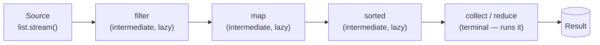
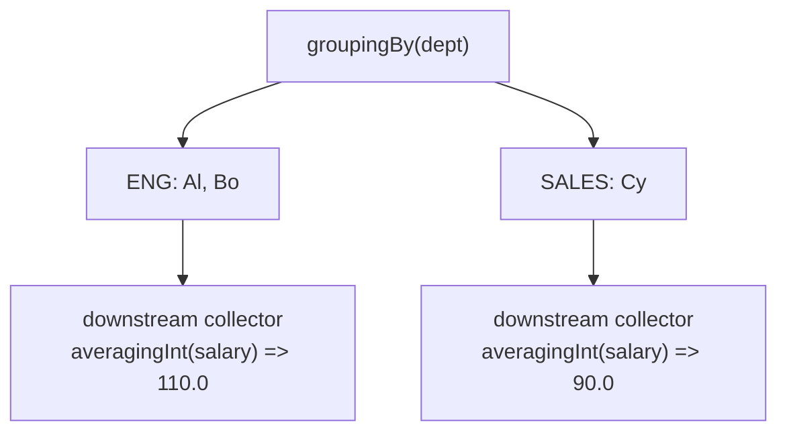

# Streams & Functional Programming

> Think in pipelines, not loops — lambdas, functional interfaces, lazy stream operations, and `Optional` give you declarative, composable data processing on the JVM.

## Mental model

A **lambda** is a compact implementation of a **functional interface** (an interface with exactly one abstract method, `@FunctionalInterface`). A **stream** is *not* a data structure — it's a one-shot pipeline over a source. Every pipeline has three parts:

- **Source** — `collection.stream()`, `Stream.of(...)`, `IntStream.range(...)`, `Files.lines(...)`.
- **Intermediate operations** — `map`, `filter`, `sorted`, `distinct`, `flatMap` — **lazy**, they return a new stream and do nothing until...
- **Terminal operation** — `collect`, `forEach`, `reduce`, `count`, `findFirst` — triggers execution and consumes the stream.



::: info
Laziness means intermediate ops fuse: each element flows through the whole chain before the next starts, and short-circuiting terminals (`findFirst`, `anyMatch`, `limit`) stop early. A stream can be consumed only **once**.
:::

## Core concepts

### Lambdas and method references

A lambda captures effectively-final local variables and supplies the single abstract method's body. A **method reference** is shorthand when the lambda just calls an existing method.

```java
Runnable r = () -> System.out.println("hi");          // no args
Comparator<String> byLen = (a, b) -> a.length() - b.length();

// Four method-reference flavors:
Function<String, Integer> len  = String::length;       // instance method of arg
Supplier<List<String>> factory = ArrayList::new;       // constructor
Function<String, Boolean> empt = String::isEmpty;      // unbound instance
var upper = (Function<String, String>) String::toUpperCase;
System.out.println(upper.apply("hi"));                 // => HI
```

### The core functional interfaces

`java.util.function` covers the common shapes. Memorize these five:

```java
Function<String, Integer> length = String::length;     // T -> R
length.apply("hello");                                  // => 5

Predicate<Integer> even = n -> n % 2 == 0;             // T -> boolean
even.test(4);                                           // => true

Supplier<Double> rng = Math::random;                   // () -> T
rng.get();                                              // => 0.0..1.0

Consumer<String> print = System.out::println;         // T -> void
print.accept("log");                                   // prints "log"

BiFunction<Integer, Integer, Integer> add = Integer::sum; // (T,U) -> R
add.apply(2, 3);                                        // => 5
```

They **compose**: `Function.andThen`/`compose`, `Predicate.and`/`or`/`negate`.

```java
Predicate<Integer> positiveEven = even.and(n -> n > 0);
Function<Integer, Integer> plus1times2 = ((Function<Integer,Integer>) n -> n + 1)
        .andThen(n -> n * 2);
System.out.println(plus1times2.apply(3)); // => 8  ((3+1)*2)
```

### `map`, `filter`, `reduce`

`map` transforms each element, `filter` keeps matches, `reduce` folds the stream to a single value.

```java
List<Integer> nums = List.of(1, 2, 3, 4, 5);

int sumOfSquaresOfEvens = nums.stream()
    .filter(n -> n % 2 == 0)   // 2, 4
    .map(n -> n * n)           // 4, 16
    .reduce(0, Integer::sum);  // 20
System.out.println(sumOfSquaresOfEvens); // => 20

Optional<Integer> max = nums.stream().reduce(Integer::max);
System.out.println(max.get()); // => 5
```

::: tip
The three-arg `reduce(identity, accumulator, combiner)` exists for **parallel** streams — the combiner merges partial results from different threads. For most code, prefer `collect` with a `Collector`.
:::

### `collect` and `Collectors`

`collect` performs a mutable reduction. `Collectors` is the toolbox.

```java
record Employee(String name, String dept, int salary) {}
var staff = List.of(
    new Employee("Al", "ENG", 100), new Employee("Bo", "ENG", 120),
    new Employee("Cy", "SALES", 90));

List<String> names = staff.stream().map(Employee::name).toList(); // Java 16+
// => [Al, Bo, Cy]

Map<String, List<Employee>> byDept = staff.stream()
    .collect(Collectors.groupingBy(Employee::dept));
// => {ENG=[Al, Bo], SALES=[Cy]}

Map<String, Double> avgByDept = staff.stream()
    .collect(Collectors.groupingBy(Employee::dept,
             Collectors.averagingInt(Employee::salary)));
// => {ENG=110.0, SALES=90.0}

String roster = staff.stream().map(Employee::name)
    .collect(Collectors.joining(", ", "[", "]"));
// => [Al, Bo, Cy]

Map<Boolean, List<Employee>> wellPaid = staff.stream()
    .collect(Collectors.partitioningBy(e -> e.salary() >= 100));
// => {false=[Cy], true=[Al, Bo]}
```



::: tip
`groupingBy` takes a **downstream collector** as its second arg — `counting()`, `mapping(...)`, `averagingInt(...)`, `toSet()` — so you can summarize each group in one pass.
:::

### `flatMap`

`flatMap` flattens a stream-of-streams (or stream-of-collections) into one stream — the right tool for nested structures.

```java
List<List<Integer>> nested = List.of(List.of(1, 2), List.of(3, 4), List.of(5));
List<Integer> flat = nested.stream()
    .flatMap(List::stream)
    .toList();
System.out.println(flat); // => [1, 2, 3, 4, 5]

List<String> words = List.of("hello", "world");
long distinctChars = words.stream()
    .flatMap(w -> w.chars().mapToObj(c -> (char) c))
    .distinct().count();
System.out.println(distinctChars); // => 7  (h e l o w r d)
```

### Primitive streams

`IntStream`, `LongStream`, `DoubleStream` avoid boxing and add numeric helpers (`sum`, `average`, `range`, `summaryStatistics`).

```java
int sum = IntStream.rangeClosed(1, 100).sum();         // => 5050
double avg = IntStream.of(2, 4, 6).average().orElse(0); // => 4.0

IntSummaryStatistics stats = IntStream.of(3, 1, 4, 1, 5).summaryStatistics();
System.out.println(stats.getMax() + " " + stats.getAverage()); // => 5 2.8

// Bridge: object stream -> primitive with mapToInt, back with boxed()
int totalLen = Stream.of("a", "bb", "ccc").mapToInt(String::length).sum(); // => 6
```

### Stateful vs stateless operations

Intermediate ops are **stateless** (`map`, `filter`) — each element handled independently — or **stateful** (`sorted`, `distinct`, `limit`, `skip`), which must see other elements (or buffer the whole stream) to produce output. Stateful ops are barriers that hurt parallelism and can defeat short-circuiting.

```java
List<Integer> top3 = Stream.of(5, 3, 9, 1, 7, 2)
    .sorted(Comparator.reverseOrder()) // stateful: buffers all, then orders
    .limit(3)                          // stateful + short-circuiting
    .toList();
System.out.println(top3); // => [9, 7, 5]

List<Integer> distinctEven = Stream.of(2, 2, 4, 4, 6)
    .distinct()                        // stateful: tracks seen elements
    .toList();
System.out.println(distinctEven); // => [2, 4, 6]
```

### Infinite & generated streams

`Stream.iterate` and `Stream.generate` create lazy, *infinite* streams — pair them with a short-circuiting `limit`/`takeWhile` so they terminate.

```java
List<Integer> powers = Stream.iterate(1, n -> n * 2)
    .limit(5)
    .toList();
System.out.println(powers); // => [1, 2, 4, 8, 16]

// Java 9 three-arg iterate has a built-in predicate (like a for-loop)
List<Integer> underHundred = Stream.iterate(1, n -> n < 100, n -> n * 3).toList();
System.out.println(underHundred); // => [1, 3, 9, 27, 81]

// takeWhile / dropWhile (Java 9+) short-circuit on ordered streams
List<Integer> taken = Stream.of(1, 2, 3, 4, 1).takeWhile(n -> n < 3).toList();
System.out.println(taken); // => [1, 2]
```

::: warning
`Stream.generate(Math::random)` and two-arg `Stream.iterate` are infinite — without a `limit`/`takeWhile` a terminal op like `forEach` or `count` never returns.
:::

### Parallel streams — when and when not

`parallelStream()` (or `.parallel()`) splits work across the common `ForkJoinPool`. It helps only when: the source splits cheaply (arrays, `ArrayList`), the per-element work is heavy, the data set is large, and the operation is **stateless and associative**.

```java
long count = LongStream.rangeClosed(1, 10_000_000)
    .parallel()
    .filter(n -> n % 2 == 0)
    .count();
System.out.println(count); // => 5000000
```

::: danger
Do **not** parallelize when: the source is `LinkedList`/`IO`-bound, ordering matters with side effects, the work is tiny (overhead dominates), or you touch shared mutable state. Never run blocking I/O on a parallel stream — it starves the shared `ForkJoinPool` that the whole JVM uses. Measure before parallelizing.
:::

### `Optional` in depth

`Optional<T>` models "maybe a value" to make absence explicit and kill null checks at call sites. Treat it as a return type, never a field or parameter.

```java
Optional<Employee> found = staff.stream()
    .filter(e -> e.name().equals("Bo")).findFirst();

String dept = found.map(Employee::dept).orElse("UNKNOWN"); // => ENG
found.ifPresentOrElse(
    e -> System.out.println("found " + e.name()),
    () -> System.out.println("missing"));                 // => found Bo

// Chain transformations; supply lazily computed fallbacks
int salary = found.map(Employee::salary)
                  .filter(s -> s > 0)
                  .orElseGet(() -> 0);                     // => 120

// Throw on absence
Employee must = found.orElseThrow(() -> new IllegalStateException("no Bo"));
```

::: warning
Avoid `Optional.get()` without a prior `isPresent()` — it throws `NoSuchElementException`. Prefer `orElse`/`orElseGet`/`orElseThrow`/`map`. Use `orElseGet` (lazy) over `orElse` when the default is expensive to build.
:::

## Common pitfalls

- **Reusing a consumed stream** — terminal ops exhaust it; build a new one.
- **Side effects in `map`/`filter`** — keep them pure; mutating external state breaks laziness and parallelism.
- **`Optional.get()` unguarded** — use the `orElse*` family.
- **`Optional` as a field or method parameter** — it's a return type; it isn't `Serializable` and adds overhead.
- **`peek` for logic** — it's a debugging hook and may be skipped under optimization; don't rely on it.
- **`forEach` to build a collection** — use `collect`/`toList`; `forEach` is for genuine side effects only.
- **Parallel streams everywhere** — overhead, ordering surprises, and `ForkJoinPool` contention; profile first.
- **`collect(Collectors.toList())` expecting immutability** — that list is mutable; `Stream.toList()` (Java 16+) returns an unmodifiable list.

## Best practices

- Read the pipeline top to bottom: source → transforms → terminal.
- Keep lambdas short and pure; extract complex logic into named methods and use method references.
- Prefer `Stream.toList()` over `collect(Collectors.toList())` for an unmodifiable result.
- Use primitive streams (`IntStream` etc.) for numeric work to skip boxing.
- Return `Optional` from lookups that can legitimately find nothing; chain with `map`/`flatMap`.
- Reach for `groupingBy`/`partitioningBy` with downstream collectors instead of manual maps.
- Default to sequential streams; parallelize only large, CPU-bound, stateless work and measure.

## Interview quick-reference

| Concept | Key point |
| --- | --- |
| Functional interface | One abstract method; target type of a lambda |
| Lambda vs method ref | Inline body vs shorthand for an existing method |
| `Function`/`Predicate`/`Supplier`/`Consumer` | T→R / T→boolean / ()→T / T→void |
| Stream pipeline | Source → lazy intermediates → terminal |
| Lazy evaluation | Nothing runs until a terminal op; short-circuits |
| `map` vs `flatMap` | 1→1 transform vs flatten nested streams |
| `reduce` vs `collect` | Immutable fold vs mutable reduction (Collectors) |
| `groupingBy` | Map by classifier + optional downstream collector |
| `partitioningBy` | Boolean split into `{true=..., false=...}` |
| Primitive streams | `IntStream`/`LongStream`/`DoubleStream` avoid boxing |
| Parallel streams | Common ForkJoinPool; only for big, stateless, CPU-bound work |
| `Optional` | Explicit absence; `orElseGet`/`map`/`orElseThrow`, never a field |

See the [interview questions](../questions/streams-functional) for drilling.
