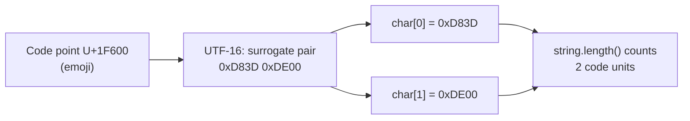

# Strings & Text

> Strings are immutable, interned, and everywhere — understand the String pool, when to reach for `StringBuilder`, how concatenation really compiles, and how Unicode code points work.

## Mental model

A `String` in Java is an **immutable** sequence of UTF-16 code units. Immutability makes strings safe to share, cache, and use as map keys, and enables the **String pool** (a.k.a. string intern table): string *literals* are deduplicated into a shared pool in the heap, so identical literals are the same object.

- `String` — immutable; every "modification" returns a new object.
- `StringBuilder` — mutable, **not** thread-safe, fast — the default for building strings.
- `StringBuffer` — mutable, **synchronized** (thread-safe), legacy, slower.

```mermaid
flowchart TD
    subgraph Heap
        subgraph Pool["String pool (interned literals)"]
            P1["\"hello\""]
        end
        A["String a = \"hello\""] --> P1
        B["String b = \"hello\""] --> P1
        C["String c = new String(\"hello\")"] --> N["distinct heap object"]
        N -.->|c.intern()| P1
    end
```

::: info
Because `a` and `b` point at the same pooled object, `a == b` is `true`. But `c = new String("hello")` forces a brand-new object, so `a == c` is `false` — which is exactly why you compare strings with `equals`, never `==`.
:::

## Core concepts

### Immutability and the String pool / `intern()`

Once created, a string's contents never change. Methods like `toUpperCase` return a *new* string. Literals live in the pool; `intern()` puts a runtime-built string into the pool (or returns the existing canonical instance).

```java
String a = "hello";
String b = "hello";
String c = new String("hello");

System.out.println(a == b);          // => true  (same pooled literal)
System.out.println(a == c);          // => false (c is a fresh object)
System.out.println(a == c.intern()); // => true  (intern returns pooled instance)
System.out.println(a.equals(c));     // => true  (compares contents)
```

::: warning
Don't call `intern()` to "optimize" — the pool is a fixed-size native table and over-interning causes memory pressure and slow lookups. Rely on automatic literal interning; intern manually only for huge numbers of known-duplicate runtime strings.
:::

### `String` vs `StringBuilder` vs `StringBuffer`

Building a string in a loop with `+` creates a new `String` (and discarded intermediates) each iteration — O(n²). `StringBuilder` mutates a single internal buffer — O(n).

```java
// BAD: O(n^2), allocates a new String every iteration
String s = "";
for (int i = 0; i < 5; i++) s += i;

// GOOD: O(n), one growable buffer
StringBuilder sb = new StringBuilder();
for (int i = 0; i < 5; i++) sb.append(i);
System.out.println(sb.toString());   // => 01234
System.out.println(sb.reverse());    // => 43210
```

| Type | Mutable | Thread-safe | Use when |
| --- | --- | --- | --- |
| `String` | no | yes (immutable) | fixed text, keys, sharing |
| `StringBuilder` | yes | no | building strings (default) |
| `StringBuffer` | yes | yes (synchronized) | legacy / shared mutable buffer |

### Concatenation performance & `invokedynamic`

A single `a + b + c` expression is fine — since Java 9 the compiler turns it into an `invokedynamic` call to `StringConcatFactory`, which builds the result in one efficient step (no visible `StringBuilder`). The problem is concatenation **inside loops**, where each iteration is a separate expression.

```java
// Compiles to a single invokedynamic StringConcatFactory call — efficient
String greeting = "Hi " + name + ", you are " + age;

// Inside a loop, each += is its own concat — use StringBuilder instead
StringBuilder sb = new StringBuilder();
for (String part : parts) sb.append(part).append(',');
```

::: tip
Don't pre-emptively replace readable `a + b` expressions with `StringBuilder` — the compiler already optimizes them. Reach for `StringBuilder` (or `String.join`/streams) only for **loop** accumulation.
:::

### `equals` vs `==`

`==` compares **references** (same object?); `equals` compares **contents**. Always use `equals` for strings; use `equalsIgnoreCase` for case-insensitive checks.

```java
String x = "java";
String y = new String("java");
System.out.println(x == y);                 // => false (different objects)
System.out.println(x.equals(y));            // => true  (same content)
System.out.println("JAVA".equalsIgnoreCase(x)); // => true

// Null-safe constant-first idiom avoids NPE when the variable may be null
String input = null;
System.out.println("yes".equals(input));    // => false (no NPE)
```

### Common String methods

```java
String s = "  Hello, World  ";
System.out.println(s.strip());             // => "Hello, World" (Unicode-aware)
System.out.println(s.trim().length());     // => 12
System.out.println("Hello".charAt(1));     // => e
System.out.println("Hello".indexOf("ll")); // => 2
System.out.println("Hello".substring(1,3));// => el
System.out.println("Hello".replace('l','L'));// => HeLLo
System.out.println("a,b,c".contains("b")); // => true
System.out.println("Hi".repeat(3));        // => HiHiHi
System.out.println("  ".isBlank());        // => true (Java 11+)
System.out.println("line".chars().count());// => 4
```

::: tip
Prefer `strip()`/`stripLeading()`/`stripTrailing()` (Java 11, Unicode-aware) over the legacy `trim()`, which only removes characters ≤ U+0020 and misses many Unicode whitespace characters.
:::

### Character encoding, `char`, and code points

A Java `char` is a **16-bit UTF-16 code unit**, not a full character. Code points beyond the Basic Multilingual Plane (like emoji) are stored as a **surrogate pair** of two `char`s, so `length()` and `charAt()` count code units, not characters.

```java
String emoji = "A😀";          // "A" + grinning face emoji
System.out.println(emoji.length());      // => 3  (1 + surrogate pair = 2)
System.out.println(emoji.codePointCount(0, emoji.length())); // => 2
emoji.codePoints().forEach(cp ->
    System.out.print(Character.toChars(cp)[0] == 'A' ? "A " : "[emoji] "));
// => A [emoji]

// Always specify a charset for bytes <-> text round-trips
byte[] bytes = "café".getBytes(StandardCharsets.UTF_8);
String back = new String(bytes, StandardCharsets.UTF_8);
System.out.println(back);                // => café
```



::: danger
Always pass an explicit `Charset` (use `StandardCharsets.UTF_8`) to `getBytes`/`new String(byte[])`. The no-arg versions use the platform default charset, which differs across machines and silently corrupts non-ASCII text. (Java 18+ defaults to UTF-8, but be explicit anyway.)
:::

### Formatting and text blocks

`String.format` (and the instance method `formatted`) build strings from a format spec. **Text blocks** (Java 15+) provide multi-line literals with clean indentation handling.

```java
String row = String.format("%-10s | %5.2f", "coffee", 3.5);
System.out.println(row);                 // => coffee     |  3.50
System.out.println("%d items".formatted(7)); // => 7 items

String json = """
    {
      "name": "%s",
      "age": %d
    }""".formatted("Al", 30);
System.out.println(json);
// => {
//      "name": "Al",
//      "age": 30
//    }
```

::: info
Text blocks strip the common leading whitespace (the "incidental" indentation determined by the closing `"""`) and the trailing newline behavior is controlled by where you place the closing delimiter. Use `\` at line end to suppress a newline.
:::

### Comparing, ordering, and switching on strings

`String` implements `Comparable` with **lexicographic** (UTF-16 code-unit) ordering — uppercase letters sort before lowercase. Use `compareToIgnoreCase` or a `Collator` for human-friendly ordering. Strings also drive `switch`.

```java
List<String> words = new ArrayList<>(List.of("banana", "Apple", "cherry"));
words.sort(String::compareTo);
System.out.println(words);                       // => [Apple, banana, cherry]
words.sort(String.CASE_INSENSITIVE_ORDER);
System.out.println(words);                       // => [Apple, banana, cherry]
System.out.println("a".compareTo("b"));          // => -1

String role = "ADMIN";
String access = switch (role) {                  // switch on String (since Java 7)
    case "ADMIN" -> "full";
    case "USER"  -> "limited";
    default      -> "none";
};
System.out.println(access);                       // => full
```

::: info
`switch` on a `String` uses `hashCode()` for the jump table and then `equals()` to confirm — so it is null-hostile: a null selector throws `NullPointerException`. Guard nulls before switching.
:::

### Regex: `Pattern` and `Matcher`

For one-off matches use `String.matches`; for repeated use, **compile** the `Pattern` once and reuse it (compilation is expensive).

```java
Pattern email = Pattern.compile("(\\w+)@(\\w+\\.\\w+)"); // compile once, reuse
Matcher m = email.matcher("contact al@example.com now");
if (m.find()) {
    System.out.println(m.group());   // => al@example.com (whole match)
    System.out.println(m.group(1));  // => al            (group 1)
    System.out.println(m.group(2));  // => example.com   (group 2)
}
System.out.println("12345".matches("\\d+"));   // => true (whole-string match)
System.out.println("a1b2".replaceAll("\\d", "#")); // => a#b#
```

::: warning
`String.matches` requires the **entire** string to match (it's anchored), unlike `Matcher.find` which searches for a substring. And don't call `Pattern.compile` inside a hot loop — hoist it to a `static final` field.
:::

### `split`, `join`, `strip`

```java
String csv = "a, b , c";
String[] parts = csv.split("\\s*,\\s*");   // split on comma + surrounding spaces
System.out.println(Arrays.toString(parts)); // => [a, b, c]

System.out.println("x".split(",").length);  // => 1 (no match => whole string)
System.out.println("a,b,,".split(",").length); // => 2 (trailing empties dropped)
System.out.println("a,b,,".split(",", -1).length); // => 4 (limit -1 keeps them)

System.out.println(String.join("-", "a", "b", "c")); // => a-b-c
System.out.println(String.join(",", List.of("x", "y"))); // => x,y
```

::: tip
`split` takes a **regex**, so escape regex metacharacters: split on a literal dot with `split("\\.")`, not `split(".")` (which matches every character and returns an empty array). By default trailing empty strings are dropped — pass a negative limit to keep them.
:::

## Common pitfalls

- **`==` to compare strings** — compares references; use `equals`.
- **`+` concatenation in loops** — O(n²); use `StringBuilder` or `String.join`.
- **`split(".")` / `split("|")`** — these are regex; escape them (`\\.`).
- **Assuming `length()` counts characters** — it counts UTF-16 code units; emoji count as 2.
- **No-arg `getBytes()`/`new String(byte[])`** — platform-default charset corrupts text; pass `UTF_8`.
- **Compiling regex in a loop** — hoist `Pattern.compile` to a `static final` field.
- **`trim()` for Unicode whitespace** — use `strip()`.
- **Over-using `intern()`** — pressures the native pool; rely on literal interning.

## Best practices

- Compare with `equals`/`equalsIgnoreCase`; put the constant first to avoid NPEs.
- Use `StringBuilder` for loop-built strings; trust the compiler for simple `+`.
- Always pass `StandardCharsets.UTF_8` for byte/string conversions.
- Use text blocks for multi-line JSON/SQL/HTML literals.
- Compile and reuse `Pattern` objects; prefer pre-compiled patterns over `String.matches` in hot paths.
- Prefer `strip`/`isBlank`/`repeat` (Java 11+) over older equivalents.
- Iterate by code point (`codePoints()`) when handling full Unicode text.
- Keep `String` keys immutable and rely on the pool — never depend on `==` identity semantics.

## Interview quick-reference

| Concept | Key point |
| --- | --- |
| Immutability | Strings never change; methods return new objects |
| String pool | Literals deduplicated; `==` true for equal literals |
| `intern()` | Returns the canonical pooled instance |
| `equals` vs `==` | Contents vs reference identity |
| `String`/`StringBuilder`/`StringBuffer` | Immutable / mutable unsynced / mutable synced |
| Loop concatenation | `+` is O(n²); use `StringBuilder` |
| `invokedynamic` concat | Java 9+ optimizes single `+` expressions |
| `char` vs code point | `char` = UTF-16 code unit; emoji = surrogate pair |
| Charset | Always specify `UTF_8`; default is platform-dependent |
| Text blocks | `"""` multi-line literals (Java 15+) |
| `Pattern`/`Matcher` | Compile once, reuse; `find` vs anchored `matches` |
| `split` | Takes a regex; escape `.`; negative limit keeps trailing empties |

See the [interview questions](../questions/strings) for drilling.
