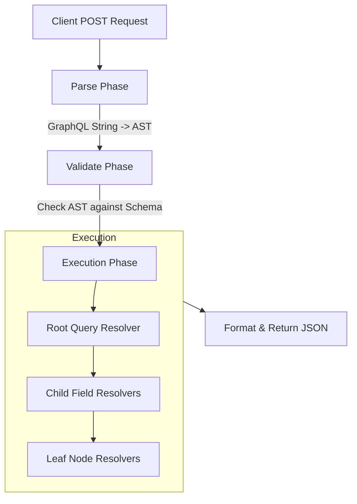
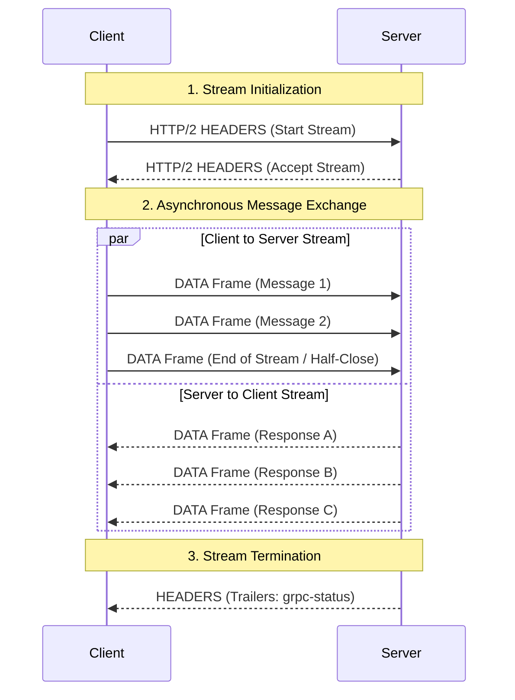

# API Paradigms: GraphQL, gRPC, REST

## What is the Richardson Maturity Model in the context of REST API design? <Badge type="tip" text="easy" />

::: details View Answer
The Richardson Maturity Model (RMM) is a heuristic framework used to grade the maturity of a web API in adhering to REST architectural principles.

It defines four levels:
- **Level 0 (The Swamp of POX):** Uses HTTP strictly as a transport mechanism for remote interactions, typically with a single URI and a single HTTP method (e.g., SOAP or XML-RPC over POST).
- **Level 1 (Resources):** Introduces the concept of resources. Instead of a single endpoint, the API exposes multiple URIs representing different entities (e.g., `/users`, `/orders`).
- **Level 2 (HTTP Verbs):** Utilizes standard HTTP methods (GET, POST, PUT, DELETE) in accordance with their semantic meanings, using HTTP status codes for communicating outcomes.
- **Level 3 (Hypermedia Controls):** Implements HATEOAS (Hypermedia As The Engine Of Application State), where responses include links to related resources and actions, guiding the client dynamically.
:::

## How do you design idempotent APIs, and which HTTP methods are idempotent by definition? <Badge type="warning" text="medium" />

::: details View Answer
An operation is idempotent if making multiple identical requests produces the same result as making a single request, preventing unintended side-effects.

**Idempotent HTTP Methods:**
- `GET`, `HEAD`, `OPTIONS`, `TRACE`: Read-only, do not modify state.
- `PUT`: Replaces the entire resource. Repeatedly replacing with the same payload results in the same state.
- `DELETE`: Deleting a resource once removes it. Subsequent requests typically return `404 Not Found`, but the end state (resource absent) remains the same.

**Non-Idempotent Methods:**
- `POST`: Typically creates a new resource. Repeating a `POST` creates duplicates.
- `PATCH`: Modifying a resource partially. Depending on the payload (e.g., incrementing a counter), it might not be idempotent.

**Designing Idempotent POSTs:**
To make a non-idempotent method idempotent (e.g., processing a payment), you use an **Idempotency Key** provided by the client in the request header (`Idempotency-Key`). The server stores the key alongside the response. If a subsequent request arrives with the same key, the server bypasses processing and returns the cached response.
:::

## What are the different API versioning strategies for REST, and what are their trade-offs? <Badge type="warning" text="medium" />

::: details View Answer
There are four primary ways to version REST APIs:

1. **URI Path (`/v1/users`):**
   - *Pros:* Easiest to implement and route. Highly visible to clients.
   - *Cons:* Breaks the principle that a URI should represent a unique resource, not a versioned schema of it.
2. **Query Parameter (`/users?version=1`):**
   - *Pros:* Easy to implement.
   - *Cons:* Clutters the URL. Often stripped by aggressive caching mechanisms.
3. **Custom Header (`X-API-Version: 1`):**
   - *Pros:* Keeps URIs clean and resource-focused.
   - *Cons:* Harder to test in a browser without tools like Postman or cURL.
4. **Content Negotiation / Accept Header (`Accept: application/vnd.company.v1+json`):**
   - *Pros:* Most semantically correct according to REST principles.
   - *Cons:* Most complex to implement and test.

*Recommendation:* URI path versioning is the industry standard due to its pragmatism and ease of developer onboarding, despite REST purist objections.
:::

## What is HATEOAS, and why is it often omitted in modern REST APIs? <Badge type="warning" text="medium" />

::: details View Answer
HATEOAS (Hypermedia As The Engine Of Application State) is the highest level of REST maturity (Level 3). It means the server includes hypermedia links in its responses, dynamically informing the client of available actions and subsequent endpoints.

*Example Response:*
```json
{
  "orderId": 123,
  "status": "pending",
  "links": [
    { "rel": "self", "href": "/orders/123" },
    { "rel": "cancel", "href": "/orders/123/cancel" }
  ]
}
```

**Why it is rarely used:**
- **Client Complexity:** Frontend clients (e.g., React, iOS) typically rely on rigid internal state management and upfront knowledge of API routes. Dynamically parsing available actions from hypermedia adds unnecessary overhead.
- **Payload Bloat:** Adding links to every resource significantly increases JSON payload size.
- **Tooling:** Technologies like OpenAPI (Swagger) provide out-of-band contracts that negate the need for in-band hypermedia discovery.
:::

## Demonstrate building a simple RESTful API endpoint using FastAPI that uses validation. <Badge type="tip" text="easy" />

::: details View Answer
FastAPI leverages Python type hints and Pydantic for automatic data validation, serialization, and OpenAPI documentation generation.

```python
from fastapi import FastAPI, HTTPException
from pydantic import BaseModel

app = FastAPI()

# Pydantic model for request body validation
class UserCreate(BaseModel):
    username: str
    email: str
    age: int

@app.post("/users/", status_code=201)
async def create_user(user: UserCreate):
    # Validation automatically applied: 422 Unprocessable Entity if invalid
    if user.age < 18:
        raise HTTPException(status_code=400, detail="User must be an adult.")
    
    # Save to DB logic here...
    return {"message": "User created successfully", "data": user.model_dump()}
```
:::

## What is the N+1 query problem in GraphQL, and how does DataLoader solve it? <Badge type="danger" text="hard" />

::: details View Answer
The N+1 query problem occurs when fetching hierarchical data. If a client queries a list of N objects, and for each object requests a nested relation, the server makes 1 query for the list, plus N individual queries for the nested items, severely degrading database performance.

**How DataLoader solves it:**
DataLoader acts as a batching and caching layer. Instead of executing queries immediately in the resolver, promises/coroutines are returned and queued. At the end of the event loop tick, DataLoader batches all accumulated keys and executes a single query.

**Python Example using `graphene` and `aiodataloader`:**

```python
from aiodataloader import DataLoader
import graphene

# The DataLoader definition
class UserLoader(DataLoader):
    async def batch_load_fn(self, keys):
        # Executes exactly ONCE for a batch of keys
        # SELECT * FROM users WHERE id IN (keys)
        users = await db.get_users_by_ids(keys) 
        
        # DataLoader expects an array of the same length and order as keys
        user_map = {user.id: user for user in users}
        return [user_map.get(user_id) for user_id in keys]

class Post(graphene.ObjectType):
    title = graphene.String()
    author_id = graphene.Int()
    author = graphene.Field(lambda: User)

    async def resolve_author(parent, info):
        # Instead of querying the DB directly, delegate to DataLoader
        return await info.context['user_loader'].load(parent.author_id)
```
:::

## Explain the execution phases of a GraphQL query. <Badge type="warning" text="medium" />

::: details View Answer
A GraphQL query undergoes three distinct phases before yielding a JSON response.

1. **Parse:** The raw string payload is parsed into an Abstract Syntax Tree (AST). If there are syntax errors, execution halts.
2. **Validate:** The AST is validated against the defined GraphQL schema (e.g., ensuring queried fields exist, variables match expected types, and fragments are valid).
3. **Execute:** The server traverses the validated AST top-down, invoking the corresponding resolver function for each field and aggregating the results.


:::

## How do you handle authentication and authorization in GraphQL? <Badge type="warning" text="medium" />

::: details View Answer
A common anti-pattern is placing authentication/authorization logic directly inside GraphQL resolvers. 

**Best Practices:**
- **Authentication:** Should happen *before* the request reaches the GraphQL execution engine. Middleware (e.g., FastAPI middleware or Express middleware) should validate JWTs/Session cookies and inject the authenticated `user` object into the GraphQL **context**.
- **Authorization:** Resolvers should delegate authorization to the business logic/domain layer.

*Example:*
```python
def resolve_financial_records(parent, info):
    current_user = info.context.get("user")
    if not current_user:
        raise Exception("Unauthenticated")
        
    # Delegate to domain service where complex RBAC logic lives
    return FinancialService.get_records(user=current_user)
```
:::

## How do you protect a GraphQL API against malicious or overly complex queries? <Badge type="danger" text="hard" />

::: details View Answer
Because clients dictate the shape of the response, GraphQL APIs are vulnerable to resource exhaustion (DoS attacks) via deeply nested or highly aliased queries.

**Mitigation Strategies:**
1. **Depth Limiting:** Inspect the AST before execution and reject queries exceeding a maximum nesting depth (e.g., `user -> posts -> comments -> author -> posts`).
2. **Query Cost Analysis (Complexity Limiting):** Assign a weight/cost to each field. The server calculates the total cost of the query AST. If it exceeds a threshold, the query is rejected before execution.
3. **Amount Limiting:** Enforce mandatory pagination limits on connection/list fields.
4. **Persisted Queries:** In production, clients only send a hash of the query. The server maps the hash to a pre-approved, safe query string stored on the backend. This completely prevents arbitrary queries from malicious actors.
:::

## What are GraphQL Subscriptions, and how do they differ from Queries and Mutations? <Badge type="warning" text="medium" />

::: details View Answer
While **Queries** are for reading data (idempotent) and **Mutations** are for modifying data (state-changing), **Subscriptions** are for observing data in real-time.

Subscriptions establish a long-lived connection between the client and the server, typically via **WebSockets** (or Server-Sent Events). When a specific event triggers on the server backend (often utilizing a Pub/Sub mechanism like Redis or Kafka), the server pushes a targeted GraphQL payload down the WebSocket connection to subscribed clients.
:::

## How does caching differ between REST and GraphQL, and how can you implement caching in GraphQL? <Badge type="danger" text="hard" />

::: details View Answer
**REST Caching:**
REST leverages built-in HTTP semantics. Because endpoints are distinct URIs and typically use `GET`, they work seamlessly with proxy caches, CDNs, and browser caches using headers like `Cache-Control` and `ETag`.

**GraphQL Caching:**
GraphQL typically operates over a single `/graphql` endpoint using `POST` requests. This breaks standard HTTP caching at the network/CDN level.

**Implementing Caching in GraphQL:**
1. **Client-Side:** Libraries like Apollo Client implement normalized caching. Responses are broken down into flat entities and stored using a combination of `__typename` and `id` as the cache key.
2. **Server-Side (Whole Query):** Using Persisted Queries combined with `GET` requests for GraphQL queries. By mapping a query hash to a URL like `/graphql?queryId=abc123hash`, CDNs can cache the JSON response.
3. **Server-Side (Field-Level):** Utilizing caching at the data-fetching layer (e.g., caching the results inside DataLoader or Redis) so resolvers pull from memory instead of the database.
:::

## Compare Protocol Buffers (Protobuf) serialization with JSON. Why is Protobuf significantly faster? <Badge type="warning" text="medium" />

::: details View Answer
JSON is a text-based, schema-less format. Protobuf is a strongly-typed, binary serialization format developed by Google.

**Why Protobuf is faster:**
1. **No Field Names in Payload:** JSON includes string keys (`"username": "alice"`). Protobuf uses numbered tags defined in a `.proto` file. The payload only contains the tag number and the value, drastically reducing payload size.
2. **Binary vs Text Parsing:** JSON parsers must read strings character by character, handle escaping, and infer data types. Protobuf parses data natively in binary using fixed offsets, requiring minimal CPU cycles.
3. **Pre-compiled Schema:** Because the schema is known ahead of time, code generators create optimized accessor methods in the target language (C++, Python, Go), eliminating dynamic runtime reflection overhead.
:::

## How does HTTP/2 multiplexing work, and why is it crucial for gRPC performance? <Badge type="danger" text="hard" />

::: details View Answer
In HTTP/1.1, a single TCP connection processes one request/response pair at a time. This leads to **Head-of-Line (HOL) blocking** at the application layer, requiring connection pooling (multiple TCP connections) to achieve concurrency.

**HTTP/2 Multiplexing:**
HTTP/2 establishes a single, persistent TCP connection and divides data into frames. Multiple concurrent requests and responses can be interleaved seamlessly over this single connection by assigning them unique "Stream IDs".

**Why it's crucial for gRPC:**
gRPC relies heavily on HTTP/2. Multiplexing allows thousands of asynchronous RPC calls to share a single TCP connection concurrently without blocking one another. This eliminates the latency of establishing new TCP/TLS handshakes, drastically reducing CPU overhead and network congestion for high-throughput microservices.
:::

## Explain the four types of gRPC service methods. <Badge type="warning" text="medium" />

::: details View Answer
gRPC supports four distinct communication patterns defined in Protobuf:

1. **Unary RPC:** The classic request-response model. Client sends a single request, server returns a single response.
2. **Server Streaming RPC:** Client sends a single request. Server returns a stream of messages. Client reads until the stream is exhausted.
3. **Client Streaming RPC:** Client writes a sequence of messages via a stream to the server. Once finished, it waits for the server to process them and return a single response.
4. **Bidirectional Streaming RPC:** Both sides send a sequence of messages using independent read-write streams. The streams operate completely asynchronously.
:::

## How does a gRPC bidirectional streaming connection work? <Badge type="danger" text="hard" />

::: details View Answer
Bidirectional streaming allows the client and server to read and write messages in any order over a single persistent connection. It is ideal for real-time applications like chat, gaming, or continuous telemetry.


:::

## Provide a Python example of implementing a gRPC Bidirectional Streaming service. <Badge type="danger" text="hard" />

::: details View Answer
Using the `grpcio` library in Python, streams are represented as Iterables/Generators.

```python
import grpc
import chat_pb2
import chat_pb2_grpc

class ChatServicer(chat_pb2_grpc.ChatServiceServicer):
    # The method signature receives an iterator and must yield responses
    def ChatStream(self, request_iterator, context):
        try:
            # Iterating over incoming client messages
            for message in request_iterator:
                print(f"Received from client: {message.text}")
                
                # Asynchronously yield responses back to the client
                yield chat_pb2.ChatReply(
                    reply=f"Server echo: {message.text}"
                )
        except Exception as e:
            # Terminate stream with an error
            context.set_code(grpc.StatusCode.INTERNAL)
            context.set_details(str(e))
```
:::

## What are gRPC Interceptors, and how can they be used? <Badge type="warning" text="medium" />

::: details View Answer
Interceptors in gRPC are analogous to middleware in REST web frameworks (like Django or Express). They allow you to "intercept" the execution of an RPC method to execute cross-cutting concerns before or after the actual handler logic runs.

**Common Use Cases:**
- **Authentication/Authorization:** Validating metadata tokens (JWTs) before allowing the RPC to proceed.
- **Logging and Metrics:** Emitting trace IDs, timing RPC execution duration, and tracking error rates.
- **Retry Mechanisms:** Client-side interceptors can automatically retry idempotent requests upon transient network failures.
- **Error Translation:** Mapping internal domain exceptions into standardized `google.rpc.Status` error codes.
:::

## How do you handle load balancing for gRPC services given that HTTP/2 connections are persistent? <Badge type="danger" text="hard" />

::: details View Answer
Load balancing gRPC is notoriously tricky because standard L4 (TCP) load balancers (like AWS NLB or standard Kubernetes Services) operate at the connection level. Because gRPC multiplexes all requests over a single, persistent HTTP/2 connection, an L4 load balancer will route *all* requests from one client pod to exactly one server pod, completely failing to distribute the load.

**Solutions:**
1. **L7 Proxy Load Balancing:** Use a modern proxy that understands HTTP/2 (like Envoy, Nginx, or HAProxy). The proxy terminates the HTTP/2 connection from the client, parses the individual RPC streams, and multiplexes them across new connections to the backend server fleet.
2. **Client-Side Load Balancing:** The client application uses a registry (like Consul, etcd, or DNS) to discover backend IPs and maintains its own connections to multiple servers, distributing RPC calls round-robin or via an xDS management server natively.
:::

## Compare error handling paradigms across REST, GraphQL, and gRPC. <Badge type="warning" text="medium" />

::: details View Answer
- **REST:** Relies heavily on **HTTP Status Codes** (e.g., `400 Bad Request`, `404 Not Found`, `500 Internal Server Error`). The response body typically contains a JSON object with error details.
- **GraphQL:** Always returns a `200 OK` HTTP status (unless there's a catastrophic network/server failure). Errors are returned inside the JSON payload in a specific `"errors"` array alongside the `"data"` object. This allows returning partial successes.
- **gRPC:** Uses a dedicated status model (`grpc-status` trailer). It provides 16 standard status codes (e.g., `NOT_FOUND`, `UNAUTHENTICATED`, `DEADLINE_EXCEEDED`). For complex errors, gRPC uses the `google.rpc.Status` message to attach arbitrary rich metadata (like validation violation details) to the error response.
:::

## As a Senior Architect, what heuristics do you use to choose between REST, GraphQL, and gRPC for a new microservice? <Badge type="danger" text="hard" />

::: details View Answer
The decision depends heavily on the consumer and network boundary:

- **Choose REST when:**
  - Building a public, outward-facing API for third-party developers (due to universality and ease of integration).
  - The API exposes simple CRUD operations on distinct entities.
  - HTTP network caching (CDNs) is highly critical.

- **Choose GraphQL when:**
  - Building an API for diverse frontend clients (web, mobile, IoT) that have wildly different data requirements.
  - Serving as a Backend-For-Frontend (BFF) aggregator that orchestrates data from multiple underlying microservices.
  - You want to eliminate over-fetching and under-fetching to optimize mobile bandwidth.

- **Choose gRPC when:**
  - Building internal, synchronous server-to-server microservice communication behind the firewall.
  - Performance, low latency, and network throughput are critical.
  - You require polyglot environments and want strict, strongly-typed contracts (Protobuf) generated across various languages.
  - The application requires bidirectional streaming capabilities.
:::
