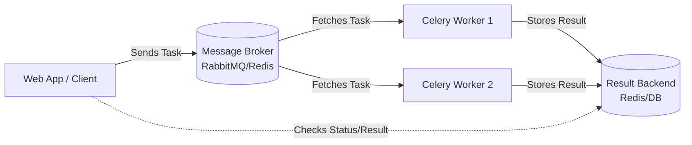
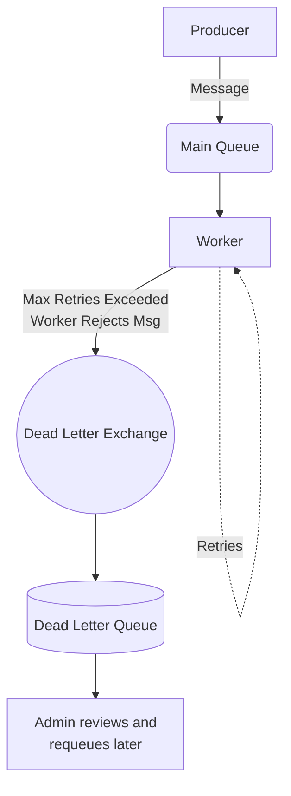

# Celery and Task Queues

## What is the fundamental architecture of Celery, and how do the Broker and Result Backend differ? <Badge type="tip" text="easy" />

::: details View Answer
Celery relies on a distributed message passing architecture. The core components are:
1. **Producer/Client**: The application (e.g., a Django or FastAPI web server) that creates and sends tasks.
2. **Broker**: The message queue that acts as an intermediary. It receives messages (tasks) from the producer and delivers them to the workers. Common brokers are RabbitMQ and Redis.
3. **Worker**: The background processes that constantly listen to the broker for new tasks, execute them, and report back.
4. **Result Backend**: A storage system used to store the results or state of the executed tasks (e.g., success, failure, return values). Redis, Memcached, or a relational database are commonly used.

**Broker vs. Result Backend:**
The **Broker** is responsible for the *transport* of tasks. It holds the tasks until a worker is ready to process them.
The **Result Backend** is responsible for the *state and output* of tasks. It stores the return value of a task so the producer can retrieve it later using the task's ID.


:::

## Explain the difference between `delay()` and `apply_async()` in Celery. When would you use one over the other? <Badge type="tip" text="easy" />

::: details View Answer
Both methods are used to send tasks to the Celery broker, but they differ in flexibility.

- `delay(*args, **kwargs)`: This is a convenient shortcut for `apply_async`. It only accepts the arguments and keyword arguments that the task function itself expects. It is used for straightforward task execution where default routing and execution options are sufficient.
- `apply_async(args=None, kwargs=None, **options)`: This is the underlying method that provides full control over task execution. It allows you to specify execution options (like `countdown`, `eta`, `expires`, `queue`, `retry`, etc.) in addition to the task's arguments.

**Example:**
```python
# Using delay - Simple and clean
my_task.delay(arg1, arg2, kwarg1='value')

# Using apply_async - Advanced options
my_task.apply_async(
    args=[arg1, arg2], 
    kwargs={'kwarg1': 'value'}, 
    countdown=60,  # Execute after 60 seconds
    queue='priority_queue'  # Route to a specific queue
)
```
You use `delay()` 90% of the time for simple executions, and `apply_async()` when you need specific execution modifiers or custom routing.
:::

## Why is it considered a bad practice to pass database model instances as task arguments? What should you pass instead? <Badge type="tip" text="easy" />

::: details View Answer
Passing database model instances directly as task arguments (e.g., `send_email_task.delay(user_instance)`) is a bad practice for several reasons:

1. **Serialization Issues**: Task arguments must be serialized (usually to JSON) to be sent across the message broker. ORM objects (like Django models or SQLAlchemy objects) are complex objects that are often not natively JSON serializable.
2. **Stale Data**: Tasks might sit in the queue for seconds, minutes, or even longer before a worker picks them up. If you serialize a model instance, the worker will deserialize the exact state of the object at the time the task was *queued*. If the database record was updated in the meantime, the worker will be operating on stale data.
3. **Payload Size**: Serializing full objects increases the payload size in the message broker, leading to memory overhead and slower transport times.

**Best Practice:**
Always pass simple identifiers (like primary keys or UUIDs) as arguments. The task should fetch the latest record from the database upon execution.

```python
# BAD
@app.task
def process_order(order_obj):
    pass

# GOOD
@app.task
def process_order(order_id):
    order = Order.objects.get(id=order_id)
    # process order...
```
:::

## What happens when a Celery worker dies unexpectedly while processing a task? How can you prevent message loss? <Badge type="warning" text="medium" />

::: details View Answer
If a Celery worker dies unexpectedly (e.g., OOM kill, power loss, hardware failure) while processing a task, the default behavior depends on the acknowledgment configuration.

By default, Celery acknowledges messages **early** (just before the worker executes the task). If the worker dies mid-execution, the task is considered completed by the broker and is permanently lost.

To prevent message loss, you should enable **Late Acknowledgment** (`acks_late=True`).

When `acks_late=True` is set, the worker only acknowledges the message *after* the task has successfully returned. If the worker dies during execution, the connection to the broker is severed. The broker notices the disconnected worker, realizes the message was unacknowledged, and re-queues the message to be processed by another available worker.

```python
@app.task(acks_late=True)
def critical_data_processing(data_id):
    # If the worker crashes here, the task will be re-queued.
    pass
```
Note: Enabling `acks_late` requires your tasks to be **idempotent**, as a worker might have partially completed the work before crashing, and the next worker will start from scratch.
:::

## How would you implement a retry mechanism with exponential backoff for a flaky API call in Celery? <Badge type="warning" text="medium" />

::: details View Answer
Celery provides built-in mechanisms to retry tasks when exceptions occur. For flaky external APIs, using an exponential backoff prevents overwhelming the failing service while it recovers.

You can achieve this using the `autoretry_for` argument in the task decorator, combined with `retry_backoff`.

```python
import requests
from celery import shared_task

@shared_task(
    autoretry_for=(requests.exceptions.RequestException,),
    retry_kwargs={'max_retries': 5},
    retry_backoff=True,  # Enables exponential backoff
    retry_backoff_max=600,  # Max wait time between retries (e.g., 10 minutes)
    retry_jitter=True  # Adds randomness to prevent thundering herd
)
def fetch_external_data(api_url):
    response = requests.get(api_url, timeout=5)
    response.raise_for_status()
    return response.json()
```

**How it works:**
- `autoretry_for`: Specifies which exceptions should trigger a retry.
- `retry_backoff=True`: The wait time between retries doubles sequentially (e.g., 1s, 2s, 4s, 8s...).
- `retry_jitter=True`: Adds a random offset to the backoff time to prevent multiple workers from retrying simultaneously if they failed at the same time.
:::

## Describe how to route different types of tasks to specific worker nodes. Why would you do this? <Badge type="warning" text="medium" />

::: details View Answer
Task routing allows you to direct specific tasks to specific queues, which are then consumed by specific worker instances.

**Why do this?**
1. **Resource Allocation**: Some tasks are CPU-bound (e.g., image processing), while others are I/O-bound (e.g., sending emails). You can dedicate powerful CPU-optimized servers to the image-processing queue, and lightweight servers to the email queue.
2. **Prioritization**: You can have a `high_priority` queue for critical user actions (like password resets) and a `low_priority` queue for background data syncing, ensuring critical tasks are not delayed by heavy background jobs.

**How to implement:**
1. Define routing in `celery.py`:
```python
app.conf.task_routes = {
    'myapp.tasks.process_video': {'queue': 'video_processing'},
    'myapp.tasks.send_email': {'queue': 'communications'},
}
```

2. Start workers specifically listening to those queues:
```bash
# Worker for communications
celery -A myproject worker -Q communications -c 4

# Worker for video processing (maybe on a different server)
celery -A myproject worker -Q video_processing -c 2
```
Alternatively, you can route dynamically using `apply_async`:
```python
process_video.apply_async(args=[vid_id], queue='video_processing')
```
:::

## What is a "Chord" in Celery, and how does it differ from a "Group" or "Chain"? <Badge type="warning" text="medium" />

::: details View Answer
Celery Canvas provides primitives for designing complex task workflows.

- **Group**: Takes a list of tasks and executes them in parallel (concurrently). It returns a `GroupResult` to check the status of all tasks.
- **Chain**: Takes a list of tasks and executes them sequentially. The return value of one task is passed as the first argument to the next task.
- **Chord**: A chord is a combination of a Group and a single task (callback). It executes a group of tasks in parallel, and *only after all tasks in the group have finished successfully*, it executes the callback task with the results of the group.

**Example of a Chord:**
Imagine you need to fetch data from 3 different APIs concurrently, and then aggregate the results.

```python
from celery import chord

# Group of tasks to run in parallel
header_tasks = [fetch_api_1.s(), fetch_api_2.s(), fetch_api_3.s()]

# The callback task to run after the group finishes
callback_task = aggregate_results.s()

# Execute the chord
result = chord(header_tasks)(callback_task)
```
*Note: Chords require a Result Backend to be configured, as the workers need a way to track when the group of tasks has completed.*
:::

## Explain the difference between `SoftTimeLimitExceeded` and `TimeLimitExceeded`. How should a worker handle them? <Badge type="warning" text="medium" />

::: details View Answer
Celery provides time limits to prevent tasks from running indefinitely and tying up worker processes.

1. **Hard Time Limit (`time_limit`)**: If a task exceeds this limit, the worker process executing it is brutally killed at the OS level (via a SIGKILL). The task raises a `TimeLimitExceeded` exception, but the task cannot catch it within the function itself because the process is abruptly terminated.
2. **Soft Time Limit (`soft_time_limit`)**: If a task exceeds this limit, a `SoftTimeLimitExceeded` exception is raised *inside* the task execution process. The task has the opportunity to catch this exception, perform cleanup operations (close files, rollback transactions, save state), and exit gracefully before the hard time limit hits.

**Best Practice:**
Always set a soft time limit slightly lower than the hard time limit.

```python
from celery.exceptions import SoftTimeLimitExceeded

@app.task(soft_time_limit=50, time_limit=60)
def long_running_task():
    try:
        # Do heavy work
        pass
    except SoftTimeLimitExceeded:
        # Clean up database connections, save intermediate state
        logger.warning("Task ran out of time! Cleaning up...")
        return "Failed gracefully"
```
:::

## How can you schedule recurring tasks dynamically in Celery without hardcoding them in `celery.py`? <Badge type="warning" text="medium" />

::: details View Answer
By default, Celery Beat schedules are defined statically in the `celery.py` settings file. However, in modern applications, administrators often need to add, modify, or delete periodic tasks via an admin dashboard without restarting the Celery processes.

To achieve dynamic scheduling, you must use a database-backed scheduler.

If using Django, the standard solution is **`django-celery-beat`**.
1. It stores the schedule configurations (crontabs, intervals) and the task definitions in standard Django database tables.
2. You configure Celery Beat to use its custom scheduler class:
   ```bash
   celery -A myproject beat -l info --scheduler django_celery_beat.schedulers:DatabaseScheduler
   ```
3. Celery Beat regularly queries the database for schedule updates. You can use the Django Admin interface to create a `PeriodicTask` model instance, and Celery Beat will pick it up automatically without needing a restart.

For SQLAlchemy/Flask apps, similar extensions exist (e.g., `celery-sqlalchemy-scheduler`).
:::

## What are Celery Beat and the challenges associated with running multiple instances of it? <Badge type="warning" text="medium" />

::: details View Answer
**Celery Beat** is the scheduler component of Celery. It reads the schedule configuration, determines when periodic tasks should run, and sends them to the message broker (queueing them for workers to pick up).

**The Multi-Instance Challenge:**
You should **NEVER** run more than one instance of Celery Beat against the same broker/database configuration.

If you run multiple Beat instances, they will not synchronize with each other. Both instances will read the same schedule, calculate that it's time to run a task, and **both will send a duplicate task to the broker**. This leads to tasks executing multiple times concurrently, potentially corrupting data or exhausting external API quotas.

**Solutions for High Availability:**
If you need high availability for Celery Beat (so scheduling doesn't fail if one server goes down), you cannot simply run multiple instances. You must use a lock mechanism:
1. **RedBeat**: An extension that uses Redis to maintain a distributed lock. Multiple Beat instances can run, but RedBeat ensures only one is actively dispatching tasks at any given time.
2. **Kubernetes StatefulSets / Leader Election**: Ensuring the orchestrator maintains exactly one replica of the Beat pod.
:::

## How can you implement rate-limiting for specific tasks in Celery to avoid overwhelming an external API? <Badge type="warning" text="medium" />

::: details View Answer
Celery provides a built-in `rate_limit` option on the `@task` decorator.

```python
@app.task(rate_limit='10/m')  # Allow 10 executions per minute
def call_external_api():
    pass
```

**Caveat regarding built-in rate-limiting:**
Celery's built-in `rate_limit` is applied **per worker instance**, not globally across the cluster. If you set `rate_limit='10/m'` and have 5 workers, your cluster will actually process up to 50 tasks per minute.

**Global Rate Limiting Solutions:**
If you need a strict global rate limit (e.g., a third-party API allows exactly 10 requests per minute total), you need an external locking/token-bucket mechanism, typically using Redis.

Using Redis for global rate limiting:
```python
import time
import redis
from celery import shared_task

redis_client = redis.Redis()

@shared_task(bind=True)
def global_rate_limited_task(self):
    # Try to acquire a token from a Redis token bucket
    if not acquire_rate_limit_token(redis_client, 'api_limit', limit=10, window=60):
        # If no tokens available, retry in a few seconds
        raise self.retry(countdown=5)
    
    # Process the API call
    pass
```
Alternatively, route the specific API task to a dedicated queue that is consumed by a single worker with concurrency set to 1 (`-c 1`) and apply the Celery native rate limit there.
:::

## What is idempotency, and why is it crucial in a distributed task queue like Celery? How do you implement it? <Badge type="warning" text="medium" />

::: details View Answer
**Idempotency** means that an operation can be applied multiple times without changing the result beyond the initial application. In mathematical terms: `f(f(x)) = f(x)`.

**Why it's crucial in Celery:**
Distributed systems guarantee "at-least-once" delivery, not "exactly-once". Due to network partitions, worker crashes (especially with `acks_late=True`), or broker retries, a task might be executed multiple times. If a task involves charging a credit card, executing it twice would result in a double charge.

**How to implement it:**
Idempotency is usually implemented by checking the state before acting, often utilizing a database or Redis for atomicity.

**Example Implementation using a Database:**
```python
@app.task
def process_payment(order_id):
    # Start a database transaction
    with transaction.atomic():
        order = Order.objects.select_for_update().get(id=order_id)
        
        # Idempotency check: has this already been paid?
        if order.status == 'PAID':
            logger.info("Order already paid. Skipping.")
            return
        
        # Perform external API call
        charge_stripe(order.amount)
        
        # Update state
        order.status = 'PAID'
        order.save()
```
Using `select_for_update()` ensures row-level locking so concurrent duplicated tasks won't process simultaneously and bypass the check.
:::

## What are Dead Letter Exchanges (DLX) in RabbitMQ, and how do you integrate them with Celery for failed tasks? <Badge type="danger" text="hard" />

::: details View Answer
A **Dead Letter Exchange (DLX)** is a feature in RabbitMQ (and other brokers) where messages that cannot be routed, are explicitly rejected, or expire (TTL) are sent. This provides a safety net to capture failed messages instead of dropping them, allowing developers to inspect, debug, and manually replay them later.

**How it works with Celery:**
By default, Celery doesn't use DLXs. If a task fails all its retries, the exception is logged, the Result Backend is updated, but the message itself is discarded.

To use DLX with Celery and RabbitMQ:
1. Define a Dead Letter Exchange and Queue in RabbitMQ.
2. Configure your Celery Queues to route rejected messages to the DLX.
3. Use `acks_late=True` and configure Celery to `reject` tasks that fail permanently.

```python
from kombu import Exchange, Queue

# Define the Dead Letter Exchange
dlx_exchange = Exchange('dlx', type='direct')
dlx_queue = Queue('dead_letters', dlx_exchange, routing_key='dead_letter')

# Configure normal queue to use the DLX
task_queue = Queue(
    'celery', 
    Exchange('celery'), 
    routing_key='celery',
    queue_arguments={
        'x-dead-letter-exchange': 'dlx',
        'x-dead-letter-routing-key': 'dead_letter'
    }
)

app.conf.task_queues = (task_queue, dlx_queue)
app.conf.task_reject_on_worker_lost = True
```


:::

## How does Celery handle task prioritization? Are there differences when using Redis vs RabbitMQ? <Badge type="danger" text="hard" />

::: details View Answer
Celery supports task prioritization, but its effectiveness depends heavily on the underlying message broker.

**RabbitMQ:**
RabbitMQ natively supports priority queues. You must explicitly configure the maximum priority level for a queue.
```python
app.conf.task_queues = [
    Queue('tasks', Exchange('tasks'), routing_key='tasks',
          queue_arguments={'x-max-priority': 10}),
]
```
When routing a task, you pass the `priority` argument (0-10, where 10 is highest):
```python
my_task.apply_async(args=[1], priority=9)
```
RabbitMQ will actively sort messages in the queue based on their priority.

**Redis:**
Redis *does not* natively support priority queues out of the box in the same way. Celery mimics prioritization in Redis by creating multiple underlying queues under the hood for each priority level (e.g., `celery`, `celery\x06\x163`, etc.).
When a worker fetches tasks, it checks the higher-priority list first using `BRPOP`.

**Recommendation:**
If strict task prioritization is a critical requirement for your architecture, RabbitMQ is the vastly superior broker over Redis. If using Redis, it's often better to manually define explicitly named queues (e.g., `high_priority`, `low_priority`) and dedicate specific workers to them, rather than relying on Celery's simulated Redis priorities.
:::

## Explain the concept of "Prefetch Multiplier" in Celery. How does it affect worker performance and fairness? <Badge type="danger" text="hard" />

::: details View Answer
The **Prefetch Multiplier** determines how many messages a worker will fetch from the broker in advance, before it has finished processing its current tasks.
The total number of prefetched messages per worker is: `worker_concurrency * prefetch_multiplier`.

The default `worker_prefetch_multiplier` in Celery is **4**. If you have a worker with concurrency 10, it will reserve up to 40 tasks from the broker.

**The Impact on Performance and Fairness:**
- **High Prefetch (Good for fast tasks):** If your tasks execute very quickly (e.g., simple DB writes taking 5ms), fetching them one by one introduces massive network overhead. A high prefetch allows the worker to pull chunks of tasks at once, significantly increasing throughput.
- **Low Prefetch (Good for long tasks):** If your tasks are long-running (e.g., video encoding taking 5 minutes), a high prefetch is disastrous. A single worker might reserve 40 long-running tasks. Meanwhile, other workers might be completely idle, but they can't help because those 40 tasks are already "claimed" by the busy worker. This leads to severe unfairness and bottlenecking.

**Optimization:**
For long-running tasks, you should always set `worker_prefetch_multiplier = 1` (and often enable `acks_late=True`). This ensures a worker only takes a new task when it is absolutely ready to process it, enabling perfect load balancing across the cluster.
:::

## In a high-throughput system, your Redis broker is running out of memory. How would you troubleshoot and mitigate this issue? <Badge type="danger" text="hard" />

::: details View Answer
If Redis is running out of memory while acting as a Celery broker/backend, several issues could be at play:

**1. Backlog of Unprocessed Tasks (Broker Issue):**
Workers cannot keep up with the producers. Tasks are piling up in Redis lists.
*Mitigation:* Scale up the number of workers. Optimize task execution time. Implement rate-limiting on the producers. Monitor queue lengths using tools like Flower.

**2. Result Backend Bloat (Backend Issue):**
By default, Celery stores the result (return value) of *every single task* in the backend. If you don't retrieve and clear these results, Redis memory will fill up with useless state data.
*Mitigation:*
- Set `ignore_result=True` on the `@task` decorator for tasks where you don't care about the return value.
- Configure `result_expires` to a low value (e.g., `app.conf.result_expires = 3600` for 1 hour) so Redis automatically evicts old results.

**3. Large Payload Sizes:**
Passing massive dictionaries, base64 strings, or file contents as task arguments.
*Mitigation:* Pass database IDs or file paths (e.g., S3 URIs) instead of raw data. Compress payloads if necessary.

**4. Visibility Timeout issues:**
If using Redis as a broker, Celery moves unacknowledged tasks to an internal structure. If workers die without acking, or tasks take longer than `broker_transport_options = {'visibility_timeout': 3600}`, Redis might hold onto tasks or duplicate them. Ensure `visibility_timeout` is significantly higher than your longest-running task.
:::

## Describe the problem of "Task Canvas" synchronization when the result backend goes down or gets overwhelmed. <Badge type="danger" text="hard" />

::: details View Answer
Celery Canvas features (like `chord`, `chain`, `map`) rely heavily on the **Result Backend** to manage state and synchronization.

For example, in a `chord(header)(callback)`, the workers processing the `header` group must periodically update a counter or check the state of other tasks in the backend to know when the entire group is finished. Once the last task finishes, it reads the results from the backend and triggers the `callback`.

**The Problem:**
If the Result Backend (e.g., Redis) experiences high latency, gets overwhelmed by connections, or goes down:
1. **Deadlocks**: The synchronization fails. Workers might never realize a chord has completed, leaving the callback permanently stuck in a pending state.
2. **Backend Polling Storm**: Older versions of Celery used active polling by the worker waiting for the chord to finish. This could exponentially increase load on the backend, crashing it further. (Newer versions use Redis Pub/Sub for coordination, but connection drops still break state).
3. **Data Loss**: The intermediate results passed down a `chain` are temporarily stored in the backend. Backend failure means the next step in the chain receives missing arguments.

**Mitigation:**
Use a highly available cluster for the Result Backend. Keep result payloads small. Avoid using complex Chords for mission-critical flows if possible; instead, manage state explicitly in a robust transactional database using state-machines.
:::

## How would you handle gracefully shutting down a Celery worker without dropping tasks currently being processed? <Badge type="medium" text="medium" />

::: details View Answer
When deploying new code, you need to restart Celery workers. A hard kill (`kill -9`) will instantly destroy the process, dropping any tasks currently executing (unless `acks_late` is enabled, in which case they are re-queued).

To shut down gracefully, you should send a `SIGTERM` signal to the worker.

**The Graceful Shutdown Process:**
1. You send a `SIGTERM` (Warm shutdown).
2. The Celery worker immediately stops consuming *new* tasks from the broker.
3. It allows currently running tasks to finish processing.
4. Once all active tasks are finished, the worker process exits completely.

**Handling Hanging Tasks:**
If a task is hanging indefinitely (e.g., a blocked network request without a timeout), the worker will never shut down. To prevent this, you should use the `worker_shutdown_timeout` setting.
If the tasks do not finish within this timeout after receiving `SIGTERM`, Celery will escalate to a cold shutdown (`SIGQUIT`/`SIGKILL`), terminating the processes.

Always ensure your tasks have proper socket timeouts to avoid blocking the graceful shutdown process.
:::

## How does Celery guarantee message delivery? What are the limitations and caveats? <Badge type="medium" text="medium" />

::: details View Answer
Celery attempts to provide **at-least-once** delivery guarantees, but it is highly dependent on how you configure both Celery and the Broker.

**To achieve At-Least-Once delivery:**
1. **Persistent Messages**: The broker must write messages to disk. In RabbitMQ, this means setting `delivery_mode=2` (persistent). Celery does this by default.
2. **Late Acknowledgment**: Set `acks_late=True` so messages are only removed from the queue after successful execution, preventing loss if the worker crashes mid-execution.
3. **Task Rejection on Worker Loss**: Set `task_reject_on_worker_lost=True` to ensure that if a worker process is killed abruptly, the task is re-queued.

**Limitations and Caveats:**
1. **Network partitions**: If the connection between the client and broker drops exactly while `apply_async` is firing, the message might not reach the broker. You must implement client-side retries for the enqueueing process itself.
2. **Broker crashes**: Even with persistent queues in Redis or RabbitMQ, there is a tiny window between receiving a message and writing it to disk (fsync). A power failure during this millisecond window causes data loss.
3. **Duplicates**: Because the guarantee is "at-least-once" (and not exactly-once), network instability can cause the broker to mistakenly believe a message wasn't acknowledged, sending it to another worker. Tasks **must** be idempotent.
:::

## What is the difference between Celery's `bind=True` and standard task decorators? <Badge type="tip" text="easy" />

::: details View Answer
By default, when you decorate a function with `@app.task`, the function acts as a standard python function. It doesn't know anything about the Celery execution context.

When you use `@app.task(bind=True)`, the first argument passed to the function will be the Celery `Task` instance itself (commonly named `self`), much like methods in a Python class.

**Why use `bind=True`?**
It gives the function access to internal task properties and methods. You need it when you want to:
1. **Retries**: Call `self.retry()` to manually trigger a retry upon a specific condition.
2. **Task Metadata**: Access `self.request.id` to get the current task ID (useful for passing to external systems or logging).
3. **Custom State**: Update custom progress states using `self.update_state()` so the client can track the progression of a long-running task.

**Example:**
```python
@app.task(bind=True)
def download_large_file(self, url):
    for i in range(100):
        # ... download chunk ...
        # Update custom state for a progress bar
        self.update_state(state='PROGRESS', meta={'percent': i})
        
    return "Done"
```
:::
