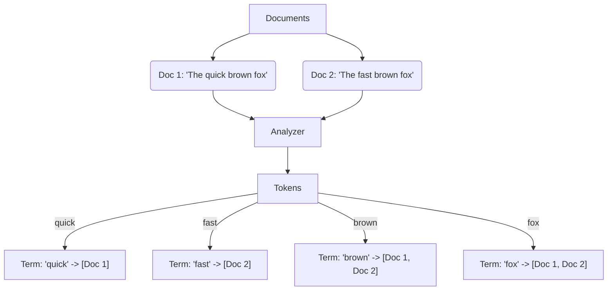
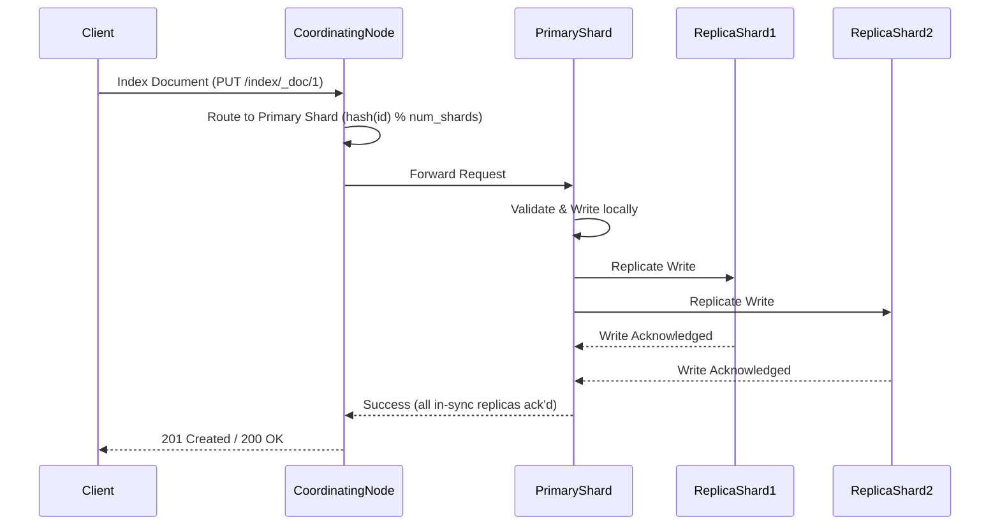

# Elasticsearch & Search Architectures

## What is an inverted index in Elasticsearch, and how does it enable fast full-text search? <Badge type="tip" text="easy" />

::: details View Answer
An inverted index is the core data structure used by Apache Lucene (which powers Elasticsearch) to enable extremely fast full-text search. Instead of scanning every document to find a word (which is O(N)), it works like the index at the back of a book. It maps each unique word (term) back to the documents that contain it.

When a document is indexed, its text fields are analyzed (tokenized into terms), and these terms are added to the inverted index.



When you search for "quick fox", Elasticsearch looks up "quick" and "fox" in the index, finds their document lists, and computes the intersection to quickly return the relevant documents.
:::

## Explain the difference between TF-IDF and BM25 scoring algorithms. Why did Elasticsearch switch to BM25? <Badge type="warning" text="medium" />

::: details View Answer
Both TF-IDF and BM25 are probabilistic retrieval frameworks used to calculate document relevance (`_score`), but BM25 is more advanced and is the default in modern Elasticsearch.

1. **TF-IDF (Term Frequency-Inverse Document Frequency):**
   - **Term Frequency (TF):** How often a term appears in a document. In TF-IDF, if a term appears 10 times, it has roughly 10x the weight of appearing once.
   - **Inverse Document Frequency (IDF):** How rare the term is across all documents. Rare terms (like "hippopotamus") score higher than common terms (like "the").

2. **BM25 (Best Matching 25):**
   - **Term Frequency Saturation:** BM25 introduces a non-linear TF curve (controlled by parameter `k1`). Seeing a term 5 times is better than 1 time, but seeing it 100 times isn't significantly better than 5 times. It caps the impact of keyword stuffing.
   - **Document Length Normalization:** BM25 normalizes by document length (controlled by parameter `b`). A single match in a short tweet is considered much more relevant than a single match in a 500-page book. 

Elasticsearch switched to BM25 because it provides vastly superior relevance scoring for natural language queries and prevents long documents or heavily repeated terms from unfairly dominating search results.
:::

## How does Elasticsearch handle sharding, and what is the formula used for document routing? <Badge type="warning" text="medium" />

::: details View Answer
Sharding is how Elasticsearch distributes data across multiple nodes to handle data volumes larger than a single node's disk capacity and to parallelize processing.

An index is divided into a fixed number of primary shards at creation time. When indexing a document, Elasticsearch needs to determine which primary shard it belongs to. It does this using a routing formula:

`shard_num = hash(_routing) % num_primary_shards`

- `_routing` is typically the document's `_id` by default, but it can be a custom value provided by the user.
- Because `num_primary_shards` is in the denominator of the modulo operation, **the number of primary shards cannot be changed once an index is created**. Changing it would invalidate the routing for all existing documents, meaning they could no longer be found.
:::

## Walk through the write lifecycle (indexing a document) in Elasticsearch from the coordinating node to the replicas. <Badge type="danger" text="hard" />

::: details View Answer
When a write request is made, it follows a specific pipeline to ensure consistency and replication across the cluster.

1. **Coordinating Node:** The node that receives the client request acts as the coordinating node. It uses the document's routing value to determine which primary shard should receive the write.
2. **Primary Shard:** The request is forwarded to the node hosting the primary shard. The primary shard validates the request and executes the operation locally (writing to the Lucene index and the translog).
3. **Replica Shards:** If the primary succeeds, it forwards the operation in parallel to all in-sync replica shards. 
4. **Acknowledgment:** Once all in-sync replicas acknowledge they have written the document, the primary shard acknowledges success to the coordinating node, which then returns a success response to the client.



Example in Python:
```python
from elasticsearch import Elasticsearch

es = Elasticsearch("http://localhost:9200")

doc = {
    "user": "alice",
    "message": "System architecture design",
    "timestamp": "2023-10-25T12:00:00"
}

# The routing process is handled transparently by the cluster
response = es.index(index="logs", id=1, document=doc)
print(response['result'])
```
:::

## Explain the difference between `match` and `term` queries in Elasticsearch. When should you use each? <Badge type="tip" text="easy" />

::: details View Answer
The main difference is how the search input is processed before querying the inverted index.

- **`match` query:** This is a full-text query. The search string is passed through the exact same analyzer that was applied to the field during indexing. For example, if you search for "Quick Foxes" on an analyzed text field, it will be tokenized and lowercased to `["quick", "fox"]` before searching. Use `match` for natural language search on `text` fields.
- **`term` query:** This is an exact-match query. The search string is **not** analyzed. It looks for the exact literal token in the inverted index. If you search for "Quick Foxes", it looks for the exact string "Quick Foxes". Use `term` for structured data like enums, status codes, IDs, or `keyword` fields.
:::

## What is the difference between a query context and a filter context in Elasticsearch? How does this impact performance? <Badge type="warning" text="medium" />

::: details View Answer
Elasticsearch queries execute in two different contexts, which significantly impact performance and caching:

1. **Query Context ("How well does this match?"):** 
   - Used to calculate relevance (`_score`). 
   - Answers the question: "How well does this document match the query clause?"
   - Does not cache results because scores can vary.
   - Typically used in the `must` or `should` clauses of a boolean query.

2. **Filter Context ("Does this match?"):** 
   - Answers a simple yes/no question: "Does this document match the clause?"
   - **Does not calculate scores**, saving CPU resources.
   - **Results are frequently cached** by Elasticsearch in the node query cache, making subsequent identical filters nearly instantaneous.
   - Typically used in the `filter` or `must_not` clauses.

**Performance Impact:** Always use filter context for structured data (timestamps, statuses, booleans) or anything where relevance scoring doesn't matter. Save query context strictly for full-text search.
:::

## What is a "mapping explosion" in Elasticsearch, and how can it be prevented? <Badge type="danger" text="hard" />

::: details View Answer
A mapping explosion occurs when an index receives an excessive number of uniquely named fields, causing the index mapping (schema) to grow massive. 

Because the entire mapping must be stored in the cluster state and synchronized across all nodes in the cluster, a huge mapping causes the cluster state update process to grind to a halt. This leads to high CPU usage, out-of-memory errors, and eventually a collapsed cluster.

**Causes:**
Usually caused by dynamic mapping combined with unstructured JSON where keys are dynamic (e.g., UUIDs or user IDs used as JSON keys).

**Prevention:**
1. **`dynamic: strict` or `dynamic: false`:** Disable dynamic mapping at the index or object level so unexpected fields are either rejected or ignored.
2. **Use `flattened` data type:** If you need to store objects with highly dynamic keys, map the parent object as `flattened`. Elasticsearch will index it as a single field rather than creating sub-fields for every key.
3. **Refactor Data Model:** Change from `{"user_123": "admin"}` to `[{"user_id": "123", "role": "admin"}]`.
:::

## Describe the role of Analyzers in Elasticsearch. What are their three main components? <Badge type="warning" text="medium" />

::: details View Answer
Analyzers are responsible for converting raw text into the precise tokens that get stored in the inverted index. This process is called text analysis.

An analyzer executes a pipeline consisting of three components, applied in this exact order:

1. **Character Filters (0 or more):** They modify the raw text string before tokenization. For example, stripping HTML tags (`<p>Hello</p>` -> `Hello`) or replacing characters (mapping `&` to `and`).
2. **Tokenizer (Exactly 1):** Splits the text into individual tokens (words). For example, the `standard` tokenizer splits text on whitespace and punctuation.
3. **Token Filters (0 or more):** Modify, add, or delete the generated tokens. For example:
   - `lowercase`: Converts "Fox" to "fox".
   - `stop`: Removes common words like "the", "and".
   - `snowball` (Stemmer): Reduces words to their root (e.g., "jumping" -> "jump").
:::

## How do you handle pagination in Elasticsearch for deep data sets? Compare `from`/`size`, `search_after`, and Scroll API. <Badge type="warning" text="medium" />

::: details View Answer
Pagination changes depending on depth and use case:

1. **`from` and `size` (Standard Pagination):**
   - Good for shallow pagination (e.g., pages 1-10 of a website).
   - Fails at deep paging. To get records 10,000 to 10,010, each shard must compute 10,010 hits, and the coordinating node must sort all of them just to discard the first 10,000. 
   - Capped at `index.max_result_window` (default 10,000).

2. **`search_after` (Deep Pagination for User Interfaces):**
   - Efficiently fetches the "next page" by using the sort values of the last hit from the previous page.
   - Stateless, but requires a unique sort tie-breaker (like `_id`) to prevent skipping or duplicating results.

3. **Scroll API (Data Extraction / Point in Time):**
   - Creates a snapshot in time of the index.
   - Extremely efficient for extracting massive datasets or reindexing.
   - Stateful and consumes heavy resources to keep the Lucene segments alive. Deprecated for user pagination in favor of `search_after` with Point-in-Time (PIT).

```python
# Search After Example
es = Elasticsearch("http://localhost:9200")

# Initial Request
resp = es.search(
    index="events",
    size=10,
    sort=[{"timestamp": "asc"}, {"_id": "asc"}]
)

last_hit = resp['hits']['hits'][-1]

# Next Page Request using search_after
next_resp = es.search(
    index="events",
    size=10,
    sort=[{"timestamp": "asc"}, {"_id": "asc"}],
    search_after=last_hit['sort']
)
```
:::

## What are Doc Values and Fielddata in Elasticsearch? How do they differ in purpose and memory usage? <Badge type="danger" text="hard" />

::: details View Answer
While the **inverted index** (mapping terms to documents) is perfect for searching, it is terrible for sorting, aggregations, and accessing field values in scripts. For these operations, Elasticsearch needs an "un-inverted" structure: mapping documents back to their terms. 

Elasticsearch uses two different structures to achieve this:

1. **Doc Values:**
   - **Data Structure:** Columnar data structures built at **index time**.
   - **Storage:** Stored **on disk** and leverage the OS filesystem cache.
   - **Usage:** Enabled by default for all non-analyzed fields (`keyword`, numbers, dates).
   - **Pros:** Highly memory-efficient and scalable.

2. **Fielddata:**
   - **Data Structure:** Un-inverted structures built on the fly at **query time**.
   - **Storage:** Stored entirely in JVM **Heap memory**.
   - **Usage:** Used for analyzed `text` fields (since analyzed fields can have massive token combinations). Disabled by default.
   - **Cons:** If enabled and queried on a massive dataset, it will quickly consume JVM heap and cause **Out Of Memory (OOM)** exceptions.

**Rule of Thumb:** Never use fielddata. If you need to aggregate or sort on a text field, create a multi-field mapping with a `keyword` sub-field and aggregate on the keyword field using doc values.
:::

## How does the cluster state update process work in Elasticsearch, and what is the role of the master node? <Badge type="warning" text="medium" />

::: details View Answer
The **Cluster State** is a vital data structure containing metadata about the entire cluster: global settings, index schemas (mappings), routing tables, and node presence.

1. **The Master Node:** Only the elected active master node is permitted to change the cluster state. This prevents conflicting changes.
2. **Update Process:**
   - When a node wants to change state (e.g., create an index or update a mapping), it forwards the request to the master.
   - The master processes the change and generates a new cluster state.
   - The master publishes the new state to all nodes in the cluster.
   - The nodes acknowledge the receipt. Once a quorum acknowledges, the master commits the state and tells the nodes to apply it.
   
This mechanism is why "mapping explosions" are dangerous: a massive cluster state blocks the single master node from processing critical cluster events like node failures or shard reallocations.
:::

## Explain the concept of replica shards and how they affect read performance, write performance, and fault tolerance. <Badge type="warning" text="medium" />

::: details View Answer
A replica shard is a byte-for-byte copy of a primary shard.

- **Fault Tolerance:** If a node goes down, any primary shards on it are lost. Elasticsearch will immediately promote the corresponding replica shards on surviving nodes to primary status, preventing data loss. Replicas are never allocated to the same node as their primary.
- **Read Performance:** Replicas significantly **increase** read throughput. When a search request arrives, the coordinating node can load-balance the request across the primary and any of its replicas.
- **Write Performance:** Replicas **decrease** write throughput. When a document is indexed, it must be successfully written to the primary and then replicated to all in-sync replicas before the write is acknowledged as successful. More replicas = more disk I/O and network overhead per write.
:::

## How would you design an autocomplete/typeahead feature using Elasticsearch? <Badge type="danger" text="hard" />

::: details View Answer
Autocomplete requires extremely low-latency queries (sub 50ms) because it fires on every keystroke. Standard `match` or `wildcard` queries are too slow. There are three optimal approaches:

1. **Prefix Queries (Good):** Use `match_phrase_prefix` on standard text fields. It's easy to set up but can be slow if the prefix matches many terms.
2. **Edge N-Grams (Better):** 
   - Analyze text at index time into fragments. 
   - "search" becomes `["s", "se", "sea", "sear", "searc", "search"]`.
   - You can then use standard, fast exact-match queries on these tokens. Trades storage space for query speed.
3. **Completion Suggester (Best):**
   - Uses a specialized `completion` data type.
   - Builds an **FST (Finite State Transducer)** in memory.
   - Bypasses the standard query execution pipeline entirely for blazing-fast lookups.
   - Downside: Extremely rigid, doesn't support advanced filtering easily, and consumes JVM heap.
4. **Search-as-you-type (Modern alternative):** A built-in field type in ES 7.x+ that automatically creates edge n-grams and shingles behind the scenes, offering a great balance between speed and ease of use.
:::

## What are nested objects and parent-child relationships in Elasticsearch? When would you use one over the other? <Badge type="danger" text="hard" />

::: details View Answer
Both address the challenge of modeling relational data (1-to-N) in Elasticsearch, which lacks SQL joins.

1. **Nested Objects:**
   - **How it works:** Array of objects under a single document. Under the hood, Lucene indexes each object as a separate hidden document, but they are guaranteed to reside in the same Lucene segment as the parent.
   - **Pros:** Fast query performance because they are physically co-located.
   - **Cons:** If you update one nested object, the **entire parent document and all its nested objects must be reindexed**. 
   - **Use Case:** When the sub-objects are relatively small, infrequently updated, and usually queried alongside the parent.

2. **Parent-Child (Join datatype):**
   - **How it works:** Parent and child documents are completely separate documents in the index, linked via a routing mechanism to ensure they land on the same shard.
   - **Pros:** Children can be added, updated, or deleted independently without touching the parent or other children.
   - **Cons:** Queries are significantly slower (up to 100x slower) because it has to execute a join at query time.
   - **Use Case:** When you have massive amounts of child documents per parent, or the children update very frequently.
:::

## How does Elasticsearch handle updates to an existing document if documents are immutable? <Badge type="warning" text="medium" />

::: details View Answer
Underlying Lucene segments are write-once (immutable). You cannot modify data inside a segment.

When you "update" a document in Elasticsearch:
1. Elasticsearch retrieves the old document.
2. It modifies the JSON in memory with your changes.
3. It marks the old document as **deleted** in a special `.del` file. The document is still physically on disk but is filtered out of search results.
4. It indexes the new, updated document as a brand new document in a new Lucene segment.

Over time, this results in many hidden deleted documents consuming disk space. Elasticsearch handles this automatically via **Segment Merging** in the background, where it merges smaller segments into bigger ones and physically purges the deleted documents.
:::

## What is a split-brain problem in Elasticsearch, and how is it mitigated in modern versions (7.x+)? <Badge type="danger" text="hard" />

::: details View Answer
**Split-brain** occurs when a network partition divides the cluster into two disconnected halves. If both halves elect their own master node, you now have two separate clusters modifying data independently. When the network heals, the data cannot be reconciled, resulting in catastrophic data loss.

**Old Mitigation (ES < 7.x):** 
Administrators had to manually configure `discovery.zen.minimum_master_nodes` to `(N/2) + 1` (a quorum). If you forgot, your cluster was at risk.

**Modern Mitigation (ES 7.x+):**
Elasticsearch completely rewrote its cluster coordination subsystem (using an algorithm inspired by Raft). 
- It automatically manages voting configurations.
- It enforces a strict majority quorum for master elections.
- A cluster with 3 master-eligible nodes will only elect a master if at least 2 nodes can communicate. The isolated 3rd node cannot elect itself.
- You only need to provide `cluster.initial_master_nodes` when starting the cluster for the very first time; after that, ES manages the quorum safely by itself.
:::

## Explain the concept of Segment Merging in Elasticsearch. Why is it important, and what are its performance implications? <Badge type="warning" text="medium" />

::: details View Answer
Every time an index buffer is refreshed, Elasticsearch creates a new immutable Lucene segment on disk. In a write-heavy cluster, this quickly creates thousands of tiny segments. 

Searching requires querying *every single segment* in a shard and merging the results. Too many segments severely degrade search performance and consume file descriptors.

**Segment Merging** is the background process where Elasticsearch takes several small segments and rewrites them into a single larger segment.
- **Importance:** Keeps search latency low and reclaims disk space by purging documents marked as deleted (from updates).
- **Performance Implications:** Merging is extremely I/O and CPU intensive. If not tuned properly in heavy write workloads, merges can throttle the indexing rate. Elasticsearch dynamically throttles indexing if segment generation outpaces merge capabilities.
:::

## How does the `bool` query work in Elasticsearch, and what are its four main occurrence types? <Badge type="tip" text="easy" />

::: details View Answer
The `bool` query is the primary compound query in Elasticsearch, allowing you to combine multiple queries using boolean logic.

It has four occurrence types:
1. **`must`:** Clauses that MUST appear in matching documents. Contributes to the relevance score. (Logical AND)
2. **`filter`:** Clauses that MUST appear. Does NOT contribute to the score. Caches results for high performance. (Logical AND)
3. **`should`:** Clauses that SHOULD appear. Increases relevance score if they match. If a `bool` query has no `must` or `filter` clauses, at least one `should` clause must match. (Logical OR)
4. **`must_not`:** Clauses that MUST NOT appear. Executes in filter context (no scoring, cached). (Logical NOT)

```python
from elasticsearch import Elasticsearch

es = Elasticsearch("http://localhost:9200")

query = {
    "query": {
        "bool": {
            "must": [
                { "match": { "title": "architecture" } }
            ],
            "filter": [
                { "term": { "status": "published" } }
            ],
            "should": [
                { "match": { "content": "scaling" } }
            ],
            "must_not": [
                { "term": { "category": "deprecated" } }
            ]
        }
    }
}

response = es.search(index="articles", body=query)
```
:::

## How would you optimize an Elasticsearch cluster for write-heavy logging workloads? <Badge type="danger" text="hard" />

::: details View Answer
Logging workloads (like ELK stacks) have massive ingestion rates but infrequent searches. Optimizations focus on maximizing throughput:

1. **Use the Bulk API:** Never index documents one by one. Batch them (e.g., 5MB - 15MB per bulk request) to minimize network overhead.
2. **Increase `refresh_interval`:** By default, ES refreshes the index every 1 second, creating tiny segments. Increase this to `30s` or `60s` to build larger segments in memory before writing to disk.
3. **Use Auto-generated IDs:** If you provide your own `_id`, Elasticsearch must check the shard to ensure the ID doesn't already exist (a costly disk read). Using ES-generated IDs skips this check entirely.
4. **Disable Replicas on Initial Load:** If doing a massive backfill, set `number_of_replicas: 0` to avoid double-writing overhead, then restore replicas when ingestion slows.
5. **Tune Indexing Buffer:** Ensure `indices.memory.index_buffer_size` is large enough (default 10% of heap) to hold documents before they are flushed.
6. **Data Tiers & Rollover:** Use Index Lifecycle Management (ILM) to roll over indices daily, moving old logs from "Hot" SSD nodes to "Warm/Cold" HDD nodes.
:::

## What is a keyword field vs a text field in Elasticsearch, and how do they interact with analyzers and aggregations? <Badge type="tip" text="easy" />

::: details View Answer
These are the two primary string data types, optimized for entirely different use cases.

1. **`text` Field:**
   - **Processing:** Passed through an analyzer. "New York" becomes `["new", "york"]`.
   - **Use Case:** Full-text search (e.g., matching "york" in "New York").
   - **Aggregations:** Disabled by default. If forced (via fielddata), it will aggregate on the individual tokens (e.g., bucket for "new" and bucket for "york", which is usually not what you want) and risks OOM errors.

2. **`keyword` Field:**
   - **Processing:** Not analyzed. Indexed as a single, exact literal string. "New York" remains `"New York"`.
   - **Use Case:** Exact match filtering, sorting, and aggregations.
   - **Aggregations:** Uses highly efficient Doc Values. Aggregating will yield a single bucket for "New York".

*Note:* It is common practice to map a string as both using a multi-field (e.g., `city` as text, and `city.keyword` as keyword) to support both full-text search and aggregations.
:::
