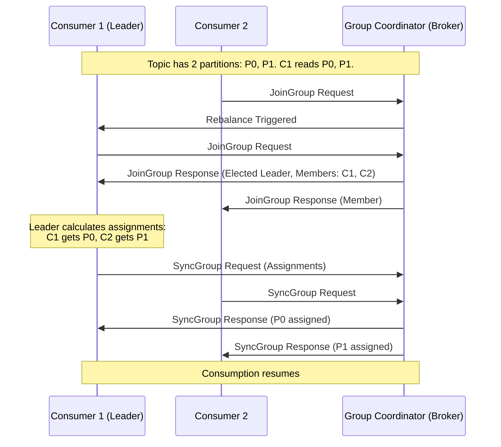
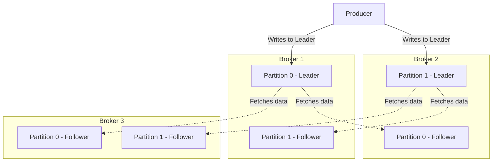

# Apache Kafka

## What is Apache Kafka and what are its primary use cases? <Badge type="tip" text="easy" />

::: details View Answer
Apache Kafka is an open-source distributed event streaming platform designed for high-throughput, low-latency, and fault-tolerant data pipelines. Originally developed by LinkedIn, it acts as a highly scalable publish-subscribe message bus.

Primary use cases include:
- **Real-time Event Streaming**: Capturing user activity, logs, and telemetry data in real-time.
- **Microservices Communication**: Decoupling microservices asynchronously.
- **Stream Processing**: Aggregating, enriching, and transforming data streams using tools like Kafka Streams or Apache Flink.
- **Change Data Capture (CDC)**: Syncing database changes to other systems.
- **Log Aggregation**: Centralizing logs from distributed systems.
:::

## Explain the concepts of Topics, Partitions, and Offsets in Kafka. <Badge type="tip" text="easy" />

::: details View Answer
- **Topic**: A logical channel or category where records (messages) are published by producers and read by consumers. Topics are multi-subscriber.
- **Partition**: Topics are divided into one or more partitions for horizontal scalability. A partition is an ordered, immutable sequence of records. Each partition is hosted on a specific broker. Partitions allow Kafka to parallelize consumption and scale beyond a single server.
- **Offset**: A unique, sequential ID assigned to each record within a partition. It represents the position of a message in that specific partition. Consumers track their progress by storing the highest offset they have successfully processed.
:::

## How does Kafka achieve high throughput and low latency? <Badge type="warning" text="medium" />

::: details View Answer
Kafka achieves its performance through several design principles:
1. **Sequential I/O**: Kafka appends messages to the end of partition log files. Sequential disk access is significantly faster than random access, often rivaling memory speed.
2. **Zero-Copy**: Kafka uses the OS-level `sendfile` system call to transfer data directly from the page cache to the network socket, bypassing application-level buffers and saving CPU cycles.
3. **Batching**: Producers batch messages before sending them to brokers, reducing network round trips. Consumers also fetch data in batches.
4. **Compression**: Kafka supports compressing message batches (e.g., Snappy, LZ4, Zstd) to reduce network bandwidth and storage.
5. **Horizontal Scalability**: Partitions allow data to be distributed across many brokers, enabling parallel reads and writes.
:::

## What is a Consumer Group and how does it relate to Partitions? <Badge type="warning" text="medium" />

::: details View Answer
A **Consumer Group** is a set of consumers working together to consume data from a topic. 
- Each partition in a topic is consumed by exactly **one consumer** within a consumer group.
- If there are more partitions than consumers, some consumers will read from multiple partitions.
- If there are more consumers than partitions, the excess consumers will remain idle.
- Consumer groups allow Kafka to provide both point-to-point messaging (put all consumers in the same group) and publish-subscribe messaging (put consumers in different groups).
:::

## Explain the Consumer Group Rebalancing process. <Badge type="warning" text="medium" />

::: details View Answer
Rebalancing is the process of reassigning partitions to consumers within a group. It occurs when:
1. A new consumer joins the group.
2. An existing consumer leaves the group (gracefully or crashes).
3. The number of partitions in a topic changes.

When a rebalance triggers, consumption pauses. The Group Coordinator (a broker) manages the process, electing a Group Leader (usually the first consumer to join). The leader computes the new partition assignments and sends them to the coordinator, which distributes them to the consumers.


:::

## How does data replication work in Kafka? <Badge type="warning" text="medium" />

::: details View Answer
Kafka replicates partitions across multiple brokers for fault tolerance. For each partition, there is one **Leader** replica and zero or more **Follower** replicas.

- All read and write requests for a partition go to its Leader.
- Followers passively replicate data from the Leader by fetching messages, similar to regular consumers.
- The `replication.factor` configuration determines the total number of replicas (Leader + Followers).


:::

## What are In-Sync Replicas (ISR) and what happens when a broker fails? <Badge type="danger" text="hard" />

::: details View Answer
The **ISR (In-Sync Replicas)** is a subset of a partition's replicas that are fully caught up with the Leader. 
- A follower is considered in-sync if it has fetched records from the leader within a configured time window (`replica.lag.time.max.ms`).
- If a follower falls too far behind, the leader removes it from the ISR.

**Broker Failure:**
When the broker hosting a partition's Leader fails, the Controller detects this (via session timeout) and elects a new Leader from the current ISR. Since the ISR contains fully replicated data, no data is lost. If the `min.insync.replicas` setting is not met (e.g., required 2, but only 1 is available), producers requiring `acks=all` will receive an exception, preventing data loss but sacrificing availability.
:::

## What is the role of ZooKeeper in older Kafka versions and what is KRaft? <Badge type="warning" text="medium" />

::: details View Answer
**ZooKeeper** was traditionally used by Kafka to manage cluster metadata, track broker availability, elect the Controller, and (in very old versions) store consumer offsets.

**KRaft (Kafka Raft Metadata mode)**, introduced in KIP-500, replaces ZooKeeper. It uses the Raft consensus algorithm directly within Kafka brokers to manage metadata. 
Benefits of KRaft:
- **Simpler Architecture**: Removes the need to maintain a separate ZooKeeper cluster.
- **Scalability**: Allows clusters to have millions of partitions, as metadata changes are replicated natively like standard Kafka topics, avoiding ZooKeeper bottlenecks.
- **Faster Recovery**: Controller failover is much faster because the new controller already has the metadata replicated in memory.
:::

## Explain exactly-once semantics (EOS) in Kafka and how it is achieved. <Badge type="danger" text="hard" />

::: details View Answer
Exactly-once semantics ensures that even if a producer retries sending a message, or a stream processing app restarts, a message is processed exactly once.

Kafka achieves this through two main features:
1. **Idempotent Producers**: Prevents duplicates during producer retries. The producer assigns a unique Sequence Number to each message, and the broker uses the Producer ID (PID) and sequence number to deduplicate messages.
2. **Transactional API**: Allows a producer to write to multiple partitions atomically. This is crucial for consume-transform-produce workloads (like Kafka Streams). The application begins a transaction, consumes messages, writes processed outputs, commits the consumer offsets, and commits the transaction simultaneously. If the app crashes, the transaction is aborted, and the offsets are not committed.
:::

## How would you handle poisonous messages (deserialization errors) in a Kafka consumer? <Badge type="warning" text="medium" />

::: details View Answer
A "poisonous message" cannot be deserialized and causes the consumer to crash. If unhandled, the consumer restarts, encounters the same message, crashes again, leading to an infinite loop.

Handling strategies:
1. **Try-Catch in Deserializer**: Catch exceptions during deserialization. Instead of crashing, return a sentinel value (e.g., `None` in Python) or a custom wrapper object containing the raw bytes and the error.
2. **Dead Letter Queue (DLQ)**: In the consumer logic, if a bad message is detected, log the error, optionally write the raw message to a separate DLQ topic for manual inspection, and then **commit the offset** so the consumer can move on to the next message.
3. **Use Schema Registry**: Prevent bad data from entering Kafka in the first place by enforcing schemas (Avro, Protobuf, JSON Schema) at the producer level.
:::

## Write a Python snippet using `confluent-kafka` to produce a message asynchronously with a delivery callback. <Badge type="warning" text="medium" />

::: details View Answer
Using the `confluent-kafka` Python library, production is asynchronous by default. You can use a callback to handle successes or failures.

```python
from confluent_kafka import Producer

def delivery_report(err, msg):
    """ Called once for each message produced to indicate delivery result. """
    if err is not None:
        print(f'Message delivery failed: {err}')
    else:
        print(f'Message delivered to {msg.topic()} [{msg.partition()}] at offset {msg.offset()}')

conf = {'bootstrap.servers': 'localhost:9092'}
producer = Producer(conf)

topic = 'my-topic'
key = 'user-123'
value = '{"event": "login"}'

# Produce asynchronously
producer.produce(topic, key=key, value=value, callback=delivery_report)

# Wait for any outstanding messages to be delivered and delivery reports received
producer.flush()
```
:::

## Write a Python snippet using `confluent-kafka` to consume messages manually committing offsets. <Badge type="warning" text="medium" />

::: details View Answer
Manual offset commitment provides better control over exactly when a message is considered "processed".

```python
from confluent_kafka import Consumer, KafkaError

conf = {
    'bootstrap.servers': 'localhost:9092',
    'group.id': 'my-group',
    'auto.offset.reset': 'earliest',
    'enable.auto.commit': False  # Disable auto commit
}

consumer = Consumer(conf)
consumer.subscribe(['my-topic'])

try:
    while True:
        msg = consumer.poll(timeout=1.0)
        if msg is None:
            continue
        if msg.error():
            if msg.error().code() == KafkaError._PARTITION_EOF:
                continue
            else:
                print(msg.error())
                break

        # Process the message
        print(f"Received message: {msg.value().decode('utf-8')}")

        # Manually commit the offset synchronously
        consumer.commit(asynchronous=False)
except KeyboardInterrupt:
    pass
finally:
    consumer.close()
```
:::

## What is the difference between `auto.offset.reset=earliest` and `latest`? <Badge type="tip" text="easy" />

::: details View Answer
This configuration dictates what a consumer should do when it starts reading a partition but has no valid committed offset (e.g., a brand new consumer group, or the offset expired).

- **`earliest`**: The consumer will start reading from the very beginning of the partition (the oldest retained message). Useful when you want to process historical data.
- **`latest`**: The consumer will start reading only new messages that arrive *after* it joins the group. It ignores all existing historical data. This is the default behavior in many clients.
- **`none`**: Throws an exception if no previous offset is found.
:::

## How can you ensure message ordering in Kafka? <Badge type="warning" text="medium" />

::: details View Answer
Kafka only guarantees message ordering **within a single partition**, not across the entire topic.

To ensure ordering for related events (e.g., all events for user ID `123`):
1. **Use a Message Key**: When producing, assign the same key (e.g., the User ID) to related messages. Kafka hashes the key to determine the partition. Messages with the same key will always go to the same partition, guaranteeing their order.
2. **Producer Configs**: Set `max.in.flight.requests.per.connection=1` (or up to 5 if `enable.idempotence=true`) to prevent reordering if a request fails and is retried.
:::

## What are the key configuration parameters for performance tuning a Kafka Producer? <Badge type="danger" text="hard" />

::: details View Answer
To optimize a producer for high throughput:
1. **`batch.size`**: Increases the maximum size of a batch (in bytes). Larger batches improve compression ratio and throughput but may use more memory.
2. **`linger.ms`**: Adds a small artificial delay (e.g., 5-10ms) before sending a batch. This allows more messages to accumulate in the batch, improving throughput at a slight cost to latency.
3. **`compression.type`**: E.g., `lz4` or `zstd` or `snappy`. Compresses the batch, heavily reducing network utilization.
4. **`acks`**: 
   - `acks=0`: Fire and forget (fastest, high data loss risk).
   - `acks=1`: Leader acknowledgment (fast, moderate risk).
   - `acks=all`: Leader and all ISRs acknowledge (slowest, highest durability).
5. **`buffer.memory`**: Total memory available to the producer for buffering.
:::

## How does Kafka manage data retention and what is Log Compaction? <Badge type="danger" text="hard" />

::: details View Answer
Kafka does not delete messages immediately after consumption. Instead, data is retained based on policies configured per topic.

1. **Time-based Retention**: Deletes segments older than a specific duration (`log.retention.hours`, default is 168 hours or 7 days).
2. **Size-based Retention**: Deletes older segments when the partition size exceeds a threshold (`log.retention.bytes`).

**Log Compaction** is an alternative cleanup policy (`cleanup.policy=compact`). Instead of deleting old records, Kafka retains only the **latest value for each unique key** within the partition. This is extremely useful for maintaining the current state of an entity (like a database table), ensuring consumers can restore the latest state without replaying every historical change. Tombstone messages (null value) are used to explicitly delete a key during compaction.
:::

## What is the "Split Brain" problem and how does KRaft solve it? <Badge type="danger" text="hard" />

::: details View Answer
The **Split Brain** problem occurs in distributed systems when a network partition causes the cluster to split into two isolated halves, and both halves mistakenly elect a leader (or Controller), leading to conflicting writes and corrupted state.

With ZooKeeper, split brain was mitigated using a majority quorum. However, ZooKeeper and Kafka were separate systems, and synchronization issues could occasionally cause complex metadata inconsistencies.

**KRaft** solves this by integrating the Raft consensus protocol directly into Kafka. Raft inherently requires a strict majority (quorum) to elect a leader and commit metadata changes. If the network splits, only the partition containing the majority of voting nodes can elect a Controller and accept updates. The minority partition will halt, making split-brain impossible by mathematical design.
:::

## How do you monitor the health and lag of Kafka consumers? <Badge type="warning" text="medium" />

::: details View Answer
**Consumer Lag** is the difference between the latest offset produced to a partition (Log End Offset) and the latest offset committed by the consumer group. High lag means the consumer is falling behind.

Monitoring strategies:
1. **JMX Metrics**: Expose Kafka broker and consumer metrics via JMX. Monitor `records-lag-max`.
2. **AdminClient API**: Use the `AdminClient` in Python or Java to programmatically fetch the end offsets and group offsets to calculate lag.
3. **External Tools**: Use specialized monitoring tools like Burrow (by LinkedIn), Prometheus + Grafana (using JMX exporter), AKHQ, or Confluent Control Center. Burrow is particularly useful as it evaluates lag over time and provides a status (OK, WARNING, ERROR) rather than just raw numbers.
:::

## Explain the differences between Kafka and RabbitMQ. <Badge type="warning" text="medium" />

::: details View Answer
While both are messaging systems, their architectures and use cases differ significantly:

- **Architecture**: RabbitMQ is a traditional message broker using Smart Broker / Dumb Consumer architecture. Kafka is a distributed append-only log using Dumb Broker / Smart Consumer.
- **Message Retention**: RabbitMQ deletes messages once they are consumed and acknowledged. Kafka retains messages based on time or size policies, allowing replay.
- **Routing**: RabbitMQ provides complex routing capabilities (Direct, Topic, Fanout exchanges). Kafka routing is simple: producers write to topics/partitions, consumers read from them.
- **Ordering**: RabbitMQ guarantees order per queue, but scaling consumers across a single queue breaks strict ordering. Kafka guarantees strict ordering per partition, even with multiple consumers in a group.
- **Performance**: Kafka scales horizontally to millions of messages per second. RabbitMQ handles tens of thousands natively but provides lower latency for complex routing topologies.
:::

## What is a Controller in Kafka and how is it elected? <Badge type="danger" text="hard" />

::: details View Answer
The **Controller** is a crucial broker responsible for managing the state of partitions and replicas, and performing administrative tasks. Its duties include:
- Electing partition leaders when a broker fails.
- Reassigning partitions.
- Creating/deleting topics.

**Election in ZooKeeper mode:**
When brokers start, they try to create an ephemeral node `/controller` in ZooKeeper. The first broker to succeed becomes the Controller. If it fails, the ZNode expires, and surviving brokers race to create it again.

**Election in KRaft mode:**
A designated subset of brokers act as "Controller nodes" (they can be combined with data nodes). They use the Raft protocol to elect an active Controller. The Raft leader becomes the active Controller, and the others act as hot standbys, receiving metadata updates synchronously, enabling instant failover.
:::
